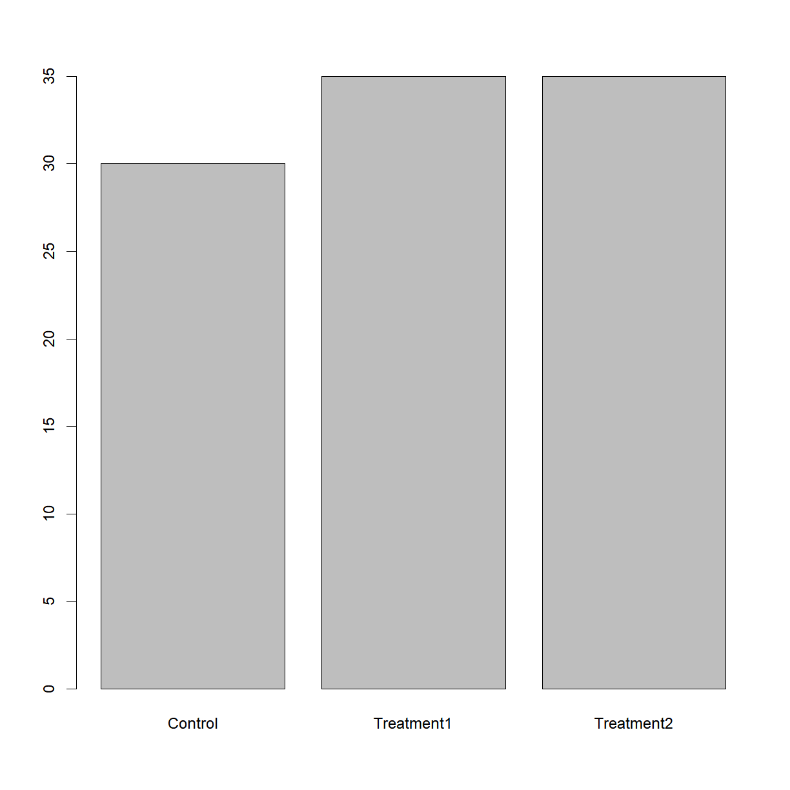

### Reading data from a tabulated file (.csv, .txt)

In the majority of cases, your data will be stored in some type of external file. The most common way that scientists store data is in Excel spreadsheets. While there are R packages designed to access data from Excel spreadsheets (e.g., gdata, RODBC, XLConnect, xlsx, RExcel), these packages are often difficult and non-intuitive to use. When you start dealing with larger datasets, accessing data from Excel files in R also gets slow. users often find it easier to save their spreadsheets in one or more [comma-separated values]({{ page.root }}/reference.html#comma-separated-values-csv) (CSV or .csv) or text (TXT or .txt) files and then use R's built in functionality to read and manipulate the data. Both file types are more primitive forms of table/spreadsheet in which data is stored as text with distinct data elements separated by a *delimiting character* (a comma `,` for .csv files and usually a tab `\t` for .txt files).

Thankfully, Excel is capable of opening, editing, and saving both .csv and .txt files, so we can go back and forth between R and Excel when we find it convenient. 

In this short lesson, we'll learn how to read external data from a .csv or .txt file, and write data modified or generatated in R to a new .csv or .txt file. We will also explore the [arguments]({{ page.root }}/reference.html#argument) that allow you read and write the data correctly for your needs.

&nbsp;
#### Loading external data into a data frame

Let's start by loading some sample data and take a look at the first few rows of the contents using the `head()`:

~~~
dat <- read.csv(file = 'data/sample.csv')
~~~
{: .language-r}

&nbsp;

Open up the same file using a basic text editor (e.g. *Notepad* in Windows; *TextEdit* in MacOS). You should see something like this:

> "ID","Gender","Group","BloodPressure","Age","Aneurisms_q1","Aneurisms_q2","Aneurisms_q3","Aneurisms_q4" 
> "Sub001","m","Control",132,16,114,140,202,237
> "Sub002","m","Treatment2",139,17.2,148,209,248,248
> "Sub003","m","Treatment2",130,19.5,196,251,122,177
> "Sub004","f","Treatment1",105,15.7,199,140,233,220
> "Sub005","m","Treatment1",125,19.9,188,120,222,228
> "Sub006","M","Treatment2",112,14.3,260,266,320,294
{: .callout}

&nbsp;

A couple of things to notice:
* The frist line contains column headers.
* The `,` delimiters tell the `read.csv(...)` function where the breaks in the data are located; that is, which data to put in which column of the output data frame.
* Each new line is also a delimiter that tells `read.csv(...)` which data to put in which row in the output data frame
* In this case, all strings are contained withing quotation marks `""`. This is an optional way to tell the program where character strings start and stop. 

On the topic of using quotation marks, open `sample-noquotes.csv` in your text editor to see the quote-free option:

> ID,Gender,Group,BloodPressure,Age,Aneurisms_q1,Aneurisms_q2,Aneurisms_q3,Aneurisms_q4 
> Sub001,m,Control,132,16,114,140,202,237
> Sub002,m,Treatment2,139,17.2,148,209,248,248
> Sub003,m,Treatment2,130,19.5,196,251,122,177
> Sub004,f,Treatment1,105,15.7,199,140,233,220
> Sub005,m,Treatment1,125,19.9,188,120,222,228
> Sub006,M,Treatment2,112,14.3,260,266,320,294
{: .callout}

&nbsp;

And note that the default `read.csv(...)` treats this file identically:

~~~
dat2 <- read.csv(file = 'data/sample-noquotes.csv')
head(dat2)
~~~
{: .language-r}

~~~
      ID Gender      Group BloodPressure  Age Aneurisms_q1 Aneurisms_q2
1 Sub001      m    Control           132 16.0          114          140
2 Sub002      m Treatment2           139 17.2          148          209
3 Sub003      m Treatment2           130 19.5          196          251
4 Sub004      f Treatment1           105 15.7          199          140
5 Sub005      m Treatment1           125 19.9          188          120
6 Sub006      M Treatment2           112 14.3          260          266
  Aneurisms_q3 Aneurisms_q4
1          202          237
2          248          248
3          122          177
4          233          220
5          222          228
6          320          294
~~~
{: .output}

&nbsp;

Whether to use quotes in your data files is up to you. The default behavior of `read.csv(...)` is smart enough to figure this out on it's own. However, the `read.csv(...)` has an argument called `quote` that dictates how to interpret quotation marks. 

> ## Mis-loading quoted data
>
> What if we force `read.csv("")` to ignore the quotes when they are present?
> Before you run any code, think about what will happen to the data in quotes
> if we tell R that there are no "quote" characters.
>
> 
> ~~~
> dat3 <- read.csv(file = 'data/sample.csv', quote="")
> head(dat3)
> ~~~
> {: .language-r}
>
> > ## Solution
> > 
> > The quotes are now included as part of the character arguments. It also messed up the header formating, apending
> > an "X" to the beginning and surrounding text with "."ss.
> {: .solution}
{: .challenge}

&nbsp;

What happens if we don't assign the output of `read.csv(...)` to a variable?

~~~
read.csv(file = 'data/sample.csv')
~~~
{: .language-r}

&nbsp;

As with any other function call, if the output is not explicitly assigned, it will be dumped into the console window.

&nbsp;
#### Changing Delimiters

The default delimiter of the `read.csv()` function is a comma `,`, but you can
use esentially any set of characters as a delimiter. `read.csv(...)` is actually a special case of a broader function called `read.table(...)`, with the delimiter argument (which is `sep`, for "separator") set to `c` by default. Check out the help file for these functions:

~~~
?read.table # note that `?read.csv` brings up the same help document.
~~~
{: .language-r}

&nbsp;

Under the **Usage** section there are multiple functions listed, including `read.table(...)` and `read.csv(...)`. In the parentheses for each function there is a list of arguments. Since `read.table(...)` is the parent function, all arguments are listed. Only arguments with different default values (as indicated by the `=`) are listed for `read.csv(...)`. A default value is the value that each arguement assumes when you do not explicitly enter a value. For example, `read.table(...)` assumes that a data file has no header (`header = FALSE`) and no delimiting character (`sep = ""`) while `read.csv(...)` assumes that a data file does have a header (`header = TRUE`) and a comma as the delimiting character (`sep = ","`), unless you specify otherwise. 

If your data is stored in a tab-delimited text file, you will need to use `read.table(...)` a different delimiting character, or another of the associated functions called `read.delim(...)` which has defaults to a tab-delimited file format. Note that to define a *tab* as a delimiting character, you have to us `\t`.

Let's give it a try using a copy of the `sample.csv` data saved as a tab-delimited `sample.txt` file.

*Note:* From the help file, `read.delim(...)` defaults to `header = TRUE` while we have to explicity definit it when using `read.table(...)`. We will talk about what this means in the next section.

~~~
# note that read
dat4 <- read.delim(file = 'data/sample.txt')
dat5 <- read.table(file = 'data/sample.txt', header = TRUE)
head(dat4)
~~~
{: .language-r}

~~~
      ID Gender      Group BloodPressure  Age Aneurisms_q1 Aneurisms_q2
1 Sub001      m    Control           132 16.0          114          140
2 Sub002      m Treatment2           139 17.2          148          209
3 Sub003      m Treatment2           130 19.5          196          251
4 Sub004      f Treatment1           105 15.7          199          140
5 Sub005      m Treatment1           125 19.9          188          120
6 Sub006      M Treatment2           112 14.3          260          266
  Aneurisms_q3 Aneurisms_q4
1          202          237
2          248          248
3          122          177
4          233          220
5          222          228
6          320          294
~~~
{: .output}

~~~
head(dat5)
~~~
{: .language-r}

~~~
      ID Gender      Group BloodPressure  Age Aneurisms_q1 Aneurisms_q2
1 Sub001      m    Control           132 16.0          114          140
2 Sub002      m Treatment2           139 17.2          148          209
3 Sub003      m Treatment2           130 19.5          196          251
4 Sub004      f Treatment1           105 15.7          199          140
5 Sub005      m Treatment1           125 19.9          188          120
6 Sub006      M Treatment2           112 14.3          260          266
  Aneurisms_q3 Aneurisms_q4
1          202          237
2          248          248
3          122          177
4          233          220
5          222          228
6          320          294
~~~
{: .output}

&nbsp;

Now let's take a closer look at a couple of useful arguments in `read.table(...)` family of functions.

&nbsp;
#### The `header` Argument

The default for `read.csv(...)` and `read.delim(...)` is to set the `header` argument to `TRUE`. This means that the first row of values in the .csv or .txt is used to define the column names for the data frame. If your data set does not have a header, set the `header` argument to `FALSE`. 

> ## Mis-loading data with headers
>
> What happens if you forget to put `header = FALSE`? The default value is
> `header = TRUE`, which you can check with `?read.csv` or `help(read.csv)`.
> What do you expect will happen if you leave the default value?
> Before you run any code, think about what will happen to the first few rows
> of your data frame, and its overall size. Then run the following code and
> see if your expectations agree:
>
> 
> ~~~
> dat6 <- read.csv(file = 'data/sample.csv', header = FALSE)
> head(dat6)
> ~~~
> {: .language-r}
>
> > ## Solution
> > 
> > The `read.csv(...)` function sets the column names as the default values (`V1, V2, V3, ...`) and 
> > treats the first row of the `sample.csv` file as the first row of data. Clearly this is not the 
> > desired behavior for this data set, but it will be useful if you have a dataset without headers.
> > Note that the `V` is prepended just a number would not be a valid variable name. 
> {: .solution}
{: .challenge}

&nbsp;
#### The `stringsAsFactors` Argument

This is perhaps the most important argument in `read.csv(...)`, particularly if you are working with categorical data. This is because the default behavior of R is to convert character [string]({{ page.root }}/reference.html#string)s into factors, which may make it difficult to do such things as replace values. 

For example, let's look at the `car-speeds.csv` data set. We find out that the data collector was color blind, and accidentally recorded green cars as being blue. In order to correct the data set, let's replace 'Blue' with 'Green' in the `$Color` column:

~~~
# First - load the data and take a look at what information is available
carSpeeds <- read.csv(file = 'data/car-speeds.csv')
head(carSpeeds)
~~~
{: .language-r}

~~~
  Color Speed     State
1  Blue    32 NewMexico
2   Red    45   Arizona
3  Blue    35  Colorado
4 White    34   Arizona
5   Red    25   Arizona
6  Blue    41   Arizona
~~~
{: .output}

~~~
# Next us indexing to replace all `Blue` entries in the Color column with 'Green'
carSpeeds$Color[carSpeeds$Color == 'Blue'] = 'Green'
~~~
{: .language-r}

~~~
Warning in `[<-.factor`(`*tmp*`, carSpeeds$Color == "Blue", value =
structure(c(NA, : invalid factor level, NA generated
~~~
{: .error}

&nbsp;

What happened? The colors of the cars were loaded as factors by `read.csv(...)` by default. Since `Green` was not in the original set of colors, it was not included as a level in the factor. 

To see the internal structure, we can use another function, `str()`. In this case,
the dataframe's internal structure includes the format of each column, which is what
we are interested in. `str()` will be reviewed a little more in the lesson
[Data Types and Structures]({{ page.root }}/13-supp-data-structures/).

~~~
str(carSpeeds)
~~~
{: .language-r}

~~~
'data.frame':	100 obs. of  3 variables:
 $ Color: Factor w/ 5 levels " Red","Black",..: NA 1 NA 5 4 NA NA 2 5 4 ...
 $ Speed: int  32 45 35 34 25 41 34 29 31 26 ...
 $ State: Factor w/ 4 levels "Arizona","Colorado",..: 3 1 2 1 1 1 3 2 1 2 ...
~~~
{: .output}

&nbsp;

We can see that the `$Color` and `$State` columns are factors and `$Speed` is a numeric column. 

One way to solve this problem would be to add the `Green` level to the `Color` factor, but there is a simpler way. Let's reload the dataset using `stringsAsFactors = FALSE`, and see what happens when we try to replace 'Blue' with 'Green' in the `$Color` column:

~~~
# First - load the data and take a look at what information is available
carSpeeds <- read.csv(file = 'data/car-speeds.csv', stringsAsFactors = FALSE)
str(carSpeeds)
~~~
{: .language-r}

~~~
'data.frame':	100 obs. of  3 variables:
 $ Color: chr  "Blue" " Red" "Blue" "White" ...
 $ Speed: int  32 45 35 34 25 41 34 29 31 26 ...
 $ State: chr  "NewMexico" "Arizona" "Colorado" "Arizona" ...
~~~
{: .output}

~~~
# Next us indexing to replace all `Blue` entries in the Color column with 'Green'
carSpeeds$Color[carSpeeds$Color == 'Blue'] = 'Green'
carSpeeds$Color
~~~
{: .language-r}

~~~
  [1] "Green" " Red"  "Green" "White" "Red"   "Green" "Green" "Black"
  [9] "White" "Red"   "Red"   "White" "Green" "Green" "Black" "Red"  
 [17] "Green" "Green" "White" "Green" "Green" "Green" "Red"   "Green"
 [25] "Red"   "Red"   "Red"   "Red"   "White" "Green" "Red"   "White"
 [33] "Black" "Red"   "Black" "Black" "Green" "Red"   "Black" "Red"  
 [41] "Black" "Black" "Red"   "Red"   "White" "Black" "Green" "Red"  
 [49] "Red"   "Black" "Black" "Red"   "White" "Red"   "Green" "Green"
 [57] "Black" "Green" "White" "Black" "Red"   "Green" "Green" "White"
 [65] "Black" "Red"   "Red"   "Black" "Green" "White" "Green" "Red"  
 [73] "White" "White" "Green" "Green" "Green" "Green" "Green" "White"
 [81] "Black" "Green" "White" "Black" "Black" "Red"   "Red"   "White"
 [89] "White" "White" "White" "Red"   "Red"   "Red"   "White" "Black"
 [97] "White" "Black" "Black" "White"
~~~
{: .output}

&nbsp;

That's better! And we can see how the data now is read as character instead of factor.

***
### Writing tabular data to a file (.csv, .txt)

After altering our cars dataset by replacing 'Blue' with 'Green' in the `$Color` column, we now want to save the output. The `read.table(...)` function family has a corresponding set of `write.table(...)` functions. These functions have a familiar set of arguments:

~~~
?read.table
~~~
{: .language-r}

&nbsp;

Here is the basic format for writing a table:

~~~
# Export the data. The write.csv() function requires a minimum of two
# arguments, the data to be saved and the name of the output file.

write.csv(carSpeeds, file = 'data/car-speeds-cleaned.csv')
~~~
{: .language-r}

If you open the file, you'll see that it has header names, because the data had headers within R, but that there are also numbers in the first column.

&nbsp;

This extra column can cause problems when trying to open data in some other programs, and in most cases you won't want to explicity name the rows. This can be easily disabled with a simple argument:

&nbsp;
#### The `row.names` Argument

This argument allows us to set the names of the rows in the output data file. R's default for this argument is `TRUE`, and since it does not know what else to name the rows for the cars data set, it resorts to using row numbers. To turn row numbers off, we can set `row.names` to `FALSE`:

~~~
write.csv(carSpeeds, file = 'data/car-speeds-cleaned.csv', row.names = FALSE)
~~~
{: .language-r}

Now we see:

&nbsp;

> ## Setting Column Names
>
> There is also a `col.names` argument, which can be used to set the column
> names for a data set without headers. If the data set already has headers
> (e.g., we used the `headers = TRUE` argument when importing the data) then a
> `col.names` argument will be ignored.
{: .callout}

&nbsp;
#### The `na` Argument

There are times when we want to specify certain values for `NA`s in the data set (e.g., we are going to pass the data to a program that only accepts -9999 as a nodata value). In this case, we want to set the `NA` value of our output file to the desired value, using the na argument. Let's see how this works:

~~~
# First, replace the speed in the 3rd row with NA, by using an index (square
# brackets to indicate the position of the value we want to replace)
carSpeeds$Speed[3] <- NA
head(carSpeeds)
~~~
{: .language-r}

~~~
  Color Speed     State
1 Green    32 NewMexico
2   Red    45   Arizona
3 Green    NA  Colorado
4 White    34   Arizona
5   Red    25   Arizona
6 Green    41   Arizona
~~~
{: .output}

~~~
write.csv(carSpeeds, file = 'data/car-speeds-cleaned.csv', row.names = FALSE)
~~~
{: .language-r}

&nbsp;

Now we'll set `NA` to -9999 when we write the new .csv file:

~~~
# Note - the na argument requires a string input
write.csv(carSpeeds,
          file = 'data/car-speeds-cleaned.csv',
          row.names = FALSE,
          na = '-9999')
~~~
{: .language-r}

&nbsp;

And we see:

&nbsp;

This can be useful when exporting data from R in a different program that either does not recognize `NA` or uses a different symbol for missing data.

***
### Manipulating Data

Now that our data are loaded into R, we can start doing things with them.
First, let's ask what type of thing `dat` is:

~~~
class(dat)
~~~
{: .language-r}

~~~
[1] "data.frame"
~~~
{: .output}

&nbsp;

The output tells us that it's a data frame. As noted in the previous lesson, data frames are the *de facto* data type in R, and many functions will produce data frames as output.

We can see the shape, or [dimensions]({{ page.root }}/reference.html#dimensions-of-an-array), of the data frame with the function `dim`:

~~~
dim(dat)
~~~
{: .language-r}

~~~
[1] 100   9
~~~
{: .output}

&nbsp;

This tells us that our data frame, `dat`, has 100 rows and 9 columns.

Reviewing the basic types of subsetting, if we want to get a single value from the data frame, we can provide an [index]({{ page.root }}/reference.html#index) in square brackets. The first number specifies the row and the second the column:

~~~
# first value in dat, row 1, column 1
dat[1, 1]
~~~
{: .language-r}

~~~
[1] Sub001
100 Levels: Sub001 Sub002 Sub003 Sub004 Sub005 Sub006 Sub007 ... Sub100
~~~
{: .output}

~~~
# middle value in dat, row 30, column 6
dat[30, 6]
~~~
{: .language-r}

~~~
[1] 103
~~~
{: .output}

&nbsp;

Or we can select sequential or non-sequential subsets using the `:` operator or `c()` function, respectively:

~~~
# output the first 4 rows and first 3 columns of dat
dat[1:4, 1:3]
~~~
{: .language-r}

~~~
      ID Gender      Group
1 Sub001      m    Control
2 Sub002      m Treatment2
3 Sub003      m Treatment2
4 Sub004      f Treatment1
~~~
{: .output}

~~~
# output rows 1, 3, and, 5, and columsn 2 and 6
dat[c(1, 3, 5), c(2, 6)]
~~~
{: .language-r}

~~~
  Gender Aneurisms_q1
1      m          114
3      m          196
5      m          188
~~~
{: .output}

&nbsp;

If you want to select all rows or all columns, leave that index value empty. 

~~~
# All columns from row 5
dat[5, ]
~~~
{: .language-r}

~~~
      ID Gender      Group BloodPressure  Age Aneurisms_q1 Aneurisms_q2
5 Sub005      m Treatment1           125 19.9          188          120
  Aneurisms_q3 Aneurisms_q4
5          222          228
~~~
{: .output}

~~~
# All rows from column 16-18
dat[, 16:18]
~~~
{: .language-r}

~~~
Error in `[.data.frame`(dat, , 16:18): undefined columns selected
~~~
{: .error}

&nbsp;

Or select columns by name:

~~~
# select the BloodPressure data
dat$BloodPressure
~~~
{: .language-r}

~~~
  [1] 132 139 130 105 125 112 173 108 131 129 126  96  77 158  81 137 147
 [18] 130 105  92 111 122  97 118  82 123 126  94 135 108 133 108 122 134
 [35] 145 133  90 118 113 115 142 114 139  90 126 109 125  99 122 111 109
 [52] 134 113 105 125 123 155 117 116 133  94 106 144 149 108 116 136  98
 [69] 148  74 147 116 133  97 132 153 151 121 116 104 111  62 124 124 109
 [86] 117  90 158 113 150 115  83 116 141 108 102  90 133  83 122
~~~
{: .output}

~~~
# select all rows for the Gender and BloodPressure columns
dat[, c("Gender", "BloodPressure")]
~~~
{: .language-r}

~~~
    Gender BloodPressure
1        m           132
2        m           139
3        m           130
4        f           105
5        m           125
6        M           112
7        f           173
8        m           108
9        m           131
10       f           129
11       m           126
12       f            96
13       f            77
14       m           158
15       m            81
16       m           137
17       f           147
18       m           130
19       m           105
20       F            92
21       f           111
22       m           122
23       f            97
24       f           118
25       m            82
26       M           123
27       M           126
28       f            94
29       m           135
30       f           108
31       f           133
32       m           108
33       m           122
34       m           134
35       m           145
36       f           133
37       f            90
38       m           118
39       M           113
40       m           115
41       f           142
42       m           114
43       m           139
44       m            90
45       f           126
46       f           109
47       M           125
48       M            99
49       m           122
50       m           111
51       m           109
52       f           134
53       f           113
54       f           105
55       m           125
56       f           123
57       m           155
58       m           117
59       m           116
60       f           133
61       f            94
62       f           106
63       f           144
64       M           149
65       f           108
66       m           116
67       f           136
68       f            98
69       M           148
70       m            74
71       m           147
72       m           116
73       F           133
74       m            97
75       m           132
76       f           153
77       M           151
78       M           121
79       M           116
80       f           104
81       m           111
82       M            62
83       M           124
84       m           124
85       m           109
86       f           117
87       f            90
88       f           158
89       m           113
90       m           150
91       f           115
92       m            83
93       F           116
94       f           141
95       m           108
96       m           102
97       F            90
98       m           133
99       M            83
100      M           122
~~~
{: .output}

If you leave both index values empty (i.e., `dat[,]`), you get the entire data frame. 

***
### Calculating basic statistics

Now let's perform some common mathematical operations to learn more about our data. Before we begin, let's clean up our environment and reload our sample data to reset any unintended changes and be sure that we include `header=TRUE` and `stringsAsFactors=FALSE`.

~~~
rm(list=ls())
dat <- read.csv(file="data/sample.csv", header=TRUE, stringsAsFactors=FALSE)
~~~
{: .language-r}

&nbsp;

This data is the results of an (not real) experiment, looking at the number of aneurysms that formed in the eyes of patients who undertook 3 different treatments.

When analyzing data we often want to look at partial statistics, such as the maximum value per patient or the average value per day.
One way to do this is to select the data we want to create a new temporary data frame, and then perform the calculation on this subset:

~~~
# first row, all of the columns
patient_1 <- dat[1, ]
# max inflammation for patient 1
max(patient_1)
~~~
{: .language-r}

~~~
Error in FUN(X[[i]], ...): only defined on a data frame with all numeric variables
~~~
{: .error}
<!-- 
    OUCH!! The following may be true, but it will vary by R version, not by
    installation! There shouldn't be an issue with a data frame where all
    columns are numeric without missing values. Under those circumstances,
    coercion should do what you expect. You'll get problems with mixed
    types (factors, character etc), or with missing values. If this is
    actually a problem, we need to change the example - we should be able
    to come up with an example that doesn't require this ugliness in the
    very first lesson. 
    
    Also, columns always work as expected because by definition a column
    contains a vector of values of the same type. Rows include values from
    different columns, which of course can be different types. This doesn't
    need to be confusing, and if we're careful in our presentation here we
    can avoid this until the students know enough to cope rationally.
-->

<!--
> ## Forcing Conversion
>
> The code above may give you an error in some R installations,
> since R does not automatically convert a row from a `data.frame` to a vector.
> (Confusingly, subsetted columns are automatically converted.)
> If this happens, you can use the `as.numeric` command to convert the row of data to a numeric vector:
>
> `patient_1 <- as.numeric(dat[1, ])`
>
> `max(patient_1)`
>
> You can also check the `class` of each object:
>
> `class(dat[1, ])`
>
> `class(as.numeric(dat[1, ]))`
{: .callout}
-->

We don't actually need to store the row in a variable of its own.
Instead, we can combine the selection and the function call:

~~~
# max inflammation for patient 2
max(dat[2, ])
~~~
{: .language-r}

~~~
Error in FUN(X[[i]], ...): only defined on a data frame with all numeric variables
~~~
{: .error}

R also has functions for other common calculations, e.g. finding the minimum, mean, median, and standard deviation of the data:

~~~
# minimum inflammation on day 7
min(dat[, 7])
~~~
{: .language-r}

~~~
[1] 80
~~~
{: .output}

~~~
# mean inflammation on day 7
mean(dat[, 7])
~~~
{: .language-r}

~~~
[1] 168.03
~~~
{: .output}

~~~
# median inflammation on day 7
median(dat[, 7])
~~~
{: .language-r}

~~~
[1] 162.5
~~~
{: .output}

~~~
# standard deviation of inflammation on day 7
sd(dat[, 7])
~~~
{: .language-r}

~~~
[1] 48.47543
~~~
{: .output}

> ## Forcing Conversion
>
> Note that R may return an error when you attempt to perform similar calculations on 
> subsetted *rows* of data frames. This is because some functions in R automatically convert 
> the object type to a numeric vector, while others do not (e.g. `max(dat[1, ])` works as 
> expected, while `mean(dat[1, ])` returns `NA` and a warning). You get the
> expected output by including an
> explicit call to `as.numeric()`, e.g. `mean(as.numeric(dat[1, ]))`. By contrast, 
> calculations on subsetted *columns* always work as expected, since columns of data frames 
> are already defined as vectors.
{: .callout}

R also has a function that summaries the previous common calculations:

~~~
# Summarize function
summary(dat[, 1:4])
~~~
{: .language-r}

~~~
      ID               Gender             Group           BloodPressure  
 Length:100         Length:100         Length:100         Min.   : 62.0  
 Class :character   Class :character   Class :character   1st Qu.:107.5  
 Mode  :character   Mode  :character   Mode  :character   Median :117.5  
                                                          Mean   :118.6  
                                                          3rd Qu.:133.0  
                                                          Max.   :173.0  
~~~
{: .output}

For every column in the data frame, the function "summary" calculates: the minimun value, the first quartile, the median, the mean, the third quartile and the max value, giving helpful details about the sample distribution.

What if we need the maximum inflammation for all patients, or the average for each day?
As the diagram below shows, we want to perform the operation across a margin of the data frame:

To support this, we can use the `apply` function.

> ## Getting Help
>
> To learn about a function in R, e.g. `apply`, we can read its help
> documention by running `help(apply)` or `?apply`.
{: .callout}

`apply` allows us to repeat a function on all of the rows (`MARGIN = 1`) or columns (`MARGIN = 2`) of a data frame.

Thus, to obtain the average inflammation of each patient we will need to calculate the mean of all of the rows (`MARGIN = 1`) of the data frame.

~~~
avg_patient_inflammation <- apply(dat, 1, mean)
~~~
{: .language-r}

~~~
Warning in mean.default(newX[, i], ...): argument is not numeric or
logical: returning NA
Warning in mean.default(newX[, i], ...): argument is not numeric or
logical: returning NA
Warning in mean.default(newX[, i], ...): argument is not numeric or
logical: returning NA
Warning in mean.default(newX[, i], ...): argument is not numeric or
logical: returning NA
Warning in mean.default(newX[, i], ...): argument is not numeric or
logical: returning NA
Warning in mean.default(newX[, i], ...): argument is not numeric or
logical: returning NA
Warning in mean.default(newX[, i], ...): argument is not numeric or
logical: returning NA
Warning in mean.default(newX[, i], ...): argument is not numeric or
logical: returning NA
Warning in mean.default(newX[, i], ...): argument is not numeric or
logical: returning NA
Warning in mean.default(newX[, i], ...): argument is not numeric or
logical: returning NA
Warning in mean.default(newX[, i], ...): argument is not numeric or
logical: returning NA
Warning in mean.default(newX[, i], ...): argument is not numeric or
logical: returning NA
Warning in mean.default(newX[, i], ...): argument is not numeric or
logical: returning NA
Warning in mean.default(newX[, i], ...): argument is not numeric or
logical: returning NA
Warning in mean.default(newX[, i], ...): argument is not numeric or
logical: returning NA
Warning in mean.default(newX[, i], ...): argument is not numeric or
logical: returning NA
Warning in mean.default(newX[, i], ...): argument is not numeric or
logical: returning NA
Warning in mean.default(newX[, i], ...): argument is not numeric or
logical: returning NA
Warning in mean.default(newX[, i], ...): argument is not numeric or
logical: returning NA
Warning in mean.default(newX[, i], ...): argument is not numeric or
logical: returning NA
Warning in mean.default(newX[, i], ...): argument is not numeric or
logical: returning NA
Warning in mean.default(newX[, i], ...): argument is not numeric or
logical: returning NA
Warning in mean.default(newX[, i], ...): argument is not numeric or
logical: returning NA
Warning in mean.default(newX[, i], ...): argument is not numeric or
logical: returning NA
Warning in mean.default(newX[, i], ...): argument is not numeric or
logical: returning NA
Warning in mean.default(newX[, i], ...): argument is not numeric or
logical: returning NA
Warning in mean.default(newX[, i], ...): argument is not numeric or
logical: returning NA
Warning in mean.default(newX[, i], ...): argument is not numeric or
logical: returning NA
Warning in mean.default(newX[, i], ...): argument is not numeric or
logical: returning NA
Warning in mean.default(newX[, i], ...): argument is not numeric or
logical: returning NA
Warning in mean.default(newX[, i], ...): argument is not numeric or
logical: returning NA
Warning in mean.default(newX[, i], ...): argument is not numeric or
logical: returning NA
Warning in mean.default(newX[, i], ...): argument is not numeric or
logical: returning NA
Warning in mean.default(newX[, i], ...): argument is not numeric or
logical: returning NA
Warning in mean.default(newX[, i], ...): argument is not numeric or
logical: returning NA
Warning in mean.default(newX[, i], ...): argument is not numeric or
logical: returning NA
Warning in mean.default(newX[, i], ...): argument is not numeric or
logical: returning NA
Warning in mean.default(newX[, i], ...): argument is not numeric or
logical: returning NA
Warning in mean.default(newX[, i], ...): argument is not numeric or
logical: returning NA
Warning in mean.default(newX[, i], ...): argument is not numeric or
logical: returning NA
Warning in mean.default(newX[, i], ...): argument is not numeric or
logical: returning NA
Warning in mean.default(newX[, i], ...): argument is not numeric or
logical: returning NA
Warning in mean.default(newX[, i], ...): argument is not numeric or
logical: returning NA
Warning in mean.default(newX[, i], ...): argument is not numeric or
logical: returning NA
Warning in mean.default(newX[, i], ...): argument is not numeric or
logical: returning NA
Warning in mean.default(newX[, i], ...): argument is not numeric or
logical: returning NA
Warning in mean.default(newX[, i], ...): argument is not numeric or
logical: returning NA
Warning in mean.default(newX[, i], ...): argument is not numeric or
logical: returning NA
Warning in mean.default(newX[, i], ...): argument is not numeric or
logical: returning NA
Warning in mean.default(newX[, i], ...): argument is not numeric or
logical: returning NA
Warning in mean.default(newX[, i], ...): argument is not numeric or
logical: returning NA
Warning in mean.default(newX[, i], ...): argument is not numeric or
logical: returning NA
Warning in mean.default(newX[, i], ...): argument is not numeric or
logical: returning NA
Warning in mean.default(newX[, i], ...): argument is not numeric or
logical: returning NA
Warning in mean.default(newX[, i], ...): argument is not numeric or
logical: returning NA
Warning in mean.default(newX[, i], ...): argument is not numeric or
logical: returning NA
Warning in mean.default(newX[, i], ...): argument is not numeric or
logical: returning NA
Warning in mean.default(newX[, i], ...): argument is not numeric or
logical: returning NA
Warning in mean.default(newX[, i], ...): argument is not numeric or
logical: returning NA
Warning in mean.default(newX[, i], ...): argument is not numeric or
logical: returning NA
Warning in mean.default(newX[, i], ...): argument is not numeric or
logical: returning NA
Warning in mean.default(newX[, i], ...): argument is not numeric or
logical: returning NA
Warning in mean.default(newX[, i], ...): argument is not numeric or
logical: returning NA
Warning in mean.default(newX[, i], ...): argument is not numeric or
logical: returning NA
Warning in mean.default(newX[, i], ...): argument is not numeric or
logical: returning NA
Warning in mean.default(newX[, i], ...): argument is not numeric or
logical: returning NA
Warning in mean.default(newX[, i], ...): argument is not numeric or
logical: returning NA
Warning in mean.default(newX[, i], ...): argument is not numeric or
logical: returning NA
Warning in mean.default(newX[, i], ...): argument is not numeric or
logical: returning NA
Warning in mean.default(newX[, i], ...): argument is not numeric or
logical: returning NA
Warning in mean.default(newX[, i], ...): argument is not numeric or
logical: returning NA
Warning in mean.default(newX[, i], ...): argument is not numeric or
logical: returning NA
Warning in mean.default(newX[, i], ...): argument is not numeric or
logical: returning NA
Warning in mean.default(newX[, i], ...): argument is not numeric or
logical: returning NA
Warning in mean.default(newX[, i], ...): argument is not numeric or
logical: returning NA
Warning in mean.default(newX[, i], ...): argument is not numeric or
logical: returning NA
Warning in mean.default(newX[, i], ...): argument is not numeric or
logical: returning NA
Warning in mean.default(newX[, i], ...): argument is not numeric or
logical: returning NA
Warning in mean.default(newX[, i], ...): argument is not numeric or
logical: returning NA
Warning in mean.default(newX[, i], ...): argument is not numeric or
logical: returning NA
Warning in mean.default(newX[, i], ...): argument is not numeric or
logical: returning NA
Warning in mean.default(newX[, i], ...): argument is not numeric or
logical: returning NA
Warning in mean.default(newX[, i], ...): argument is not numeric or
logical: returning NA
Warning in mean.default(newX[, i], ...): argument is not numeric or
logical: returning NA
Warning in mean.default(newX[, i], ...): argument is not numeric or
logical: returning NA
Warning in mean.default(newX[, i], ...): argument is not numeric or
logical: returning NA
Warning in mean.default(newX[, i], ...): argument is not numeric or
logical: returning NA
Warning in mean.default(newX[, i], ...): argument is not numeric or
logical: returning NA
Warning in mean.default(newX[, i], ...): argument is not numeric or
logical: returning NA
Warning in mean.default(newX[, i], ...): argument is not numeric or
logical: returning NA
Warning in mean.default(newX[, i], ...): argument is not numeric or
logical: returning NA
Warning in mean.default(newX[, i], ...): argument is not numeric or
logical: returning NA
Warning in mean.default(newX[, i], ...): argument is not numeric or
logical: returning NA
Warning in mean.default(newX[, i], ...): argument is not numeric or
logical: returning NA
Warning in mean.default(newX[, i], ...): argument is not numeric or
logical: returning NA
Warning in mean.default(newX[, i], ...): argument is not numeric or
logical: returning NA
Warning in mean.default(newX[, i], ...): argument is not numeric or
logical: returning NA
Warning in mean.default(newX[, i], ...): argument is not numeric or
logical: returning NA
Warning in mean.default(newX[, i], ...): argument is not numeric or
logical: returning NA
Warning in mean.default(newX[, i], ...): argument is not numeric or
logical: returning NA
~~~
{: .error}

And to obtain the average inflammation of each day we will need to calculate the mean of all of the columns (`MARGIN = 2`) of the data frame.

~~~
avg_day_inflammation <- apply(dat, 2, mean)
~~~
{: .language-r}

~~~
Warning in mean.default(newX[, i], ...): argument is not numeric or
logical: returning NA
Warning in mean.default(newX[, i], ...): argument is not numeric or
logical: returning NA
Warning in mean.default(newX[, i], ...): argument is not numeric or
logical: returning NA
Warning in mean.default(newX[, i], ...): argument is not numeric or
logical: returning NA
Warning in mean.default(newX[, i], ...): argument is not numeric or
logical: returning NA
Warning in mean.default(newX[, i], ...): argument is not numeric or
logical: returning NA
Warning in mean.default(newX[, i], ...): argument is not numeric or
logical: returning NA
Warning in mean.default(newX[, i], ...): argument is not numeric or
logical: returning NA
Warning in mean.default(newX[, i], ...): argument is not numeric or
logical: returning NA
~~~
{: .error}

Since the second argument to `apply` is `MARGIN`, the above command is equivalent to `apply(dat, MARGIN = 2, mean)`.
We'll learn why this is so in the next lesson.

> ## Efficient Alternatives
>
> Some common operations have more efficient alternatives. For example, you
> can calculate the row-wise or column-wise means with `rowMeans` and
> `colMeans`, respectively.
{: .callout}

> ## Subsetting Data
>
> We can take subsets of character vectors as well:
>
> 
> ~~~
> animal <- c("m", "o", "n", "k", "e", "y")
> # first three characters
> animal[1:3]
> ~~~
> {: .language-r}
> 
> 
> 
> ~~~
> [1] "m" "o" "n"
> ~~~
> {: .output}
> 
> 
> 
> ~~~
> # last three characters
> animal[4:6]
> ~~~
> {: .language-r}
> 
> 
> 
> ~~~
> [1] "k" "e" "y"
> ~~~
> {: .output}
>
> 1.  If the first four characters are selected using the subset `animal[1:4]`, how can we obtain the first four characters in reverse order?
>
> 1.  What is `animal[-1]`?
>    What is `animal[-4]`?
>    Given those answers,
>    explain what `animal[-1:-4]` does.
>
> 1.  Use a subset of `animal` to create a new character vector that spells the word "eon", i.e. `c("e", "o", "n")`.
> > ## Solutions
> > 
> > 1. `animal[4:1]`
> > 
> > 1. `"o" "n" "k" "e" "y"` and `"m" "o" "n" "e" "y"`, which means that a
> >    single `-` removes the element at the given index position.
> >    `animal[-1:-4]` remove the subset, returning `"e" "y"`, which is
> >    equivalent to `animal[5:6]`.
> > 
> > 1. `animal[c(5,2,3)]` combines indexing with the `c`ombine function.
> > 
> {: .solution}
{: .challenge}

> ## Subsetting More Data
>
> Suppose you want to determine the maximum inflammation for patient 5 across days three to seven.
> To do this you would extract the relevant subset from the data frame and calculate the maximum value.
> Which of the following lines of R code gives the correct answer?
>
> 1. `max(dat[5, ])`
> 2. `max(dat[3:7, 5])`
> 3. `max(dat[5, 3:7])`
> 4. `max(dat[5, 3, 7])`
>
> > ## Solution
> >  
> > Answer: 3
> >
> > Explanation: You want to extract the part of the dataframe representing data for patient 5 from days three to seven. In this dataframe, patient data is organised in rows and the days are represented by the columns. Subscripting in R follows the `[i, j]` principle, where `i = rows` and `j = columns`. Thus, answer 3 is correct since the patient is represented by the value for i (5) and the days are represented by the values in j, which is a subset spanning day 3 to 7.
> > 
> {: .solution}
{: .challenge}

> ## Subsetting and Re-Assignment
>
> Using the inflammation data frame `dat` from above:
> Let's pretend there was something wrong with the instrument on the first five days for every second patient (#2, 4, 6, etc.), which resulted in the measurements being twice as large as they should be.
>
> 1. Write a vector containing each affected patient (hint: `?seq`)
> 2. Create a new data frame in which you halve the first five days' values in only those patients
> 3. Print out the corrected data frame to check that your code has fixed the problem
>
> > ## Solution
> > ~~~
> > whichPatients <- seq(2, 60, 2) # i.e., which rows
> > whichDays <- seq(1, 5)         # i.e., which columns
> > dat2 <- dat
> > # check the size of your subset: returns `30 5`, that is 30 [rows=patients] by 5 [columns=days]
> > dim(dat2[whichPatients, whichDays])
> > dat2[whichPatients, whichDays] <- dat2[whichPatients, whichDays] / 2
> > dat2
> > ~~~
> > {: .language-r}
> {: .solution}
{: .challenge}

> ## Using the Apply Function on Patient Data
>
> Challenge: the apply function can be used to summarize datasets and subsets
> of data across rows and columns using the MARGIN argument.
> Suppose you want to calculate the mean inflammation for specific days and patients
> in the patient dataset (i.e. 60 patients across 40 days).
>
> Please use a combination of the apply function and indexing to:
>
> 1. calculate the mean inflammation for patients 1 to 5 over the whole 40 days
> 1. calculate the mean inflammation for days 1 to 10 (across all patients).
> 1. calculate the mean inflammation for every second day (across all patients).
>
> Think about the number of rows and columns you would expect as the result before each
> apply call and check your intuition by applying the mean function.
>
> > ## Solution
> > ~~~
> > # 1.
> > apply(dat[1:5, ], 1, mean)
> > # 2.
> > apply(dat[, 1:10], 2, mean)
> > # 3.
> > apply(dat[, seq(1, 40, by = 2)], 2, mean)
> > ~~~
> > {: .language-r}
> {: .solution}
{: .challenge}

### Basic data statistics

It's hard to tell from the default output whether the result is correct, but there are a few simple tests that will reassure us:

~~~
# original min
min(dat[, 4])
# original mean
mean(dat[, 4])
# original max
max(dat[, 4])
# centered min
min(centered)
# centered mean
mean(centered)
# centered max
max(centered)
~~~
{: .language-r}

That seems almost right: the original mean was about 118.61, so the lower bound from zero is now about -118.61.
The mean of the centered data is `mean(centered)`.
We can even go further and check that the standard deviation hasn't changed:

~~~
# original standard deviation
sd(dat[, 4])
# centered standard deviation
sd(centered)
~~~
{: .language-r}

Those values look the same, but we probably wouldn't notice if they were different in the sixth decimal place.
Let's do this instead:

~~~
# difference in standard deviations before and after
sd(dat[, 4]) - sd(centered)
~~~
{: .language-r}

Sometimes, a very small difference can be detected due to rounding at very low decimal places.
R has a useful function for comparing two objects allowing for rounding errors, `all.equal`:

~~~
all.equal(sd(dat[, 4]), sd(centered))
~~~
{: .language-r}

### Plotting

The mathematician Richard Hamming once said, "The purpose of computing is insight, not numbers," and the best way to develop insight is often to visualize data.
Visualization deserves an entire lecture (or course) of its own, but we can explore a few of R's plotting features.

Let's take a look at the average inflammation over time.
Recall that we already calculated these values above using `apply(dat, 2, mean)` and saved them in the variable `avg_day_inflammation`.
Plotting the values is done with the function `plot`.

~~~
plot(avg_day_inflammation)
~~~
{: .language-r}

~~~
Warning in min(x): no non-missing arguments to min; returning Inf
~~~
{: .error}

~~~
Warning in max(x): no non-missing arguments to max; returning -Inf
~~~
{: .error}

~~~
Error in plot.window(...): need finite 'ylim' values
~~~
{: .error}

Above, we gave the function `plot` a vector of numbers corresponding to the average inflammation per day across all patients.
`plot` created a scatter plot where the y-axis is the average inflammation level and the x-axis is the order, or index, of the values in the vector, which in this case correspond to the 40 days of treatment.
The result is roughly a linear rise and fall, which is suspicious: based on other studies, we expect a sharper rise and slower fall.
Let's have a look at two other statistics: the maximum and minimum inflammation per day.

~~~
max_day_inflammation <- apply(dat, 2, max)
plot(max_day_inflammation)
~~~
{: .language-r}

~~~
Warning in xy.coords(x, y, xlabel, ylabel, log): NAs introduced by coercion
~~~
{: .error}

~~~
min_day_inflammation <- apply(dat, 2, min)
plot(min_day_inflammation)
~~~
{: .language-r}

~~~
Warning in xy.coords(x, y, xlabel, ylabel, log): NAs introduced by coercion
~~~
{: .error}

The maximum value rises and falls perfectly smoothly, while the minimum seems to be a step function. Neither result seems particularly likely, so either there's a mistake in our calculations or something is wrong with our data.

> ## Plotting Data
>
> Create a plot showing the standard deviation of the inflammation data for each day across all patients.
>
> > ## Solution
> > 
> > ~~~
> > sd_day_inflammation <- apply(dat, 2, sd)
> > plot(sd_day_inflammation)
> > ~~~
> > {: .language-r}
> {: .solution}
{: .challenge}

### Saving Plots to a File

So far, we have built a function `analyze` to plot summary statistics of the inflammation data:

~~~
analyze <- function(filename) {
  # Plots the average, min, and max inflammation over time.
  # Input is character string of a csv file.
  dat <- read.csv(file = filename, header = FALSE)
  avg_day_inflammation <- apply(dat, 2, mean)
  plot(avg_day_inflammation)
  max_day_inflammation <- apply(dat, 2, max)
  plot(max_day_inflammation)
  min_day_inflammation <- apply(dat, 2, min)
  plot(min_day_inflammation)
}
~~~
{: .language-r}

And also built the function `analyze_all` to automate the processing of each data file:

~~~
analyze_all <- function(folder = "data", pattern) {
  # Runs the function analyze for each file in the given folder
  # that contains the given pattern.
  filenames <- list.files(path = folder, pattern = pattern, full.names = TRUE)
  for (f in filenames) {
    analyze(f)
  }
}
~~~
{: .language-r}

While these are useful in an interactive R session, what if we want to send our results to our collaborators?
Since we currently have 12 data sets, running `analyze_all` creates 36 plots.
Saving each of these individually would be tedious and error-prone.
And in the likely situation that we want to change how the data is processed or the look of the plots, we would have to once again save all 36 before sharing the updated results with our collaborators.

Here's how we can save all three plots of the first inflammation data set in a pdf file:

~~~
pdf("inflammation-01.pdf")
analyze("data/inflammation-01.csv")
dev.off()
~~~
{: .language-r}

The function `pdf` redirects all the plots generated by R into a pdf file, which in this case we have named "inflammation-01.pdf".
After we are done generating the plots to be saved in the pdf file, we stop R from redirecting plots with the function `dev.off`.

> ## Overwriting Plots
>
> If you run `pdf` multiple times without running `dev.off`, you will save plots to the most recently opened file.
> However, you won't be able to open the previous pdf files because the connections were not closed.
> In order to get out of this situation, you'll need to run `dev.off` until all the pdf connections are closed.
> You can check your current status using the function `dev.cur`.
> If it says "pdf", all your plots are being saved in the last pdf specified.
> If it says "null device" or "RStudioGD", the plots will be visualized normally.
{: .callout}

We can update the `analyze` function so that it always saves the plots in a pdf.
But that would make it more difficult to interactively test out new changes.
It would be ideal if `analyze` would either save or not save the plots based on its input.

### Saving Automatically Generated Figures

Now that we know how to have R make decisions based on input values,
let's update `analyze`:

~~~
analyze <- function(filename, output = NULL) {
  # Plots the average, min, and max inflammation over time.
  # Input:
  #    filename: character string of a csv file
  #    output: character string of pdf file for saving
  if (!is.null(output)) {
    pdf(output)
  }
  dat <- read.csv(file = filename, header = FALSE)
  avg_day_inflammation <- apply(dat, 2, mean)
  plot(avg_day_inflammation)
  max_day_inflammation <- apply(dat, 2, max)
  plot(max_day_inflammation)
  min_day_inflammation <- apply(dat, 2, min)
  plot(min_day_inflammation)
  if (!is.null(output)) {
    dev.off()
  }
}
~~~
{: .language-r}

We added an argument, `output`, that by default is set to `NULL`.
An `if` statement at the beginning checks the argument `output` to decide whether or not to save the plots to a pdf.
Let's break it down.
The function `is.null` returns `TRUE` if a variable is `NULL` and `FALSE` otherwise.
The exclamation mark, `!`, stands for "not".
Therefore the line in the `if` block is only executed if `output` is "not null".

~~~
output <- NULL
is.null(output)
~~~
{: .language-r}

~~~
[1] TRUE
~~~
{: .output}

~~~
!is.null(output)
~~~
{: .language-r}

~~~
[1] FALSE
~~~
{: .output}

Now we can use `analyze` interactively, as before,

~~~
analyze("data/inflammation-01.csv")
~~~
{: .language-r}

but also use it to save plots,

~~~
analyze("data/inflammation-01.csv", output = "inflammation-01.pdf")
~~~
{: .language-r}

~~~
png 
  2 
~~~
{: .output}

Before going further, we will create a directory `results` for saving our plots.
It is [good practice](http://swcarpentry.github.io/good-enough-practices-in-scientific-computing/) in data analysis projects to save all output to a directory separate from the data and analysis code.
You can create this directory using the shell command [mkdir]({{ site.swc_pages }}/shell-novice/03-create/), or the R function `dir.create()`

~~~
dir.create("results")
~~~
{: .language-r}

~~~
Warning in dir.create("results"): 'results' already exists
~~~
{: .error}

Now run `analyze` and save the plot in the `results` directory,

~~~
analyze("data/inflammation-01.csv", output = "results/inflammation-01.pdf")
~~~
{: .language-r}

~~~
png 
  2 
~~~
{: .output}

This now works well when we want to process one data file at a time, but how can we specify the output file in `analyze_all`?
We need to do two things:

1. Substitute the filename ending "csv" with "pdf".
2. Save the plot to the `results` directory.

To change the extension to "pdf", we will use the function `sub`,

~~~
f <- "inflammation-01.csv"
sub("csv", "pdf", f)
~~~
{: .language-r}

~~~
[1] "inflammation-01.pdf"
~~~
{: .output}
To add the "results" directory to the filename use the function `file.path`,

~~~
file.path("results", sub("csv", "pdf", f))
~~~
{: .language-r}

~~~
[1] "results/inflammation-01.pdf"
~~~
{: .output}

Now let's update `analyze_all`:

~~~
analyze_all <- function(pattern) {
  # Directory name containing the data
  data_dir <- "data"
  # Directory name for results
  results_dir <- "results"
  # Runs the function analyze for each file in the current working directory
  # that contains the given pattern.
  filenames <- list.files(path = data_dir, pattern = pattern)
  for (f in filenames) {
    pdf_name <- file.path(results_dir, sub("csv", "pdf", f))
    analyze(file.path(data_dir, f), output = pdf_name)
  }
}
~~~
{: .language-r}

Now we can save all of the results with just one line of code:

~~~
analyze_all("inflammation.*csv")
~~~
{: .language-r}

Now if we need to make any changes to our analysis, we can edit the `analyze` function and quickly regenerate all the figures with `analyze_all`.

> ## Changing the Behavior of the Plot Command
>
> One of your collaborators asks if you can recreate the figures with lines instead of points.
> Find the relevant argument to `plot` by reading the documentation (`?plot`),
> update `analyze`, and then recreate all the figures with `analyze_all`.
>
> > ## Solution
> > ~~~
> > analyze <- function(filename, output = NULL) {
> >   # Plots the average, min, and max inflammation over time.
> >   # Input:
> >   #    filename: character string of a csv file
> >   #    output: character string of pdf file for saving
> >   if (!is.null(output)) {
> >     pdf(output)
> >   }
> >   dat <- read.csv(file = filename, header = FALSE)
> >   avg_day_inflammation <- apply(dat, 2, mean)
> >   plot(avg_day_inflammation, type = "l")
> >   max_day_inflammation <- apply(dat, 2, max)
> >   plot(max_day_inflammation, type = "l")
> >   min_day_inflammation <- apply(dat, 2, min)
> >   plot(min_day_inflammation, type = "l")
> >   if (!is.null(output)) {
> >     dev.off()
> >   }
> > }
> > ~~~
> > {: .language-r}
> {: .solution}
{: .challenge}

&nbsp;
#### Using Factors

Lets load our example data to see the use of factors:

~~~
dat <- read.csv(file = 'data/sample.csv', stringsAsFactors = TRUE)
~~~
{: .language-r}

> ## Default Behavior
>
> `stringsAsFactors = TRUE` is the default behavior for R.
> We could leave this argument out.
> It is included here for clarity.
{: .callout}

~~~
str(dat)
~~~
{: .language-r}

~~~
'data.frame':	100 obs. of  9 variables:
 $ ID           : Factor w/ 100 levels "Sub001","Sub002",..: 1 2 3 4 5 6 7 8 9 10 ...
 $ Gender       : Factor w/ 4 levels "f","F","m","M": 3 3 3 1 3 4 1 3 3 1 ...
 $ Group        : Factor w/ 3 levels "Control","Treatment1",..: 1 3 3 2 2 3 1 3 3 1 ...
 $ BloodPressure: int  132 139 130 105 125 112 173 108 131 129 ...
 $ Age          : num  16 17.2 19.5 15.7 19.9 14.3 17.7 19.8 19.4 18.8 ...
 $ Aneurisms_q1 : int  114 148 196 199 188 260 135 216 117 188 ...
 $ Aneurisms_q2 : int  140 209 251 140 120 266 98 238 215 144 ...
 $ Aneurisms_q3 : int  202 248 122 233 222 320 154 279 181 192 ...
 $ Aneurisms_q4 : int  237 248 177 220 228 294 245 251 272 185 ...
~~~
{: .output}

Notice the first 3 columns have been converted to factors. These values were text in the data file so R automatically interpreted them as categorical variables.

~~~
summary(dat)
~~~
{: .language-r}

~~~
       ID     Gender        Group    BloodPressure        Age       
 Sub001 : 1   f:35   Control   :30   Min.   : 62.0   Min.   :12.10  
 Sub002 : 1   F: 4   Treatment1:35   1st Qu.:107.5   1st Qu.:14.78  
 Sub003 : 1   m:46   Treatment2:35   Median :117.5   Median :16.65  
 Sub004 : 1   M:15                   Mean   :118.6   Mean   :16.42  
 Sub005 : 1                          3rd Qu.:133.0   3rd Qu.:18.30  
 Sub006 : 1                          Max.   :173.0   Max.   :20.00  
 (Other):94                                                         
  Aneurisms_q1    Aneurisms_q2    Aneurisms_q3    Aneurisms_q4  
 Min.   : 65.0   Min.   : 80.0   Min.   :105.0   Min.   :116.0  
 1st Qu.:118.0   1st Qu.:131.5   1st Qu.:182.5   1st Qu.:186.8  
 Median :158.0   Median :162.5   Median :217.0   Median :219.0  
 Mean   :158.8   Mean   :168.0   Mean   :219.8   Mean   :217.9  
 3rd Qu.:188.0   3rd Qu.:196.8   3rd Qu.:248.2   3rd Qu.:244.2  
 Max.   :260.0   Max.   :283.0   Max.   :323.0   Max.   :315.0  
                                                                
~~~
{: .output}

Notice the `summary()` function handles factors differently to numbers (and strings), the occurrence counts for each value is often more useful information.

> ## The `summary()` Function
>
> The `summary()` function is a great way of spotting errors in your data (look at the *dat$Gender* column).
> It's also a great way for spotting missing data.
{: .callout}

> ## Reordering Factors
>
> The function `table()` tabulates observations and can be used to create bar plots quickly. For instance:
>
> 
> ~~~
> table(dat$Group)
> ~~~
> {: .language-r}
> 
> 
> 
> ~~~
> 
>    Control Treatment1 Treatment2 
>         30         35         35 
> ~~~
> {: .output}
> 
> 
> 
> ~~~
> barplot(table(dat$Group))
> ~~~
> {: .language-r}
> 
> 
> Use the `factor()` command to modify the column dat$Group so that the *control* group is plotted last.
> > ## Solution
> > 
> > ~~~
> > dat$Group <- factor(dat$Group, levels = c("Treatment1", "Treatment2", "Control"))
> > barplot(table(dat$Group))
> > ~~~
> > {: .language-r}
> > 
> > 
> {: .solution}
{: .challenge}

#### Removing Levels from a Factor

Some of the Gender values in our dataset have been coded incorrectly.
Let's remove levels from this factor.

~~~
barplot(table(dat$Gender))
~~~
{: .language-r}

Values should have been recorded as lowercase 'm' and 'f'. We should correct this.

~~~
dat$Gender[dat$Gender == 'M'] <- 'm'
~~~
{: .language-r}

> ## Updating Factors
>
> 
> ~~~
> plot(x = dat$Gender, y = dat$BloodPressure)
> ~~~
> {: .language-r}
> 
> 
>
> Why does this plot show 4 levels?
>
> *Hint* how many levels does dat$Gender have?
> > ## Solution
> > `dat$Gender` has 4 levels, so the plot shows 4 levels.
> {: .solution}
{: .challenge}

We need to tell R that "M" is no longer a valid value for this column.
We use the `droplevels()` function to remove extra levels.

~~~
dat$Gender <- droplevels(dat$Gender)
plot(x = dat$Gender, y = dat$BloodPressure)
~~~
{: .language-r}

> ## Adjusting Factor Levels
>
> Adjusting the `levels()` of a factor provides a useful shortcut for reassigning values in this case.
>
> 
> ~~~
> levels(dat$Gender)[2] <- 'f'
> plot(x = dat$Gender, y = dat$BloodPressure)
> ~~~
> {: .language-r}
> 
> 
{: .callout}


