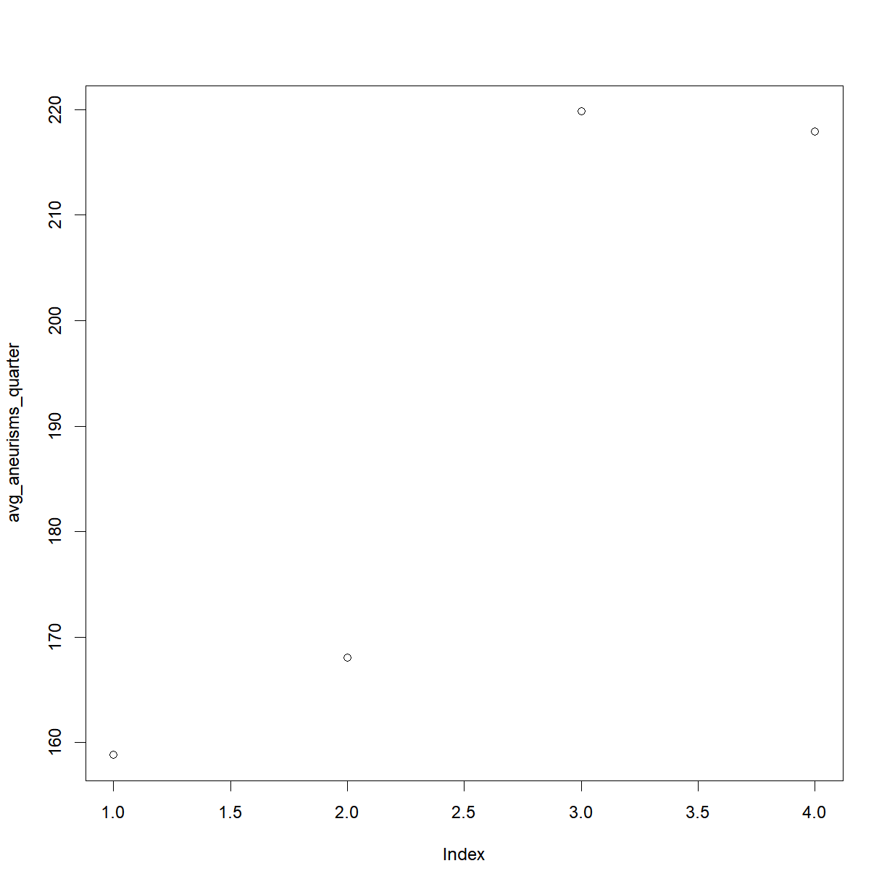
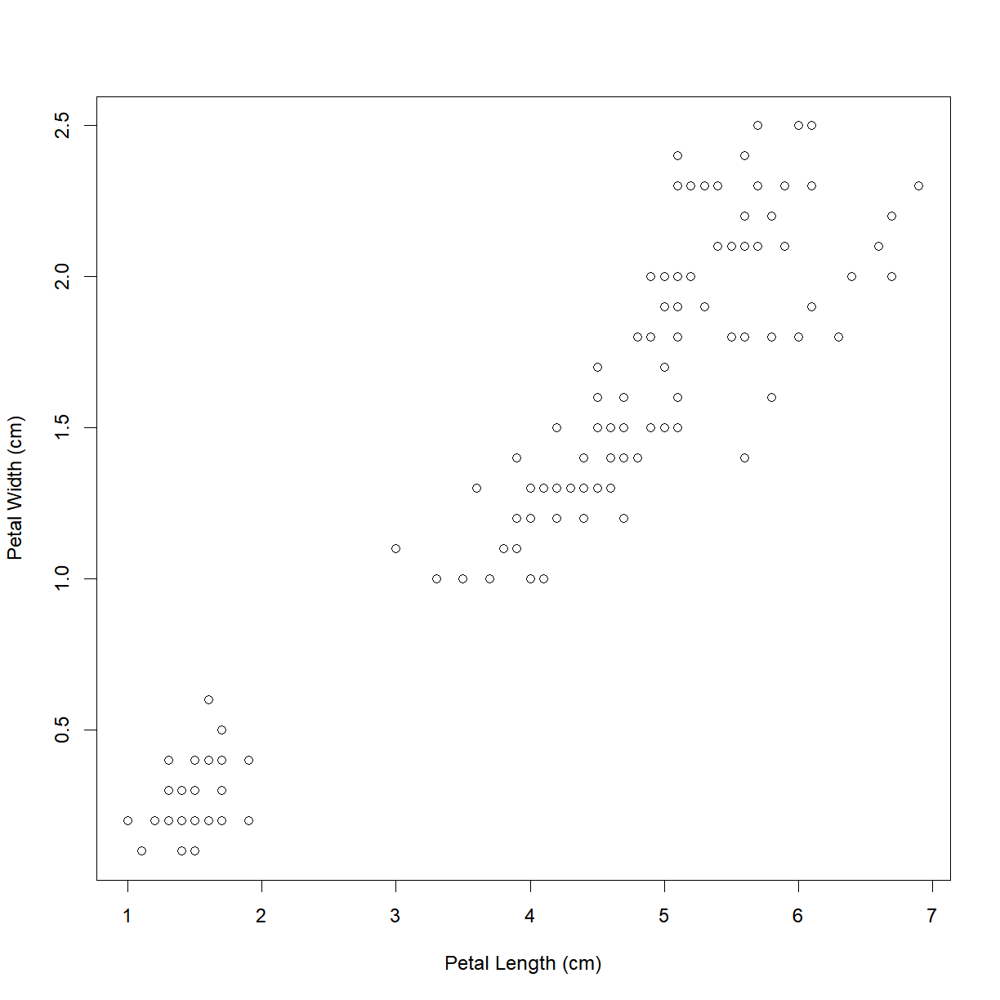
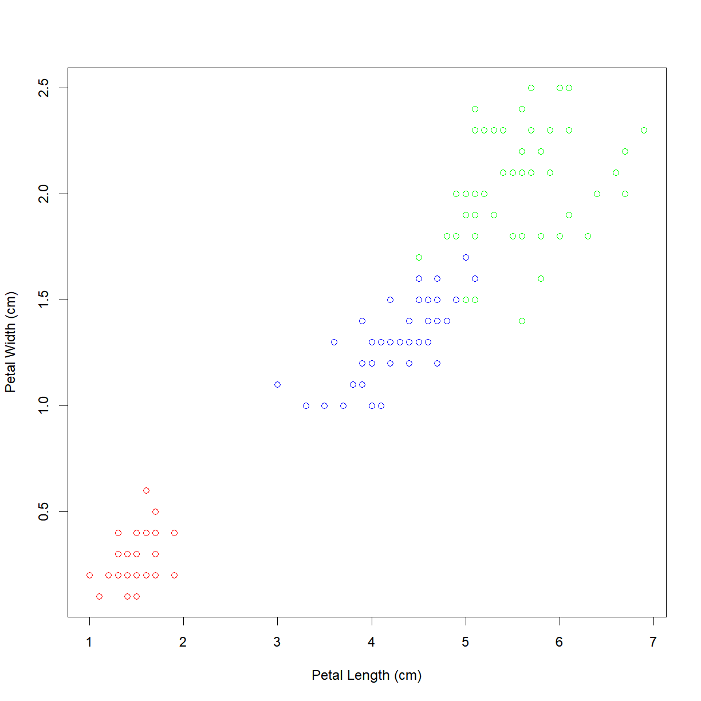
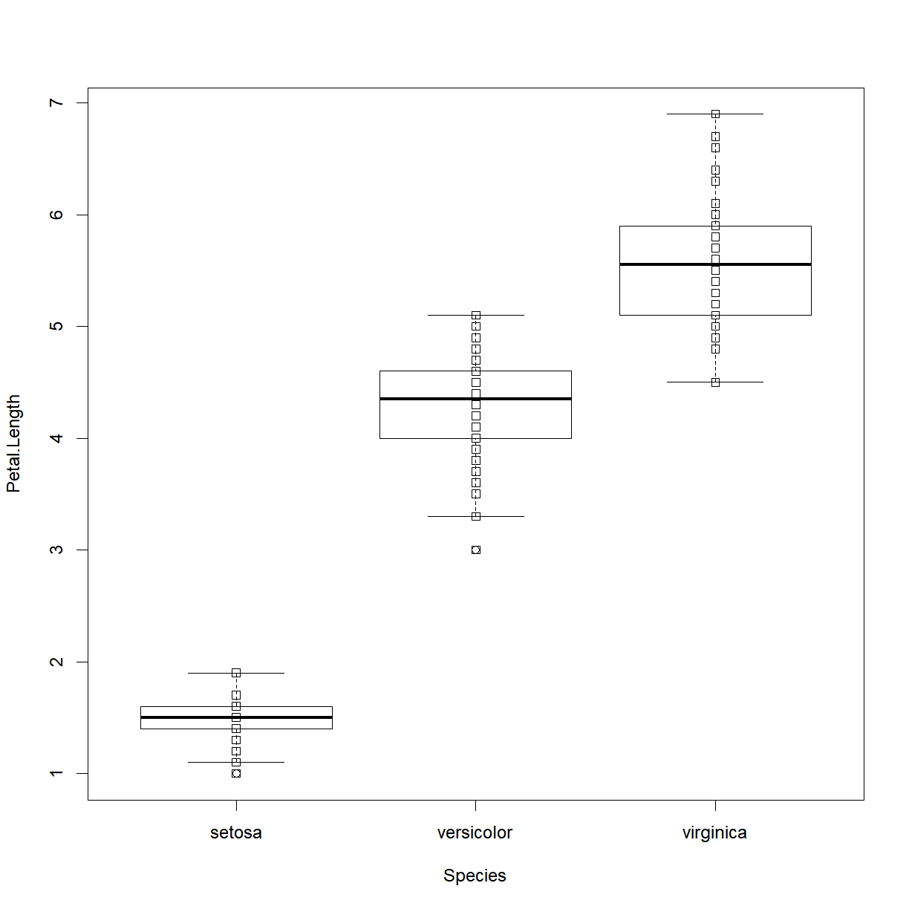
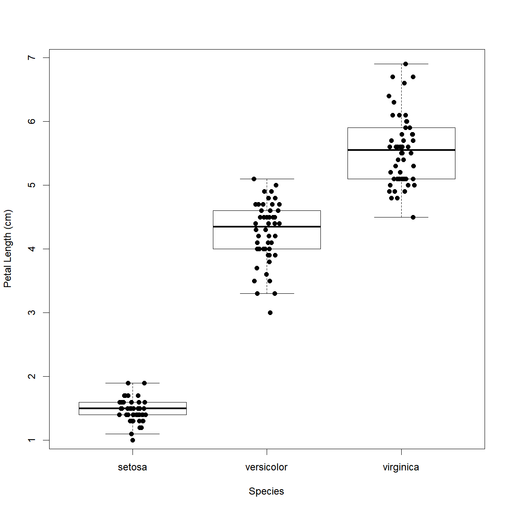
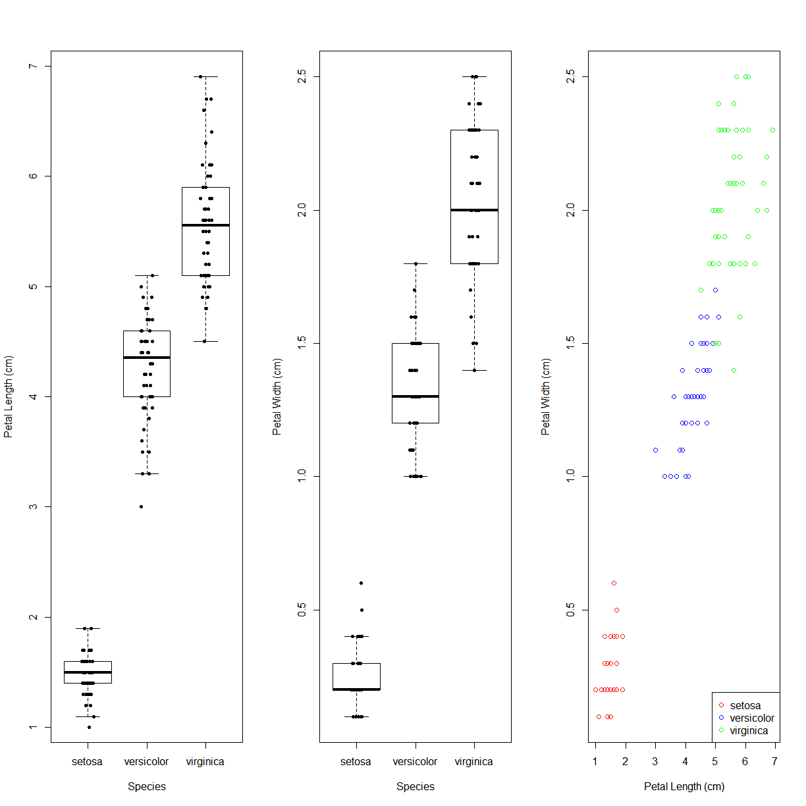

### Reading data from a tabulated file (.csv, .txt)

In the majority of cases, your data will be stored in some type of external file. The most common way that scientists store data is in Excel spreadsheets. While there are R packages designed to access data from Excel spreadsheets (e.g., gdata, RODBC, XLConnect, xlsx, RExcel), these packages are often difficult and non-intuitive to use. When you start dealing with larger datasets, accessing data from Excel files in R also gets slow. users often find it easier to save their spreadsheets in one or more [comma-separated values]({{ page.root }}/reference.html#comma-separated-values-csv) (CSV or .csv) or text (TXT or .txt) files and then use R's built in functionality to read and manipulate the data. Both file types are more primitive forms of table/spreadsheet in which data is stored as text with distinct data elements separated by a *delimiting character* (a comma `,` for .csv files and usually a tab `\t` for .txt files).

Thankfully, Excel is capable of opening, editing, and saving both .csv and .txt files, so we can go back and forth between R and Excel when we find it convenient. 

In this short lesson, we'll learn how to read external data from a .csv or .txt file, and write data modified or generated in R to a new .csv or .txt file. We will also explore the [arguments]({{ page.root }}/reference.html#argument) that allow you read and write the data correctly for your needs.

&nbsp;
#### Loading external data into a data frame

Let's start by loading some sample data and take a look at the first few rows of the contents using the `head()`:

~~~
dat <- read.csv(file = 'data/sample.csv')
~~~
{: .language-r}

&nbsp;

Open up the same file using a basic text editor (e.g. *Notepad* in Windows; *TextEdit* in MacOS). You should see something like this:

> "ID","Gender","Group","BloodPressure","Age","Aneurisms_q1","Aneurisms_q2","Aneurisms_q3","Aneurisms_q4" 
> "Sub001","m","Control",132,16,114,140,202,237
> "Sub002","m","Treatment2",139,17.2,148,209,248,248
> "Sub003","m","Treatment2",130,19.5,196,251,122,177
> "Sub004","f","Treatment1",105,15.7,199,140,233,220
> "Sub005","m","Treatment1",125,19.9,188,120,222,228
> "Sub006","M","Treatment2",112,14.3,260,266,320,294
{: .callout}

&nbsp;

A couple of things to notice:
* The first line contains column headers.
* The `,` delimiters tell the `read.csv(...)` function where the breaks in the data are located; that is, which data to put in which column of the output data frame.
* Each new line is also a delimiter that tells `read.csv(...)` which data to put in which row in the output data frame
* In this case, all strings are contained within quotation marks `""`. This is an optional way to tell the program where character strings start and stop. 

On the topic of using quotation marks, open `sample-noquotes.csv` in your text editor to see the quote-free option:

> ID,Gender,Group,BloodPressure,Age,Aneurisms_q1,Aneurisms_q2,Aneurisms_q3,Aneurisms_q4 
> Sub001,m,Control,132,16,114,140,202,237
> Sub002,m,Treatment2,139,17.2,148,209,248,248
> Sub003,m,Treatment2,130,19.5,196,251,122,177
> Sub004,f,Treatment1,105,15.7,199,140,233,220
> Sub005,m,Treatment1,125,19.9,188,120,222,228
> Sub006,M,Treatment2,112,14.3,260,266,320,294
{: .callout}

&nbsp;

And note that the default `read.csv(...)` treats this file identically:

~~~
dat2 <- read.csv(file = 'data/sample-noquotes.csv')
head(dat2)
~~~
{: .language-r}

~~~
      ID Gender      Group BloodPressure  Age Aneurisms_q1 Aneurisms_q2
1 Sub001      m    Control           132 16.0          114          140
2 Sub002      m Treatment2           139 17.2          148          209
3 Sub003      m Treatment2           130 19.5          196          251
4 Sub004      f Treatment1           105 15.7          199          140
5 Sub005      m Treatment1           125 19.9          188          120
6 Sub006      M Treatment2           112 14.3          260          266
  Aneurisms_q3 Aneurisms_q4
1          202          237
2          248          248
3          122          177
4          233          220
5          222          228
6          320          294
~~~
{: .output}

&nbsp;

Whether to use quotes in your data files is up to you. The default behavior of `read.csv(...)` is smart enough to figure this out on it's own. However, the `read.csv(...)` has an argument called `quote` that dictates how to interpret quotation marks. 

> ## Mis-loading quoted data
>
> What if we force `read.csv("")` to ignore the quotes when they are present?
> Before you run any code, think about what will happen to the data in quotes
> if we tell R that there are no "quote" characters.
>
> 
> ~~~
> dat3 <- read.csv(file = 'data/sample.csv', quote="")
> head(dat3)
> ~~~
> {: .language-r}
>
> > ## Solution
> > 
> > The quotes are now included as part of the character arguments. It also messed up the header 
> > formatting, appending an "X" to the beginning and surrounding text with "."ss.
> {: .solution}
{: .challenge}

&nbsp;

What happens if we don't assign the output of `read.csv(...)` to a variable?

~~~
read.csv(file = 'data/sample.csv')
~~~
{: .language-r}

&nbsp;

As with any other function call, if the output is not explicitly assigned, it will be dumped into the console window.

&nbsp;
#### Changing Delimiters

The default delimiter of the `read.csv()` function is a comma `,`, but you can
use essentially any set of characters as a delimiter. `read.csv(...)` is actually a special case of a broader function called `read.table(...)`, with the delimiter argument (which is `sep`, for "separator") set to `c` by default. Check out the help file for these functions:

~~~
?read.table # note that `?read.csv` brings up the same help document.
~~~
{: .language-r}

&nbsp;

Under the **Usage** section there are multiple functions listed, including `read.table(...)` and `read.csv(...)`. In the parentheses for each function there is a list of arguments. Since `read.table(...)` is the parent function, all arguments are listed. Only arguments with different default values (as indicated by the `=`) are listed for `read.csv(...)`. A default value is the value that each argument assumes when you do not explicitly enter a value. For example, `read.table(...)` assumes that a data file has no header (`header = FALSE`) and no delimiting character (`sep = ""`) while `read.csv(...)` assumes that a data file does have a header (`header = TRUE`) and a comma as the delimiting character (`sep = ","`), unless you specify otherwise. 

If your data is stored in a tab-delimited text file, you will need to use `read.table(...)` a different delimiting character, or another of the associated functions called `read.delim(...)` which has defaults to a tab-delimited file format. Note that to define a *tab* as a delimiting character, you have to use `\t`.

Let's give it a try using a copy of the `sample.csv` data saved as a tab-delimited `sample.txt` file.

*Note:* From the help file, `read.delim(...)` defaults to `header = TRUE` while we have to explicity definit it when using `read.table(...)`. We will talk about what this means in the next section.

~~~
# note that read
dat4 <- read.delim(file = 'data/sample.txt')
dat5 <- read.table(file = 'data/sample.txt', header = TRUE)
head(dat4)
~~~
{: .language-r}

~~~
      ID Gender      Group BloodPressure  Age Aneurisms_q1 Aneurisms_q2
1 Sub001      m    Control           132 16.0          114          140
2 Sub002      m Treatment2           139 17.2          148          209
3 Sub003      m Treatment2           130 19.5          196          251
4 Sub004      f Treatment1           105 15.7          199          140
5 Sub005      m Treatment1           125 19.9          188          120
6 Sub006      M Treatment2           112 14.3          260          266
  Aneurisms_q3 Aneurisms_q4
1          202          237
2          248          248
3          122          177
4          233          220
5          222          228
6          320          294
~~~
{: .output}

~~~
head(dat5)
~~~
{: .language-r}

~~~
      ID Gender      Group BloodPressure  Age Aneurisms_q1 Aneurisms_q2
1 Sub001      m    Control           132 16.0          114          140
2 Sub002      m Treatment2           139 17.2          148          209
3 Sub003      m Treatment2           130 19.5          196          251
4 Sub004      f Treatment1           105 15.7          199          140
5 Sub005      m Treatment1           125 19.9          188          120
6 Sub006      M Treatment2           112 14.3          260          266
  Aneurisms_q3 Aneurisms_q4
1          202          237
2          248          248
3          122          177
4          233          220
5          222          228
6          320          294
~~~
{: .output}

&nbsp;

Now let's take a closer look at a couple of useful arguments in `read.table(...)` family of functions.

&nbsp;
#### The `header` Argument

The default for `read.csv(...)` and `read.delim(...)` is to set the `header` argument to `TRUE`. This means that the first row of values in the .csv or .txt is used to define the column names for the data frame. If your data set does not have a header, set the `header` argument to `FALSE`. 

> ## Mis-loading data with headers
>
> What happens if you forget to put `header = FALSE`? The default value is
> `header = TRUE`, which you can check with `?read.csv` or `help(read.csv)`.
> What do you expect will happen if you leave the default value?
> Before you run any code, think about what will happen to the first few rows
> of your data frame, and its overall size. Then run the following code and
> see if your expectations agree:
>
> 
> ~~~
> dat6 <- read.csv(file = 'data/sample.csv', header = FALSE)
> head(dat6)
> ~~~
> {: .language-r}
>
> > ## Solution
> > 
> > The `read.csv(...)` function sets the column names as the default values (`V1, V2, V3, ...`) and 
> > treats the first row of the `sample.csv` file as the first row of data. Clearly this is not the 
> > desired behavior for this data set, but it will be useful if you have a dataset without headers.
> > Note that the `V` is prepended just a number would not be a valid variable name. 
> {: .solution}
{: .challenge}

&nbsp;
#### The `stringsAsFactors` Argument

This is perhaps the most important argument in `read.csv(...)`, particularly if you are working with categorical data. This is because the default behavior of R is to convert character [string]({{ page.root }}/reference.html#string)s into factors, which may make it difficult to do such things as replace values. 

For example, let's look at the `car-speeds.csv` data set. We find out that the data collector was color blind, and accidentally recorded green cars as being blue. In order to correct the data set, let's replace 'Blue' with 'Green' in the `$Color` column:

~~~
# First - load the data and take a look at what information is available
carSpeeds <- read.csv(file = 'data/car-speeds.csv')
head(carSpeeds)
~~~
{: .language-r}

~~~
  Color Speed     State
1  Blue    32 NewMexico
2   Red    45   Arizona
3  Blue    35  Colorado
4 White    34   Arizona
5   Red    25   Arizona
6  Blue    41   Arizona
~~~
{: .output}

~~~
# Next use indexing to replace all `Blue` entries in the Color column with 'Green'
carSpeeds$Color[carSpeeds$Color == 'Blue'] = 'Green'
~~~
{: .language-r}

~~~
Warning in `[<-.factor`(`*tmp*`, carSpeeds$Color == "Blue", value =
structure(c(NA, : invalid factor level, NA generated
~~~
{: .error}

&nbsp;

What happened? The colors of the cars were loaded as factors by `read.csv(...)` by default. Since `Green` was not in the original set of colors, it was not included as a level in the factor. 

To see the internal structure, we can use another function, `str()`. In this case,
the dataframe's internal structure includes the format of each column, which is what
we are interested in. 

~~~
str(carSpeeds)
~~~
{: .language-r}

~~~
'data.frame':	100 obs. of  3 variables:
 $ Color: Factor w/ 5 levels " Red","Black",..: NA 1 NA 5 4 NA NA 2 5 4 ...
 $ Speed: int  32 45 35 34 25 41 34 29 31 26 ...
 $ State: Factor w/ 4 levels "Arizona","Colorado",..: 3 1 2 1 1 1 3 2 1 2 ...
~~~
{: .output}

&nbsp;

We can see that the `$Color` and `$State` columns are factors and `$Speed` is a numeric column. 

One way to solve this problem would be to add the `Green` level to the `Color` factor, but there is a simpler way. Let's reload the dataset using `stringsAsFactors = FALSE`, and see what happens when we try to replace 'Blue' with 'Green' in the `$Color` column:

~~~
# First - load the data and take a look at what information is available
carSpeeds <- read.csv(file = 'data/car-speeds.csv', stringsAsFactors = FALSE)
str(carSpeeds)
~~~
{: .language-r}

~~~
'data.frame':	100 obs. of  3 variables:
 $ Color: chr  "Blue" " Red" "Blue" "White" ...
 $ Speed: int  32 45 35 34 25 41 34 29 31 26 ...
 $ State: chr  "NewMexico" "Arizona" "Colorado" "Arizona" ...
~~~
{: .output}

~~~
# Next use indexing to replace all `Blue` entries in the Color column with 'Green'
carSpeeds$Color[carSpeeds$Color == 'Blue'] = 'Green'
carSpeeds$Color
~~~
{: .language-r}

~~~
  [1] "Green" " Red"  "Green" "White" "Red"   "Green" "Green" "Black"
  [9] "White" "Red"   "Red"   "White" "Green" "Green" "Black" "Red"  
 [17] "Green" "Green" "White" "Green" "Green" "Green" "Red"   "Green"
 [25] "Red"   "Red"   "Red"   "Red"   "White" "Green" "Red"   "White"
 [33] "Black" "Red"   "Black" "Black" "Green" "Red"   "Black" "Red"  
 [41] "Black" "Black" "Red"   "Red"   "White" "Black" "Green" "Red"  
 [49] "Red"   "Black" "Black" "Red"   "White" "Red"   "Green" "Green"
 [57] "Black" "Green" "White" "Black" "Red"   "Green" "Green" "White"
 [65] "Black" "Red"   "Red"   "Black" "Green" "White" "Green" "Red"  
 [73] "White" "White" "Green" "Green" "Green" "Green" "Green" "White"
 [81] "Black" "Green" "White" "Black" "Black" "Red"   "Red"   "White"
 [89] "White" "White" "White" "Red"   "Red"   "Red"   "White" "Black"
 [97] "White" "Black" "Black" "White"
~~~
{: .output}

&nbsp;

That's better! And we can see how the data now is read as character instead of factor.

***
### Writing tabular data to a file (.csv, .txt)

After altering our cars dataset by replacing 'Blue' with 'Green' in the `$Color` column, we now want to save the output. The `read.table(...)` function family has a corresponding set of `write.table(...)` functions. These functions have a familiar set of arguments:

~~~
?read.table
~~~
{: .language-r}

&nbsp;

Here is the basic format for writing a table:

~~~
# Export the data. The write.csv() function requires a minimum of two
# arguments, the data to be saved and the name of the output file.

write.csv(carSpeeds, file = 'data/car-speeds-cleaned.csv')
~~~
{: .language-r}

If you open the file, you'll see that it has header names, because the data had headers within R, but that there are also numbers in the first column.

&nbsp;

This extra column can cause problems when trying to open data in some other programs, and in most cases you won't want to explicity name the rows. This can be easily disabled with a simple argument:

&nbsp;
#### The `row.names` Argument

This argument allows us to set the names of the rows in the output data file. R's default for this argument is `TRUE`, and since it does not know what else to name the rows for the cars data set, it resorts to using row numbers. To turn row numbers off, we can set `row.names` to `FALSE`:

~~~
write.csv(carSpeeds, file = 'data/car-speeds-cleaned.csv', row.names = FALSE)
~~~
{: .language-r}

&nbsp; 

Now we see:

&nbsp;

> ## Setting Column Names
>
> There is also a `col.names` argument, which can be used to set the column
> names for a data set without headers. If the data set already has headers
> (e.g., we used the `headers = TRUE` argument when importing the data) then a
> `col.names` argument will be ignored.
{: .callout}

&nbsp;
#### The `na` Argument

There are times when we want to specify certain values for `NA`s in the data set (e.g., we are going to pass the data to a program that only accepts -9999 as a nodata value). In this case, we want to set the `NA` value of our output file to the desired value, using the na argument. Let's see how this works:

~~~
# First, replace the speed in the 3rd row with NA, by using an index (square
# brackets to indicate the position of the value we want to replace)
carSpeeds$Speed[3] <- NA
head(carSpeeds)
~~~
{: .language-r}

~~~
  Color Speed     State
1 Green    32 NewMexico
2   Red    45   Arizona
3 Green    NA  Colorado
4 White    34   Arizona
5   Red    25   Arizona
6 Green    41   Arizona
~~~
{: .output}

~~~
write.csv(carSpeeds, file = 'data/car-speeds-cleaned.csv', row.names = FALSE)
~~~
{: .language-r}

&nbsp;

Now we'll set `NA` to -9999 when we write the new .csv file:

~~~
# Note - the na argument requires a string input
write.csv(carSpeeds,
          file = 'data/car-speeds-cleaned.csv',
          row.names = FALSE,
          na = '-9999')
~~~
{: .language-r}

&nbsp;

And we see:

&nbsp;

This can be useful when exporting data from R in a different program that either does not recognize `NA` or uses a different symbol for missing data.

***
### Calculating basic statistics

Now let's perform some common mathematical operations to learn more about our data. Before we begin, let's clean up our environment and reload our sample data to reset any unintended changes and be sure that we include `header=TRUE` and `stringsAsFactors=FALSE`.

~~~
rm(list=ls())
dat <- read.csv(file="data/sample.csv", header=TRUE, stringsAsFactors=FALSE)
~~~
{: .language-r}

&nbsp;

This data is the results of an (not real) experiment, looking at the number of aneurisms that formed in the eyes of patients who undertook 3 different treatments.

When analyzing data we often want to look at partial statistics, such as the maximum value per patient or the average value per treatment group. One way to do this is to select the data we want to create a new temporary data frame, and then perform the calculation on this subset:

~~~
# select aneurism data for the first subject
sub1 <- dat[1, 6:9]

# max number of aneurisms for subject 1
max(sub1)
~~~
{: .language-r}

~~~
[1] 237
~~~
{: .output}

&nbsp;

We don't actually need to store the row in a variable of its own.
Instead, we can combine the selection and the function call:

~~~
# max inflammation for subject 2
max(dat[2, 6:9])
~~~
{: .language-r}

~~~
[1] 248
~~~
{: .output}

&nbsp;

R also has functions for other common calculations, e.g. finding the minimum, mean, median, and standard deviation of the data:

~~~
# minimum number of aneurisms in q3
min(dat$Aneurisms_q3)
~~~
{: .language-r}

~~~
[1] 105
~~~
{: .output}

~~~
# mean number of aneurisms in q3
mean(dat$Aneurisms_q3)
~~~
{: .language-r}

~~~
[1] 219.85
~~~
{: .output}

~~~
# median number of aneurisms in q3
median(dat$Aneurisms_q3)
~~~
{: .language-r}

~~~
[1] 217
~~~
{: .output}

~~~
# standard deviation number of aneurisms in q3
sd(dat$Aneurisms_q3)
~~~
{: .language-r}

~~~
[1] 48.76958
~~~
{: .output}

~~~
# total number of observations in q3
length(dat$Aneurisms_q3)
~~~
{: .language-r}

~~~
[1] 100
~~~
{: .output}

&nbsp;

R has a function called `summary()` that provides a convenient summary of each column:

~~~
# Summarize function
summary(dat)
~~~
{: .language-r}

~~~
      ID               Gender             Group           BloodPressure  
 Length:100         Length:100         Length:100         Min.   : 62.0  
 Class :character   Class :character   Class :character   1st Qu.:107.5  
 Mode  :character   Mode  :character   Mode  :character   Median :117.5  
                                                          Mean   :118.6  
                                                          3rd Qu.:133.0  
                                                          Max.   :173.0  
      Age         Aneurisms_q1    Aneurisms_q2    Aneurisms_q3  
 Min.   :12.10   Min.   : 65.0   Min.   : 80.0   Min.   :105.0  
 1st Qu.:14.78   1st Qu.:118.0   1st Qu.:131.5   1st Qu.:182.5  
 Median :16.65   Median :158.0   Median :162.5   Median :217.0  
 Mean   :16.42   Mean   :158.8   Mean   :168.0   Mean   :219.8  
 3rd Qu.:18.30   3rd Qu.:188.0   3rd Qu.:196.8   3rd Qu.:248.2  
 Max.   :20.00   Max.   :260.0   Max.   :283.0   Max.   :323.0  
  Aneurisms_q4  
 Min.   :116.0  
 1st Qu.:186.8  
 Median :219.0  
 Mean   :217.9  
 3rd Qu.:244.2  
 Max.   :315.0  
~~~
{: .output}

&nbsp; 

For every column in the data frame, `summary()` provides a different of summary data depending on the class of that column. For instance, for `numeric` columns, `summary()` provides minimun, maximum, mean, median, and quartile values. 

What if we need the maximum number of aneurisms across quarters for each patient, or perhaps the average across quarters? As the diagram below shows, we want to perform the operation across a `margin` of the data frame; that is we want to perform the same function (`mean()`) on the last 4 columns for every row:

To support this, we can use the `apply` function.

~~~
?apply
~~~
{: .language-r}

&nbsp;

`apply` allows us to repeat a function on all of the rows (`MARGIN = 1`) or columns (`MARGIN = 2`) of a data frame. Thus, to obtain the average inflammation of each patient we will need to calculate the mean of all of the rows (`MARGIN = 1`) of the data frame.

~~~
avg_aneurisms_subject <- apply(dat[,6:9], 1, mean)
~~~
{: .language-r}

&nbsp;

And to obtain the average number of aneurisms for each quarter, mean of all of the columns (`MARGIN = 2`) of the data frame:

~~~
avg_aneurisms_quarter <- apply(dat[,6:9], 2, mean)
~~~
{: .language-r}

&nbsp; 

> ## Argument Order in Functions
> 
> Notice that we did not specify the argument names in `apply()`. Looking at the help file, the argument 
> order is `X` (indicating the input data), then `MARGIN`, then `FUN` (for function to apply). So long as you 
> enter arguments in the requested order, you do not need to be explicitly about which argument you are 
> referring too. `apply()` just assumes that the first argument entered is the value for `X`, the second is the > value for `MARGIN`, and the third is the value for `FUN`. You can mix up the order, but then you have to be 
> explicit about which argument you are defining.
>
> For example, this will return an error:
> 
> ~~~
> avg_aneurisms_subject <- apply(mean, 1, dat[,6:9])
> ~~~
> {: .language-r}
> 
> while this will be interpreted identically to the earlier function call:
> 
> ~~~
> avg_aneurisms_subject <- apply(FUN = mean, MARGIN = 1, X = dat[,6:9])
> ~~~
> {: .language-r}
{: .callout}

&nbsp;

> ## Efficient Alternatives
>
> Some common operations have more efficient alternatives. For example, you
> can calculate the row-wise or column-wise means with `rowMeans()` and
> `colMeans()`, respectively. Similarly for `rowSums()` and `colSums()`.
{: .callout}

&nbsp;
#### Exercises

> ## Subsetting More Data
>
> Suppose you want to determine the maximum number of aneurisms for subject 5 across quarters two to four.
> To do this you would extract the relevant subset from the data frame and calculate the maximum value.
> Which of the following lines of R code gives the correct answer?
>
> 1. `max(dat[5, ])`
> 2. `max(dat[7:9, 5])`
> 3. `max(dat[5, 7:9])`
> 4. `max(dat[5, 7, 9])`
>
> > ## Solution
> >  
> > Answer: 3
> >
> > Explanation: You want to extract the part of the data frame representing data for patient 5 from quarter two (column 7) to quarter 4 (column 9). In this data frame, patient data is organised in rows and the days are represented by the columns. Subscripting in R follows the `[i, j]` principle, where `i = rows` and `j = columns`. Thus, answer 3 is correct since the patient is represented by the value for i (5) and the days are represented by the values in j, which is a subset spanning day 9 to 7.
> > 
> {: .solution}
{: .challenge}

> ## Subsetting and Re-Assignment
>
> Using the data frame `dat` from above:
> Let's pretend there was something wrong with the instrument on the first two quarters for every second patient (subjects 2, 4, 6, etc.), which resulted in the measurements being twice as large as they should be.
>
> 1. Write a vector containing each affected patient (hint: `?seq`)
> 2. Create a new data frame in which you halve the first two quarters' values in only those patients
> 3. Print out the corrected data frame to check that your code has fixed the problem
>
> > ## Solution
> > 
> > ~~~
> > whichPatients <- seq(2, dim(dat)[1], 2) # i.e., which rows
> > whichQuarters <- seq(6,7)         # i.e., which columns indicates quarters 1 and 2; you could also use c(6,7) or 6:7
> > dat2 <- dat # make a copy of the original data
> > # check the size of your subset: returns `30 5`, that is 30 [rows=patients] by 5 [columns=quarters]
> > dim(dat2[whichPatients, whichQuarters])
> > ~~~
> > {: .language-r}
> > 
> > 
> > 
> > ~~~
> > [1] 50  2
> > ~~~
> > {: .output}
> > 
> > 
> > 
> > ~~~
> > dat2[whichPatients, whichQuarters] <- dat[whichPatients, whichQuarters] / 2
> > dat2
> > ~~~
> > {: .language-r}
> > 
> > 
> > 
> > ~~~
> >         ID Gender      Group BloodPressure  Age Aneurisms_q1 Aneurisms_q2
> > 1   Sub001      m    Control           132 16.0        114.0        140.0
> > 2   Sub002      m Treatment2           139 17.2         74.0        104.5
> > 3   Sub003      m Treatment2           130 19.5        196.0        251.0
> > 4   Sub004      f Treatment1           105 15.7         99.5         70.0
> > 5   Sub005      m Treatment1           125 19.9        188.0        120.0
> > 6   Sub006      M Treatment2           112 14.3        130.0        133.0
> > 7   Sub007      f    Control           173 17.7        135.0         98.0
> > 8   Sub008      m Treatment2           108 19.8        108.0        119.0
> > 9   Sub009      m Treatment2           131 19.4        117.0        215.0
> > 10  Sub010      f    Control           129 18.8         94.0         72.0
> > 11  Sub011      m Treatment1           126 14.8        134.0        155.0
> > 12  Sub012      f Treatment2            96 15.3         76.0         88.5
> > 13  Sub013      f    Control            77 16.5        112.0        220.0
> > 14  Sub014      m    Control           158 12.6         54.5         75.0
> > 15  Sub015      m    Control            81 14.3        146.0        140.0
> > 16  Sub016      m    Control           137 15.9         48.5         86.0
> > 17  Sub017      f Treatment1           147 18.4        165.0        157.0
> > 18  Sub018      m Treatment2           130 18.3         79.0        132.5
> > 19  Sub019      m Treatment1           105 15.4        178.0        109.0
> > 20  Sub020      F Treatment1            92 14.3         53.5         94.0
> > 21  Sub021      f    Control           111 12.7        174.0        160.0
> > 22  Sub022      m Treatment1           122 15.4         48.5         55.0
> > 23  Sub023      f Treatment2            97 17.2        187.0        239.0
> > 24  Sub024      f Treatment2           118 17.3         94.0         95.5
> > 25  Sub025      m Treatment1            82 16.7        114.0        199.0
> > 26  Sub026      M Treatment1           123 19.6         57.5         80.0
> > 27  Sub027      M Treatment2           126 15.0        128.0        249.0
> > 28  Sub028      f Treatment1            94 16.1         56.0        115.0
> > 29  Sub029      m    Control           135 17.6        136.0        109.0
> > 30  Sub030      f    Control           108 18.6         51.5         74.0
> > 31  Sub031      f Treatment1           133 18.3        132.0        151.0
> > 32  Sub032      m Treatment1           108 16.7         59.0         77.0
> > 33  Sub033      m Treatment2           122 12.5        166.0        176.0
> > 34  Sub034      m Treatment1           134 14.3         76.0         52.5
> > 35  Sub035      m Treatment1           145 19.7        191.0        148.0
> > 36  Sub036      f    Control           133 17.6         76.0         89.0
> > 37  Sub037      f Treatment2            90 17.0        161.0        270.0
> > 38  Sub038      m Treatment2           118 12.2        119.5         92.0
> > 39  Sub039      M Treatment1           113 15.1        132.0        137.0
> > 40  Sub040      m Treatment2           115 17.7         84.0        127.5
> > 41  Sub041      f Treatment1           142 19.0        140.0        184.0
> > 42  Sub042      m Treatment1           114 14.7         83.0         42.5
> > 43  Sub043      m    Control           139 15.2        141.0        160.0
> > 44  Sub044      m Treatment1            90 15.3         80.5         84.0
> > 45  Sub045      f    Control           126 12.9        103.0        111.0
> > 46  Sub046      f Treatment2           109 18.4        115.5        120.0
> > 47  Sub047      M    Control           125 18.1        192.0        141.0
> > 48  Sub048      M    Control            99 15.6         89.0         90.0
> > 49  Sub049      m    Control           122 19.5        167.0        123.0
> > 50  Sub050      m Treatment1           111 13.5         67.5         75.0
> > 51  Sub051      m Treatment2           109 13.5        150.0        166.0
> > 52  Sub052      f Treatment1           134 13.7         96.0         40.0
> > 53  Sub053      f Treatment1           113 18.7        153.0        153.0
> > 54  Sub054      f Treatment2           105 12.2        102.5        132.0
> > 55  Sub055      m Treatment2           125 16.9        117.0        194.0
> > 56  Sub056      f Treatment2           123 19.5         99.5         59.5
> > 57  Sub057      m    Control           155 12.1        182.0        129.0
> > 58  Sub058      m Treatment2           117 17.0         90.0         98.0
> > 59  Sub059      m Treatment1           116 19.2        111.0        111.0
> > 60  Sub060      f    Control           133 14.7         50.5         49.0
> > 61  Sub061      f    Control            94 20.0        166.0        167.0
> > 62  Sub062      f Treatment2           106 14.1         79.0         85.5
> > 63  Sub063      f Treatment1           144 14.7        189.0        178.0
> > 64  Sub064      M Treatment1           149 16.6         94.5         50.5
> > 65  Sub065      f Treatment2           108 15.0        239.0        189.0
> > 66  Sub066      m Treatment1           116 15.0         92.5        112.0
> > 67  Sub067      f Treatment2           136 13.8        224.0        112.0
> > 68  Sub068      f    Control            98 14.8         52.0         69.5
> > 69  Sub069      M Treatment2           148 19.1        222.0        199.0
> > 70  Sub070      m    Control            74 18.9         53.5         49.0
> > 71  Sub071      m Treatment2           147 17.7        153.0        255.0
> > 72  Sub072      m    Control           116 17.4         59.0         82.5
> > 73  Sub073      F Treatment1           133 15.5        102.0        184.0
> > 74  Sub074      m    Control            97 13.1         94.0         62.5
> > 75  Sub075      m Treatment2           132 12.2        180.0        283.0
> > 76  Sub076      f Treatment2           153 17.0         89.0        107.0
> > 77  Sub077      M Treatment1           151 17.7        168.0        184.0
> > 78  Sub078      M Treatment1           121 19.5         59.0         85.0
> > 79  Sub079      M Treatment1           116 19.5        169.0        114.0
> > 80  Sub080      f    Control           104 12.8         78.0         69.0
> > 81  Sub081      m Treatment2           111 17.6        232.0        211.0
> > 82  Sub082      M Treatment1            62 17.7         94.0         54.0
> > 83  Sub083      M Treatment2           124 14.2        169.0        168.0
> > 84  Sub084      m Treatment2           124 19.2        120.5        116.5
> > 85  Sub085      m Treatment2           109 16.0         65.0        207.0
> > 86  Sub086      f    Control           117 15.2        112.5         92.5
> > 87  Sub087      f    Control            90 17.6        104.0        116.0
> > 88  Sub088      f Treatment1           158 17.6         89.5         79.0
> > 89  Sub089      m Treatment1           113 15.1        103.0        140.0
> > 90  Sub090      m    Control           150 17.8         56.0         65.0
> > 91  Sub091      f Treatment2           115 16.2        226.0        170.0
> > 92  Sub092      m Treatment2            83 16.6        114.0        110.5
> > 93  Sub093      F    Control           116 19.1        209.0        142.0
> > 94  Sub094      f Treatment1           141 17.2         76.5         52.0
> > 95  Sub095      m    Control           108 13.6        111.0        118.0
> > 96  Sub096      m    Control           102 14.6         74.0         66.0
> > 97  Sub097      F Treatment2            90 19.6        141.0        196.0
> > 98  Sub098      m Treatment1           133 17.0         96.5         56.0
> > 99  Sub099      M Treatment2            83 16.2        130.0        226.0
> > 100 Sub100      M Treatment1           122 18.4         63.0         78.5
> >     Aneurisms_q3 Aneurisms_q4
> > 1            202          237
> > 2            248          248
> > 3            122          177
> > 4            233          220
> > 5            222          228
> > 6            320          294
> > 7            154          245
> > 8            279          251
> > 9            181          272
> > 10           192          185
> > 11           247          223
> > 12           323          245
> > 13           225          195
> > 14           177          189
> > 15           239          223
> > 16           203          207
> > 17           200          193
> > 18           243          187
> > 19           206          182
> > 20           167          218
> > 21           203          183
> > 22           194          133
> > 23           281          214
> > 24           256          265
> > 25           242          195
> > 26           158          228
> > 27           294          315
> > 28           281          126
> > 29           105          155
> > 30           219          228
> > 31           234          162
> > 32           260          160
> > 33           253          233
> > 34           197          299
> > 35           166          185
> > 36           158          170
> > 37           232          284
> > 38           317          269
> > 39           193          206
> > 40           273          274
> > 41           239          202
> > 42           179          196
> > 43           179          239
> > 44           212          181
> > 45           254          126
> > 46           260          310
> > 47           180          225
> > 48           169          183
> > 49           236          224
> > 50           208          279
> > 51           153          204
> > 52           138          222
> > 53           236          216
> > 54           269          207
> > 55           216          211
> > 56           183          251
> > 57           226          218
> > 58           250          294
> > 59           244          201
> > 60           178          116
> > 61           232          241
> > 62           237          212
> > 63           177          238
> > 64           193          172
> > 65           297          300
> > 66           151          182
> > 67           304          288
> > 68           211          204
> > 69           280          196
> > 70           204          138
> > 71           218          234
> > 72           220          227
> > 73           246          222
> > 74           191          157
> > 75           204          298
> > 76           291          240
> > 77           184          229
> > 78           249          249
> > 79           248          233
> > 80           218          258
> > 81           219          246
> > 82           180          136
> > 83           180          211
> > 84           292          182
> > 85           234          235
> > 86           195          235
> > 87           173          221
> > 88           216          244
> > 89           209          186
> > 90           175          191
> > 91           307          244
> > 92           316          259
> > 93           199          184
> > 94           194          214
> > 95           173          191
> > 96           200          194
> > 97           322          273
> > 98           123          181
> > 99           286          281
> > 100          129          160
> > ~~~
> > {: .output}
> {: .solution}
{: .challenge}

> ## Correcting Case in Gender
>
> Take a closer look at the gender break down of our aneurism patient group.
> You can use the `table()` function to give you a count of each category for a 
> categorical vector:
> 
> 
> ~~~
> table(dat$Gender)
> ~~~
> {: .language-r}
> 
> 
> 
> ~~~
> 
>  f  F  m  M 
> 35  4 46 15 
> ~~~
> {: .output}
>
> What is going on here? It appears that the person entering this data sometimes
> used `m` and sometimes `M` to indicate `male`, and similarly `f` or `F` to 
> indicate `female` (or perhaps there were two individuals entering the data
> in slightly different ways). This is a problem, because R is case-sensitive and
> treats `m` as a different entry from `M`. 
>
> Use logical indexing to correct this problem. So we are all on the same page,
> change all entries to capitals. Save your corrected file to the data folder under
> the file name "sample-gendercorrected.csv".
>
> > ## Solution
> > 
> > 
> > ~~~
> > # first make a copy of the data (never overwrite your raw data)
> > dat_cor <- dat
> > 
> > # correct `f` entries to `F`
> > dat_cor$Gender[dat_cor$Gender == 'f'] = 'F'
> > 
> > # correct `m` entries to `M`
> > dat_cor$Gender[dat_cor$Gender == 'm'] = 'M'
> > 
> > # check the output using `table()`
> > table(dat_cor$Gender)
> > 
> > # save corrected data file
> > write.csv(dat_cor, file="data/sample-gendercorrected.csv", row.names = FALSE)
> > ~~~
> > {: .language-r}
> {: .solution}
{: .challenge}

> ## Using the Apply Function on Patient Data
>
> The apply function can be used to summarize datasets and subsets
> of data across rows and columns using the MARGIN argument.
> Suppose you want to calculate the mean number of aneurisms for 
> specific quarters and patients in the patient dataset.
>
> Use a combination of the apply function and indexing to:
>
> 1. Calculate the mean number of aneurisms for patients 1 to 5 over all four quarters.
> 2. Calculate the mean number of aneurisms for quarters 1 to 3 (across all patients).
> 3. Calculate the mean number of aneurisms for each patient in treatment group 2 day (across all quarters).
>
> Think about the number of rows and columns you would expect as the result before each apply call and check your intuition by applying the mean function.
>
> > ## Solution
> > 
> > 
> > ~~~
> >  # 1.
> > apply(dat[1:5, 6:9], 1, mean)
> > 
> > # 2.
> > apply(dat[, 6:8], 2, mean)
> > 
> > # 3.
> > apply(dat[dat$Group == "Treatment2", 6:9], 1, mean)
> > ~~~
> > {: .language-r}
> {: .solution}
{: .challenge}

***
### Plotting

The mathematician Richard Hamming once said, 

&nbsp;&nbsp;&nbsp;&nbsp;&nbsp;&nbsp;*"The purpose of computing is insight, not numbers."*

The best way to develop insight is often to visualize data. Visualization deserves an entire lecture (or course) of its own, and we will touch on various aspects of R's plotting functionality later on in the course, but for now we will introduce a few of R's plotting features.

The basic plot function in R is called, conveniently, `plot()`. Let's take a quick look:

~~~
?plot
~~~
{: .language-r}

&nbsp;

In it's most basic form, `plot(x,y)` function will create a scatter plot with points defined by the vectors `x` and `y`. Let's start out with the iris data set and look at the relationship between petal length and width:

~~~
plot(iris$Petal.Length, iris$Petal.Width)
~~~
{: .language-r}

&nbsp;

Congratulations! You have plotted your first data in R. So what is going on in the background here? Let's talk about what R is actually doing when you give it the plot command. 

&nbsp;
#### Graphics devices

When you tell R to run a plot, it actually takes a series of actions:

1. Opens a new "graphics device". This device can be one of several things:
 a. The "Plot" section in the lower-right panel of RStudio (this is the default in RStudio).
 b. A blank graphics pane in a new window (this requires the `windows()` or `quartz()` commands, which we discuss below).
 c. An external image file (e.g. a new .jpg file).
 d. An external PDF file (complete with vector graphics!).
2. Draws a series of objects; this part is done "under the hood" of the `plot()` function, and includes:
 a. Axes.
 b. Tick marks.
 c. Axis labels.
 d. Data points.
 e. Legend(s).
 f. Chart titles.
3. Leaves the current graphics device open for additional drawing input. This step is important, because it means that you can continue to add things to the image using other functions. 
4. Closes the graphics device following a `dev.off()` function call. This essentially "finalizes" the image.

Note that you can have multiple graphics devices open at once. R will, by default, write new graphics to the most recently used or created graphics device. Some functions, like `plot()` automatically start a new graphics device (or page in the case of the RStudio panel or a PDF), while other functions, like `lines()`, will add graphical elements to the most recently used device.

Let's repeat our above `plot()` command in a few different devices to illustrate a few of these points. 

&nbsp;

**Plotting in a separate window**

To plot in a separate window within RStudio (rather than the "Plot" panel), use one of the following platform-dependent functions:

~~~
windows() # Windows
quartz() # MacOS
~~~
{: .language-r}

&nbsp;

Now recreate our above plot:

~~~
plot(iris$Petal.Length, iris$Petal.Width)
~~~
{: .language-r}

&nbsp;

Note that we can now add additional elements to this plot. Let's add a chart title to demonstrate the point.

~~~
title("Relationship between petal length and petal width")
~~~
{: .language-r}

&nbsp;

We can shutdown the window by either just closing it, or from RStudio using the `dev.off()` function.

~~~
dev.off()
~~~
{: .language-r}

~~~
null device 
          1 
~~~
{: .output}

**Plotting to an external file**

R has a series of functions designed to open a graphics device that will write directly to an external file. These files can be image files or PDFs. 
*  `bmp()` generates a *.bmp*
*  `jpeg()` generates a *.jpg*
*  `png()` generates a *.png*
*  `tiff()` generates a *.tif*
*  `pdf()` generates a *.pdf*

The first four are all versions of the same function and behave essentially interchangably. PDF is a separate function. The primary difference between the two is that the non-PDF image files will have a defined resolution, while the PDF files are generated as *vector graphics*, meaning that they maintain resolution at any size. 

> ## Vector Graphics
>
> Traditional image formats (e.g. .bmp, .jpg, .tiff, .png) are, in essence, a two dimensional array of color and intensity values (such as 
> red-green-blue, or RGB values). The array has a fixed number of pixels in each dimension, so if you take an image that is 1 in x 1 in with 
> 100 pixels in each dimension, and blow it up to 1 ft x ft, it still only has 100 pixels in each dimension. The blowup image will appear 
> blocky, or "pixelated".
> 
> Vector graphics are distinct from traditional graphics in that they are defined by a set of mathematical operations carried out at specified > coordinates. For example, two of the instructions may be something like:
> 1. Draw the letter "A" in normal size 10 Arial font at coordinates (10, 10).
> 2. Draw the an arrow with line weight 2 and arrow head style X size 4 from the point (12, 12) to the point (20, 20).
> 
> These instructions are the same for a 1 in x 1 in image and a 1 ft x 1 ft image (or a 1 mile x 1 mile image). Because the shape of the 
> letter and the arrow are defined by the font and the arrow head style, when the image is rendered, they can be drawn with the appropriate 
> number of pixels to appear crisp and smooth at the image size requested. 
> 
> This is how PDF files and other vector graphic formats work. They are really convenient for preparing manuscripts because journals often 
> want a low-res file for review and a high-res file for publication. By starting with a PDF you can generate both categories of graphic with 
> the same underlying file. any modern journals prefer that figures be submitted as PDF or other vector graphics format for this very reason.
{: .callout}

&nbsp;

Let's give both types of graphic generation a try by generating our previous plot as a *.jpg** and **.PDF* file. Take a look at the `jpeg()` function to see what it needs:

~~~
?jpeg()
~~~
{: .language-r}

&nbsp;

By default, the function will generate a plot with an automatically generated name in our home directory. Recall that we have already defined a separate *MCB585/results* folder, stored in memory under the `results.dir` variable. First we will generate a file name that contains both the path to our results directory and the name of the file we want. We can write this all out, or use the `paste()` function to combine the path and file name into a single `character` variable:

~~~
results.dir <- "results" # in case you haven't defined it yet in this lesson
petal.cor.file <- paste(results.dir, "/petal-width-length-comparison.jpg", sep="") # note that by default, paste() puts a space in between entries whten combining them into a string; thus we have to change the separator to "nothing" by setting sep = ""

petal.cor.file <- paste0(results.dir, "/petal-width-length-comparison.jpg") # paste0() is just like paste() with the separator automatically set to "nothing"
~~~
{: .language-r}

&nbsp;

Also by default, the function will produce a 480 px x 480 px image at 72 pixels per inch (ppi). Note that the actual physical image size will be **size inches = size in pixels/ppi**. Let's make a 100 ppi *.jpg* image that is 5 in x 5 in.

~~~
jpeg(file = petal.cor.file, width = 500, height = 500, res = 100)
~~~
{: .language-r}

&nbsp;

Now look inside your results folder. If the `jpeg()` function worked correctly and our directories were correct, you should now see a new file called *petal-width-length-comparison.jpg*. What happens when you try to open this file? 

You should get an error at this point. This is because the file has been created, but that it is currently black and open in RStudio waiting for more input. We can use the `dev.cur()` to confirm that the active graphics device is indeed the JPEG file.

~~~
dev.cur()
~~~
{: .language-r}

&nbsp; 

Let's give it our earlier `plot()` and `title()` commands, and then turn off the device (using `dev.off()`) to complete and close the file.

~~~
plot(iris$Petal.Length, iris$Petal.Width)
title("Relationship between petal length and petal width")
~~~
{: .language-r}

~~~
dev.off()
~~~
{: .language-r}

~~~
jpeg 
   3 
~~~
{: .output}

&nbsp;

Now try opening the *petal-width-length-comparison.jpg*. We have our chart in JPG format! Zoom in to check out the resolution. Not great? Generating JPEG or other graphics formats is useful for some applications (e.g. direct output to a webpage, for example), but for generating reports and paper figures, vector graphics are the way to go. That's why I tend to work almost exclusively in PDF files, and so will we for the rest of the course. 

So let's do it. First let's take a look at the `pdf()` function:

~~~
?pdf()
~~~
{: .language-r}

&nbsp;

While `pdf()` still wants the file name as the `file = ` argument, we now specify width and height in inches to define the size of the file, and exclude resolution because PDF files are vector graphics and will be generated to the resolution required by the size. This is more intuitive (we just ask for the image size that we way, instead of having to calculate it from pixel number and ppi), and more convenient. WE can now generate any size output we want, including a nice, printable 8.5 in x 11 in standard paper size.

For the moment, we will generate the PDF equivalent of our earlier JPEG, with dimensions of 5 in x 5 in. For fun, let's also include a second plot that compares sepal length and width:

~~~
# define the file name
petal.cor.pdf <- paste0(results.dir, "/petal-width-length-comparison.pdf")

# generate the PDF file
pdf(file = petal.cor.pdf, width = 5, height = 5)

# plot petal length vs. width
plot(iris$Petal.Length, iris$Petal.Width)
title("Relationship between petal length and petal width")

# plot petal length vs. width
plot(iris$Sepal.Length, iris$Sepal.Width)
title("Relationship between sepal length and sepal width")

# finalize the PDF
dev.off()
~~~
{: .language-r}

&nbsp;

Notice a couple of important things:
* Zooming in and out in the PDF does not affect image resulution. It always looks sharp!
* Running `plot()` the second time generated a second page in the PDF file. If you want a new file for every figure, set `onefile = T` in the `pdf()` function (see the `?pdf` documentation for details).

&nbsp;
#### Fixing the axis labels

Okay, so we know how to generate a chart. Clearly the default parameters are not what we want. First, what is up with the axis labels? By default, R will just use the variable name as the axis labels, having nothing else to work with. We can add out own labels with the `xlab` and `ylab` arguments. 

For now, we will just use the plot window in RStudio to demonstrate a few of the features of `plot()`. To make sure you don't have any open graphics devices, run `dev.off()` a few times before moving forward.

~~~
plot(iris$Petal.Length, iris$Petal.Width,
     xlab = "Petal Length (cm)", ylab = "Petal Width (cm)") # line wrap longer function calls for readability
~~~
{: .language-r}

&nbsp;

That's better! Now, looking at the data, there does seem to be an odd pattern. There is clearly a distinct group in the lower left corner with smaller petals. Let's remind ourselves what information we have available:

~~~
head(iris)
~~~
{: .language-r}

~~~
  Sepal.Length Sepal.Width Petal.Length Petal.Width Species
1          5.1         3.5          1.4         0.2  setosa
2          4.9         3.0          1.4         0.2  setosa
3          4.7         3.2          1.3         0.2  setosa
4          4.6         3.1          1.5         0.2  setosa
5          5.0         3.6          1.4         0.2  setosa
6          5.4         3.9          1.7         0.4  setosa
~~~
{: .output}

&nbsp;

The most obvious candidate to explain the separate grouping is species. We can add color to see if that grouping is all one species using the `col` argument. R has many color names available by default which can be listed using the `colors()` function and called using a simple character string (e.g. `"blue"`), which is how we will do it. You can also select colors by hex code or RGB value with other functions, details on which can be found on this helpful [R color guide]({{ page.root }}/fig/colorPaletteCheatsheet.pdf).

First, we can just specify a color for the whole plot using `col = "<color name>"`. 

~~~
plot(iris$Petal.Length, iris$Petal.Width,
     xlab = "Petal Length (cm)", ylab = "Petal Width (cm)",
     col = "blue")
~~~
{: .language-r}

&nbsp;

Of course, we don't want all of the points to be blue. The `col` argument can also take a list that is the same length of the `x` and `y` arguments that assigns individual color values to each point. Since we know the species order for the point, we can use logical indexing to assign colors to each species.

~~~
# iris$Species is a factor, which makes things easier in this case
iris$Species
~~~
{: .language-r}

~~~
  [1] setosa     setosa     setosa     setosa     setosa     setosa    
  [7] setosa     setosa     setosa     setosa     setosa     setosa    
 [13] setosa     setosa     setosa     setosa     setosa     setosa    
 [19] setosa     setosa     setosa     setosa     setosa     setosa    
 [25] setosa     setosa     setosa     setosa     setosa     setosa    
 [31] setosa     setosa     setosa     setosa     setosa     setosa    
 [37] setosa     setosa     setosa     setosa     setosa     setosa    
 [43] setosa     setosa     setosa     setosa     setosa     setosa    
 [49] setosa     setosa     versicolor versicolor versicolor versicolor
 [55] versicolor versicolor versicolor versicolor versicolor versicolor
 [61] versicolor versicolor versicolor versicolor versicolor versicolor
 [67] versicolor versicolor versicolor versicolor versicolor versicolor
 [73] versicolor versicolor versicolor versicolor versicolor versicolor
 [79] versicolor versicolor versicolor versicolor versicolor versicolor
 [85] versicolor versicolor versicolor versicolor versicolor versicolor
 [91] versicolor versicolor versicolor versicolor versicolor versicolor
 [97] versicolor versicolor versicolor versicolor virginica  virginica 
[103] virginica  virginica  virginica  virginica  virginica  virginica 
[109] virginica  virginica  virginica  virginica  virginica  virginica 
[115] virginica  virginica  virginica  virginica  virginica  virginica 
[121] virginica  virginica  virginica  virginica  virginica  virginica 
[127] virginica  virginica  virginica  virginica  virginica  virginica 
[133] virginica  virginica  virginica  virginica  virginica  virginica 
[139] virginica  virginica  virginica  virginica  virginica  virginica 
[145] virginica  virginica  virginica  virginica  virginica  virginica 
Levels: setosa versicolor virginica
~~~
{: .output}

~~~
levels(iris$Species)
~~~
{: .language-r}

~~~
[1] "setosa"     "versicolor" "virginica" 
~~~
{: .output}

~~~
# Let's define a list of colors to use in the plot
col.list <- c("red", "blue", "green") # the color order will be assigned in order of factor levels
col.list
~~~
{: .language-r}

~~~
[1] "red"   "blue"  "green"
~~~
{: .output}

~~~
# Recall that when we enter a factor as an index, R sees the underlying nueric representation:
as.numeric(iris$Species)
~~~
{: .language-r}

~~~
  [1] 1 1 1 1 1 1 1 1 1 1 1 1 1 1 1 1 1 1 1 1 1 1 1 1 1 1 1 1 1 1 1 1 1 1 1
 [36] 1 1 1 1 1 1 1 1 1 1 1 1 1 1 1 2 2 2 2 2 2 2 2 2 2 2 2 2 2 2 2 2 2 2 2
 [71] 2 2 2 2 2 2 2 2 2 2 2 2 2 2 2 2 2 2 2 2 2 2 2 2 2 2 2 2 2 2 3 3 3 3 3
[106] 3 3 3 3 3 3 3 3 3 3 3 3 3 3 3 3 3 3 3 3 3 3 3 3 3 3 3 3 3 3 3 3 3 3 3
[141] 3 3 3 3 3 3 3 3 3 3
~~~
{: .output}

~~~
# Taking advantage of this, we can direclty index our color list and set up a vector the length of iris$Species
# with a unique color value for each species name
col.vector <- col.list[iris$Species]
col.vector
~~~
{: .language-r}

~~~
  [1] "red"   "red"   "red"   "red"   "red"   "red"   "red"   "red"  
  [9] "red"   "red"   "red"   "red"   "red"   "red"   "red"   "red"  
 [17] "red"   "red"   "red"   "red"   "red"   "red"   "red"   "red"  
 [25] "red"   "red"   "red"   "red"   "red"   "red"   "red"   "red"  
 [33] "red"   "red"   "red"   "red"   "red"   "red"   "red"   "red"  
 [41] "red"   "red"   "red"   "red"   "red"   "red"   "red"   "red"  
 [49] "red"   "red"   "blue"  "blue"  "blue"  "blue"  "blue"  "blue" 
 [57] "blue"  "blue"  "blue"  "blue"  "blue"  "blue"  "blue"  "blue" 
 [65] "blue"  "blue"  "blue"  "blue"  "blue"  "blue"  "blue"  "blue" 
 [73] "blue"  "blue"  "blue"  "blue"  "blue"  "blue"  "blue"  "blue" 
 [81] "blue"  "blue"  "blue"  "blue"  "blue"  "blue"  "blue"  "blue" 
 [89] "blue"  "blue"  "blue"  "blue"  "blue"  "blue"  "blue"  "blue" 
 [97] "blue"  "blue"  "blue"  "blue"  "green" "green" "green" "green"
[105] "green" "green" "green" "green" "green" "green" "green" "green"
[113] "green" "green" "green" "green" "green" "green" "green" "green"
[121] "green" "green" "green" "green" "green" "green" "green" "green"
[129] "green" "green" "green" "green" "green" "green" "green" "green"
[137] "green" "green" "green" "green" "green" "green" "green" "green"
[145] "green" "green" "green" "green" "green" "green"
~~~
{: .output}

~~~
# note that the lengths are indeed the same
length(iris$Species) == length(col.vector)
~~~
{: .language-r}

~~~
[1] TRUE
~~~
{: .output}

&nbsp; 

Now that we have our color assignments stored in the `col.vector` variable, we can use that to color our plot by species. 

~~~
plot(iris$Petal.Length, iris$Petal.Width,
     xlab = "Petal Length (cm)", ylab = "Petal Width (cm)",
     col = col.vector)
~~~
{: .language-r}

&nbsp; 

As suspected, the lower left grouping is a single species. The other upper right grouping also breaks down nicely by species. But which is which? We can add a legend using the (you guessed it!) `legend()` function. First let's look at the inputs:

~~~
?legend
~~~
{: .language-r}

&nbsp;

The `legend()` function is not very smart. It does not actually have access to any information about the plot, and requires that we give it all of information about what information to include. This can be annoying for basic plots, but it gives you the flexibility to customize the information in your charts to any degree that you like. At a minimum, we need to give it the following arguments:
* `x` tells R where to put the legend on the plot. You can give it simple direction like `"center"`, `left`, or `bottomright`.
* `legend` tells R the list of labels for the legend, in this case we want the species names in factor level order (yes, the argument name is the same)
* `col` tells R the colors to display. We want to give it the same color order that we used to generate the species-matched color list.
* `pch` tells R the type of symbol to display. By default, the `plot()` function sets `pch = 1`, but this does not have a default value in `legend()` for some reason. For now we want `pch = 1` to match the `plot()` default.

~~~
legend("bottomright", legend = levels(iris$Species), col=col.list, pch=1)
~~~
{: .language-r}

&nbsp;

Now we can see that the setosa species has the small petal size.

What if the iris$Species were saved as a `character` instead of a `factor`? We can still accomplish the same outcome, it's just a touch more complicated.

~~~
# First let's setup a new data frame with Species converted to a character vector
iris.char <- iris
iris.char$Species <- as.character(iris$Species)

# Now, since we don't have the underlying numeric structure of the factor, we need a 
# way to generate the same index list with a character vector. We can do this using
# the match() function.
species.list <- unique(iris.char$Species) # first grab the species list using unique()
species.list
~~~
{: .language-r}

~~~
[1] "setosa"     "versicolor" "virginica" 
~~~
{: .output}

~~~
# For each element in the first list, match() essentially asks R, where is this element
# in the second list? It returns the numeric position, or index.
species.index <- match(iris$Species, species.list)
species.index 
~~~
{: .language-r}

~~~
  [1] 1 1 1 1 1 1 1 1 1 1 1 1 1 1 1 1 1 1 1 1 1 1 1 1 1 1 1 1 1 1 1 1 1 1 1
 [36] 1 1 1 1 1 1 1 1 1 1 1 1 1 1 1 2 2 2 2 2 2 2 2 2 2 2 2 2 2 2 2 2 2 2 2
 [71] 2 2 2 2 2 2 2 2 2 2 2 2 2 2 2 2 2 2 2 2 2 2 2 2 2 2 2 2 2 2 3 3 3 3 3
[106] 3 3 3 3 3 3 3 3 3 3 3 3 3 3 3 3 3 3 3 3 3 3 3 3 3 3 3 3 3 3 3 3 3 3 3
[141] 3 3 3 3 3 3 3 3 3 3
~~~
{: .output}

~~~
# We still need our color list...
col.list <- c("red", "blue", "green") 

# And we use the species.index in place of iris$Species to do the indexing and generate
# our color list for each point on the plot
col.vector <- col.list[species.index]
col.vector
~~~
{: .language-r}

~~~
  [1] "red"   "red"   "red"   "red"   "red"   "red"   "red"   "red"  
  [9] "red"   "red"   "red"   "red"   "red"   "red"   "red"   "red"  
 [17] "red"   "red"   "red"   "red"   "red"   "red"   "red"   "red"  
 [25] "red"   "red"   "red"   "red"   "red"   "red"   "red"   "red"  
 [33] "red"   "red"   "red"   "red"   "red"   "red"   "red"   "red"  
 [41] "red"   "red"   "red"   "red"   "red"   "red"   "red"   "red"  
 [49] "red"   "red"   "blue"  "blue"  "blue"  "blue"  "blue"  "blue" 
 [57] "blue"  "blue"  "blue"  "blue"  "blue"  "blue"  "blue"  "blue" 
 [65] "blue"  "blue"  "blue"  "blue"  "blue"  "blue"  "blue"  "blue" 
 [73] "blue"  "blue"  "blue"  "blue"  "blue"  "blue"  "blue"  "blue" 
 [81] "blue"  "blue"  "blue"  "blue"  "blue"  "blue"  "blue"  "blue" 
 [89] "blue"  "blue"  "blue"  "blue"  "blue"  "blue"  "blue"  "blue" 
 [97] "blue"  "blue"  "blue"  "blue"  "green" "green" "green" "green"
[105] "green" "green" "green" "green" "green" "green" "green" "green"
[113] "green" "green" "green" "green" "green" "green" "green" "green"
[121] "green" "green" "green" "green" "green" "green" "green" "green"
[129] "green" "green" "green" "green" "green" "green" "green" "green"
[137] "green" "green" "green" "green" "green" "green" "green" "green"
[145] "green" "green" "green" "green" "green" "green"
~~~
{: .output}

~~~
# Finally, we can generate our plot. Note that we now use "species.list" in place of 
# "levels(iris$Species)" for the legend
plot(iris.char$Petal.Length, iris.char$Petal.Width, 
     xlab = "Petal Length (cm)", ylab = "Petal Width (cm)",
     col = col.vector)
legend("bottomright", legend = species.list, col=col.list, pch=1)
~~~
{: .language-r}

&nbsp;
#### Box and whisker plots

We can now draw a scatter plot in R to look at the relationship between two variables. What if we want to compare a single data type across species? This is (still) most commonly done using bar charts with error bars. There is a movement in the biological sciences community to move away from bar charts and toward box and whisker plots. R is better equipped for the latter case any way, and that's what we will work with in this course.

> ## Why use box and whisker charts instead of bar charts?
>
> While bar charts are still more common and have their uses, box and whisker plots are
> almost always better. A few problems with bar charts are that they:
> * only show summary statistics (mean and variation)
> * hide information on the shape of the data distribution
> * can easily be used to misrepresent the size of differences between data
> * do not have standard error bars (standard deviation and standard error are both common)
> 
> Box and whisker plots provide a lot more detail about the data represented. A typical
> box and whisker plot include:
> * median (line in the middle of the box)
> * quartiles (the size of the box)
> * 95 percentiles (whiskers)
> * outliers (points beyond whiskers)
> * all data points (less common, but a good idea)
> * mean (also less common, but a good idea)
> 
{: .callout}

&nbsp;

We can use the `boxplot()` function to generate box and whisker plots in R. To do so, we will usually use `formula` notation to enter the data. In this case, the first argument should be a formula indicating which data you want to plot and how your want it broken out, separated by the `~` symbol:

&nbsp;&nbsp;&nbsp;&nbsp;&nbsp;&nbsp`<plot variable> ~ <separator variable>`

You can also provide the name of the data frame using the `data` argument, and then just use the column names directly in the formula. Let's give it a try for Petal Length separated by Species in the iris dataset:

~~~
boxplot(Petal.Length ~ Species, data = iris)
~~~
{: .language-r}

&nbsp; 

It is a best practice to show all your data points (at least until you have hundreds or thousands) on box plots, which we can add to our plot using the `stripchart()` function. The basic format is similar to that for `boxplot()`. We need to add a couple of arguments to make it work. The first is `add = TRUE`. This tells R to add the points to the current plot, instead of generating a new plot (which is the default behavior). The Second is `vert = TRUE`, which tells R that we want the data plotted vertically (horizontal is the default). Let's try it:

~~~
stripchart(Petal.Length ~ Species, data = iris, add=TRUE, vert=TRUE)
~~~
{: .language-r}

&nbsp;

Okay, the points are there, but the have some issues. Let's add some information to improve the quality. Note that we need to rerun the boxplot command to regenerate the base plot before fixing the strip chart issues (otherwise they will just keep adding new points to the current chart and make a mess).

We will make the following changes:

`boxplot()`:
* `outline = FALSE` prevents outlier points from being plotted (strip chart will be plotting all of the points anyway).
* `ylab = "Petal Length (cm)"` cleans up our y-axis label.

`stripchart()`:
* `pch = 16` in `stripchart()` changes the point from an open square to a solid circle, which is easier to see against the box plot.
* `method = "jitter"` in `stripchart()` offsets each point in the "x" direction by a small random amount so that you can see overlapping points.

~~~
boxplot(Petal.Length ~ Species, data = iris, 
        outline = FALSE, ylab = "Petal Length (cm)")
stripchart(Petal.Length ~ Species, data = iris, 
           pch = 16, method = "jitter",
           add=TRUE, vert=TRUE)
~~~
{: .language-r}

&nbsp;
#### Multipanel plots

Finally, let's look at how we can put multiple related panels in the same plot. This requires going beyond the `plot()` and `boxplot()` functions. 

Take a look at the `?plot` documentation. Notice that there really aren't that many input options, but that there is a "..." listed, which references the `par()` function. This will also introduce you to the `par()` function. Under the surface, there are probably hundreds of tweaks that you can make to plots through arguments.  R has a set of predefined graphical parameters that are all stored in the background. The `par()` function queries and sets these parameters. If you don't give it any arguments, `par()` will return the current settings for all of these variables. We can see what they mean using `?par`.

~~~
?par
~~~
{: .language-r}

~~~
plot.options <- par() # this just assigns all of the current background plot options to a variable. Not a bad idea if you are going to be changing things
head(plot.options) # this is a list with a bunch of graphical related variables
~~~
{: .language-r}

~~~
$xlog
[1] FALSE

$ylog
[1] FALSE

$adj
[1] 0.5

$ann
[1] TRUE

$ask
[1] FALSE

$bg
[1] "white"
~~~
{: .output}

~~~
length(plot.options) # there are 72 variables that we can tweak in par() alone, and some have multiple parameters
~~~
{: .language-r}

~~~
[1] 72
~~~
{: .output}

&nbsp;

If we want to make a multipanel plot, say with box plots of Petal Length and Petal Width, and then the correlation between them, we can use `par()` before running plot to tell R how many rows and columns of figure panels that we want to create. We use this by passing the argument `mfrow = c(<# of rows>, <# of columns>)` to `par()`. This changes the value of the background graphical parameters. Note that we later have to change this back if we want to make a normal plot.

Once we set `mfrow` we can then run our above plot commands in the order we want them displayed. Let's give it a try:

~~~
# get the current graphical parameters
old.plot.options <- par() # it never hurts to save a copy of the old parameters, so we can reset them if we break something

# setup a plot with 3 figure panels in a row using the mfrow argument
par(mfrow = c(1,3)) # 1 row, 3 columns

# Panel 1: Box plot with jittered stripchart points for Petal Length
boxplot(Petal.Length ~ Species, data = iris, 
        outline = FALSE, ylab = "Petal Length (cm)")
stripchart(Petal.Length ~ Species, data = iris, 
           pch = 16, method = "jitter",
           add=TRUE, vert=TRUE)

# Panel 2: Box plot with jittered stripchart points for Petal Width
boxplot(Petal.Width ~ Species, data = iris, 
        outline = FALSE, ylab = "Petal Width (cm)")
stripchart(Petal.Width ~ Species, data = iris, 
           pch = 16, method = "jitter",
           add=TRUE, vert=TRUE)

# Panel 3: Scatter plot comparing Petal Length to Petal Width
plot(iris.char$Petal.Length, iris.char$Petal.Width, 
     xlab = "Petal Length (cm)", ylab = "Petal Width (cm)",
     col = col.vector)
legend("bottomright", legend = species.list, col=col.list, pch=1)
~~~
{: .language-r}

&nbsp;
#### Other resources for plotting

This lesson gives you access to the two most common chart types used in biology: scatterplots and box plots (which can usually be used in place of bar charts). This is just the tip of a very large iceberg. R has the capability of producing any visualization you can imagine, and there are full workshops and courses dedicated just to generating graphics in R. The potential applications are as varied as your projects, and the best thing you can do is to sit down and start using the functions with Google search close at hand.

We don't have the time to do everything, but we will be using both of these chart types throughout the course, and introducing several others (histograms, density charts, line graphs, Kaplan-Meier charts, etc).  For now, a few resources that will help you along the way:
* A cheat sheet for the graphics tools that come with R (aka "R base graphics") can be downloaded [here]({{ page.root }}/fig/BaseGraphicsCheatsheet.pdf).
* The `lattice` package makes some improvements to R base graphics and functions. The defaults are better for example. 
* The other commonly graphics package is called `ggplot2`. I have tended toward base graphics, because you can literally do anything with them, but `ggplot2` is easier in some ways, once you get the syntax down (which is very different). Cheat sheet is [here]({{ page.root }}/fig/ggplot2-cheatsheet.pdf). 
* Google is your friend. There are probably thousands of tutorials, forum Q&As, cheat sheets, etc. to answer your project specific questions. For a taste, go to Google and search "publication quality graphics in R"

***
### Exercises

> ## On the road -- does what you drive or where you drive it matter?
>
> Read in our sample data on car speeds (car-speeds.csv) and visualize differences in car 
> speed by both state and color.
>
> > ## Solution
> > 
> > 
> > ~~~
> > # set data and results directories
> > data.dir <- "data"
> > results.dir <- "results"
> > 
> > # load data
> > carSpeeds <- read.csv(paste0(data.dir,"/car-speeds.csv"))
> > 
> > # setup two panel figure
> > par(mfrow = c(1,2))
> > 
> > # use a box plot with jittered strip chart overlay to plot car speed as a function
> > # of state
> > boxplot(Speed ~ State, data = carSpeeds, 
> >         outline = FALSE, ylab = "Car Speed (mph)")
> > stripchart(Speed ~ State, data = carSpeeds, 
> >         pch = 16, method = "jitter",
> >         add=TRUE, vert=TRUE)
> > 
> > # use a box plot with jittered strip chart overlay to plot car speed as a function
> > # of car color
> > boxplot(Speed ~ Color, data = carSpeeds, 
> >         outline = FALSE, ylab = "Car Speed (mph)")
> > stripchart(Speed ~ Color, data = carSpeeds, 
> >         pch = 16, method = "jitter",
> >             add=TRUE, vert=TRUE)
> > ~~~
> > {: .language-r}
> > 
> > 
> {: .solution}
{: .challenge}

> ## Blood pressure as a risk factor for aneurism
> 
> Does blood pressure appear to have an impact on aneurism risk?
> 
> Examine these questions using the file that we created in the "Correcting Case in Gender"
> exercise earlier (sample-gendercorrected.csv). What, other than blood pressure, may explain
> any apparent correlation (or lack there of?).
> 
> Save your results to a PDF file.
>
> > ## Solution
> > 
> > I left this intentionally a bit vague, which means that there are several solutions. But 
> > that is often the nature of real data in real research. 
> > 
> > Since we are trying to gt a general idea here, I am first going to calculate the average
> > quarterly aneurisms and the total yearly aneurisms (you could also look at each quarter
> > independently).
> >
> > 
> > ~~~
> > # set data and results directories
> > data.dir <- "data"
> > results.dir <- "results"
> > 
> > # load data
> > data.an <- read.csv(paste0(data.dir,"/sample-gendercorrected.csv"))
> > 
> > # define new columns for average quarterly and total annual aneurisms and calculate
> > data.an$Aneurisms_qmean <- rowMeans(data.an[,6:9])
> > data.an$Aneurisms_total <- rowSums(data.an[,6:9])
> > head(data.an)
> > ~~~
> > {: .language-r}
> > 
> > 
> > 
> > ~~~
> >       ID Gender      Group BloodPressure  Age Aneurisms_q1 Aneurisms_q2
> > 1 Sub001      M    Control           132 16.0          114          140
> > 2 Sub002      M Treatment2           139 17.2          148          209
> > 3 Sub003      M Treatment2           130 19.5          196          251
> > 4 Sub004      F Treatment1           105 15.7          199          140
> > 5 Sub005      M Treatment1           125 19.9          188          120
> > 6 Sub006      M Treatment2           112 14.3          260          266
> >   Aneurisms_q3 Aneurisms_q4 Aneurisms_qmean Aneurisms_total
> > 1          202          237          173.25             693
> > 2          248          248          213.25             853
> > 3          122          177          186.50             746
> > 4          233          220          198.00             792
> > 5          222          228          189.50             758
> > 6          320          294          285.00            1140
> > ~~~
> > {: .output}
> > 
> > 
> > 
> > ~~~
> > # initiate a PDF file and setup two panel figure
> > pdf(file=paste0(results.dir, "/aneurisms-bloodpressure-chart.pdf"), width = 8, height = 4)
> > par(mfrow = c(1,2))
> > 
> > # use a scatter plot to look for apparent correlation between blood pressure and 
> > # both summary measures of aneurism (in separate panels)
> > plot(data.an$BloodPressure, data.an$Aneurisms_qmean, 
> >      xlab = "Blood Pressure (mmHg)", ylab = "Mean Aneurisms per Quarter")
> > 
> > plot(data.an$BloodPressure, data.an$Aneurisms_total, 
> >      xlab = "Blood Pressure (mmHg)", ylab = "Aneurisms per Year")
> > 
> > # turn off PDF device
> > dev.off()
> > ~~~
> > {: .language-r}
> > 
> > 
> > 
> > ~~~
> > png 
> >   2 
> > ~~~
> > {: .output}
> > 
> > There is no apparent correlation, but there are a lot of potential confounders within the
> > data set that we are not examining in this exercise so far (treatment, gender, age)
> {: .solution}
{: .challenge}

> ## Correlations between petal and sepal in iris data
> 
> We looked a correlation between petal length and width. What about correlations between petal
> and sepal? Generate scatter plots to look at length and width correlations, broken down by species.
>
> Save your results to a PDF.
> 
> > ## Solution
> > 
> >  
> > 
> > ~~~
> > # set data and results directories
> > data.dir <- "data"
> > results.dir <- "results"
> > 
> > # initiate a PDF file and setup two panel figure
> > pdf(file=paste0(results.dir, "/iris-petal-sepal-correlations.pdf"), width = 8, height = 4)
> > par(mfrow = c(1,2))
> > 
> > # Define colors
> > col.list <- c("red", "blue", "green") 
> > 
> > # And we use the species.index in place of iris$Species to do the indexing and generate
> > # our color list for each point on the plot
> > col.vector <- col.list[iris$Species]
> > 
> > # Plot petal length x sepal length, then petal width x sepal width in subsequent panels
> > # we only need one legend, which after an initial look at the data, fits best in the top
> > # left of the first panel
> > plot(iris$Petal.Length, iris$Sepal.Length,xlab = "Petal Length (cm)", 
> >       ylab = "Sepal Length (cm)", col = col.vector)
> > legend("topleft", legend = levels(iris$Species), col=col.list, pch=1)
> > plot(iris$Petal.Width, iris$Sepal.Width,xlab = "Petal Width (cm)", 
> >       ylab = "Sepal Width (cm)", col = col.vector)
> > 
> > # turn off the PDF device
> > dev.off()
> > ~~~
> > {: .language-r}
> > 
> > 
> > 
> > ~~~
> > png 
> >   2 
> > ~~~
> > {: .output}
> {: .solution}
{: .challenge}


