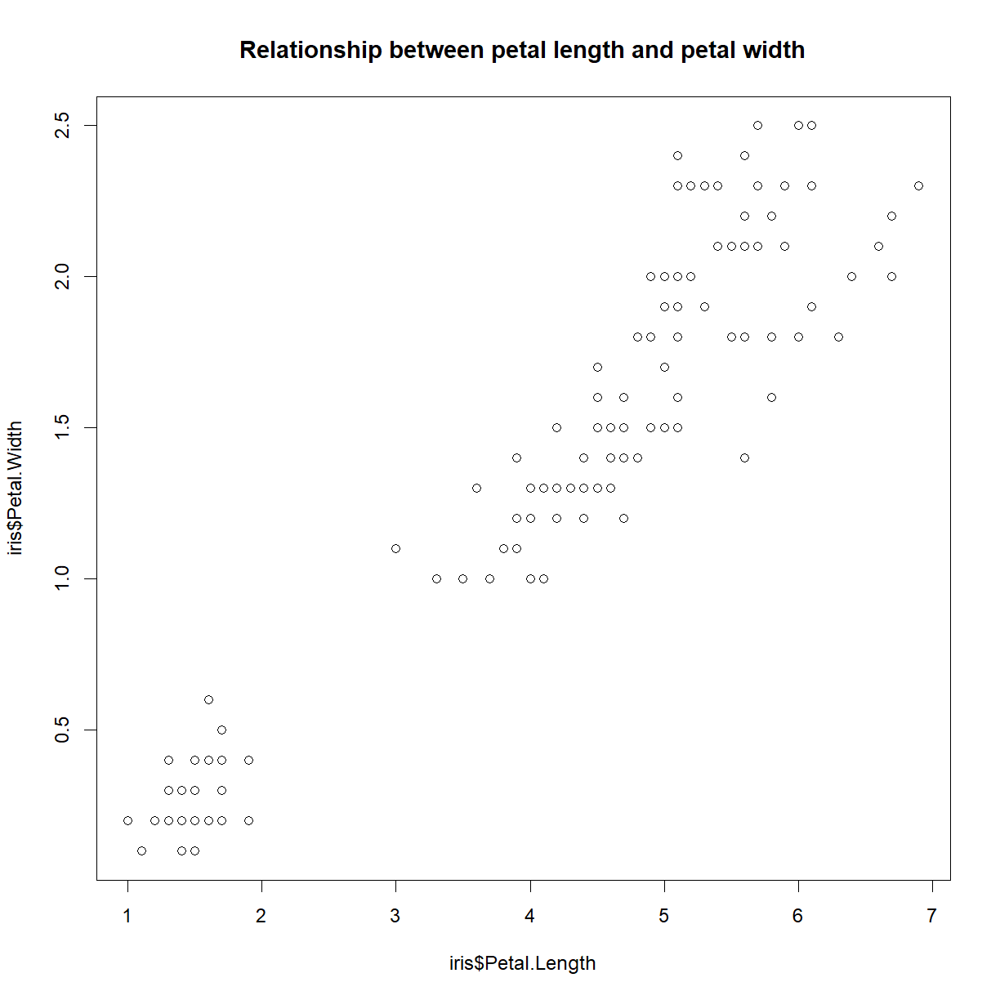
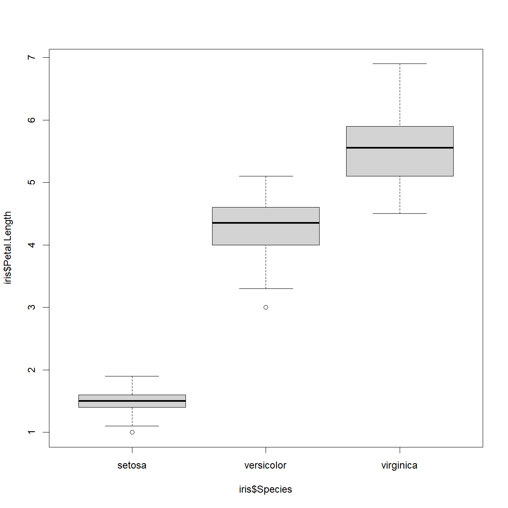
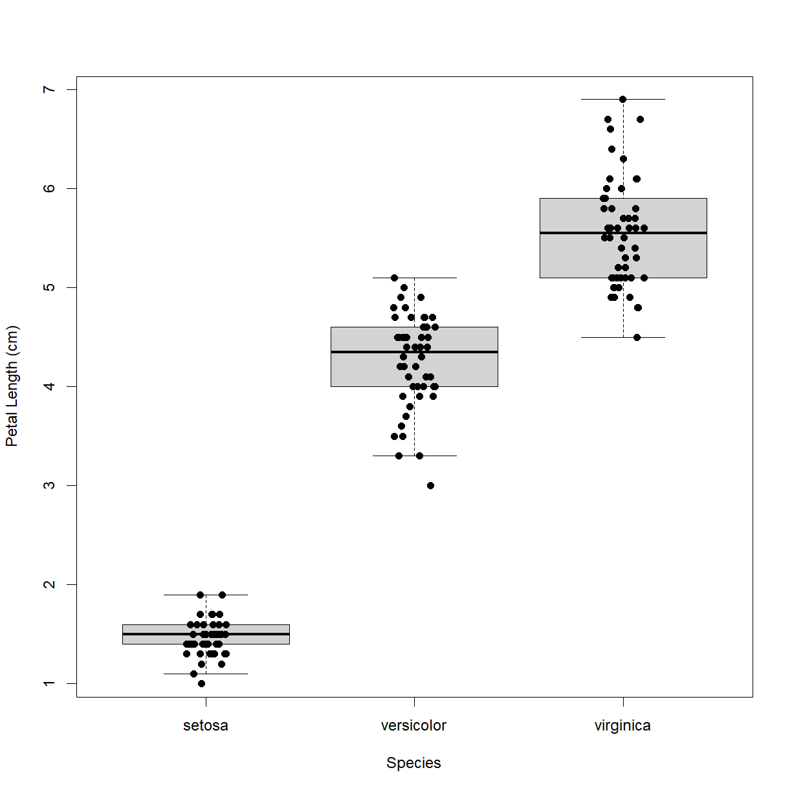

---
# Please do not edit this file directly; it is auto generated.
# Instead, please edit 04-class-manipulating-plotting-data.md in _episodes_rmd/
title: "Manipulating and Plotting Data"
classdate: "9/5/2023 -- In Class"
teaching: 90
exercises: 30
questions:
- "How do I read data from a .csv or .txt file into R?"
- "How do I write data to a .csv or .txt file?"
- "How do I calculate simple statistics from my data?"
- "How can I plot my data?"
- "How do I save my plots to a PDF file?"
objectives:
- "Be able to employ functions available in the base R language to calculate basis statistics for a dataset."
- "Generate and display simple graphs."
- "Save plot(s) to a PDF file."
keypoints:
- "Use `mean`, `max`, `min`, and `sd` to calculate simple statistics."
- "Use `plot` to create simple visualizations."
- "Display simple graphs."
- "Save a plot in a pdf file using `pdf(...)` and stop writing to the pdf file with `dev.off()`."
source: Rmd
---

## In Class

### Calculating basic statistics

The standard R installation provides many functions for calculating basic statistics about your data. Here is a sampling of some of the most generally useful:

> ## Functions for calculating descriptive statistics
> 
> Averages:
> * `mean()` - arithmetic mean
> * `median()` - median
> * `mode()` - mode
> 
> Range:
> * `min()` - minimum value in range
> * `max()` - maximum value in range
> * `range()` - minimum and maximum value in range
> * `quantile()` - quantiles corresponding to the given probabilities (`probs` argument; defaults to quartiles `c(0, 0.25, 0.5, 0.75, 1.0))
> * `IQR()` - interquartile range (Q3 - Q1)
> 
> Variability:
> * `var()` - variance
> * `sd()` - standard deviation
> * `mad()` - median absolute deviation
> *Note: there is no built-in function for calculating standard error of mean (SEM), but this can be easily calculated using `sd(x)/sqrt(length(x))`. There are also packages that have functions available (e.g. `pastecs`).*
>
> Miscellaneous:
> * `summary()` - summary statistics based on data type
> * `table()` - generate frequency or contingency table
{: .callout}

&nbsp;

Let's start by performing some common mathematical operations to learn more about our data.We will load a fresh copy of our sample data to reset any unintended changes from previous lessons and be sure that we include `header=TRUE` and `stringsAsFactors=FALSE` arguments.

~~~
dat <- read.csv(file="data/sample.csv", header=TRUE, stringsAsFactors=FALSE)
~~~
{: .language-r}

&nbsp;

This data is the result of a fictional experiment looking at the number of aneurisms that formed in the eyes of patients who undertook 3 different treatments.

We can use the basic descriptive functions to calculate values like minimum, mean, median, and standard deviation of a given variable data:

~~~
# minimum number of aneurisms in q3
min(dat$Aneurisms_q3)
~~~
{: .language-r}

~~~
[1] 105
~~~
{: .output}

~~~
# mean number of aneurisms in q3
mean(dat$Aneurisms_q3)
~~~
{: .language-r}

~~~
[1] 219.85
~~~
{: .output}

~~~
# median number of aneurisms in q3
median(dat$Aneurisms_q3)
~~~
{: .language-r}

~~~
[1] 217
~~~
{: .output}

~~~
# standard deviation number of aneurisms in q3
sd(dat$Aneurisms_q3)
~~~
{: .language-r}

~~~
[1] 48.76958
~~~
{: .output}

~~~
# total number of observations in q3
length(dat$Aneurisms_q3)
~~~
{: .language-r}

~~~
[1] 100
~~~
{: .output}

&nbsp;

R has a function called `summary()` that provides a convenient summary of each column if all you want is some basic statistics about each of your variables (without reference to subsets):

~~~
# Summarize function
summary(dat)
~~~
{: .language-r}

~~~
      ID               Gender             Group           BloodPressure  
 Length:100         Length:100         Length:100         Min.   : 62.0  
 Class :character   Class :character   Class :character   1st Qu.:107.5  
 Mode  :character   Mode  :character   Mode  :character   Median :117.5  
                                                          Mean   :118.6  
                                                          3rd Qu.:133.0  
                                                          Max.   :173.0  
      Age         Aneurisms_q1    Aneurisms_q2    Aneurisms_q3  
 Min.   :12.10   Min.   : 65.0   Min.   : 80.0   Min.   :105.0  
 1st Qu.:14.78   1st Qu.:118.0   1st Qu.:131.5   1st Qu.:182.5  
 Median :16.65   Median :158.0   Median :162.5   Median :217.0  
 Mean   :16.42   Mean   :158.8   Mean   :168.0   Mean   :219.8  
 3rd Qu.:18.30   3rd Qu.:188.0   3rd Qu.:196.8   3rd Qu.:248.2  
 Max.   :20.00   Max.   :260.0   Max.   :283.0   Max.   :323.0  
  Aneurisms_q4  
 Min.   :116.0  
 1st Qu.:186.8  
 Median :219.0  
 Mean   :217.9  
 3rd Qu.:244.2  
 Max.   :315.0  
~~~
{: .output}

&nbsp;

For every column in the data frame, `summary()` provides different set of information depending on the class of that column. For instance, for `numeric` columns, `summary()` provides minimum, maximum, mean, median, and quartile values.

When analyzing data we usually want to look at partial statistics, such as the maximum value of a phenotype for a given patient or the average value per treatment group. The most direct way to accomplish this goal is to use indexing to select the data subset we want and then perform the calculation on the data subset:

~~~
# select aneurism data for the first subject
sub1 <- dat[1, 6:9]

# calculate the max number of aneurisms for subject 1 across # time points
max(sub1)
~~~
{: .language-r}

~~~
[1] 237
~~~
{: .output}

&nbsp;

We don't actually need to store the row in a variable of its own. Instead, we can combine the selection and the function call:

~~~
# maximum number of aneurisms for subject 2
max(dat[2, 6:9])
~~~
{: .language-r}

~~~
[1] 248
~~~
{: .output}

&nbsp;

The `table()` function calculates frequency or contingency tables, which can be useful for understanding the structure of our data. For example, we can look at the number of patients in each treatment group:

~~~
table(dat$Group)
~~~
{: .language-r}

~~~

   Control Treatment1 Treatment2 
        30         35         35 
~~~
{: .output}

&nbsp;

By including multiple arguments from the dataset, we can look at the data broken down across multiple variables, such as treatment group and gender:

~~~
table(dat$Group, dat$Gender)
~~~
{: .language-r}

~~~
            
              f  F  m  M
  Control    13  1 14  2
  Treatment1 10  2 15  8
  Treatment2 12  1 17  5
~~~
{: .output}

&nbsp;

Oops... Looks like someone was being lazy with their data entry for gender. How can we fix the capitalization error?

> ## Correcting capitalization
> 
> There is a mixture of lower case (m, f) and uppder case
> entries in the `dat$Gender` variable. 
> 
> ~~~
> # First load the data if you haven't already
> dat <- read.csv(file="data/sample.csv", header=TRUE, 
> stringsAsFactors=FALSE)
> 
> # Look at the `Gender` data
> dat$Gender
> ~~~
> {: .language-r}
> 
> 
> 
> ~~~
>   [1] "m" "m" "m" "f" "m" "M" "f" "m" "m" "f" "m" "f" "f" "m" "m" "m" "f" "m"
>  [19] "m" "F" "f" "m" "f" "f" "m" "M" "M" "f" "m" "f" "f" "m" "m" "m" "m" "f"
>  [37] "f" "m" "M" "m" "f" "m" "m" "m" "f" "f" "M" "M" "m" "m" "m" "f" "f" "f"
>  [55] "m" "f" "m" "m" "m" "f" "f" "f" "f" "M" "f" "m" "f" "f" "M" "m" "m" "m"
>  [73] "F" "m" "m" "f" "M" "M" "M" "f" "m" "M" "M" "m" "m" "f" "f" "f" "m" "m"
>  [91] "f" "m" "F" "f" "m" "m" "F" "m" "M" "M"
> ~~~
> {: .output}
> 
> Correct all `Gender` values to upper case.
> 
> > ## Solution
> > 
> > Option 1 - use data subsets and logical indexing to 
> > correct `m`s and `f`s individually:
> > 
> > 
> > ~~~
> > dat$Gender[dat$Gender == "m"] <- "M"
> > dat$Gender[dat$Gender == "f"] <- "F"
> > dat$Gender
> > ~~~
> > {: .language-r}
> > 
> > 
> > 
> > ~~~
> >   [1] "M" "M" "M" "F" "M" "M" "F" "M" "M" "F" "M" "F" "F" "M" "M" "M" "F" "M"
> >  [19] "M" "F" "F" "M" "F" "F" "M" "M" "M" "F" "M" "F" "F" "M" "M" "M" "M" "F"
> >  [37] "F" "M" "M" "M" "F" "M" "M" "M" "F" "F" "M" "M" "M" "M" "M" "F" "F" "F"
> >  [55] "M" "F" "M" "M" "M" "F" "F" "F" "F" "M" "F" "M" "F" "F" "M" "M" "M" "M"
> >  [73] "F" "M" "M" "F" "M" "M" "M" "F" "M" "M" "M" "M" "M" "F" "F" "F" "M" "M"
> >  [91] "F" "M" "F" "F" "M" "M" "F" "M" "M" "M"
> > ~~~
> > {: .output}
> > 
> > Option 2 - use the `toupper()` function to correct
> > the entire vector at once:
> > 
> > 
> > ~~~
> > dat$Gender <- toupper(dat$Gender)
> > dat$Gender
> > ~~~
> > {: .language-r}
> > 
> > 
> > 
> > ~~~
> >   [1] "M" "M" "M" "F" "M" "M" "F" "M" "M" "F" "M" "F" "F" "M" "M" "M" "F" "M"
> >  [19] "M" "F" "F" "M" "F" "F" "M" "M" "M" "F" "M" "F" "F" "M" "M" "M" "M" "F"
> >  [37] "F" "M" "M" "M" "F" "M" "M" "M" "F" "F" "M" "M" "M" "M" "M" "F" "F" "F"
> >  [55] "M" "F" "M" "M" "M" "F" "F" "F" "F" "M" "F" "M" "F" "F" "M" "M" "M" "M"
> >  [73] "F" "M" "M" "F" "M" "M" "M" "F" "M" "M" "M" "M" "M" "F" "F" "F" "M" "M"
> >  [91] "F" "M" "F" "F" "M" "M" "F" "M" "M" "M"
> > ~~~
> > {: .output}
> > 
> > For good measure, let's save the corrected data to a new file
> > 
> > 
> > ~~~
> > write.csv(dat, file = "data/sample-gendercorrected.csv", row.names=F)
> > ~~~
> > {: .language-r}
> {: .solution}
{: .challenge}

&nbsp;

Now the contingency table is more useful:

~~~
table(dat$Group, dat$Gender)
~~~
{: .language-r}

~~~
            
              F  M
  Control    14 16
  Treatment1 12 23
  Treatment2 13 22
~~~
{: .output}

&nbsp;

In many instances, we will want to break data down by groups (e.g. treatment groups) and calculate statistics on each sub group. Functions like `apply()` and `aggregate()` are designed for this purpose, and you will be looking at how to use these *On Your Own*.

***
### Plotting

The mathematician Richard Hamming once said,

&nbsp;&nbsp;&nbsp;&nbsp;&nbsp;&nbsp;*"The purpose of computing is insight, not numbers."*

The best way to develop insight is often to visualize data. Visualization deserves an entire lecture (or course) of its own, and we will touch on various aspects of R's plotting functionality later on in the course, but for now we will introduce a few of R's plotting features.

> ## An alternative package for plotting in R
> 
> There is a popular package called `ggplot2` that many R users prefer to the base plotting functions included with R. This package is more efficient in many ways and most users like the default look of the graphics better. For these reasons, `ggplot2` is worth exploring. The caveat is that `ggplot2` uses a very different syntax for generating plots and does have a few limitations. My personal preference is to use R base graphics, because I often create more complex graphics, and base package is flexible enough to do *anything* once you understand all of the ins and outs of the various plotting functions. I have run into a few places where generating the exact graphic I wanted was not possible in `ggplot2`. 
{: .callout}

&nbsp;

The basic plot function in R is called, conveniently, `plot()`. Let's take a quick look:

~~~
?plot
~~~
{: .language-r}

&nbsp;

In it's most basic form, `plot(x,y)` function will create a scatter plot with points defined by the vectors `x` and `y`. Let's start out with the iris data set and look at the relationship between petal length and width:

~~~
plot(iris$Petal.Length, iris$Petal.Width)
~~~
{: .language-r}

&nbsp;

Congratulations! You have plotted your first data in R. So what is going on in the background here? Let's talk about what R is actually doing when you give it the plot command.

&nbsp;
#### Graphics devices

When you tell R to run a plot, it actually takes a series of actions:

1. Opens a new "graphics device". This device can be one of several things:
 a. The **Plot** pane in the lower-right panel of RStudio. RStudio uses this graphics device by default if you don't tell it to use something else.
 b. A blank graphics pane in a new window (this requires the `windows()` or `quartz()` commands, which we discuss below).
 c. An external image file (e.g. a new *.jpg* file).
 d. An external PDF file (complete with vector graphics!).
2. Draws a series of objects; this part is done "under the hood" of the `plot()` function, and includes:
 a. Axes.
 b. Tick marks.
 c. Axis labels.
 d. Data points.
 e. Legend(s).
 f. Chart titles.
 g. Other text, if specified.
3. Leaves the current graphics device open for additional drawing input. This step is important, because it means that you can continue to add things to the current image by calling additional functions.
4. Closes the graphics device following a `dev.off()` function call. This essentially "finalizes" the image.

Note that you can have multiple graphics devices open at once. R will, by default, write new graphics to the most recently used or created graphics device. Some functions, like `plot()` automatically start a new graphics device (or page in the case of the RStudio panel or a PDF), while other functions, like `lines()`, will add graphical elements to the most recently used device.

Let's repeat our above `plot()` command in a few different graphics devices to illustrate a their functionality.

&nbsp;

**Plotting in a separate window**

I often find it useful to plot to a separate window, rather than the **Plot** pane, because it better simulates plotting to a file like a PDF, which is usually the final goal of building a plot. The window allows you to follow the creation of your graphic live, while you can't see what is happening in a *.jpg* or *.pdf* until you have finalized the graphic. 

To plot in a separate window within RStudio, use one of the following platform-dependent functions:

~~~
windows() # Windows
quartz() # MacOS
~~~
{: .language-r}

&nbsp;

Now recreate our above plot:

~~~
plot(iris$Petal.Length, iris$Petal.Width)
~~~
{: .language-r}

&nbsp;

Note that we can now add additional elements to this plot. Let's add a chart title:

~~~
title("Relationship between petal length and petal width")
~~~
{: .language-r}

&nbsp;

We can shutdown the window by either just closing it, or from RStudio using the `dev.off()` function.

~~~
dev.off()
~~~
{: .language-r}

~~~
null device 
          1 
~~~
{: .output}

&nbsp;

**Plotting to an external file**

R has a series of functions designed to open a graphics device that will write directly to an external file. These files can be image files or PDFs.
*  `bmp()` generates a *.bmp*
*  `jpeg()` generates a *.jpg*
*  `png()` generates a *.png*
*  `tiff()` generates a *.tif*
*  `pdf()` generates a *.pdf*

The first four are all versions of the same function and behave essentially interchangably. PDF is a separate function. The primary difference between the two is that the non-PDF image files will have a defined resolution, while the PDF files are generated as *vector graphics*, meaning that they maintain resolution at any size.

> ## Vector graphics
>
> Traditional image formats (e.g. .bmp, .jpg, .tiff, .png) are, in essence, a two dimensional array of color and intensity values (such as
> red-green-blue, or RGB values). The array has a fixed number of pixels in each dimension, so if you take an image that is 1 in x 1 in with
> 100 pixels in each dimension, and blow it up to 1 ft x ft, it still only has 100 pixels in each dimension. The blowup image will appear
> blocky, or "pixelated".
>
> Vector graphics are distinct from traditional graphics in that they are defined by a set of mathematical operations carried out at specified > coordinates. For example, two of the instructions may be something like:
> 1. Draw the letter "A" in normal size 10 Arial font at coordinates (10, 10).
> 2. Draw the an arrow with line weight 2 and arrow head style X size 4 from the point (12, 12) to the point (20, 20).
>
> These instructions are the same for a 1 in x 1 in image and a 1 ft x 1 ft image (or a 1 mile x 1 mile image). Because the shape of the
> letter and the arrow are defined by the font and the arrow head style, when the image is rendered, they can be drawn with the appropriate
> number of pixels to appear crisp and smooth at the image size requested.
>
> This is how PDF files and other vector graphic formats work. They are really convenient for preparing manuscripts because journals often
> want a low-res file for review and a high-res file for publication. By starting with a PDF you can generate both categories of graphic with
> the same underlying file. any modern journals prefer that figures be submitted as PDF or other vector graphics format for this very reason.
{: .callout}

&nbsp;

Let's give both types of graphic generation a try by generating our previous plot as a *.jpg** and **.PDF* file. 

First, let's create a new directory in our class folder for results (another best practice). We can do from within R using the `dir.create()` function:

~~~
dir.create("results")
~~~
{: .language-r}

&nbsp;

Take a look at the `jpeg()` function to see what it needs:

~~~
?jpeg()
~~~
{: .language-r}

&nbsp;

Technically, you don't have to give `jpeg()` any input. By default, the function will generate a new *.jpg* image with an automatically generated name in our home directory. However, we want to at least specify both a directory and a file name for the newly created image.  

Also by default, the function will produce a 480 px x 480 px image at 72 pixels per inch (ppi). Note that the actual physical image size will be **size inches = size in pixels/ppi**. Let's make a 100 ppi *.jpg* image that is 5 in x 5 in:

~~~
jpeg(file = "results/petal-width-length-comparison.jpg", width = 500, height = 500, res = 100)
~~~
{: .language-r}

&nbsp;

Now look inside your results folder. If the `jpeg()` function worked correctly and our directories were correctly specified, you should now see a new file called *petal-width-length-comparison.jpg*. What happens when you try to open this file?

You should get an error. This is because the file has been created, but that it is currently open in RStudio waiting for more input. We can use the `dev.cur()` to confirm that the active graphics device is indeed the JPEG file.

~~~
dev.cur()
~~~
{: .language-r}

&nbsp;

Let's give it our earlier `plot()` and `title()` commands, and then turn off the device (using `dev.off()`) to complete and close the file.

~~~
plot(iris$Petal.Length, iris$Petal.Width)
title("Relationship between petal length and petal width")
~~~
{: .language-r}

~~~
dev.off()
~~~
{: .language-r}

~~~
jpeg 
   3 
~~~
{: .output}

&nbsp;

Now try opening the *petal-width-length-comparison.jpg*. We have our chart in JPG format! Zoom in to check out the resolution. Not great? Generating JPEG or other graphics formats is useful for some applications (e.g. charts for use in a webpage, for example), but for generating reports and paper figures, vector graphics are the way to go. That's why I tend to work almost exclusively generate my charts as PDF files, and so will we for the rest of the course.

So let's do it. First let's take a look at the `pdf()` function:

~~~
?pdf()
~~~
{: .language-r}

&nbsp;

While `pdf()` still wants the file name as the `file = ` argument, we now specify width and height in inches to define the size of the file, and exclude resolution because PDF files are vector graphics and will be generated to the resolution required by the size. This is more intuitive (we just ask for the image size that we way, instead of having to calculate it from pixel number and ppi), and more convenient. We can now generate any size output we want, including a nice, printable 8.5 in x 11 in standard paper size. This is useful for reports. Usually a smaller figure is more appropriate when generating a figure that you will embed in a manuscript.

For the moment, we will generate the PDF equivalent of our earlier JPEG, with dimensions of 5 in x 5 in. For fun, let's also include a second plot that compares sepal length and width:

~~~
# generate the PDF file
pdf(file = "results/iris-aspect-ratio-comparison.pdf", width = 5, height = 5)

# plot petal length vs. width
plot(iris$Petal.Length, iris$Petal.Width)
title("Relationship between petal length and petal width")

# plot sepal length vs. width
plot(iris$Sepal.Length, iris$Sepal.Width)
title("Relationship between sepal length and sepal width")

# finalize the PDF
dev.off()
~~~
{: .language-r}

&nbsp;

Notice a couple of important things:
* Zooming in and out in the PDF does not affect image resolution. It always looks sharp! This is the advantage of vector graphics.
* Running `plot()` the second time generated a second page in the PDF file. If you want a new file for every figure, set the argument `onefile = T` in the `pdf()` function (see the `?pdf` documentation for details).

&nbsp;
#### Fixing the axis labels

Okay, so we know how to generate a chart. Clearly the default parameters are not what we want. First, what is up with the axis labels? By default, R will just use the variable name as the axis labels, having nothing else to work with. We can add out own labels with the `xlab` and `ylab` arguments.

For now, we will just use the plot window in RStudio to demonstrate a few of the features of `plot()`. To make sure you don't have any open graphics devices, run `dev.off()` a few times before moving forward.

~~~
plot(iris$Petal.Length, iris$Petal.Width,
     xlab = "Petal Length (cm)", 
     ylab = "Petal Width (cm)") 
~~~
{: .language-r}

&nbsp;

That's better! 

Now, looking at the data itself, there does seem to be an odd pattern. There is clearly a distinct group in the lower left corner with smaller petals. Let's remind ourselves what information we have available:

~~~
head(iris)
~~~
{: .language-r}

~~~
  Sepal.Length Sepal.Width Petal.Length Petal.Width Species
1          5.1         3.5          1.4         0.2  setosa
2          4.9         3.0          1.4         0.2  setosa
3          4.7         3.2          1.3         0.2  setosa
4          4.6         3.1          1.5         0.2  setosa
5          5.0         3.6          1.4         0.2  setosa
6          5.4         3.9          1.7         0.4  setosa
~~~
{: .output}

&nbsp;

The most obvious candidate to explain the separate grouping is species. We can add color to see if that grouping is all one species using the `col` argument. R has many color names available by default which can be listed using the `colors()` function:

~~~
head(colors()) 
~~~
{: .language-r}

~~~
[1] "white"         "aliceblue"     "antiquewhite"  "antiquewhite1"
[5] "antiquewhite2" "antiquewhite3"
~~~
{: .output}

~~~
length(colors())
~~~
{: .language-r}

~~~
[1] 657
~~~
{: .output}

&nbsp;

To request a specific color, simply specify the color name as a character string (e.g. `"blue"`). You can also select colors by hex code or RGB value with other functions, details on which can be found on this helpful [R color guide]({{ page.root }}/fig/colorPaletteCheatsheet.pdf).

First, we can just specify a color for the whole plot using the argument `col = "<color name>"`.

~~~
plot(iris$Petal.Length, iris$Petal.Width,
     xlab = "Petal Length (cm)", ylab = "Petal Width (cm)",
     col = "blue")
~~~
{: .language-r}

&nbsp;

Of course, we don't want all of the points to be blue. The `col` argument can also take a list that is the same length of the `x` and `y` arguments that assigns individual color values to each point. Since we know the species order for the point, we can use logical indexing to assign colors to each species.

~~~
# iris$Species is a factor, which makes things easier in this case
iris$Species
~~~
{: .language-r}

~~~
  [1] setosa     setosa     setosa     setosa     setosa     setosa    
  [7] setosa     setosa     setosa     setosa     setosa     setosa    
 [13] setosa     setosa     setosa     setosa     setosa     setosa    
 [19] setosa     setosa     setosa     setosa     setosa     setosa    
 [25] setosa     setosa     setosa     setosa     setosa     setosa    
 [31] setosa     setosa     setosa     setosa     setosa     setosa    
 [37] setosa     setosa     setosa     setosa     setosa     setosa    
 [43] setosa     setosa     setosa     setosa     setosa     setosa    
 [49] setosa     setosa     versicolor versicolor versicolor versicolor
 [55] versicolor versicolor versicolor versicolor versicolor versicolor
 [61] versicolor versicolor versicolor versicolor versicolor versicolor
 [67] versicolor versicolor versicolor versicolor versicolor versicolor
 [73] versicolor versicolor versicolor versicolor versicolor versicolor
 [79] versicolor versicolor versicolor versicolor versicolor versicolor
 [85] versicolor versicolor versicolor versicolor versicolor versicolor
 [91] versicolor versicolor versicolor versicolor versicolor versicolor
 [97] versicolor versicolor versicolor versicolor virginica  virginica 
[103] virginica  virginica  virginica  virginica  virginica  virginica 
[109] virginica  virginica  virginica  virginica  virginica  virginica 
[115] virginica  virginica  virginica  virginica  virginica  virginica 
[121] virginica  virginica  virginica  virginica  virginica  virginica 
[127] virginica  virginica  virginica  virginica  virginica  virginica 
[133] virginica  virginica  virginica  virginica  virginica  virginica 
[139] virginica  virginica  virginica  virginica  virginica  virginica 
[145] virginica  virginica  virginica  virginica  virginica  virginica 
Levels: setosa versicolor virginica
~~~
{: .output}

~~~
levels(iris$Species)
~~~
{: .language-r}

~~~
[1] "setosa"     "versicolor" "virginica" 
~~~
{: .output}

~~~
# Let's define a list of colors to use in the plot. The color order 
# will be assigned in order of factor levels
col.list <- c("red", "blue", "green") 

# Recall that when we enter a factor as an index, R sees the underlying numeric representation
as.numeric(iris$Species)
~~~
{: .language-r}

~~~
  [1] 1 1 1 1 1 1 1 1 1 1 1 1 1 1 1 1 1 1 1 1 1 1 1 1 1 1 1 1 1 1 1 1 1 1 1 1 1
 [38] 1 1 1 1 1 1 1 1 1 1 1 1 1 2 2 2 2 2 2 2 2 2 2 2 2 2 2 2 2 2 2 2 2 2 2 2 2
 [75] 2 2 2 2 2 2 2 2 2 2 2 2 2 2 2 2 2 2 2 2 2 2 2 2 2 2 3 3 3 3 3 3 3 3 3 3 3
[112] 3 3 3 3 3 3 3 3 3 3 3 3 3 3 3 3 3 3 3 3 3 3 3 3 3 3 3 3 3 3 3 3 3 3 3 3 3
[149] 3 3
~~~
{: .output}

~~~
# Note: if you are are starting with a character vector, you can 
# achieve this same effect by first converting the charater to a factor,
# then converting the factor to numeric: as.numeric(as.factor(x))

# Taking advantage of this, we can directly index our color list and set # up a vector the length of iris$Species with a unique color value for 
# each species name
col.vector <- col.list[iris$Species]
col.vector
~~~
{: .language-r}

~~~
  [1] "red"   "red"   "red"   "red"   "red"   "red"   "red"   "red"   "red"  
 [10] "red"   "red"   "red"   "red"   "red"   "red"   "red"   "red"   "red"  
 [19] "red"   "red"   "red"   "red"   "red"   "red"   "red"   "red"   "red"  
 [28] "red"   "red"   "red"   "red"   "red"   "red"   "red"   "red"   "red"  
 [37] "red"   "red"   "red"   "red"   "red"   "red"   "red"   "red"   "red"  
 [46] "red"   "red"   "red"   "red"   "red"   "blue"  "blue"  "blue"  "blue" 
 [55] "blue"  "blue"  "blue"  "blue"  "blue"  "blue"  "blue"  "blue"  "blue" 
 [64] "blue"  "blue"  "blue"  "blue"  "blue"  "blue"  "blue"  "blue"  "blue" 
 [73] "blue"  "blue"  "blue"  "blue"  "blue"  "blue"  "blue"  "blue"  "blue" 
 [82] "blue"  "blue"  "blue"  "blue"  "blue"  "blue"  "blue"  "blue"  "blue" 
 [91] "blue"  "blue"  "blue"  "blue"  "blue"  "blue"  "blue"  "blue"  "blue" 
[100] "blue"  "green" "green" "green" "green" "green" "green" "green" "green"
[109] "green" "green" "green" "green" "green" "green" "green" "green" "green"
[118] "green" "green" "green" "green" "green" "green" "green" "green" "green"
[127] "green" "green" "green" "green" "green" "green" "green" "green" "green"
[136] "green" "green" "green" "green" "green" "green" "green" "green" "green"
[145] "green" "green" "green" "green" "green" "green"
~~~
{: .output}

~~~
# note that the lengths are indeed the same
length(iris$Species) == length(col.vector)
~~~
{: .language-r}

~~~
[1] TRUE
~~~
{: .output}

&nbsp;

Now that we have our color assignments stored in the `col.vector` variable, we can use that to color our plot by species.

~~~
plot(iris$Petal.Length, iris$Petal.Width,
     xlab = "Petal Length (cm)", ylab = "Petal Width (cm)",
     col = col.vector)
~~~
{: .language-r}

&nbsp;

As suspected, the lower left grouping is a single species. The other upper right grouping also breaks down nicely by species. But which is which? We can add a legend using the (you guessed it!) `legend()` function. First let's look at the inputs:

~~~
?legend
~~~
{: .language-r}

&nbsp;

The `legend()` function is not very smart. It does not actually have access to any information about the plot, and requires that we give it all of information about what information to include. This can be annoying for basic plots, but it gives you the flexibility to customize the information in your charts to any degree that you like. 

At a minimum, we need to give it the following arguments:
* `x` tells R where to put the legend on the plot. You can give it simple direction like `"center"`, `left`, or `bottomright`.
* `legend` tells R the list of labels for the legend, in this case we want the species names in factor level order (yes, the argument name is the same)
* `col` tells R the colors to display. We want to give it the same color order that we used to generate the species-matched color list.
* `pch` tells R the type of symbol to display. By default, the `plot()` function sets `pch = 1`, but this does not have a default value in `legend()` for some reason. For now we want `pch = 1` to match the `plot()` default.

~~~
legend("bottomright", legend = levels(iris$Species), col=col.list, pch=1)
~~~
{: .language-r}

&nbsp;

Now we can see that the *Iris setosa* species has the small petals.

> ## Assigning colors based on contents of a character vector
> 
> What if the iris$Species were saved as a `character` instead of a `factor`? How 
> would you go about generating your `col.list` input?
> 
> Let's define a new dataset where this is the case:
> 
> 
> ~~~
> iris2 <- iris
> iris2$Species <- as.character(iris$Species)
> ~~~
> {: .language-r}
> 
> > ## Hint
> > 
> > Aside from just converting your character vector back to a factor vector, there is
> > a more direct solution using the character vector. Check out the `unique()` and 
> > `match()` functions.
> {: .solution}
>
> > ## Solution
> >  
> > First make sure our color list is defined:
> > 
> > 
> > ~~~
> > # Make sure our color list is defined
> > col.list <- c("red", "blue", "green")
> > ~~~
> > {: .language-r}
> >  
> > Here are two solutions:
> > 
> > Option 1 -- just convert the character to a factor
> > 
> > 
> > 
> > ~~~
> > # Add the `as.factor()` function to the indexing when defining col.list
> > col.vector <- col.list[as.factor(iris$Species)]
> > col.vector
> > ~~~
> > {: .language-r}
> > 
> > 
> > 
> > ~~~
> >   [1] "red"   "red"   "red"   "red"   "red"   "red"   "red"   "red"   "red"  
> >  [10] "red"   "red"   "red"   "red"   "red"   "red"   "red"   "red"   "red"  
> >  [19] "red"   "red"   "red"   "red"   "red"   "red"   "red"   "red"   "red"  
> >  [28] "red"   "red"   "red"   "red"   "red"   "red"   "red"   "red"   "red"  
> >  [37] "red"   "red"   "red"   "red"   "red"   "red"   "red"   "red"   "red"  
> >  [46] "red"   "red"   "red"   "red"   "red"   "blue"  "blue"  "blue"  "blue" 
> >  [55] "blue"  "blue"  "blue"  "blue"  "blue"  "blue"  "blue"  "blue"  "blue" 
> >  [64] "blue"  "blue"  "blue"  "blue"  "blue"  "blue"  "blue"  "blue"  "blue" 
> >  [73] "blue"  "blue"  "blue"  "blue"  "blue"  "blue"  "blue"  "blue"  "blue" 
> >  [82] "blue"  "blue"  "blue"  "blue"  "blue"  "blue"  "blue"  "blue"  "blue" 
> >  [91] "blue"  "blue"  "blue"  "blue"  "blue"  "blue"  "blue"  "blue"  "blue" 
> > [100] "blue"  "green" "green" "green" "green" "green" "green" "green" "green"
> > [109] "green" "green" "green" "green" "green" "green" "green" "green" "green"
> > [118] "green" "green" "green" "green" "green" "green" "green" "green" "green"
> > [127] "green" "green" "green" "green" "green" "green" "green" "green" "green"
> > [136] "green" "green" "green" "green" "green" "green" "green" "green" "green"
> > [145] "green" "green" "green" "green" "green" "green"
> > ~~~
> > {: .output}
> > 
> > 
> > 
> > ~~~
> > # Check the plot output
> > plot(iris2$Petal.Length, iris2$Petal.Width,
> >    xlab = "Petal Length (cm)", ylab = "Petal Width (cm)", 
> >    col = col.vector)
> > legend("bottomright", legend = levels(as.factor(iris2$Species)), 
> >    col=col.list, pch=1)
> > ~~~
> > {: .language-r}
> > 
> > 
> > 
> > Option 2 -- Use the `match()` function to determine which color to 
> > assign to each element of col.vector based on the element of the 
> > species character vector.
> > 
> > 
> > ~~~
> > # Now, since we don't have the underlying numeric structure of the 
> > # factor, we need a  way to generate the same index list with a 
> > # character vector. We can do this using the match() function.
> > species.list <- unique(iris2$Species) # first grab the species list using unique()
> > species.list
> > ~~~
> > {: .language-r}
> > 
> > 
> > 
> > ~~~
> > [1] "setosa"     "versicolor" "virginica" 
> > ~~~
> > {: .output}
> > 
> > 
> > 
> > ~~~
> > # For each element in the first list, match() essentially asks R "where 
> > # is this element in the second list?" It returns the numeric position, 
> > # or index.
> > species.index <- match(iris$Species, species.list)
> > species.index
> > ~~~
> > {: .language-r}
> > 
> > 
> > 
> > ~~~
> >   [1] 1 1 1 1 1 1 1 1 1 1 1 1 1 1 1 1 1 1 1 1 1 1 1 1 1 1 1 1 1 1 1 1 1 1 1 1 1
> >  [38] 1 1 1 1 1 1 1 1 1 1 1 1 1 2 2 2 2 2 2 2 2 2 2 2 2 2 2 2 2 2 2 2 2 2 2 2 2
> >  [75] 2 2 2 2 2 2 2 2 2 2 2 2 2 2 2 2 2 2 2 2 2 2 2 2 2 2 3 3 3 3 3 3 3 3 3 3 3
> > [112] 3 3 3 3 3 3 3 3 3 3 3 3 3 3 3 3 3 3 3 3 3 3 3 3 3 3 3 3 3 3 3 3 3 3 3 3 3
> > [149] 3 3
> > ~~~
> > {: .output}
> > 
> > 
> > 
> > ~~~
> > # And we use the species.index in place of iris$Species to do the 
> > # indexing and generate our color list for each point on the plot
> > col.vector <- col.list[species.index]
> > col.vector
> > ~~~
> > {: .language-r}
> > 
> > 
> > 
> > ~~~
> >   [1] "red"   "red"   "red"   "red"   "red"   "red"   "red"   "red"   "red"  
> >  [10] "red"   "red"   "red"   "red"   "red"   "red"   "red"   "red"   "red"  
> >  [19] "red"   "red"   "red"   "red"   "red"   "red"   "red"   "red"   "red"  
> >  [28] "red"   "red"   "red"   "red"   "red"   "red"   "red"   "red"   "red"  
> >  [37] "red"   "red"   "red"   "red"   "red"   "red"   "red"   "red"   "red"  
> >  [46] "red"   "red"   "red"   "red"   "red"   "blue"  "blue"  "blue"  "blue" 
> >  [55] "blue"  "blue"  "blue"  "blue"  "blue"  "blue"  "blue"  "blue"  "blue" 
> >  [64] "blue"  "blue"  "blue"  "blue"  "blue"  "blue"  "blue"  "blue"  "blue" 
> >  [73] "blue"  "blue"  "blue"  "blue"  "blue"  "blue"  "blue"  "blue"  "blue" 
> >  [82] "blue"  "blue"  "blue"  "blue"  "blue"  "blue"  "blue"  "blue"  "blue" 
> >  [91] "blue"  "blue"  "blue"  "blue"  "blue"  "blue"  "blue"  "blue"  "blue" 
> > [100] "blue"  "green" "green" "green" "green" "green" "green" "green" "green"
> > [109] "green" "green" "green" "green" "green" "green" "green" "green" "green"
> > [118] "green" "green" "green" "green" "green" "green" "green" "green" "green"
> > [127] "green" "green" "green" "green" "green" "green" "green" "green" "green"
> > [136] "green" "green" "green" "green" "green" "green" "green" "green" "green"
> > [145] "green" "green" "green" "green" "green" "green"
> > ~~~
> > {: .output}
> > 
> > 
> > 
> > ~~~
> > # Finally, we can generate our plot. Note that we now use 
> > # "species.list" in place of "levels(iris$Species)" for the legend
> > plot(iris2$Petal.Length, iris2$Petal.Width,
> >      xlab = "Petal Length (cm)", ylab = "Petal Width (cm)",
> >      col = col.vector)
> > legend("bottomright", legend = species.list, col=col.list, pch=1)
> > ~~~
> > {: .language-r}
> > 
> > 
> {: .solution}
{: .challenge}

&nbsp;
#### Box and whisker plots

We can now draw a scatter plot in R to look at the relationship between two variables. What if we want to compare a single data type across species? This is (still) most commonly done using bar charts with error bars. There is a movement in the biological sciences community to move away from bar charts and toward box and whisker plots. R is better equipped for the latter case any way, and that's what we will work with in this course.

> ## Why use box and whisker charts instead of bar charts?
>
> While bar charts are still more common and have their uses, box and whisker plots are
> almost always better. A few problems with bar charts are that they:
> * only show summary statistics (mean and variation)
> * hide information on the shape of the data distribution
> * can easily be used to misrepresent the size of differences between data
> * do not have standard error bars (standard deviation and standard error are both common)
>
> Box and whisker plots provide a lot more detail about the data represented. A typical
> box and whisker plot include:
> * median (line in the middle of the box)
> * quartiles (the size of the box)
> * 95 percentiles (whiskers)
> * outliers (points beyond whiskers)
> * all data points (less common, but a good idea)
> * mean (also less common, but a good idea)
>
{: .callout}

&nbsp;

We can use the `boxplot()` function to generate box and whisker plots in R. To do so, we will usually use `formula` notation to enter the data. In this case, the first argument should be a formula indicating which data you want to plot and how your want it broken out, separated by the `~` symbol:

&nbsp;&nbsp;&nbsp;&nbsp;&nbsp;&nbsp;`<plot variable> ~ <separator variable>`

You can also provide the name of the data frame using the `data` argument, and then just use the column names directly in the formula. Let's give both a try for Petal Length separated by Species in the iris dataset. These statements are equivalent, except for the axis labels:

~~~
boxplot(iris$Petal.Length ~ iris$Species)
~~~
{: .language-r}

~~~
boxplot(Petal.Length ~ Species, data = iris)
~~~
{: .language-r}

&nbsp;

It is a best practice to show all your data points (at least until you have hundreds or thousands) on box plots, which we can add to our plot using the `stripchart()` function. The basic format is similar to that for `boxplot()`. We need to add a couple of arguments to make it work. The first is `add = TRUE`. This tells R to add the points to the current plot, instead of generating a new plot (which is the default behavior). The second is `vert = TRUE`, which tells R that we want the data plotted vertically (horizontal is the default for some reason). Let's try it:

~~~
stripchart(Petal.Length ~ Species, data = iris, add=TRUE, vert=TRUE)
~~~
{: .language-r}

&nbsp;

Okay, the points are there, but they have some issues. Let's add some information to improve the quality. Note that we need to rerun the boxplot command to regenerate the base plot before fixing the strip chart issues (otherwise they will just keep adding new points to the current chart and make a mess).

We will make the following changes:

`boxplot()`:
* `outline = FALSE` prevents outlier points from being plotted (strip chart will be plotting all of the points anyway).
* `ylab = "Petal Length (cm)"` cleans up our y-axis label.

`stripchart()`:
* `pch = 16` in `stripchart()` changes the point from an open square to a solid circle, which is easier to see against the box plot.
* `method = "jitter"` in `stripchart()` offsets each point in the "x" direction by a small random amount so that you can see overlapping points.

~~~
boxplot(Petal.Length ~ Species, data = iris,
        outline = FALSE, ylab = "Petal Length (cm)")
stripchart(Petal.Length ~ Species, data = iris,
           pch = 16, method = "jitter",
           add=TRUE, vert=TRUE)
~~~
{: .language-r}

&nbsp;

Better! Now this is a chart that is easy to read and shows all of the relevant data. *On Your Own* you will be digging into plotting in additional detail, including how to make multipanel plots and segregate data in boxplots by more than one independent variable.

***


