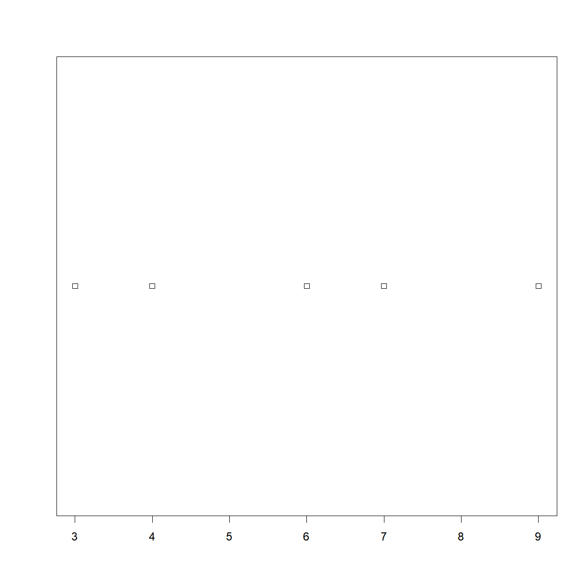
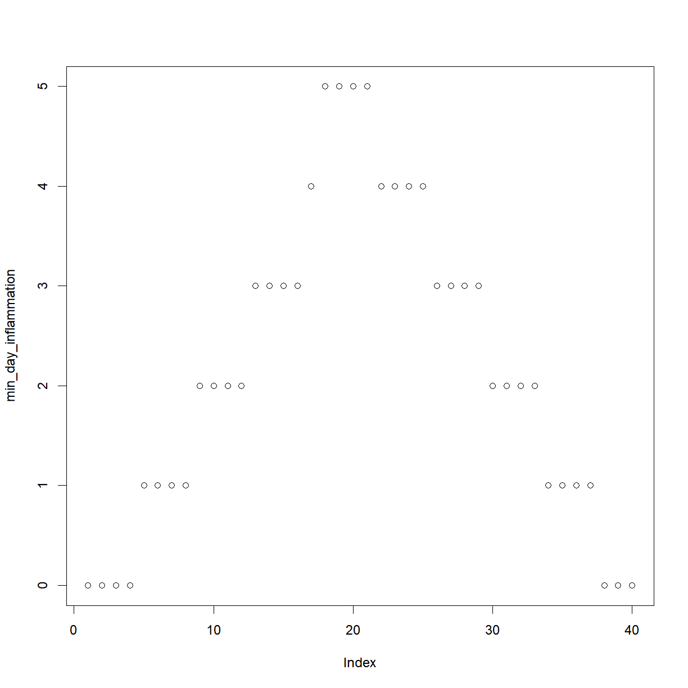

---
# Please do not edit this file directly; it is auto generated.
# Instead, please edit 04-introduction-to-R-decisions-and-loops.md in _episodes_rmd/
title: "Introduction to R -- Decisions and Loops"
teaching: 80
exercises: 25
questions:
- "How do I write code to make decisions about data?"
- "How do I use the same code to treat different data sets in different ways?"
- "How can I do the same thing to multiple data sets?"
- "How do I write a `for` loop?"
- "How can I do the same thing multiple times more efficiently in R?"
- "Should I use a loop or an `apply` statement?"
objectives:
- "Write conditional statements with `if` and `else`."
- "Correctly evaluate expressions containing `&&` ('and') and `||` ('or')."
- "Use a `for` loop to process multiple files."
- "Explain what a `for` loop does."
- "Correctly write `for` loops to repeat simple calculations."
- "Trace changes to a loop variable as the loop runs."
- "Trace changes to other variables as they are updated by a `for` loop."
- "Use a function to get a list of filenames that match a simple pattern."
- "Use the apply family of functions."
keypoints:
- "Use `length(thing)` to determine the length of something that contains other values."
- "Use `if (condition)` to start a conditional statement, `else if (condition)` to provide additional tests, and `else` to provide a default."
- "The bodies of conditional statements must be surrounded by curly braces `{ }`."
- "Use `==` to test for equality."
- "`X && Y` is only true if both X and Y are true."
- "`X || Y` is true if either X or Y, or both, are true."
- "Use `for (variable in collection)` to process the elements of a collection one at a time."
- "The body of a `for` loop is surrounded by curly braces (`{}`)."
- "Use functions such as `apply` instead of `for` loops to operate on the values in a data structure."
- "Use `list.files(path = \"path\", pattern = \"pattern\", full.names = TRUE)` to create a list of files whose names match a pattern."
source: Rmd
---

Our previous lessons have shown us how to read and manipulate data, define our own functions, calculate basic statistics, and generate basic charts. However, the programs we have written so far always do the same things, regardless of what data they're given. We want programs to make choices based on the values they are manipulating.

### Making decisions with if and else

&nbsp;
#### Conditionals

In order to update our function to decide between saving or not, we need to write code that automatically decides between multiple options. The tool R gives us for doing this is called a [conditional statement]({{ page.root }}/reference.html#conditional-statement), and looks like this:

~~~
num <- 37
if (num > 100) {
  print("greater")
} else {
  print("not greater")
}
print("done")
~~~
{: .language-r}

~~~
[1] "not greater"
[1] "done"
~~~
{: .output}

&nbsp;

The second line of this code uses an `if` statement to tell R that we want to make a choice.
If the following test is true, the body of the `if` (i.e. the lines in the curly braces underneath it) are executed. If the test is false, the body of the `else` is executed instead. Only one or the other is ever executed:

In the example above, the test `num > 100` returns the value `FALSE`, which is why the code inside the `if` block was skipped and the code inside the `else` statement was run instead.

~~~
num > 100
~~~
{: .language-r}

~~~
[1] FALSE
~~~
{: .output}

&nbsp;

Conditional statements don't have to include an `else`. If there isn't one, R simply does nothing if the test is false:

~~~
num <- 53
if (num > 100) {
  print("num is greater than 100")
}
~~~
{: .language-r}

&nbsp;

We can also chain several tests together when there are more than two options.
This makes it simple to write a function that returns the sign of a number:

~~~
sign <- function(num) {
  if (num > 0) {
    return(1)
  } else if (num == 0) {
    return(0)
  } else {
    return(-1)
  }
}

sign(-3)
~~~
{: .language-r}

~~~
[1] -1
~~~
{: .output}

~~~
sign(0)
~~~
{: .language-r}

~~~
[1] 0
~~~
{: .output}

~~~
sign(2/3)
~~~
{: .language-r}

~~~
[1] 1
~~~
{: .output}

&nbsp;

Note that when combining `else` and `if` in an `else if` statement, the `if` portion still requires a direct input condition.  This is never the case for the `else` statement alone, which is only executed if all other conditions go unsatisfied. As a reminder, the test for equality uses two equal signs, `==`.

> ## Other Comparisons
>
> Other tests include greater than or equal to (`>=`), less than or equal to
> (`<=`), and not equal to (`!=`).
{: .callout}

&nbsp;

We can also combine tests. Two ampersands, `&&`, symbolize "and". Two vertical bars, `||`, symbolize "or".
`&&` is only true if both parts are true:

~~~
if (1 > 0 && -1 > 0) {
    print("both parts are true")
} else {
  print("at least one part is not true")
}
~~~
{: .language-r}

~~~
[1] "at least one part is not true"
~~~
{: .output}

&nbsp;

while `||` is true if either part is true:

~~~
if (1 > 0 || -1 > 0) {
    print("at least one part is true")
} else {
  print("neither part is true")
}
~~~
{: .language-r}

~~~
[1] "at least one part is true"
~~~
{: .output}

&nbsp;

In this case, "either" means "either or both", not "either one or the other but not both".

~~~
# Here we will use R's `ifelse` function, in which we provide the test phrase,
# the outcome if the result of the test is 'TRUE', and the outcome if the
# result is 'FALSE'. We will also assign the results to the Color column,
# using '<-'

# First - reload the data with a header
carSpeeds <- read.csv(file = 'data/car-speeds.csv')

carSpeeds$Color <- ifelse(carSpeeds$Color == 'Blue', 'Green', carSpeeds$Color)
carSpeeds$Color
~~~
{: .language-r}

~~~
  [1] "Green" "1"     "Green" "5"     "4"     "Green" "Green" "2"    
  [9] "5"     "4"     "4"     "5"     "Green" "Green" "2"     "4"    
 [17] "Green" "Green" "5"     "Green" "Green" "Green" "4"     "Green"
 [25] "4"     "4"     "4"     "4"     "5"     "Green" "4"     "5"    
 [33] "2"     "4"     "2"     "2"     "Green" "4"     "2"     "4"    
 [41] "2"     "2"     "4"     "4"     "5"     "2"     "Green" "4"    
 [49] "4"     "2"     "2"     "4"     "5"     "4"     "Green" "Green"
 [57] "2"     "Green" "5"     "2"     "4"     "Green" "Green" "5"    
 [65] "2"     "4"     "4"     "2"     "Green" "5"     "Green" "4"    
 [73] "5"     "5"     "Green" "Green" "Green" "Green" "Green" "5"    
 [81] "2"     "Green" "5"     "2"     "2"     "4"     "4"     "5"    
 [89] "5"     "5"     "5"     "4"     "4"     "4"     "5"     "2"    
 [97] "5"     "2"     "2"     "5"    
~~~
{: .output}

&nbsp;
#### Exercises

> ## Choosing Plots Based on Data
>
> Write a function `plot_dist` that plots a boxplot if the length of the vector is
> greater than a specified threshold and a stripchart otherwise.
>
> To do this you'll use the R functions `boxplot` and `stripchart`.
>
>
>~~~
> dat <- read.csv("data/inflammation-01.csv", header = FALSE)
> plot_dist(dat[, 10], threshold = 10)     # day (column) 10
>~~~
>{: .language-r}
>
>
>
>~~~
> plot_dist(dat[1:5, 10], threshold = 10)  # samples (rows) 1-5 on day (column) 10
>~~~
>{: .language-r}
>
>
>
> > ## Solution
> > ~~~
> > plot_dist <- function(x, threshold) {
> >   if (length(x) > threshold) {
> >     boxplot(x)
> >   } else {
> >     stripchart(x)
> >   }
> > }
> > ~~~
> > {: .language-r}
> {: .solution}
{: .challenge}

> ## Histograms Instead
>
> One of your collaborators prefers to see the distributions of the larger vectors
> as a histogram instead of as a boxplot.
> In order to choose between a histogram and a boxplot
> we will edit the function `plot_dist` and add an additional argument `use_boxplot`.
> By default we will set `use_boxplot` to `TRUE`
> which will create a boxplot when the vector is longer than `threshold`.
> When `use_boxplot` is set to `FALSE`,
> `plot_dist` will instead plot a histogram for the larger vectors.
> As before, if the length of the vector is shorter than `threshold`,
> `plot_dist` will create a stripchart.
> A histogram is made with the `hist` command in R.
>
> 
> ~~~
> dat <- read.csv("data/inflammation-01.csv", header = FALSE)
> plot_dist(dat[, 10], threshold = 10, use_boxplot = TRUE)   # day (column) 10 - create boxplot
> ~~~
> {: .language-r}
> 
> 
> 
> ~~~
> plot_dist(dat[, 10], threshold = 10, use_boxplot = FALSE)  # day (column) 10 - create histogram
> ~~~
> {: .language-r}
> 
> 
> 
> ~~~
> plot_dist(dat[1:5, 10], threshold = 10)                    # samples (rows) 1-5 on day (column) 10
> ~~~
> {: .language-r}
> 
> 
>
> > ## Solution
> > ~~~
> > plot_dist <- function(x, threshold, use_boxplot = TRUE) {
> >    if (length(x) > threshold && use_boxplot) {
> >        boxplot(x)
> >    } else if (length(x) > threshold && !use_boxplot) {
> >        hist(x)
> >    } else {
> >        stripchart(x)
> >    }
> > }
> > ~~~
> > {: .language-r}
> {: .solution}
{: .challenge}

***
### Vectorization

In R you have multiple options when repeating calculations: vectorized operations, `for` loops, and `apply` functions.

This lesson is an extension of [Analyzing Multiple Data Sets]({{ page.root }}/03-loops-R/).
In that lesson, we introduced how to run a custom function, `analyze`, over multiple data files:

~~~
analyze <- function(filename) {
  # Plots the average, min, and max inflammation over time.
  # Input is character string of a csv file.
  dat <- read.csv(file = filename, header = FALSE)
  avg_day_inflammation <- apply(dat, 2, mean)
  plot(avg_day_inflammation)
  max_day_inflammation <- apply(dat, 2, max)
  plot(max_day_inflammation)
  min_day_inflammation <- apply(dat, 2, min)
  plot(min_day_inflammation)
}
~~~
{: .language-r}

~~~
filenames <- list.files(path = "data", pattern = "inflammation-[0-9]{2}.csv", full.names = TRUE)
~~~
{: .language-r}

### Using **for** Loops to repeat simple tasks

We have created a function called `analyze` that creates graphs of the minimum, average, and maximum daily inflammation rates for a single data set:

~~~
analyze <- function(filename) {
  # Plots the average, min, and max inflammation over time.
  # Input is character string of a csv file.
  dat <- read.csv(file = filename, header = FALSE)
  avg_day_inflammation <- apply(dat, 2, mean)
  plot(avg_day_inflammation)
  max_day_inflammation <- apply(dat, 2, max)
  plot(max_day_inflammation)
  min_day_inflammation <- apply(dat, 2, min)
  plot(min_day_inflammation)
}

analyze("data/inflammation-01.csv")
~~~
{: .language-r}

We can use it to analyze other data sets one by one:

~~~
analyze("data/inflammation-02.csv")
~~~
{: .language-r}

but we have a dozen data sets right now and more on the way.
We want to create plots for all our data sets with a single statement.
To do that, we'll have to teach the computer how to repeat things.

### For Loops

Suppose we want to print each word in a sentence.
One way is to use six `print` statements:

~~~
best_practice <- c("Let", "the", "computer", "do", "the", "work")
print_words <- function(sentence) {
  print(sentence[1])
  print(sentence[2])
  print(sentence[3])
  print(sentence[4])
  print(sentence[5])
  print(sentence[6])
}

print_words(best_practice)
~~~
{: .language-r}

~~~
[1] "Let"
[1] "the"
[1] "computer"
[1] "do"
[1] "the"
[1] "work"
~~~
{: .output}

but that's a bad approach for two reasons:

 1. It doesn't scale: if we want to print the elements in a vector that's hundreds long, we'd be better off just typing them in.

 2. It's fragile: if we give it a longer vector, it only prints part of the data, and if we give it a shorter input, it returns `NA` values because we're asking for elements that don't exist!

~~~
best_practice[-6]
~~~
{: .language-r}

~~~
[1] "Let"      "the"      "computer" "do"       "the"     
~~~
{: .output}

~~~
print_words(best_practice[-6])
~~~
{: .language-r}

~~~
[1] "Let"
[1] "the"
[1] "computer"
[1] "do"
[1] "the"
[1] NA
~~~
{: .output}

> ## Not Available
>
> R has has a special variable, `NA`, for designating missing values that are
> **N**ot **A**vailable in a data set. See `?NA` and [An Introduction to R][na]
> for more details.
{: .callout}

[na]: https://cran.r-project.org/doc/manuals/r-release/R-intro.html#Missing-values

Here's a better approach:

~~~
print_words <- function(sentence) {
  for (word in sentence) {
    print(word)
  }
}

print_words(best_practice)
~~~
{: .language-r}

~~~
[1] "Let"
[1] "the"
[1] "computer"
[1] "do"
[1] "the"
[1] "work"
~~~
{: .output}

This is shorter - certainly shorter than something that prints every character in a hundred-letter string - and more robust as well:

~~~
print_words(best_practice[-6])
~~~
{: .language-r}

~~~
[1] "Let"
[1] "the"
[1] "computer"
[1] "do"
[1] "the"
~~~
{: .output}

The improved version of `print_words` uses a [for loop]({{ page.root }}/reference.html#for-loop) to repeat an operation---in this case, printing---once for each thing in a collection.
The general form of a loop is:

~~~
for (variable in collection) {
  do things with variable
}
~~~
{: .language-r}

We can name the [loop variable]({{ page.root }}/reference.html#loop-variable) anything we like (with a few [restrictions][], e.g. the name of the variable cannot start with a digit).
`in` is part of the `for` syntax.
Note that the condition (`variable in collection`) is enclosed in parentheses,
and the body of the loop is enclosed in curly braces `{ }`.
For a single-line loop body, as here, the braces aren't needed, but it is good practice to include them as we did.

[restrictions]: https://cran.r-project.org/doc/manuals/R-intro.html#R-commands_003b-case-sensitivity-etc

Here's another loop that repeatedly updates a variable:

~~~
len <- 0
vowels <- c("a", "e", "i", "o", "u")
for (v in vowels) {
  len <- len + 1
}
# Number of vowels
len
~~~
{: .language-r}

~~~
[1] 5
~~~
{: .output}

It's worth tracing the execution of this little program step by step.
Since there are five elements in the vector `vowels`, the statement inside the loop will be executed five times.
The first time around, `len` is zero (the value assigned to it on line 1) and `v` is `"a"`.
The statement adds 1 to the old value of `len`, producing 1, and updates `len` to refer to that new value.
The next time around, `v` is `"e"` and `len` is 1, so `len` is updated to be 2.
After three more updates, `len` is 5; since there is nothing left in the vector `vowels` for R to process, the loop finishes.

Note that a loop variable is just a variable that's being used to record progress in a loop.
It still exists after the loop is over, and we can re-use variables previously defined as loop variables as well:

~~~
letter <- "z"
for (letter in c("a", "b", "c")) {
  print(letter)
}
~~~
{: .language-r}

~~~
[1] "a"
[1] "b"
[1] "c"
~~~
{: .output}

~~~
# after the loop, letter is
letter
~~~
{: .language-r}

~~~
[1] "c"
~~~
{: .output}

Note also that finding the length of a vector is such a common operation that R actually has a built-in function to do it called `length`:

~~~
length(vowels)
~~~
{: .language-r}

~~~
[1] 5
~~~
{: .output}

`length` is much faster than any R function we could write ourselves, and much easier to read than a two-line loop; it will also give us the length of many other things that we haven't met yet, so we should always use it when we can (see this [lesson]({{ page.root }}/13-supp-data-structures/) to learn more about the different ways to store data in R).

> ## Printing Numbers
>
> R has a built-in function called `seq` that creates a list of numbers:
>
> 
> ~~~
> seq(3)
> ~~~
> {: .language-r}
> 
> 
> 
> ~~~
> [1] 1 2 3
> ~~~
> {: .output}
>
> Using `seq`, write a function that prints the first **N** natural numbers, one per line:
>
> 
> ~~~
> print_N(3)
> ~~~
> {: .language-r}
> 
> 
> 
> ~~~
> [1] 1
> [1] 2
> [1] 3
> ~~~
> {: .output}
>
> > ## Solution
> > ~~~
> > print_N <- function(N) {
> >   nseq <- seq(N)
> >   for (num in nseq) {
> >     print(num)
> >   }
> > }
> > ~~~
> > {: .language-r}
> {: .solution}
{: .challenge}

> ## Summing Values
>
> Write a function called `total` that calculates the sum of the values in a vector.
> (R has a built-in function called `sum` that does this for you.
> Please don't use it for this exercise.)
>
> 
> ~~~
> ex_vec <- c(4, 8, 15, 16, 23, 42)
> total(ex_vec)
> ~~~
> {: .language-r}
> 
> 
> 
> ~~~
> [1] 108
> ~~~
> {: .output}
>
> > ## Solution
> > ~~~
> > total <- function(vec) {
> >   # calculates the sum of the values in a vector
> >   vec_sum <- 0
> >   for (num in vec) {
> >     vec_sum <- vec_sum + num
> >   }
> >   return(vec_sum)
> > }
> > ~~~
> > {: .language-r}
> {: .solution}
{: .challenge}

> ## Exponentiation
>
> Exponentiation is built into R:
>
> 
> ~~~
> 2^4
> ~~~
> {: .language-r}
> 
> 
> 
> ~~~
> [1] 16
> ~~~
> {: .output}
>
> Write a function called `expo` that uses a loop to calculate the same result.
>
> 
> ~~~
> expo(2, 4)
> ~~~
> {: .language-r}
> 
> 
> 
> ~~~
> [1] 16
> ~~~
> {: .output}
>
> > ## Solution
> > ~~~
> > expo <- function(base, power) {
> >   result <- 1
> >   for (i in seq(power)) {
> >     result <- result * base
> >   }
> >   return(result)
> > }
> > ~~~
> > {: .language-r}
> {: .solution}
{: .challenge}

### Processing Multiple Files

We now have almost everything we need to process all our data files.
The only thing that's missing is a function that finds files whose names match a pattern.
We do not need to write it ourselves because R already has a function to do this called `list.files`.

If we run the function without any arguments, `list.files()`, it returns every file in the current working directory.
We can understand this result by reading the help file (`?list.files`).
The first argument, `path`, is the path to the directory to be searched, and it has the default value of `"."`
(recall from the [lesson]({{ site.swc_pages }}/shell-novice/02-filedir/) on the Unix Shell that `"."` is shorthand for the current working directory).
The second argument, `pattern`, is the pattern being searched, and it has the default value of `NULL`.
Since no pattern is specified to filter the files, all files are returned.

So to list all the csv files, we could run either of the following:

~~~
list.files(path = "data", pattern = "csv")
~~~
{: .language-r}

~~~
 [1] "car-speeds-cleaned.csv"     "car-speeds.csv"            
 [3] "inflammation-01.csv"        "inflammation-02.csv"       
 [5] "inflammation-03.csv"        "inflammation-04.csv"       
 [7] "inflammation-05.csv"        "inflammation-06.csv"       
 [9] "inflammation-07.csv"        "inflammation-08.csv"       
[11] "inflammation-09.csv"        "inflammation-10.csv"       
[13] "inflammation-11.csv"        "inflammation-12.csv"       
[15] "Nadeau2_table.csv"          "sample-gendercorrected.csv"
[17] "sample-noquotes.csv"        "sample.csv"                
[19] "small-01.csv"               "small-02.csv"              
[21] "small-03.csv"              
~~~
{: .output}

~~~
list.files(path = "data", pattern = "inflammation")
~~~
{: .language-r}

~~~
 [1] "inflammation-01.csv" "inflammation-02.csv" "inflammation-03.csv"
 [4] "inflammation-04.csv" "inflammation-05.csv" "inflammation-06.csv"
 [7] "inflammation-07.csv" "inflammation-08.csv" "inflammation-09.csv"
[10] "inflammation-10.csv" "inflammation-11.csv" "inflammation-12.csv"
~~~
{: .output}

> ## Organizing Larger Projects
>
> For larger projects, it is recommended to organize separate parts of the
> analysis into multiple subdirectories, e.g. one subdirectory for the raw data,
> one for the code, and one for the results like figures. We have done that here
> to some extent, putting all of our data files into the subdirectory "data".
> For more advice on this topic, you can read [A quick guide to organizing
> computational biology projects][Noble2009] by William Stafford Noble.
{: .callout}

[Noble2009]: http://www.ploscompbiol.org/article/info%3Adoi%2F10.1371%2Fjournal.pcbi.1000424

As these examples show, `list.files` result is a vector of strings, which means we can loop over it to do something with each filename in turn.
In our case, the "something" we want is our `analyze` function.

Because we have put our data in a separate subdirectory, if we want to access these files
using the output of `list.files` we also need to include the "path" portion of the file name.
We can do that by using the argument `full.names = TRUE`.

~~~
list.files(path = "data", pattern = "csv", full.names = TRUE)
~~~
{: .language-r}

~~~
 [1] "data/car-speeds-cleaned.csv"     "data/car-speeds.csv"            
 [3] "data/inflammation-01.csv"        "data/inflammation-02.csv"       
 [5] "data/inflammation-03.csv"        "data/inflammation-04.csv"       
 [7] "data/inflammation-05.csv"        "data/inflammation-06.csv"       
 [9] "data/inflammation-07.csv"        "data/inflammation-08.csv"       
[11] "data/inflammation-09.csv"        "data/inflammation-10.csv"       
[13] "data/inflammation-11.csv"        "data/inflammation-12.csv"       
[15] "data/Nadeau2_table.csv"          "data/sample-gendercorrected.csv"
[17] "data/sample-noquotes.csv"        "data/sample.csv"                
[19] "data/small-01.csv"               "data/small-02.csv"              
[21] "data/small-03.csv"              
~~~
{: .output}

~~~
list.files(path = "data", pattern = "inflammation", full.names = TRUE)
~~~
{: .language-r}

~~~
 [1] "data/inflammation-01.csv" "data/inflammation-02.csv"
 [3] "data/inflammation-03.csv" "data/inflammation-04.csv"
 [5] "data/inflammation-05.csv" "data/inflammation-06.csv"
 [7] "data/inflammation-07.csv" "data/inflammation-08.csv"
 [9] "data/inflammation-09.csv" "data/inflammation-10.csv"
[11] "data/inflammation-11.csv" "data/inflammation-12.csv"
~~~
{: .output}

Let's test out running our `analyze` function by using it on the first three files in the vector returned by `list.files`:

~~~
filenames <- list.files(path = "data",  
                        # Now follows a regular expression that matches:
                        pattern = "inflammation-[0-9]{2}.csv",
                        #          |            |        the standard file extension of comma-separated values
                        #          |            the variable parts (two digits, each between 0 and 9)
                        #          the static part of the filenames
                        full.names = TRUE)
filenames <- filenames[1:3]
for (f in filenames) {
  print(f)
  analyze(f)
}
~~~
{: .language-r}

~~~
[1] "data/inflammation-01.csv"
~~~
{: .output}

~~~
[1] "data/inflammation-02.csv"
~~~
{: .output}

~~~
[1] "data/inflammation-03.csv"
~~~
{: .output}

Sure enough, the maxima of these data sets show exactly the same ramp as the first, and their minima show the same staircase structure.

> ## Other Ways to Do It
>
> In this lesson we saw how to use a simple `for` loop to repeat an operation.
> As you progress with R, you will learn that there are multiple ways to
> accomplish this. Sometimes the choice of one method over another is more a
> matter of personal style, but other times it can have consequences for the
> speed of your code. For instruction on best practices, see this supplementary
> [lesson]({{ page.root }}/15-supp-loops-in-depth/) that demonstrates how to properly repeat
> operations in R.
{: .callout}

> ## Using Loops to Analyze Multiple Files
>
> Write a function called `analyze_all` that takes a folder path and 
> a filename pattern as its arguments
> and runs `analyze` for each file whose name matches the pattern.
>
> > ## Solution
> > ~~~
> > analyze_all <- function(folder = "data", pattern) {
> >   # Runs the function analyze for each file in the given folder
> >   # that contains the given pattern.
> >   filenames <- list.files(path = folder, pattern = pattern, full.names = TRUE)
> >   for (f in filenames) {
> >     analyze(f)
> >   }
> > }
> > ~~~
> > {: .language-r}
> {: .solution}
{: .challenge}

### `for` or `apply`?

A `for` loop is used to apply the same function calls to a collection of objects.
R has a family of functions, the `apply` family, which can be used in much the same way.
You've already used one of the family, `apply` in the first [lesson]({{ page.root }}/01-starting-with-data/).
The `apply` family members include

 * `apply`  - apply over the margins of an array (e.g. the rows or columns of a matrix)
 * `lapply` - apply over an object and return list
 * `sapply` - apply over an object and return a simplified object (an array) if possible
 * `vapply` - similar to `sapply` but you specify the type of object returned by the iterations

Each of these has an argument `FUN` which takes a function to apply to each element of the object.
Instead of looping over `filenames` and calling `analyze`, as you did earlier, you could `sapply` over `filenames` with `FUN = analyze`:

~~~
sapply(filenames, FUN = analyze)
~~~
{: .language-r}

Deciding whether to use `for` or one of the `apply` family is really personal preference.
Using an `apply` family function forces to you encapsulate your operations as a function rather than separate calls with `for`.
`for` loops are often more natural in some circumstances; for several related operations, a `for` loop will avoid you having to pass in a lot of extra arguments to your function.

### Loops in R Are Slow

No, they are not! *If* you follow some golden rules:

 1. Don't use a loop when a vectorized alternative exists
 2. Don't grow objects (via `c`, `cbind`, etc) during the loop - R has to create a new object and copy across the information just to add a new element or row/column
 3. Allocate an object to hold the results and fill it in during the loop

As an example, we'll create a new version of `analyze` that will return the mean inflammation per day (column) of each file.

~~~
analyze2 <- function(filenames) {
  for (f in seq_along(filenames)) {
    fdata <- read.csv(filenames[f], header = FALSE)
    res <- apply(fdata, 2, mean)
    if (f == 1) {
      out <- res
    } else {
      # The loop is slowed by this call to cbind that grows the object
      out <- cbind(out, res)
    }
  }
  return(out)
}

system.time(avg2 <- analyze2(filenames))
~~~
{: .language-r}

~~~
   user  system elapsed 
   0.02    0.00    0.02 
~~~
{: .output}

Note how we add a new column to `out` at each iteration?
This is a cardinal sin of writing a `for` loop in R.

Instead, we can create an empty matrix with the right dimensions (rows/columns) to hold the results.
Then we loop over the files but this time we fill in the `f`th column of our results matrix `out`.
This time there is no copying/growing for R to deal with.

~~~
analyze3 <- function(filenames) {
  out <- matrix(ncol = length(filenames), nrow = 40) # assuming 40 here from files
  for (f in seq_along(filenames)) {
    fdata <- read.csv(filenames[f], header = FALSE)
    out[, f] <- apply(fdata, 2, mean)
  }
  return(out)
}

system.time(avg3 <- analyze3(filenames))
~~~
{: .language-r}

~~~
   user  system elapsed 
   0.01    0.00    0.01 
~~~
{: .output}

In this simple example there is little difference in the compute time of `analyze2` and `analyze3`.
This is because we are only iterating over 12 files and hence we only incur 12 copy/grow operations.
If we were doing this over more files or the data objects we were growing were larger, the penalty for copying/growing would be much larger.

Note that `apply` handles these memory allocation issues for you, but then you have to write the loop part as a function to pass to `apply`.
At its heart, `apply` is just a `for` loop with extra convenience.

***
### Exercises

> ## Find the Maximum Inflammation Score
>
> Find the file containing the patient with the highest average inflammation score.
> Print the file name, the patient number (row number) and the value of the maximum average inflammation score.
>
> Tips:
>
> 1. Use variables to store the maximum average and update it as you go through files and patients.
> 1. You can use nested loops (one loop is inside the other) to go through the files as well as through the patients in each file (every row).
>
> Complete the code below:
>
> 
> ~~~
> filenames <- list.files(path = "data", pattern = "inflammation-[0-9]{2}.csv", full.names = TRUE)
> filename_max <- "" # filename where the maximum average inflammation patient is found
> patient_max <- 0 # index (row number) for this patient in this file
> average_inf_max <- 0 # value of the average inflammation score for this patient
> for (f in filenames) {
>   dat <- read.csv(file = f, header = FALSE)
>   dat.means <- apply(dat, 1, mean)
>   for (patient_index in 1:length(dat.means)){
>     patient_average_inf <- dat.means[patient_index]
>     # Add your code here ...
>   }
> }
> print(filename_max)
> print(patient_max)
> print(average_inf_max)
> ~~~
> {: .language-r}
>
> > ## Solution
> > ~~~
> > # Add your code here ...
> > if (patient_average_inf > average_inf_max) {
> >   average_inf_max <- patient_average_inf
> >   filename_max <- f
> >   patient_max <- patient_index
> > }
> > ~~~
> > {: .language-r}
> {: .solution}
{: .challenge}


