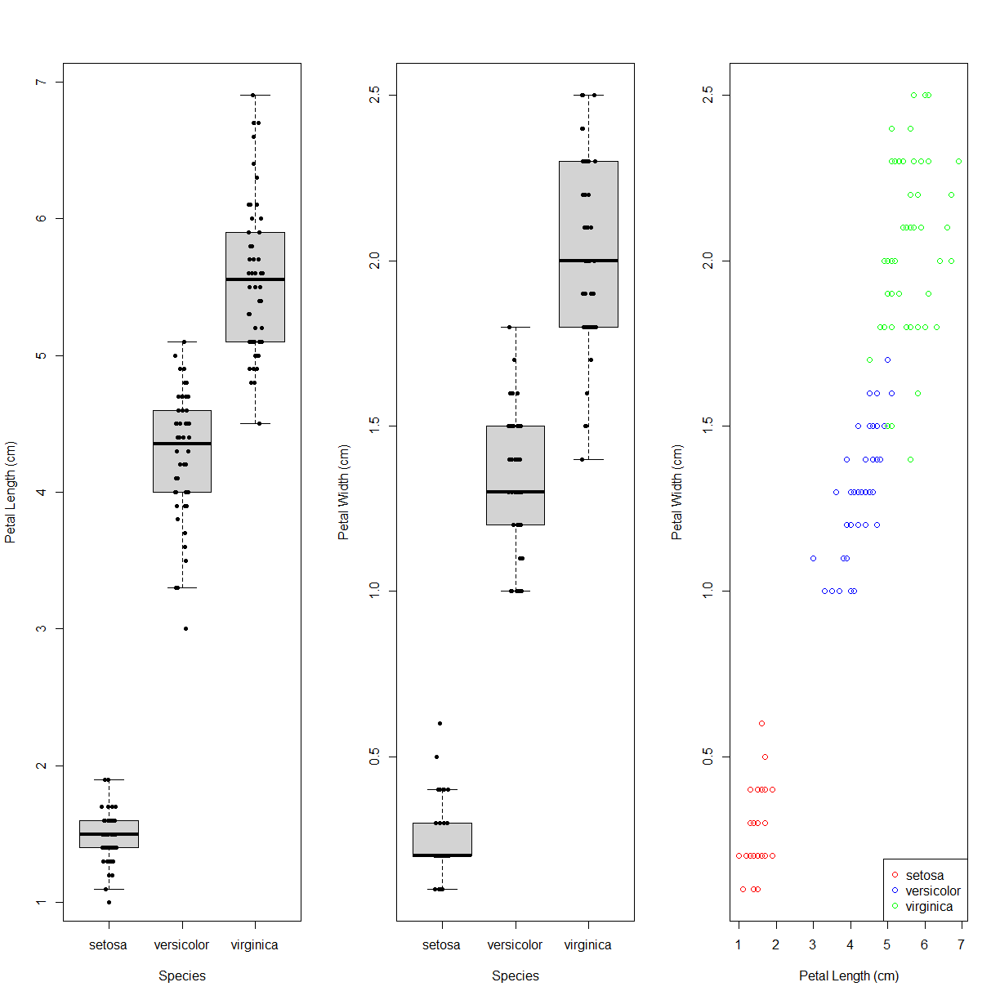
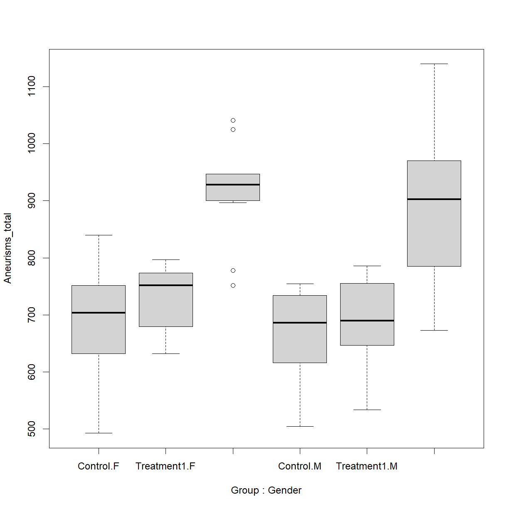
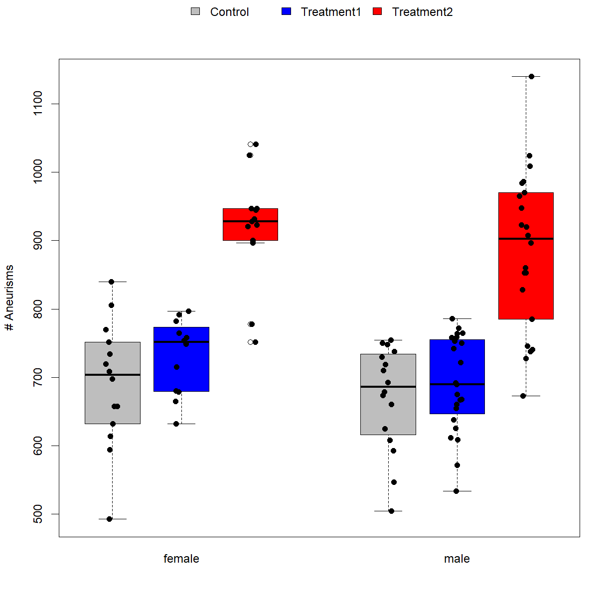
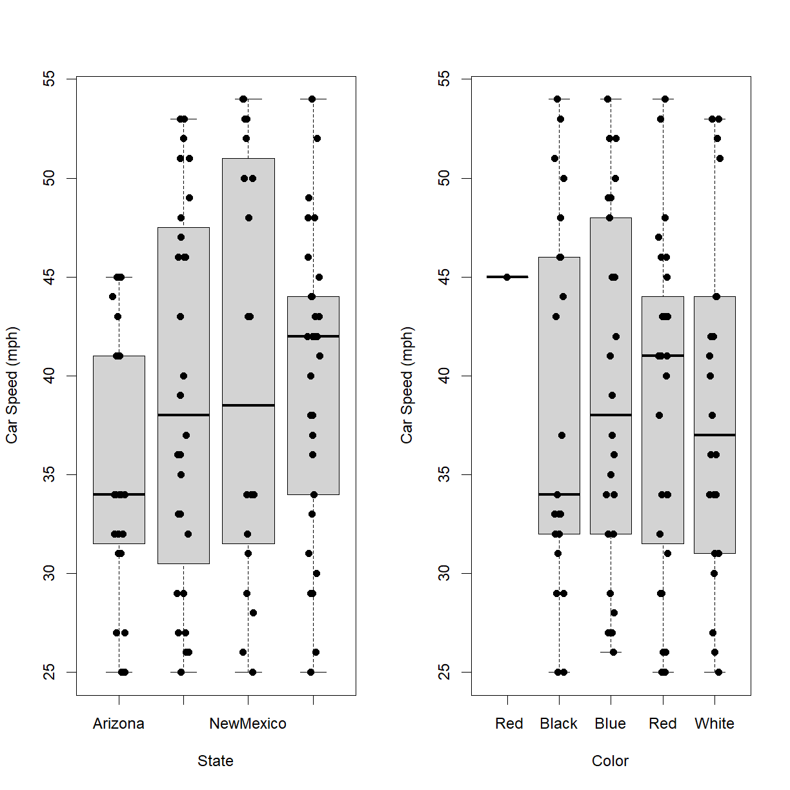

---
# Please do not edit this file directly; it is auto generated.
# Instead, please edit 04-oyo-advanced-data-manipulation.md in _episodes_rmd/
title: "Advanced Data Manipulation and Plotting"
classdate: "9/4/2020 -- On Your Own"
teaching: 90
exercises: 30
questions:
- "How do I rapidly calculate statistics based on relevant variables in a dataset?"
- "How to I begin to build more complex graphics?"
- "What tools are available for generating publication quality graphics in R?"
objectives:
- "Use pre-build functions like `rowSums()` to perform specific operations on data frame elements."
- "Use the `apply()` function to rapidly apply general functions across rows or columns of a data frame."
- "Use the `aggregate()` function to rapidly segregate dependent variables of interest by one or mor indpendent variables and calculate useful descriptive statistics."
- "Locate and employ tools in R base graphics to generate custom graphics."
keypoints:
- "Use `apply()`, `lapply()`, and `sapply()` to calculate statistics across the rows or columns of a data frame."
- "There are more advanced tools for complex data manipulation, including the `dplyr` and `data.table` packages."
- "Use `aggregate()` to calculate statistics based on the structure of a dataset."
source: Rmd
---

***
## On Your Own

### Advanced Data Manipulation

*In Class* we covered a few of the basic functions for calculating descriptive statistics. Here we will examine a few techniques for using these functions more efficiently across data sets.

&nbsp;
#### The `apply()` function

To start, let's reload the aneurisms dataset that we were using *In Class*, and specifically the version with the gender capitalization corrected:

~~~
dat <- read.csv(file="data/sample-gendercorrected.csv", header=TRUE, stringsAsFactors=FALSE)
~~~
{: .language-r}

&nbsp;

In this dataset, we have aneurism counts in patient eyes at four time points. What if our phenotype of interest is the maximum number of aneurisms across quarters for each patient, or perhaps the average across quarters? How do we calculate these values efficiently for each patient. We want to perform the repeat the same operation across a `margin` of the data frame (in this case a each row, but it can similarly apply to columns):

&nbsp;

In particular, we want to perform the functions `max()` or `mean()` on the last 4 columns of every row. To support this, we can use the `apply()` function.

~~~
?apply
~~~
{: .language-r}

&nbsp;

`apply()` allows us to repeat a function on each of the rows (`MARGIN = 1`) or columns (`MARGIN = 2`) of a data frame. To obtain the maximum or average inflammation of each patient we will need to calculate the `max` or `mean` of all of the rows (`MARGIN = 1`) of the relevant subset of the `dat` data frame. Let's start with mean:

~~~
avg_aneurisms_subject <- apply(dat[,6:9], 1, mean)
avg_aneurisms_subject
~~~
{: .language-r}

~~~
  [1] 173.25 213.25 186.50 198.00 189.50 285.00 158.00 246.00 196.25 177.25
 [11] 189.75 224.25 188.00 156.25 187.00 169.75 178.75 213.25 168.75 170.00
 [21] 180.00 133.50 230.25 225.00 187.50 165.25 246.50 187.25 126.25 174.50
 [31] 169.75 173.00 207.00 188.25 172.50 164.50 236.75 252.25 167.00 242.50
 [41] 191.25 156.50 179.75 180.50 148.50 260.25 184.50 177.50 187.50 193.00
 [51] 168.25 158.00 189.50 236.25 184.50 188.00 188.75 230.00 166.75 123.25
 [61] 201.50 194.50 195.50 163.75 256.25 185.50 232.00 164.50 224.25 136.75
 [71] 215.00 182.50 188.50 165.25 241.25 230.75 191.25 196.50 191.00 192.50
 [81] 227.00 153.00 182.00 237.00 185.25 210.00 153.50 199.25 159.50 152.00
 [91] 236.75 256.00 183.50 166.25 148.25 168.50 233.00 152.25 230.75 143.00
~~~
{: .output}

&nbsp;

Each element in the `avg_aneurisms_subject` vector is the mean of the four values in the `Aneurisms_q1`, `Aneurisms_q2`, `Aneurisms_q3`, and `Aneurisms_q4` columns for the corresponding row in the `dat` data frame. Note that the length of this vector is the same as the number of rows in the `dat` data frame:

~~~
length(avg_aneurisms_subject)
~~~
{: .language-r}

~~~
[1] 100
~~~
{: .output}

~~~
dim(dat)[1]
~~~
{: .language-r}

~~~
[1] 100
~~~
{: .output}

&nbsp;
 
A convenient way to associated this data with the corresponding patient is to directly add the calculated data to the data frame in a new column instead of assigning it to a separate vector:

~~~
dat$Aneurisms_avg <- apply(dat[,6:9], 1, mean)
~~~
{: .language-r}

&nbsp;

By changing to `MARGIN = 2` (calculate across columns), we ask a different question, namely what is the average number of aneurisms across patients for each quarter:

~~~
avg_aneurisms_quarter <- apply(dat[,6:9], 2, mean)
avg_aneurisms_quarter
~~~
{: .language-r}

~~~
Aneurisms_q1 Aneurisms_q2 Aneurisms_q3 Aneurisms_q4 
      158.84       168.03       219.85       217.94 
~~~
{: .output}

&nbsp;

> ## Maximum aneurisms
> 
> Determine the maximum and total number of aneurisms for each patient and add these values to the data frame. Save the results to a new file called "sample-processed.csv".
> 
> > ## Solution
> > 
> > First calculate the relevant descriptive statistics and add them directly to the `dat` data frame using the `apply` function.
> > 
> > 
> > ~~~
> > dat$Aneurisms_max <- apply(dat[,6:9], 1, max)
> > dat$Aneurisms_total <- apply(dat[,6:9], 1, sum)
> > ~~~
> > {: .language-r}
> > 
> > Check the output:
> > 
> > 
> > ~~~
> > head(dat)
> > ~~~
> > {: .language-r}
> > 
> > 
> > 
> > ~~~
> >       ID Gender      Group BloodPressure  Age Aneurisms_q1 Aneurisms_q2
> > 1 Sub001      M    Control           132 16.0          114          140
> > 2 Sub002      M Treatment2           139 17.2          148          209
> > 3 Sub003      M Treatment2           130 19.5          196          251
> > 4 Sub004      F Treatment1           105 15.7          199          140
> > 5 Sub005      M Treatment1           125 19.9          188          120
> > 6 Sub006      M Treatment2           112 14.3          260          266
> >   Aneurisms_q3 Aneurisms_q4 Aneurisms_avg Aneurisms_max Aneurisms_total
> > 1          202          237        173.25           237             693
> > 2          248          248        213.25           248             853
> > 3          122          177        186.50           251             746
> > 4          233          220        198.00           233             792
> > 5          222          228        189.50           228             758
> > 6          320          294        285.00           320            1140
> > ~~~
> > {: .output}
> > 
> > And save the final file using `write.csv()`:
> > 
> > 
> > ~~~
> > write.csv(dat, file = "data/sample-processed.csv", row.names = F)
> > ~~~
> > {: .language-r}
> {: .solution}
{: .challenge}

&nbsp;

> ## Argument Order in Functions
>
> Notice that we did not specify the argument names in `apply()`. Looking at the help file, the argument
> order is `X` (indicating the input data), then `MARGIN`, then `FUN` (for function to apply). So long as you
> enter arguments in the requested order, you do not need to be explicitly about which argument you are
> referring too. `apply()` just assumes that the first argument entered is the value for `X`, the second is the > value for `MARGIN`, and the third is the value for `FUN`. You can mix up the order, but then you have to be
> explicit about which argument you are defining.
>
> For example, this will return an error:
> 
> ~~~
> avg_aneurisms_subject <- apply(mean, 1, dat[,6:9])
> ~~~
> {: .language-r}
>
> while this will be interpreted identically to the earlier function call:
> 
> ~~~
> avg_aneurisms_subject <- apply(FUN = mean, MARGIN = 1, X = dat[,6:9])
> ~~~
> {: .language-r}
{: .callout}

&nbsp;

&nbsp;

> ## Efficient Alternatives
>
> Some common operations have more efficient alternatives. For example, you
> can calculate the row-wise or column-wise means with `rowMeans()` and
> `colMeans()`, respectively. Similarly for `rowSums()` and `colSums()`.
{: .callout}

&nbsp;
#### Aggregating data

Looking at summary statistics of the entire data set is great, but usually we are more interested in comparing these statistics across groups. R has a function called `aggregate()` that lets you apply a function (or more than one function) to a dependent variable (or more than one dependent variable) with the data separated by one or more independent variables.

~~~
?aggregate
~~~
{: .language-r}

&nbsp;

As with the `boxplot()` function, `aggregate()` uses formula notation. To get a feel for how the function operates, let's calculate the `mean()` of our newly calculated average aneurisms variable, broken down by treatment group. `aggregate()` requires three arguments: (1) the formula that defines how the data should be broken down, (2) the data to be used, and (3) the function that you would like to perform:

~~~
mean_by_group <- aggregate(Aneurisms_avg ~ Group, data = dat, FUN = mean)
mean_by_group
~~~
{: .language-r}

~~~
       Group Aneurisms_avg
1    Control      170.1083
2 Treatment1      175.9857
3 Treatment2      224.3929
~~~
{: .output}

&nbsp;

Great! `aggregate()` selected the subset of `Aneurisms_avg` values for each treatment group and returned the mean. What if we also want to see the breakdown by Gender?

~~~
mean_by_group_gender <- aggregate(Aneurisms_avg ~ Group + Gender, data = dat, FUN = mean)
mean_by_group_gender
~~~
{: .language-r}

~~~
       Group Gender Aneurisms_avg
1    Control      F      172.8214
2 Treatment1      F      182.6667
3 Treatment2      F      229.5385
4    Control      M      167.7344
5 Treatment1      M      172.5000
6 Treatment2      M      221.3523
~~~
{: .output}

&nbsp;

So far so good. Now, what if we wean to calculate more than just the mean? Maybe standard deviation to examin variability as well? This makes things a bit more complicated, but `aggregate()` is up to the task. First, `aggregate()` can technically only take one "input" function. However, we can get around this by defining our own input `function()` on the fly that includes multiple sub-functions combined using the `c()` function:

~~~
avg_aneurisms_summary <- aggregate(Aneurisms_avg ~ Group + Gender, data = dat, 
    FUN = function(x) c(mean(x), sd(x))) 
avg_aneurisms_summary
~~~
{: .language-r}

~~~
       Group Gender Aneurisms_avg.1 Aneurisms_avg.2
1    Control      F       172.82143        22.85519
2 Treatment1      F       182.66667        13.72056
3 Treatment2      F       229.53846        20.05717
4    Control      M       167.73438        19.01523
5 Treatment1      M       172.50000        17.57581
6 Treatment2      M       221.35227        29.26873
~~~
{: .output}

&nbsp;

Now, this new object `avg_aneurisms_summary` looks like a standard **data frame** on the surface, and even claims to be one:

~~~
class(avg_aneurisms_summary)
~~~
{: .language-r}

~~~
[1] "data.frame"
~~~
{: .output}

&nbsp;

However, if you actually look at the structure there is something odd going on:

~~~
str(avg_aneurisms_summary)
~~~
{: .language-r}

~~~
'data.frame':	6 obs. of  3 variables:
 $ Group        : chr  "Control" "Treatment1" "Treatment2" "Control" ...
 $ Gender       : chr  "F" "F" "F" "M" ...
 $ Aneurisms_avg: num [1:6, 1:2] 173 183 230 168 172 ...
~~~
{: .output}

&nbsp;

Instead of creating separate columns for the calculated `mean()` and `sd()` values, `aggregate()` made those values columns of a **numeric matrix** and assigned that **matrix** to a single "column" of the data frame:

~~~
# This doesn't actually contain any information:
avg_aneurisms_summary$Aneurisms_avg.1
~~~
{: .language-r}

~~~
NULL
~~~
{: .output}

~~~
# While this contaims a matrix (rather than a vector)
avg_aneurisms_summary$Aneurisms_avg
~~~
{: .language-r}

~~~
         [,1]     [,2]
[1,] 172.8214 22.85519
[2,] 182.6667 13.72056
[3,] 229.5385 20.05717
[4,] 167.7344 19.01523
[5,] 172.5000 17.57581
[6,] 221.3523 29.26873
~~~
{: .output}

&nbsp;

To fix this odd formating, we can use the function `do.call()` to convert the "matrix-within-a-data-frame" into a normal data frame, and then fix the column names to make them meaningful. We can actually just do this all in one step from the beginning:

~~~
# first run the aggregate function with do.call
avg_aneurisms_summary <- do.call(data.frame, 
                     aggregate(Aneurisms_avg ~ Group + Gender, data = dat,                      FUN = function(x) c(mean(x), sd(x)))) 

# check the baseline names of the output (not helpful!)
names(avg_aneurisms_summary)
~~~
{: .language-r}

~~~
[1] "Group"           "Gender"          "Aneurisms_avg.1" "Aneurisms_avg.2"
~~~
{: .output}

~~~
# correct the names of the newly created variables to reflect the functions that 
# were used to generate them
names(avg_aneurisms_summary)[c(3,4)] <- c("Aneurisms_avg_mean", "Aneurisms_avg_sd")

# Now check out the structure. This looks more like what we might have first expected
avg_aneurisms_summary
~~~
{: .language-r}

~~~
       Group Gender Aneurisms_avg_mean Aneurisms_avg_sd
1    Control      F           172.8214         22.85519
2 Treatment1      F           182.6667         13.72056
3 Treatment2      F           229.5385         20.05717
4    Control      M           167.7344         19.01523
5 Treatment1      M           172.5000         17.57581
6 Treatment2      M           221.3523         29.26873
~~~
{: .output}

~~~
str(avg_aneurisms_summary)
~~~
{: .language-r}

~~~
'data.frame':	6 obs. of  4 variables:
 $ Group             : chr  "Control" "Treatment1" "Treatment2" "Control" ...
 $ Gender            : chr  "F" "F" "F" "M" ...
 $ Aneurisms_avg_mean: num  173 183 230 168 172 ...
 $ Aneurisms_avg_sd  : num  22.9 13.7 20.1 19 17.6 ...
~~~
{: .output}

&nbsp;

Finally, we will often want to apply the same set of functions to multiple dependent variables. To tie this all together, let's calculate the same `mean()` and `sd()` for both `Aneurisms_avg` and `Aneurisms_total`. Do do this, we need to add an additional dependent variable to our `formula` notation, and bind them together using the `cbind()` function:

~~~
# First calculate the statistics using aggregate() and convert the output to a
# standard data frame using do.call()
aneurisms_summary <- do.call(data.frame, 
                             aggregate(cbind(Aneurisms_avg, Aneurisms_total) ~ Group + Gender, 
                                       data = dat, 
                                       FUN = function(x) c(mean(x), sd(x)))) 

# don't forget to correct the column names to something more meaningfule 
names(aneurisms_summary)[3:6] <- c("Aneurisms_avg_mean", "Aneurisms_avg_sd",
                                          "Aneurisms_total_mean", "Aneurisms_total_sd")

# ... and take a look at the results
aneurisms_summary
~~~
{: .language-r}

~~~
       Group Gender Aneurisms_avg_mean Aneurisms_avg_sd Aneurisms_total_mean
1    Control      F           172.8214         22.85519             691.2857
2 Treatment1      F           182.6667         13.72056             730.6667
3 Treatment2      F           229.5385         20.05717             918.1538
4    Control      M           167.7344         19.01523             670.9375
5 Treatment1      M           172.5000         17.57581             690.0000
6 Treatment2      M           221.3523         29.26873             885.4091
  Aneurisms_total_sd
1           91.42078
2           54.88224
3           80.22868
4           76.06091
5           70.30324
6          117.07493
~~~
{: .output}

&nbsp;

Using the `aggregate()` function to it's full potential is, admittedly, a bit convoluted. If you don't quite get all of the detail, especially how to format and deal with the output of a multiple-dependent-variable, multiple-independent-variable, multiple-function `aggregate()` call, that's okay. The goal here is to demonstrate that what is possible with the basic functions available in R. Even the basic single-function `aggregate()` can be really useful in speeding up data processing. Start there and work you way up.

&nbsp;
#### Additional Data Manipulation Exercises

> ## Subsetting More Data
>
> Suppose you want to determine the maximum number of aneurisms for subject 5 across quarters two to four.
> To do this you would extract the relevant subset from the data frame and calculate the maximum value.
> Which of the following lines of R code gives the correct answer?
>
> 1. `max(dat[5, ])`
> 2. `max(dat[7:9, 5])`
> 3. `max(dat[5, 7:9])`
> 4. `max(dat[5, 7, 9])`
>
> > ## Solution
> >
> > Answer: 3
> >
> > Explanation: You want to extract the part of the data frame representing data for patient 5 from quarter two (column 7) to quarter 4 (column 9). In this data frame, patient data is organised in rows and the days are represented by the columns. Subscripting in R follows the `[i, j]` principle, where `i = rows` and `j = columns`. Thus, answer 3 is correct since the patient is represented by the value for i (5) and the days are represented by the values in j, which is a subset spanning day 9 to 7.
> >
> {: .solution}
{: .challenge}

&nbsp;

> ## Subsetting and Re-Assignment
>
> Using the data frame `dat` from above:
> Let's pretend there was something wrong with the instrument on the first two quarters for every second patient (subjects 2, 4, 6, etc.), which resulted in the measurements being twice as large as they should be.
>
> 1. Write a vector containing each affected patient (hint: `?seq`).
> 2. Create a new data frame in which you halve the first two quarters' values in only those patients.
> 3. Print out the corrected data frame to check that your code has fixed the problem.
>
> > ## Solution
> > 
> > ~~~
> > whichPatients <- seq(2, dim(dat)[1], 2) # i.e., which rows
> > whichQuarters <- seq(6,7)         # i.e., which columns indicates quarters 1 and 2; you could also use c(6,7) or 6:7
> > dat2 <- dat # make a copy of the original data
> > # check the size of your subset: returns `30 5`, that is 30 [rows=patients] by 5 [columns=quarters]
> > dim(dat2[whichPatients, whichQuarters])
> > ~~~
> > {: .language-r}
> > 
> > 
> > 
> > ~~~
> > [1] 50  2
> > ~~~
> > {: .output}
> > 
> > 
> > 
> > ~~~
> > dat2[whichPatients, whichQuarters] <- dat[whichPatients, whichQuarters] / 2
> > dat2
> > ~~~
> > {: .language-r}
> > 
> > 
> > 
> > ~~~
> >         ID Gender      Group BloodPressure  Age Aneurisms_q1 Aneurisms_q2
> > 1   Sub001      M    Control           132 16.0        114.0        140.0
> > 2   Sub002      M Treatment2           139 17.2         74.0        104.5
> > 3   Sub003      M Treatment2           130 19.5        196.0        251.0
> > 4   Sub004      F Treatment1           105 15.7         99.5         70.0
> > 5   Sub005      M Treatment1           125 19.9        188.0        120.0
> > 6   Sub006      M Treatment2           112 14.3        130.0        133.0
> > 7   Sub007      F    Control           173 17.7        135.0         98.0
> > 8   Sub008      M Treatment2           108 19.8        108.0        119.0
> > 9   Sub009      M Treatment2           131 19.4        117.0        215.0
> > 10  Sub010      F    Control           129 18.8         94.0         72.0
> > 11  Sub011      M Treatment1           126 14.8        134.0        155.0
> > 12  Sub012      F Treatment2            96 15.3         76.0         88.5
> > 13  Sub013      F    Control            77 16.5        112.0        220.0
> > 14  Sub014      M    Control           158 12.6         54.5         75.0
> > 15  Sub015      M    Control            81 14.3        146.0        140.0
> > 16  Sub016      M    Control           137 15.9         48.5         86.0
> > 17  Sub017      F Treatment1           147 18.4        165.0        157.0
> > 18  Sub018      M Treatment2           130 18.3         79.0        132.5
> > 19  Sub019      M Treatment1           105 15.4        178.0        109.0
> > 20  Sub020      F Treatment1            92 14.3         53.5         94.0
> > 21  Sub021      F    Control           111 12.7        174.0        160.0
> > 22  Sub022      M Treatment1           122 15.4         48.5         55.0
> > 23  Sub023      F Treatment2            97 17.2        187.0        239.0
> > 24  Sub024      F Treatment2           118 17.3         94.0         95.5
> > 25  Sub025      M Treatment1            82 16.7        114.0        199.0
> > 26  Sub026      M Treatment1           123 19.6         57.5         80.0
> > 27  Sub027      M Treatment2           126 15.0        128.0        249.0
> > 28  Sub028      F Treatment1            94 16.1         56.0        115.0
> > 29  Sub029      M    Control           135 17.6        136.0        109.0
> > 30  Sub030      F    Control           108 18.6         51.5         74.0
> > 31  Sub031      F Treatment1           133 18.3        132.0        151.0
> > 32  Sub032      M Treatment1           108 16.7         59.0         77.0
> > 33  Sub033      M Treatment2           122 12.5        166.0        176.0
> > 34  Sub034      M Treatment1           134 14.3         76.0         52.5
> > 35  Sub035      M Treatment1           145 19.7        191.0        148.0
> > 36  Sub036      F    Control           133 17.6         76.0         89.0
> > 37  Sub037      F Treatment2            90 17.0        161.0        270.0
> > 38  Sub038      M Treatment2           118 12.2        119.5         92.0
> > 39  Sub039      M Treatment1           113 15.1        132.0        137.0
> > 40  Sub040      M Treatment2           115 17.7         84.0        127.5
> > 41  Sub041      F Treatment1           142 19.0        140.0        184.0
> > 42  Sub042      M Treatment1           114 14.7         83.0         42.5
> > 43  Sub043      M    Control           139 15.2        141.0        160.0
> > 44  Sub044      M Treatment1            90 15.3         80.5         84.0
> > 45  Sub045      F    Control           126 12.9        103.0        111.0
> > 46  Sub046      F Treatment2           109 18.4        115.5        120.0
> > 47  Sub047      M    Control           125 18.1        192.0        141.0
> > 48  Sub048      M    Control            99 15.6         89.0         90.0
> > 49  Sub049      M    Control           122 19.5        167.0        123.0
> > 50  Sub050      M Treatment1           111 13.5         67.5         75.0
> > 51  Sub051      M Treatment2           109 13.5        150.0        166.0
> > 52  Sub052      F Treatment1           134 13.7         96.0         40.0
> > 53  Sub053      F Treatment1           113 18.7        153.0        153.0
> > 54  Sub054      F Treatment2           105 12.2        102.5        132.0
> > 55  Sub055      M Treatment2           125 16.9        117.0        194.0
> > 56  Sub056      F Treatment2           123 19.5         99.5         59.5
> > 57  Sub057      M    Control           155 12.1        182.0        129.0
> > 58  Sub058      M Treatment2           117 17.0         90.0         98.0
> > 59  Sub059      M Treatment1           116 19.2        111.0        111.0
> > 60  Sub060      F    Control           133 14.7         50.5         49.0
> > 61  Sub061      F    Control            94 20.0        166.0        167.0
> > 62  Sub062      F Treatment2           106 14.1         79.0         85.5
> > 63  Sub063      F Treatment1           144 14.7        189.0        178.0
> > 64  Sub064      M Treatment1           149 16.6         94.5         50.5
> > 65  Sub065      F Treatment2           108 15.0        239.0        189.0
> > 66  Sub066      M Treatment1           116 15.0         92.5        112.0
> > 67  Sub067      F Treatment2           136 13.8        224.0        112.0
> > 68  Sub068      F    Control            98 14.8         52.0         69.5
> > 69  Sub069      M Treatment2           148 19.1        222.0        199.0
> > 70  Sub070      M    Control            74 18.9         53.5         49.0
> > 71  Sub071      M Treatment2           147 17.7        153.0        255.0
> > 72  Sub072      M    Control           116 17.4         59.0         82.5
> > 73  Sub073      F Treatment1           133 15.5        102.0        184.0
> > 74  Sub074      M    Control            97 13.1         94.0         62.5
> > 75  Sub075      M Treatment2           132 12.2        180.0        283.0
> > 76  Sub076      F Treatment2           153 17.0         89.0        107.0
> > 77  Sub077      M Treatment1           151 17.7        168.0        184.0
> > 78  Sub078      M Treatment1           121 19.5         59.0         85.0
> > 79  Sub079      M Treatment1           116 19.5        169.0        114.0
> > 80  Sub080      F    Control           104 12.8         78.0         69.0
> > 81  Sub081      M Treatment2           111 17.6        232.0        211.0
> > 82  Sub082      M Treatment1            62 17.7         94.0         54.0
> > 83  Sub083      M Treatment2           124 14.2        169.0        168.0
> > 84  Sub084      M Treatment2           124 19.2        120.5        116.5
> > 85  Sub085      M Treatment2           109 16.0         65.0        207.0
> > 86  Sub086      F    Control           117 15.2        112.5         92.5
> > 87  Sub087      F    Control            90 17.6        104.0        116.0
> > 88  Sub088      F Treatment1           158 17.6         89.5         79.0
> > 89  Sub089      M Treatment1           113 15.1        103.0        140.0
> > 90  Sub090      M    Control           150 17.8         56.0         65.0
> > 91  Sub091      F Treatment2           115 16.2        226.0        170.0
> > 92  Sub092      M Treatment2            83 16.6        114.0        110.5
> > 93  Sub093      F    Control           116 19.1        209.0        142.0
> > 94  Sub094      F Treatment1           141 17.2         76.5         52.0
> > 95  Sub095      M    Control           108 13.6        111.0        118.0
> > 96  Sub096      M    Control           102 14.6         74.0         66.0
> > 97  Sub097      F Treatment2            90 19.6        141.0        196.0
> > 98  Sub098      M Treatment1           133 17.0         96.5         56.0
> > 99  Sub099      M Treatment2            83 16.2        130.0        226.0
> > 100 Sub100      M Treatment1           122 18.4         63.0         78.5
> >     Aneurisms_q3 Aneurisms_q4 Aneurisms_avg Aneurisms_max Aneurisms_total
> > 1            202          237        173.25           237             693
> > 2            248          248        213.25           248             853
> > 3            122          177        186.50           251             746
> > 4            233          220        198.00           233             792
> > 5            222          228        189.50           228             758
> > 6            320          294        285.00           320            1140
> > 7            154          245        158.00           245             632
> > 8            279          251        246.00           279             984
> > 9            181          272        196.25           272             785
> > 10           192          185        177.25           192             709
> > 11           247          223        189.75           247             759
> > 12           323          245        224.25           323             897
> > 13           225          195        188.00           225             752
> > 14           177          189        156.25           189             625
> > 15           239          223        187.00           239             748
> > 16           203          207        169.75           207             679
> > 17           200          193        178.75           200             715
> > 18           243          187        213.25           265             853
> > 19           206          182        168.75           206             675
> > 20           167          218        170.00           218             680
> > 21           203          183        180.00           203             720
> > 22           194          133        133.50           194             534
> > 23           281          214        230.25           281             921
> > 24           256          265        225.00           265             900
> > 25           242          195        187.50           242             750
> > 26           158          228        165.25           228             661
> > 27           294          315        246.50           315             986
> > 28           281          126        187.25           281             749
> > 29           105          155        126.25           155             505
> > 30           219          228        174.50           228             698
> > 31           234          162        169.75           234             679
> > 32           260          160        173.00           260             692
> > 33           253          233        207.00           253             828
> > 34           197          299        188.25           299             753
> > 35           166          185        172.50           191             690
> > 36           158          170        164.50           178             658
> > 37           232          284        236.75           284             947
> > 38           317          269        252.25           317            1009
> > 39           193          206        167.00           206             668
> > 40           273          274        242.50           274             970
> > 41           239          202        191.25           239             765
> > 42           179          196        156.50           196             626
> > 43           179          239        179.75           239             719
> > 44           212          181        180.50           212             722
> > 45           254          126        148.50           254             594
> > 46           260          310        260.25           310            1041
> > 47           180          225        184.50           225             738
> > 48           169          183        177.50           183             710
> > 49           236          224        187.50           236             750
> > 50           208          279        193.00           279             772
> > 51           153          204        168.25           204             673
> > 52           138          222        158.00           222             632
> > 53           236          216        189.50           236             758
> > 54           269          207        236.25           269             945
> > 55           216          211        184.50           216             738
> > 56           183          251        188.00           251             752
> > 57           226          218        188.75           226             755
> > 58           250          294        230.00           294             920
> > 59           244          201        166.75           244             667
> > 60           178          116        123.25           178             493
> > 61           232          241        201.50           241             806
> > 62           237          212        194.50           237             778
> > 63           177          238        195.50           238             782
> > 64           193          172        163.75           193             655
> > 65           297          300        256.25           300            1025
> > 66           151          182        185.50           224             742
> > 67           304          288        232.00           304             928
> > 68           211          204        164.50           211             658
> > 69           280          196        224.25           280             897
> > 70           204          138        136.75           204             547
> > 71           218          234        215.00           255             860
> > 72           220          227        182.50           227             730
> > 73           246          222        188.50           246             754
> > 74           191          157        165.25           191             661
> > 75           204          298        241.25           298             965
> > 76           291          240        230.75           291             923
> > 77           184          229        191.25           229             765
> > 78           249          249        196.50           249             786
> > 79           248          233        191.00           248             764
> > 80           218          258        192.50           258             770
> > 81           219          246        227.00           246             908
> > 82           180          136        153.00           188             612
> > 83           180          211        182.00           211             728
> > 84           292          182        237.00           292             948
> > 85           234          235        185.25           235             741
> > 86           195          235        210.00           235             840
> > 87           173          221        153.50           221             614
> > 88           216          244        199.25           244             797
> > 89           209          186        159.50           209             638
> > 90           175          191        152.00           191             608
> > 91           307          244        236.75           307             947
> > 92           316          259        256.00           316            1024
> > 93           199          184        183.50           209             734
> > 94           194          214        166.25           214             665
> > 95           173          191        148.25           191             593
> > 96           200          194        168.50           200             674
> > 97           322          273        233.00           322             932
> > 98           123          181        152.25           193             609
> > 99           286          281        230.75           286             923
> > 100          129          160        143.00           160             572
> > ~~~
> > {: .output}
> {: .solution}
{: .challenge}

&nbsp;

> ## Using the apply function on patient data
>
> The apply function can be used to summarize datasets and subsets
> of data across rows and columns using the MARGIN argument.
> Suppose you want to calculate the mean number of aneurisms for
> specific quarters and patients in the patient dataset.
>
> Use a combination of the apply function and indexing to:
>
> 1. Calculate the mean number of aneurisms for patients 1 to 5 over all four quarters.
> 2. Calculate the mean number of aneurisms for quarters 1 to 3 (across all patients).
> 3. Calculate the mean number of aneurisms for each patient in treatment group 2 day (across all quarters).
>
> Think about the number of rows and columns you would expect as the result before each apply call and check your intuition by applying the mean function.
>
> > ## Solution
> >
> > 
> > ~~~
> >  # 1.
> > apply(dat[1:5, 6:9], 1, mean)
> > 
> > # 2.
> > apply(dat[, 6:8], 2, mean)
> > 
> > # 3.
> > apply(dat[dat$Group == "Treatment2", 6:9], 1, mean)
> > ~~~
> > {: .language-r}
> {: .solution}
{: .challenge}

*** 
### Plotting -- Additional Detail

R is a robust platform for creating publication quality graphics, regardless of the complexity of you data and presentation. We really just scratched the surface *In Class* and there is no way we will be able to adequately cover the available tools in one session of one class. The goal is to give you a taste of what you can do (i.e. virtually anything you can image) and where to look for the tools to begin to do so.

&nbsp;
#### Multipanel plots

Most figures contain multiple panels containing different information. One option is to generate each panel as a separate figure and stitch them together after the fact using a PDF editor or some other graphics program. However, R has the tools to build multipanel plots. Let's look at how we can put multiple related panels in the same plot. This requires going beyond the `plot()` and `boxplot()` functions.

Take a look at the `?plot` documentation. Notice that there really aren't that many input options, but that there is a "..." listed, which references the `par()` function. This will also introduce you to the `par()` function. Under the surface, there are  hundreds of tweaks that you can make to plots through arguments. R has a set of predefined graphical parameters that are all stored in the background. The `par()` function queries and sets these parameters. If you don't give it any arguments, `par()` will return the current settings for all of these variables. We can see what settings are available and what the defaults are using `?par`.

~~~
?par
~~~
{: .language-r}

&nbsp;

Before you start to fiddle with `par()`, it is a good idea to store all of the current settings to a variable, which can be used to restore the default if we need to later on.

~~~
plot.options <- par()
~~~
{: .language-r}

&nbsp;

Now to take a look at what we have:

~~~
head(plot.options) # this is a list with a bunch of graphical related variables
~~~
{: .language-r}

~~~
$xlog
[1] FALSE

$ylog
[1] FALSE

$adj
[1] 0.5

$ann
[1] TRUE

$ask
[1] FALSE

$bg
[1] "white"
~~~
{: .output}

~~~
length(plot.options) # there are 72 variables that we can tweak in par() alone, and some have multiple parameters
~~~
{: .language-r}

~~~
[1] 72
~~~
{: .output}

&nbsp;

Consider the `iris` data set. If we want to make a multipanel plot, say with box plots of Petal Length and Petal Width, and then the correlation between them, we can use `par()` before running plot to tell R how many rows and columns of figure panels  we want to create. We use this by passing the argument `mfrow = c(<# of rows>, <# of columns>)` to `par()`. This changes the value of the background graphical parameters. Note that we later have to change this back if we want to make a single-panel plot.

Once we set `mfrow` we can then run our previous plot commands in the order we want them displayed. Let's give it a try:

~~~
# get the current graphical parameters
old.plot.options <- par() # it never hurts to save a copy of the old parameters, so we can reset them if we break something

# setup a plot with 3 figure panels in a row using the mfrow argument
par(mfrow = c(1,3)) # 1 row, 3 columns

# Panel 1: Box plot with jittered stripchart points for Petal Length
boxplot(Petal.Length ~ Species, data = iris,
        outline = FALSE, ylab = "Petal Length (cm)")
stripchart(Petal.Length ~ Species, data = iris,
           pch = 16, method = "jitter",
           add=TRUE, vert=TRUE)

# Panel 2: Box plot with jittered stripchart points for Petal Width
boxplot(Petal.Width ~ Species, data = iris,
        outline = FALSE, ylab = "Petal Width (cm)")
stripchart(Petal.Width ~ Species, data = iris,
           pch = 16, method = "jitter",
           add=TRUE, vert=TRUE)

# Panel 3: Scatter plot comparing Petal Length to Petal Width
col.list <- c("red", "blue", "green")
col.vector <- col.list[iris$Species]
plot(iris$Petal.Length, iris$Petal.Width,
     xlab = "Petal Length (cm)", ylab = "Petal Width (cm)",
     col = col.vector)
legend("bottomright", legend = levels(iris$Species), col=col.list, pch=1)
~~~
{: .language-r}

~~~
# and finally, reset the mfrow argument to a single panel
par(mfrow = c(1,1))
~~~
{: .language-r}

&nbsp;
#### Box plots with multiple independent variables -- getting to publication quality

Box plots begin to tax the default behavior of R when it comes to things like axis labeling. Let's use the gender-corrected and processed version of our aneurism data ("sample-processed.csv") to take a look at plotting when multiple independent variables are in play. First, load the data:

~~~
dat <- read.csv("data/sample-processed.csv", stringsAsFactors = T)
head(dat)
~~~
{: .language-r}

~~~
      ID Gender      Group BloodPressure  Age Aneurisms_q1 Aneurisms_q2
1 Sub001      M    Control           132 16.0          114          140
2 Sub002      M Treatment2           139 17.2          148          209
3 Sub003      M Treatment2           130 19.5          196          251
4 Sub004      F Treatment1           105 15.7          199          140
5 Sub005      M Treatment1           125 19.9          188          120
6 Sub006      M Treatment2           112 14.3          260          266
  Aneurisms_q3 Aneurisms_q4 Aneurisms_avg Aneurisms_max Aneurisms_total
1          202          237        173.25           237             693
2          248          248        213.25           248             853
3          122          177        186.50           251             746
4          233          220        198.00           233             792
5          222          228        189.50           228             758
6          320          294        285.00           320            1140
~~~
{: .output}

&nbsp;

What if we want to plot total aneurisms broken down by both gender and treatment group. The `formula` notation used in `boxplot()` makes this pretty straightforward:

~~~
# use the '+' to indicate multiple grouping variables
boxplot(Aneurisms_total ~ Group + Gender, data = dat)
~~~
{: .language-r}

&nbsp;

We have the data in the right place, but the group labels are all horizontal, so they can't be displayed. There is also no clear visual way to distinguish how the treatment groups and gender groups are separated.

We can take several steps to improve the look in chart:
* Use the `at` argument to change the box spacing. By default, boxes are drawn centered over the integers 1, 2, 3, ..., n, where n is the number of boxes. By redefining these locations and skipping numbers, you can add spaces between groups.
* Use box colors to indicate treatment groups (`col` argument plus the `legend()` function) and x-axis labels to indicate gender. There are other ways to do this, but this is one of the more visually appealing.
* Tick marks are often not useful in box plots. To turn them off, we will use the `xaxt` to run off all x-axis feature, and then use the separate function `axis()` to add the ones we want back (sans tick marks).
* Make the y-axis label look better with `ylab`.
* Add all points with `stripchart()`.

~~~
# draw the box plot first
boxplot(Aneurisms_total ~ Group + Gender, data = dat,
        xaxt = "n", xlab = "", # turn off all x-axis labeling (so we can redraw it below)
        ylab = "# Aneurisms", # y axis label
        at = c(1,2,3, 5,6,7), # leave a space between gender groups
        col = c("grey","blue","red")) # color boxes by treatment for legend

# now add the points with stripchart with the same parameters as box
stripchart(Aneurisms_total ~ Group + Gender, data = dat,
        add = TRUE, vert = TRUE, # add the points to the current boxplot vertically
        at = c(1,2,3, 5,6,7), # leave a space between gender groups
        col = c("black"), pch = 16, # color and symbol for points
        method = "jitter") # jitter the points

# next add gender labels to the x-axis
axis(side = 1, # add axis labels to the x-axis
     at = c(2,6), # place the labels under the middle boxes of each group
     labels = c("female","male"), # gender labels
     tick = FALSE) # do not add tick marks

# now add a legend to indicate
legend(x = "top", inset = -0.13, # place the legend on top, but nudge it up a bit
       xpd = T, # allow the legend to be drawn outside the plot area
       bty = "n", # don't draw a box around the legend
       ncol = 3, # use 3 columns (one row, since we have 3 groups)
       fill = c("grey", "blue", "red"), # fill boxes with the same colors as boxplot
       legend = levels(dat$Group)) # labels by treatment group
~~~
{: .language-r}

&nbsp;

This ends up with a fairly complex script for a single chart, but when you start to directly generate publication quality graphics in R, this is what it tends to look like. Once you go through the process of setting up a plot that you like once, you can always copy that whole chunk of code into the next project (or write a custom plot function with your own defaults!). Over time, you build up a sort of personal "library" of code chunks and can make really nice graphics in relatively little time.

&nbsp;
#### Other resources for plotting

This lesson gives you access to the two most common chart types used in biology: scatterplots and box plots (which can usually be used in place of bar charts). This is just the tip of a very large iceberg. R has the capability of producing any visualization you can imagine, and there are full workshops and courses dedicated just to generating graphics in R. The potential applications are as varied as your projects, and the best thing you can do is to sit down and start using the functions with Google search close at hand.

We don't have the time to do everything, but we will be using both of these chart types throughout the course, and introducing several others (histograms, density charts, line graphs, Kaplan-Meier charts, etc).  For now, a few resources that will help you along the way:
* A cheat sheet for the graphics tools that come with R (aka "R base graphics") can be downloaded [here]({{ page.root }}/fig/BaseGraphicsCheatsheet.pdf).
* The `lattice` package makes some improvements to R base graphics and functions. The defaults are better for example.
* The other commonly graphics package is called `ggplot2`. I have tended toward base graphics, because you can literally do anything with them, but `ggplot2` is easier in some ways, once you get the syntax down (which is very different). Cheat sheet is [here]({{ page.root }}/fig/ggplot2-cheatsheet.pdf).
* Google is your friend. There are probably thousands of tutorials, forum Q&As, cheat sheets, etc. to answer your project specific questions. For a taste, go to Google and search "publication quality graphics in R"

***
### Exercises

> ## On the road -- does what you drive or where you drive it matter?
>
> Read in our sample data on car speeds (car-speeds.csv) and visualize differences in car
> speed by both state and color.
>
> > ## Solution
> >
> > 
> > ~~~
> > # set data and results directories
> > data.dir <- "data"
> > results.dir <- "results"
> > 
> > # load data
> > carSpeeds <- read.csv(paste0(data.dir,"/car-speeds.csv"))
> > 
> > # setup two panel figure
> > par(mfrow = c(1,2))
> > 
> > # use a box plot with jittered strip chart overlay to plot car speed as a function
> > # of state
> > boxplot(Speed ~ State, data = carSpeeds,
> >         outline = FALSE, ylab = "Car Speed (mph)")
> > stripchart(Speed ~ State, data = carSpeeds,
> >         pch = 16, method = "jitter",
> >         add=TRUE, vert=TRUE)
> > 
> > # use a box plot with jittered strip chart overlay to plot car speed as a function
> > # of car color
> > boxplot(Speed ~ Color, data = carSpeeds,
> >         outline = FALSE, ylab = "Car Speed (mph)")
> > stripchart(Speed ~ Color, data = carSpeeds,
> >         pch = 16, method = "jitter",
> >             add=TRUE, vert=TRUE)
> > ~~~
> > {: .language-r}
> > 
> > 
> {: .solution}
{: .challenge}

&nbsp;

> ## Blood pressure as a risk factor for aneurism
>
> Does blood pressure appear to have an impact on aneurism risk?
>
> Examine these questions using the file that we created in the "Correcting Case in Gender"
> exercise earlier (sample-gendercorrected.csv). What, other than blood pressure, may explain
> any apparent correlation (or lack there of?).
>
> Save your results to a PDF file.
>
> > ## Solution
> >
> > I left this intentionally a bit vague, which means that there are several solutions. But
> > that is often the nature of real data in real research.
> >
> > Since we are trying to gt a general idea here, I am first going to calculate the average
> > quarterly aneurisms and the total yearly aneurisms (you could also look at each quarter
> > independently).
> >
> > 
> > ~~~
> > # set data and results directories
> > data.dir <- "data"
> > results.dir <- "results"
> > 
> > # load data
> > data.an <- read.csv(paste0(data.dir,"/sample-gendercorrected.csv"))
> > 
> > # define new columns for average quarterly and total annual aneurisms and calculate
> > data.an$Aneurisms_qmean <- rowMeans(data.an[,6:9])
> > data.an$Aneurisms_total <- rowSums(data.an[,6:9])
> > head(data.an)
> > ~~~
> > {: .language-r}
> > 
> > 
> > 
> > ~~~
> >       ID Gender      Group BloodPressure  Age Aneurisms_q1 Aneurisms_q2
> > 1 Sub001      M    Control           132 16.0          114          140
> > 2 Sub002      M Treatment2           139 17.2          148          209
> > 3 Sub003      M Treatment2           130 19.5          196          251
> > 4 Sub004      F Treatment1           105 15.7          199          140
> > 5 Sub005      M Treatment1           125 19.9          188          120
> > 6 Sub006      M Treatment2           112 14.3          260          266
> >   Aneurisms_q3 Aneurisms_q4 Aneurisms_qmean Aneurisms_total
> > 1          202          237          173.25             693
> > 2          248          248          213.25             853
> > 3          122          177          186.50             746
> > 4          233          220          198.00             792
> > 5          222          228          189.50             758
> > 6          320          294          285.00            1140
> > ~~~
> > {: .output}
> > 
> > 
> > 
> > ~~~
> > # initiate a PDF file and setup two panel figure
> > pdf(file=paste0(results.dir, "/aneurisms-bloodpressure-chart.pdf"), width = 8, height = 4)
> > par(mfrow = c(1,2))
> > 
> > # use a scatter plot to look for apparent correlation between blood pressure and
> > # both summary measures of aneurism (in separate panels)
> > plot(data.an$BloodPressure, data.an$Aneurisms_qmean,
> >      xlab = "Blood Pressure (mmHg)", ylab = "Mean Aneurisms per Quarter")
> > 
> > plot(data.an$BloodPressure, data.an$Aneurisms_total,
> >      xlab = "Blood Pressure (mmHg)", ylab = "Aneurisms per Year")
> > 
> > # turn off PDF device
> > dev.off()
> > ~~~
> > {: .language-r}
> > 
> > 
> > 
> > ~~~
> > png 
> >   2 
> > ~~~
> > {: .output}
> >
> > There is no apparent correlation, but there are a lot of potential confounders within the
> > data set that we are not examining in this exercise so far (treatment, gender, age)
> {: .solution}
{: .challenge}

&nbsp;

> ## Correlations between petal and sepal in iris data
>
> We looked a correlation between petal length and width. What about correlations between petal
> and sepal? Generate scatter plots to look at length and width correlations, broken down by species.
>
> Save your results to a PDF.
>
> > ## Solution
> >
> >
> > 
> > ~~~
> > # set data and results directories
> > data.dir <- "data"
> > results.dir <- "results"
> > 
> > # initiate a PDF file and setup two panel figure
> > pdf(file=paste0(results.dir, "/iris-petal-sepal-correlations.pdf"), width = 8, height = 4)
> > par(mfrow = c(1,2))
> > 
> > # Define colors
> > col.list <- c("red", "blue", "green")
> > 
> > # And we use the species.index in place of iris$Species to do the indexing and generate
> > # our color list for each point on the plot
> > col.vector <- col.list[iris$Species]
> > 
> > # Plot petal length x sepal length, then petal width x sepal width in subsequent panels
> > # we only need one legend, which after an initial look at the data, fits best in the top
> > # left of the first panel
> > plot(iris$Petal.Length, iris$Sepal.Length,xlab = "Petal Length (cm)",
> >       ylab = "Sepal Length (cm)", col = col.vector)
> > legend("topleft", legend = levels(iris$Species), col=col.list, pch=1)
> > plot(iris$Petal.Width, iris$Sepal.Width,xlab = "Petal Width (cm)",
> >       ylab = "Sepal Width (cm)", col = col.vector)
> > 
> > # turn off the PDF device
> > dev.off()
> > ~~~
> > {: .language-r}
> > 
> > 
> > 
> > ~~~
> > png 
> >   2 
> > ~~~
> > {: .output}
> {: .solution}
{: .challenge}

&nbsp;

> ## Exploring plot options
>
> R has hundreds of ways to change the way plots are displayed. The only way to
> really learn how to manipulate charts is to start playing with the options to
> see what they do. Below are a range of options that I have used at one point
> or another.
>
> Try starting with one of the plots with today's lesson, change one
> or more of the following parameters, then rerun the plot script to see what
> changed. A good way to do this is to plot two charts with a single argument change
> to the RStudio plot panel. The arrows at the top left of the panel let you look
> through previous charts and see what changed. Alternatively, write the two charts
> to subsequent pages of a PDF file for comparison.
>
> **Arguments to the `plot()` function**
> *Remember that default values can be found in `?plot` or by running `par()` with no arguments, and argument descriptions can be accessed in `?par`.*
> * *bty*
> * *border*
> * *col*
> * *lty*
> * *lwd*
> * *main*
> * *sub*
> * *type*
> * *xlab*, *ylab*
> * *xlim*, *ylim*
> * *xaxs*, *yaxs*
> * *xaxt*, *yaxt*
> * *xlog*, *ylog*
> * *xpd*
>
> **Arguments to the `par()` function**
> *Note that these are typically passed to `par()` prior to running running a plot
> function. Run `par()` for defaults and `?par` for argument descriptions.
> * *cex*
> * *mar*
> * *mfrow*
> * *oma*
> * *tcl*
>
> *You can set most of the arguments listed above in `plot()` using the `par()`
> function as well, and it will set the default for future charts.*
>
> **Functions that add elements to existing plots**
> *For this set, first generate a plot (e.g. with `plot()` or `boxplot()`)
> and then call the following functions. Use `?` to see what arguments are
> required for each*
> * `abline()`
> * `axis()`
> * `box()`
> * `legend()`
> * `lines()`
> * `mtext()`
> * `points()`
> * `text()`
> * `title()`
{: .challenge}

***


