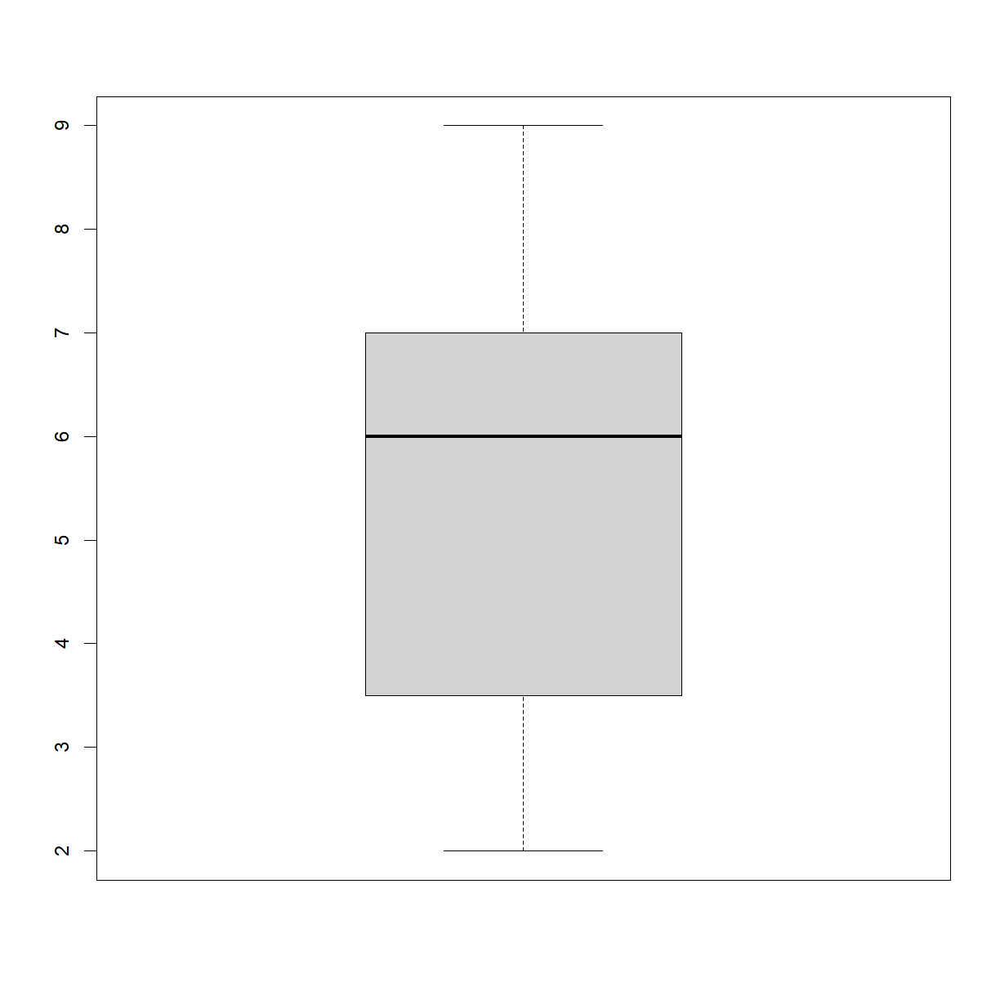
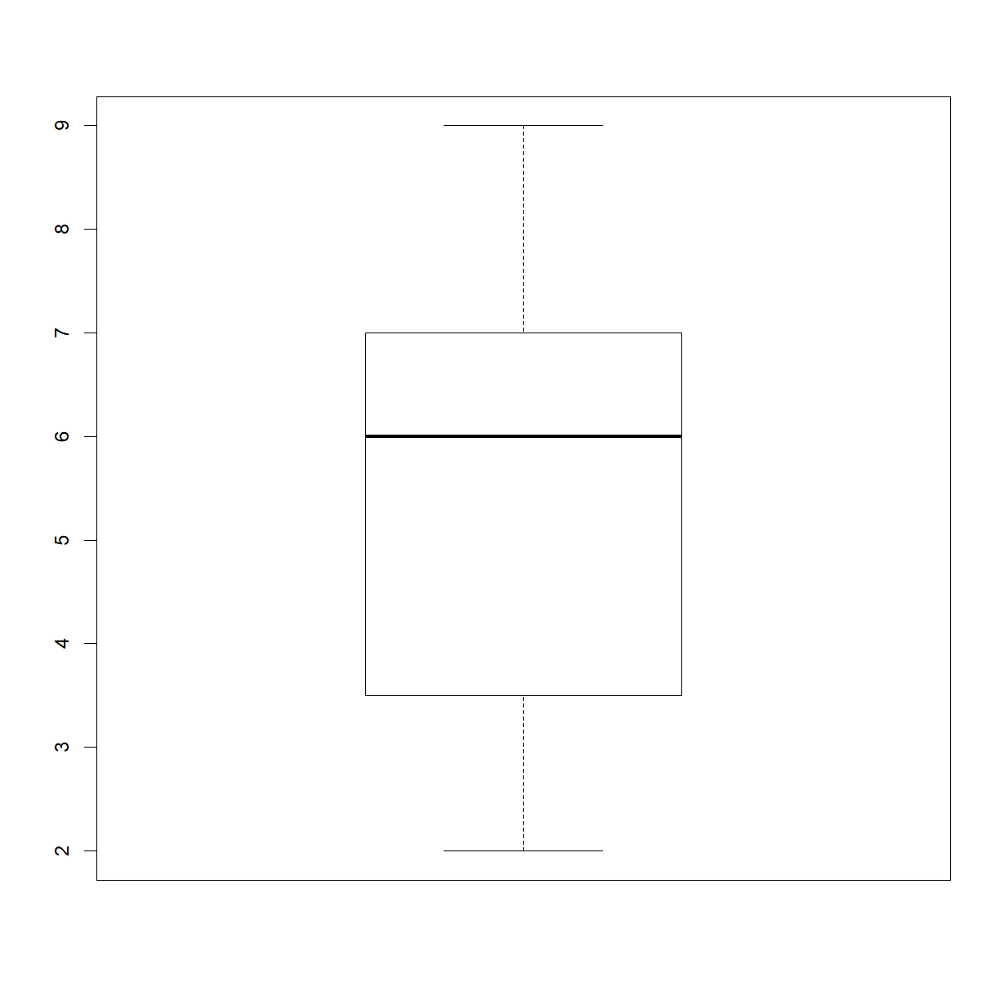
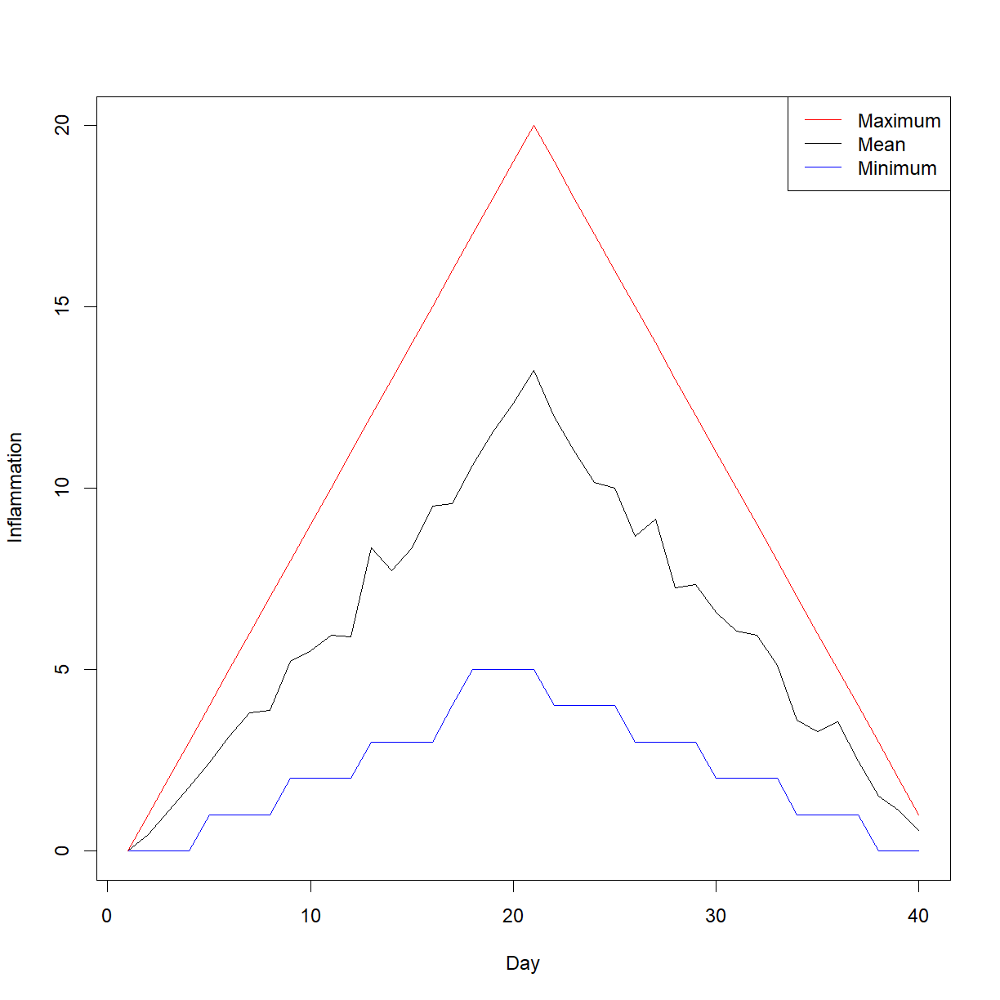

---
# Please do not edit this file directly; it is auto generated.
# Instead, please edit 05-class-decisions-loops.md in _episodes_rmd/
title: "Decision Making and Loops"
classdate: "9/9/2020 -- In Class"
teaching: 90
exercises: 30
questions:
- "How do I write code to make decisions about data?"
- "How do I use the same code to treat different data sets in different ways?"
- "How can I perform the same operations on multiple data sets or across multiple subsets of a single dataset?"
objectives:
- "Write conditional statements with `if` and `else`."
- "Correctly evaluate expressions containing `&&` ('and') and `||` ('or')."
- "Use a `for` loop to process multiple files."
- "Explain the basic process underlying what a `for` loop does."
- "Correctly write `for` loops to repeat simple calculations."
keypoints:
- "Use `if (condition)` to start a conditional statement, `else if (condition)` to provide additional tests, and `else` to provide a default alternative."
- "The bodies of conditional statements must be surrounded by curly braces `{ }`."
- "Use `==` to test for equality."
- "`X && Y` is only true if both X and Y are true."
- "`X || Y` is true if either X, Y, or both, are true."
- "Use `for (variable in collection)` to process the elements of a collection one at a time."
- "The body of a `for` loop is surrounded by curly braces (`{}`)."
source: Rmd
---

***
## In Class

Our previous lessons have shown us how to read and manipulate data, define our own functions, calculate basic statistics, and generate basic charts. However, the programs we have written so far always do the same things, regardless of what data they're given. We want programs to make choices based on the values they are manipulating.

### Making decisions with if and else

&nbsp;
#### Conditionals

In order to update our function to decide between saving or not, we need to write code that automatically decides between multiple options. The tool R gives us for doing this is called a [conditional statement]({{ page.root }}/reference.html#conditional-statement), and looks like this:

~~~
num <- 37
if (num > 100) {
  print("greater")
} else {
  print("not greater")
}
print("done")
~~~
{: .language-r}

~~~
[1] "not greater"
[1] "done"
~~~
{: .output}

&nbsp;

The second line of this code uses an `if` statement to tell R that we want to make a choice.
If the following test is true, the body of the `if` (i.e. the lines in the curly braces underneath it) are executed. If the test is false, the body of the `else` is executed instead. Only one or the other is ever executed:

In the example above, the test `num > 100` returns the value `FALSE`, which is why the code inside the `if` block was skipped and the code inside the `else` statement was run instead.

~~~
num > 100
~~~
{: .language-r}

~~~
[1] FALSE
~~~
{: .output}

&nbsp;

Conditional statements don't have to include an `else`. If there isn't one, R simply does nothing if the test is false:

~~~
num <- 53
if (num > 100) {
  print("num is greater than 100")
}
~~~
{: .language-r}

&nbsp;

We can also chain several tests together when there are more than two options.
This makes it simple to write a function that returns the sign of a number:

~~~
sign <- function(num) {
  if (num > 0) {
    return(1)
  } else if (num == 0) {
    return(0)
  } else {
    return(-1)
  }
}

sign(-3)
~~~
{: .language-r}

~~~
[1] -1
~~~
{: .output}

~~~
sign(0)
~~~
{: .language-r}

~~~
[1] 0
~~~
{: .output}

~~~
sign(2/3)
~~~
{: .language-r}

~~~
[1] 1
~~~
{: .output}

&nbsp;

Note that when combining `else` and `if` in an `else if` statement, the `if` portion still requires a direct input condition.  This is never the case for the `else` statement alone, which is only executed if all other conditions go unsatisfied. As a reminder, the test for equality uses two equal signs, `==`.

> ## Other Comparisons
>
> Other tests include greater than or equal to (`>=`), less than or equal to
> (`<=`), and not equal to (`!=`).
{: .callout}

&nbsp;

We can also combine tests. Two ampersands, `&&`, symbolize "and". Two vertical bars, `||`, symbolize "or".
`&&` is only true if both parts are true:

~~~
if (1 > 0 && -1 > 0) {
    print("both parts are true")
} else {
  print("at least one part is not true")
}
~~~
{: .language-r}

~~~
[1] "at least one part is not true"
~~~
{: .output}

&nbsp;

while `||` is true if either part is true:

~~~
if (1 > 0 || -1 > 0) {
    print("at least one part is true")
} else {
  print("neither part is true")
}
~~~
{: .language-r}

~~~
[1] "at least one part is true"
~~~
{: .output}

&nbsp;

In this case, "either" means "either or both", not "either one or the other but not both".

~~~
# Here we will use R's `ifelse` function, in which we provide the test phrase,
# the outcome if the result of the test is 'TRUE', and the outcome if the
# result is 'FALSE'. We will also assign the results to the Color column,
# using '<-'

# First - reload the data with a header
carSpeeds <- read.csv(file = 'data/car-speeds.csv')

carSpeeds$Color <- ifelse(carSpeeds$Color == 'Blue', 'Green', carSpeeds$Color)
carSpeeds$Color
~~~
{: .language-r}

~~~
  [1] "Green" " Red"  "Green" "White" "Red"   "Green" "Green" "Black" "White"
 [10] "Red"   "Red"   "White" "Green" "Green" "Black" "Red"   "Green" "Green"
 [19] "White" "Green" "Green" "Green" "Red"   "Green" "Red"   "Red"   "Red"  
 [28] "Red"   "White" "Green" "Red"   "White" "Black" "Red"   "Black" "Black"
 [37] "Green" "Red"   "Black" "Red"   "Black" "Black" "Red"   "Red"   "White"
 [46] "Black" "Green" "Red"   "Red"   "Black" "Black" "Red"   "White" "Red"  
 [55] "Green" "Green" "Black" "Green" "White" "Black" "Red"   "Green" "Green"
 [64] "White" "Black" "Red"   "Red"   "Black" "Green" "White" "Green" "Red"  
 [73] "White" "White" "Green" "Green" "Green" "Green" "Green" "White" "Black"
 [82] "Green" "White" "Black" "Black" "Red"   "Red"   "White" "White" "White"
 [91] "White" "Red"   "Red"   "Red"   "White" "Black" "White" "Black" "Black"
[100] "White"
~~~
{: .output}

&nbsp;
#### Exercises

> ## Choosing Plots Based on Data
>
> Write a function `plot_dist` that plots a boxplot if the length of the vector is
> greater than a specified threshold and a stripchart otherwise.
>
> To do this you'll use the R functions `boxplot` and `stripchart`.
>
>
>~~~
> dat <- read.csv("data/inflammation-01.csv", header = FALSE)
> plot_dist(dat[, 10], threshold = 10)     # day (column) 10
>~~~
>{: .language-r}
>
>
>
>~~~
> plot_dist(dat[1:5, 10], threshold = 10)  # samples (rows) 1-5 on day (column) 10
>~~~
>{: .language-r}
>
>
>
> > ## Solution
> > ~~~
> > plot_dist <- function(x, threshold) {
> >   if (length(x) > threshold) {
> >     boxplot(x)
> >   } else {
> >     stripchart(x, vert=T)
> >   }
> > }
> > ~~~
> > {: .language-r}
> {: .solution}
{: .challenge}

> ## Histograms Instead
>
> One of your collaborators prefers to see the distributions of the larger vectors
> as a histogram instead of as a boxplot. In order to choose between a histogram 
> and a boxplot we will edit the function `plot_dist` and add an additional argument 
> `use_boxplot`.  By default we will set `use_boxplot` to `TRUE` which will create a 
> boxplot when the vector is longer than `threshold`. 
> 
> When `use_boxplot` is set to `FALSE`, `plot_dist` will instead plot a histogram for 
> the larger vectors. As before, if the length of the vector is shorter than 
> `threshold`, `plot_dist` will create a stripchart. 
> 
> A histogram is made with the `hist` command in R.
>
> 
> ~~~
> dat <- read.csv("data/inflammation-01.csv", header = FALSE)
> plot_dist(dat[, 10], threshold = 10, use_boxplot = TRUE)   # day (column) 10 - create boxplot
> ~~~
> {: .language-r}
> 
> 
> 
> ~~~
> plot_dist(dat[, 10], threshold = 10, use_boxplot = FALSE)  # day (column) 10 - create histogram
> ~~~
> {: .language-r}
> 
> 
> 
> ~~~
> plot_dist(dat[1:5, 10], threshold = 10)                    # samples (rows) 1-5 on day (column) 10
> ~~~
> {: .language-r}
> 
> 
>
> > ## Solution
> > ~~~
> > plot_dist <- function(x, threshold, use_boxplot = TRUE) {
> >    if (length(x) > threshold && use_boxplot) {
> >        boxplot(x)
> >    } else if (length(x) > threshold && !use_boxplot) {
> >        hist(x)
> >    } else {
> >        stripchart(x, vert=T)
> >    }
> > }
> > ~~~
> > {: .language-r}
> {: .solution}
{: .challenge}

***
### Using **for** Loops to repeat simple tasks

Suppose we want to print each word in a sentence. One way is to use six `print` statements:

~~~
best_practice <- c("Let", "the", "computer", "do", "the", "work")

print_words <- function(sentence) {
  print(sentence[1])
  print(sentence[2])
  print(sentence[3])
  print(sentence[4])
  print(sentence[5])
  print(sentence[6])
}

print_words(best_practice)
~~~
{: .language-r}

~~~
[1] "Let"
[1] "the"
[1] "computer"
[1] "do"
[1] "the"
[1] "work"
~~~
{: .output}

&nbsp;

but that's a bad approach for two reasons:

 1. It doesn't scale: if we want to print the elements in a vector that's hundreds long, we'd be better off just typing them in.

 2. It's fragile: if we give it a longer vector, it only prints part of the data, and if we give it a shorter input, it returns `NA` values because we're asking for elements that don't exist!

~~~
best_practice[-6]
~~~
{: .language-r}

~~~
[1] "Let"      "the"      "computer" "do"       "the"     
~~~
{: .output}

~~~
print_words(best_practice[-6])
~~~
{: .language-r}

~~~
[1] "Let"
[1] "the"
[1] "computer"
[1] "do"
[1] "the"
[1] NA
~~~
{: .output}

&nbsp;

Here's a better approach:

~~~
print_words <- function(sentence) {
  for (word in sentence) {
    print(word)
  }
}

print_words(best_practice)
~~~
{: .language-r}

~~~
[1] "Let"
[1] "the"
[1] "computer"
[1] "do"
[1] "the"
[1] "work"
~~~
{: .output}

&nbsp;

This is shorter - certainly shorter than something that prints every character in a hundred-letter string - and more robust as well:

~~~
print_words(best_practice[-6])
~~~
{: .language-r}

~~~
[1] "Let"
[1] "the"
[1] "computer"
[1] "do"
[1] "the"
~~~
{: .output}

&nbsp;

The improved version of `print_words` uses a [for loop]({{ page.root }}/reference.html#for-loop) to repeat an operation---in this case, printing---once for each thing in a collection.

The general form of a loop is:

~~~
for (variable in collection) {
  do things with variable
}
~~~
{: .language-r}

&nbsp;

We can name the [loop variable]({{ page.root }}/reference.html#loop-variable) anything we like (with a few [restrictions](https://cran.r-project.org/doc/manuals/R-intro.html#R-commands_003b-case-sensitivity-etc), e.g. the name of the variable cannot start with a digit).
`in` is part of the `for` syntax.

Note that the condition (`variable in collection`) is enclosed in parentheses,
and the body of the loop is enclosed in curly braces `{ }`. For a single-line loop body, as here, the braces aren't needed, but it is good practice to include them as we did.

Here's another loop that repeatedly updates a variable and completes the same task as the `length()` function:

~~~
len <- 0
vowels <- c("a", "e", "i", "o", "u")
for (v in vowels) {
  len <- len + 1
}
# Number of vowels
len
~~~
{: .language-r}

~~~
[1] 5
~~~
{: .output}

&nbsp;

It's worth tracing the execution of this little program step by step:
 1. Since there are five elements in the vector `vowels`, the statement inside the loop will be executed five times.
 2. The first time around, `len` is zero (the value assigned to it on line 1) and `v` is `"a"`.
 3. The statement adds 1 to the old value of `len`, producing 1, and updates `len` to refer to that new value.
 4. The next time around, `v` is `"e"` and `len` is 1, so `len` is updated to be 2.
 5. After three more updates, `len` is 5; since there is nothing left in the vector `vowels` for R to process, the loop finishes.

Note that a loop variable is just a variable that's being used to record progress in a loop.
It still exists after the loop is over, and we can re-use variables previously defined as loop variables as well:

~~~
letter <- "z"
for (letter in c("a", "b", "c")) {
  print(letter)
}
~~~
{: .language-r}

~~~
[1] "a"
[1] "b"
[1] "c"
~~~
{: .output}

~~~
# after the loop, letter is:
letter
~~~
{: .language-r}

~~~
[1] "c"
~~~
{: .output}

&nbsp;

Note that `length()` is much faster than any R function we could write ourselves, and much easier to read than a two-line loop; it will also give us the length of many other things that we haven't met yet, so we should always use it when we can.

&nbsp;
#### Exercises

> ## Printing Numbers
>
> R has a built-in function called `seq()` that creates a list of numbers:
>
> 
> ~~~
> seq(3)
> ~~~
> {: .language-r}
> 
> 
> 
> ~~~
> [1] 1 2 3
> ~~~
> {: .output}
>
> Using `seq()`, write a function that prints the first **N** natural numbers, one per line:
>
> 
> ~~~
> print_N(3)
> ~~~
> {: .language-r}
> 
> 
> 
> ~~~
> [1] 1
> [1] 2
> [1] 3
> ~~~
> {: .output}
>
> > ## Solution
> > ~~~
> > print_N <- function(N) {
> >   nseq <- seq(N)
> >   for (num in nseq) {
> >     print(num)
> >   }
> > }
> > ~~~
> > {: .language-r}
> {: .solution}
{: .challenge}

> ## Summing Values
>
> Write a function called `total()` that calculates the sum of the values in a vector.
> 
> Yes, R has a built-in function called `sum()` that does this for you. Please don't
> use it for this exercise. The goal is to understand how this type of function might 
> work under the surface.
> 
> 
> ~~~
> ex_vec <- c(4, 8, 15, 16, 23, 42)
> total(ex_vec)
> ~~~
> {: .language-r}
> 
> 
> 
> ~~~
> [1] 108
> ~~~
> {: .output}
>
> > ## Solution
> > ~~~
> > total <- function(vec) {
> >   # calculates the sum of the values in a vector
> >   vec_sum <- 0
> >   for (num in vec) {
> >     vec_sum <- vec_sum + num
> >   }
> >   return(vec_sum)
> > }
> > ~~~
> > {: .language-r}
> {: .solution}
{: .challenge}

> ## Exponentiation
>
> Exponentiation is built into R:
>
> 
> ~~~
> 2^4
> ~~~
> {: .language-r}
> 
> 
> 
> ~~~
> [1] 16
> ~~~
> {: .output}
> Write a function called `expo()` that uses a loop to calculate the same result without
> using the `^` operator.
>
> 
> ~~~
> expo(2, 4)
> ~~~
> {: .language-r}
> 
> 
> 
> ~~~
> [1] 16
> ~~~
> {: .output}
>
> > ## Solution
> > ~~~
> > expo <- function(base, power) {
> >   result <- 1
> >   for (i in seq(power)) {
> >     result <- result * base
> >   }
> >   return(result)
> > }
> > ~~~
> > {: .language-r}
> {: .solution}
{: .challenge}

***
### Using `for` loops to process multiple files

In many real world data sets, you will want to process a series of files that contain data in the same format using the same set of analysis steps. `for` loops are a useful tool for this purpose. 

In the *data* folder we have a series of files containing information about inflammation. These files give data on patients treated with a new drug for arthritis. Each file contains a series of patients (in rows) with a series of inflammation measurements on subsequent days (in columns). Each file contains information from the same set of patients on different rounds of treatment. We looked at the first file in this series previously. Let's read in the file to recall the data format:

~~~
inflam1 <- read.csv("data/inflammation-01.csv", header=F)
head(inflam1)
~~~
{: .language-r}

~~~
  V1 V2 V3 V4 V5 V6 V7 V8 V9 V10 V11 V12 V13 V14 V15 V16 V17 V18 V19 V20 V21
1  0  0  1  3  1  2  4  7  8   3   3   3  10   5   7   4   7   7  12  18   6
2  0  1  2  1  2  1  3  2  2   6  10  11   5   9   4   4   7  16   8   6  18
3  0  1  1  3  3  2  6  2  5   9   5   7   4   5   4  15   5  11   9  10  19
4  0  0  2  0  4  2  2  1  6   7  10   7   9  13   8   8  15  10  10   7  17
5  0  1  1  3  3  1  3  5  2   4   4   7   6   5   3  10   8  10   6  17   9
6  0  0  1  2  2  4  2  1  6   4   7   6   6   9   9  15   4  16  18  12  12
  V22 V23 V24 V25 V26 V27 V28 V29 V30 V31 V32 V33 V34 V35 V36 V37 V38 V39 V40
1  13  11  11   7   7   4   6   8   8   4   4   5   7   3   4   2   3   0   0
2   4  12   5  12   7  11   5  11   3   3   5   4   4   5   5   1   1   0   1
3  14  12  17   7  12  11   7   4   2  10   5   4   2   2   3   2   2   1   1
4   4   4   7   6  15   6   4   9  11   3   5   6   3   3   4   2   3   2   1
5  14   9   7  13   9  12   6   7   7   9   6   3   2   2   4   2   0   1   1
6   5  18   9   5   3  10   3  12   7   8   4   7   3   5   4   4   3   2   1
~~~
{: .output}

&nbsp;

To begin, let's calculate and plot the minimum, maximum, and mean inflamation across patients for each day:

~~~
# use apply to calculate min, max, and mean inflammation for each day
# and save them to variables
avg_day_inflam <- apply(inflam1, 2, mean)
max_day_inflam <- apply(inflam1, 2, max)
min_day_inflam <- apply(inflam1, 2, min)

# ------------------------------------------------------------------------
# Plot min, max, and mean on the same chart (using different line colors)

# First we need to grab the overall maximum and minimum values in our data
# set to be sure we make the plot window big enough
y_min <- min(inflam1)
y_max <- max(inflam1)

# first initiat the plot with "min" data
plot(min_day_inflam, # plot minimum first
     type = "l", col = "blue", # plot the minimum in blue
     xlab = "Day", ylab = "Inflammation", # axis labels
     ylim = c(y_min, y_max)) # define plot limits

# use the lines() funciton to add max and mean to the current plot
lines(avg_day_inflam, # plot mean second
      col = "black") # draw mean in black
lines(max_day_inflam, # plot maximum second
      col = "red") # draw maximum in red

# add a legend
legend(x = "topright", # place the legend in the empty space in the upper right corner
       lty = 1, # this tells R to make lines, rather than symbols
       legend = c("Maximum", "Mean", "Minimum"), # order the labels
       col = c("red","black","blue")) # define the colors in the label order
~~~
{: .language-r}

&nbsp;

Okay, so the chart looks good, but something appears to be strange with the data. The maximum measurement across patients appears to increase exactly linearly up to day 20, then decline exactly linearly thereafter. The minimum value looks to stair-step up to day 20, then stair-step down thereafter. 

Does this happen with all the files? Let's write a script to run the above analysis on all files and save the resulting report to a PDF file. For this, we can use our `for` loop capability to carry out the following steps:
1. Identify a list of files with a similar naming pattern.
2. Initiate a PDF file for capturing the output plots.
3. Set up a `for` loop to process each file in the list.
4. For each file, complete the following steps:
 a. Calculate minimum, mean, and maximum across patients for each day.
 b. Generate a plot of minimum, mean, and maximum inflammation across the time course for each file.
5. Finalize the PDF file with `dev.off()`.

The first point requires that we have some way to recognize patterns in file names. This can be accomplished with the `list.files()` function, which we looked at briefly in an earlier lesson. 

~~~
?list.files
~~~
{: .language-r}

&nbsp;

We can use the `pattern` argument to specify a search pattern using [regular expressions](https://www.aivosto.com/articles/regex.html), which is a systematic language for searching strings of text. For, example, we can use the `pattern` argument to look for all files containing "csv":

~~~
list.files(path = "data", pattern = "csv")
~~~
{: .language-r}

~~~
 [1] "car-speeds-cleaned.csv"     "car-speeds.csv"            
 [3] "combined-inflammation.csv"  "inflammation-01.csv"       
 [5] "inflammation-02.csv"        "inflammation-03.csv"       
 [7] "inflammation-04.csv"        "inflammation-05.csv"       
 [9] "inflammation-06.csv"        "inflammation-07.csv"       
[11] "inflammation-08.csv"        "inflammation-09.csv"       
[13] "inflammation-10.csv"        "inflammation-11.csv"       
[15] "inflammation-12.csv"        "Nadeau2_table.csv"         
[17] "sample-gendercorrected.csv" "sample-noquotes.csv"       
[19] "sample.csv"                 "small-01.csv"              
[21] "small-02.csv"               "small-03.csv"              
~~~
{: .output}

&nbsp;

or "inflammation":

~~~
list.files(path = "data", pattern = "inflammation")
~~~
{: .language-r}

~~~
 [1] "combined-inflammation.csv" "inflammation-01.csv"      
 [3] "inflammation-02.csv"       "inflammation-03.csv"      
 [5] "inflammation-04.csv"       "inflammation-05.csv"      
 [7] "inflammation-06.csv"       "inflammation-07.csv"      
 [9] "inflammation-08.csv"       "inflammation-09.csv"      
[11] "inflammation-10.csv"       "inflammation-11.csv"      
[13] "inflammation-12.csv"      
~~~
{: .output}

&nbsp;

If we want to be more specific, the search string gets a bit more complicated. If we want to extract all examples from a list that start with "inflammation-" and end in ".csv", (but contain anything else in between), we can use the following:

~~~
inflam.files <- list.files(path = "data", 
                        pattern = "^inflammation-.*.csv$",
                        full.names = TRUE)
~~~
{: .language-r}

&nbsp;

For the `pattern` argument, we use several regular expression operators that tell R what to look for. The `^` indicates that this is where the file name begins. We are essentially saying "begins with *'inflammation'*". The `.*` is a wildcard (i.e. "anything can go here"). The `$` indicates the end of the file name. Now we have a way to pull just the "inflammation" file names out automatically and assign them to a variable, which we can use later.

Now that we have the last piece of the puzzle, we can build our loop.

~~~
# First, grab our file list using pattern matching
inflam.files <- list.files(path = "data", 
                        pattern = "^inflammation-.*.csv$",
                        full.names = TRUE)

# Initiate the PDF file to store the graphs
pdf(file = "results/inflammation-by-file.pdf",
    height = 5, width = 5)

# Start the for loop to cycle through the files
for(file.c in inflam.files) {
  # read in the current file
  inflam.c <- read.csv(file = file.c, header = FALSE)
  
  # calculate min, mean, and max values by day
  avg_day_inflam <- apply(inflam.c, 2, mean)
  max_day_inflam <- apply(inflam.c, 2, max)
  min_day_inflam <- apply(inflam.c, 2, min)
  
  # Plot min, max, and mean on the same chart for this day
  
  # look up max and min values for complete day to set plot size
  y_min <- min(inflam1)
  y_max <- max(inflam1)
  
  # first initiate the plot with "min" data
  plot(min_day_inflam, # plot minimum first
       type = "l", col = "blue", # plot the minimum in blue
       xlab = "Day", ylab = "Inflammation", # axis labels
       ylim = c(y_min, y_max)) # define plot limits
  
  # use the lines() function to add max and mean to the current plot
  lines(avg_day_inflam, # plot mean second
        col = "black") # draw mean in black
  lines(max_day_inflam, # plot maximum second
        col = "red") # draw maximum in red
  
  # add a legend
  legend(x = "topright", 
         lty = 1, # use lines of style 1 (solid)
         legend = c("Maximum", "Mean", "Minimum"), # order the labels
         col = c("red","black","blue")) # define colors in label order
}

# finalize the PDF file by turning off the graphics device
dev.off()
~~~
{: .language-r}

~~~
png 
  2 
~~~
{: .output}

> ## Organizing Larger Projects
>
> For larger projects, it is recommended to organize separate parts of the
> analysis into multiple subdirectories, e.g. one subdirectory for the raw data,
> one for the code, and one for the results like figures. We have done that here
> to some extent, putting all of our data files into the subdirectory "data".
> For more advice on this topic, you can read [A quick guide to organizing
> computational biology projects](http://www.ploscompbiol.org/article/info%3Adoi%2F10.1371%2Fjournal.pcbi.1000424) by William Stafford Noble.
{: .callout}

&nbsp;
#### `for` or `apply`?

A `for` loop is used to apply the same function calls to a collection of objects. R has a family of functions, the `apply` family, which can be used in much the same way.

You've already used one of the family, `apply`. The `apply` family members include:
 * `apply`  - apply over the margins of an array (e.g. the rows or columns of a matrix)
 * `lapply` - apply over an object and return list
 * `sapply` - apply over an object and return a simplified object (an array) if possible
 * `vapply` - similar to `sapply` but you specify the type of object returned by the iterations

Each of these has an argument `FUN` which takes a function to apply to each element of the object. Instead of looping over `filenames` and calling `analyze`, as you did earlier, you could `sapply` over `filenames` with `FUN = analyze`:

~~~
sapply(filenames, FUN = analyze)
~~~
{: .language-r}

Deciding whether to use `for` or one of the `apply` family is really personal preference. Using an `apply` family function forces to you encapsulate your operations as a function rather than separate calls with `for`. `for` loops are often more natural in some circumstances; for several related operations, a `for` loop will avoid you having to pass in a lot of extra arguments to your function.

&nbsp;
#### Loops in R Are Slow

You will probably hear this at some point if you keep using R, or see it in a forum. In point of fact, loops are not slow *if* you follow some golden rules:
 1. Don't use a loop when a vectorized alternative exists
 2. Don't grow objects (via `c`, `cbind`, etc) during the loop - R has to create a new object and copy across the information just to add a new element or row/column
 3. Instead, pre-allocate an object to hold the results and fill it in during the loop

As an example, we could 'll create a new function called `analyze` that will return the mean inflammation per day (column) of each file. We will start by breaking rule 2, and grow our output by adding new data to a growing dataframe using `cbind()`

~~~
analyze <- function(filenames) {
  for (f in seq_along(filenames)) {
    fdata <- read.csv(filenames[f], header = FALSE)
    res <- apply(fdata, 2, mean)
    
    # check if this is the first iteration
    if (f == 1) {
      # if so, the current result is the only line of output
      out <- res
    } else {
      # If this is not the first iteration, add the result to the
      # established result as a new column
      out <- cbind(out, res)
    }
  }
  return(out)
}
~~~
{: .language-r}

&nbsp;

Note how we add a new column to `out` at each iteration? This is a cardinal sin of writing a `for` loop in R.

Instead, we can create an empty matrix with the right dimensions (rows/columns) to hold the results. Then we loop over the files but this time we fill in the `f`th column of our results matrix `out`. This time there is no copying/growing for R to deal with.

~~~
analyze2 <- function(filenames) {
  # pre-allocate the right number of rows and columns for the data
  out <- matrix(ncol = length(filenames), nrow = 40) 
  
  # run the for loop to cycle through the files
  for (f in seq_along(filenames)) {
    # read the current file 
    fdata <- read.csv(filenames[f], header = FALSE)
    
    # instead of using cbind, now we just overwrite the row of 
    # the pre-allocated matrix
    out[, f] <- apply(fdata, 2, mean)
  }
  return(out)
}
~~~
{: .language-r}

&nbsp;

Now we can use the function `system.time()` to find out how long it takes to run each of these functions:

~~~
gc() # clean things up first
~~~
{: .language-r}

~~~
         used (Mb) gc trigger (Mb) max used (Mb)
Ncells 512694 27.4    1145560 61.2   666091 35.6
Vcells 991929  7.6    8388608 64.0  1632380 12.5
~~~
{: .output}

~~~
system.time(avg <- analyze(inflam.files))
~~~
{: .language-r}

~~~
   user  system elapsed 
   0.02    0.00    0.01 
~~~
{: .output}

~~~
system.time(avg <- analyze2(inflam.files))
~~~
{: .language-r}

~~~
   user  system elapsed 
   0.02    0.00    0.02 
~~~
{: .output}

&nbsp;

In this simple example there is little difference in the compute time of `analyze` and `analyze2`. This is because we are only iterating over 12 files and hence we only incur 12 copy/grow operations. If we were doing this over more files or the data objects we were growing were larger, the penalty for copying/growing would be much larger. This demonstrates how to evaluate efficiency when it starts to matter.

Note that `apply` handles these memory allocation issues for you, but then you have to write the loop part as a function to pass to `apply`.
At its heart, `apply` is just a `for` loop with extra convenience.

***
### Exercises

> ## Find the Maximum Inflammation Score
>
> Find the file containing the patient with the highest average inflammation score. Print the file name, the patient number (row number) and the value of the maximum average inflammation score.
>
> Tips:
>
> 1. Use variables to store the maximum average and update it as you go through files and patients.
> 1. You can use nested loops (one loop is inside the other) to go through the files as well as through the patients in each file (every row).
>
> Complete the code below:
>
> 
> ~~~
> filenames <- list.files(path = "data", pattern = "^inflammation-.*.csv$", full.names = TRUE)
> filename_max <- "" # filename where the maximum average inflammation patient is found
> patient_max <- 0 # index (row number) for this patient in this file
> average_inf_max <- 0 # value of the average inflammation score for this patient
> for (f in filenames) {
>   dat <- read.csv(file = f, header = FALSE)
>   dat.means <- apply(dat, 1, mean)
>   for (patient_index in 1:length(dat.means)){
>     patient_average_inf <- dat.means[patient_index]
>     # Add your code here ...
>   }
> }
> print(filename_max)
> print(patient_max)
> print(average_inf_max)
> ~~~
> {: .language-r}
>
> > ## Solution
> > ~~~
> > # Add your code here ...
> > if (patient_average_inf > average_inf_max) {
> >   average_inf_max <- patient_average_inf
> >   filename_max <- f
> >   patient_max <- patient_index
> > }
> > ~~~
> > {: .language-r}
> {: .solution}
{: .challenge}

> ## Comparing inflammation across trials
> 
> We want to compare how inflammation for an individual patient changes across
> trials. Write a script that plots inflammation for the first patient from each trial
> (i.e. from each file) in the same line graph.
> 
> > ## Solution
> > 
> > 
> > ~~~
> > # Indicate the patient (aka row) number that we want to extract
> > patient.id <- 1
> > 
> > # First, grab our file list using pattern matching
> > inflam.files <- list.files(path = "data", 
> >                         pattern = "^inflammation-.*.csv$",
> >                         full.names = TRUE)
> > 
> > # We can't just plot away, because we don't know the minimum and maximum values.
> > # First, we should cycle through the files and collect the data we need into
> > # a data frame
> > 
> > # Initialize matrix for data collection (numeric matrix with a row for each file
> > # and 40 columns for number of days)
> > trial.data <- matrix(nrow = length(inflam.files), ncol = 40)
> > 
> > # Start the for loop to cycle through the files
> > for(i.file in 1:length(inflam.files)) { # this time we use a numeric index
> >   # grab file name
> >   file.c <- inflam.files[i.file]
> >   
> >   # read in the current file
> >   inflam.c <- read.csv(file = file.c, header = FALSE)
> >   
> >   # assign selected patient to collection file row
> >   trial.data[i.file,] <- as.numeric(inflam.c[patient.id,])
> > }
> > 
> > # Initiate the PDF file to store the graphs
> > pdf(file = paste0("results/inflammation-patient",patient.id,"-by-trial.pdf"),
> >     height = 5, width = 5)
> > 
> > # look up max and min values for complete day to set plot size
> > y_min <- min(trial.data)
> > y_max <- max(trial.data)
> > 
> > # first initiat the plot with no data, but define the size and labels
> > plot(NA, # plot minimum first
> >      xlab = "Day", ylab = "Inflammation", # axis labels
> >      xlim = c(1,40), ylim = c(y_min, y_max)) # define plot limits
> > 
> > # select colors with the rainbow() function
> > col.list <- rainbow(length(inflam.files))
> > 
> > # now that we have the plot limits set, use another for loop to cycle through > > # and plot each trials inflammation
> > for(i.plot in 1:dim(trial.data)[1]) { # index down the number of rows
> >   lines(trial.data[i.plot,], # plot current trial
> >       col = col.list[i.plot]) # choose current color in list
> > }
> > 
> > # finalize the PDF file by turning off the graphics device
> > dev.off()
> > ~~~
> > {: .language-r}
> > 
> > 
> > 
> > ~~~
> > png 
> >   2 
> > ~~~
> > {: .output}
> > 
> > As code becomes more complex, the ways to achieve a given solution multiply. This
> > is just one solution of many possibilities.
> {: .solution}
{: .challenge}

> ## Gathering data
> 
> There is interest in examining the inflammation data in a more complete analysis.
> To examine effects of treatments across trials, we first need to collect our data
> into a single file. 
> 
> Gather all of the data from the various inflammation files into a single data frame
> with the appropriate labels indicating where each data point originated. Make sure
> that your script is robust enough to run on any number of inflammation data files.
>
> > ## Solution
> > 
> > 
> > 
> > ~~~
> > # First, grab our file list using pattern matching
> > inflam.files <- list.files(path = "data", 
> >                        pattern = "^inflammation-.*.csv$",
> >                        full.names = TRUE)
> > 
> > # Start the for loop to cycle through the files
> > for(i.file in 1:length(inflam.files)) { # this time we use a numeric index
> >   # grab file name
> >   file.c <- inflam.files[i.file]
> >   
> >   # read in the current file
> >   inflam.c <- read.csv(file = file.c, header = FALSE)
> >   
> >   # name the columns
> >   names(inflam.c) <- paste0("Inflammation.D",1:40)
> >   
> >   # add columns for Patient ID and Trial ID
> >   inflam.c <- cbind(Patient.ID = 1:60, Trial.ID = i.file, inflam.c)
> >   
> >   # if this is the first iteration, the combined file is the same as the current file
> >   if(i.file == 1) {
> >     inflam.combined <- inflam.c
> >   
> >   # otherwise, add the rows of inflam.c to the growing combined data frame
> >   } else {
> >     inflam.combined <- rbind(inflam.combined, inflam.c)
> >   }
> > }
> > 
> > # save file
> > write.csv(inflam.combined, file = "data/combined-inflammation.csv",
> >           quote = FALSE, row.names = FALSE)
> > ~~~
> > {: .language-r}
> > 
> > Is there a more efficient way to do this?
> {: .solution}
{: .challenge}

***


