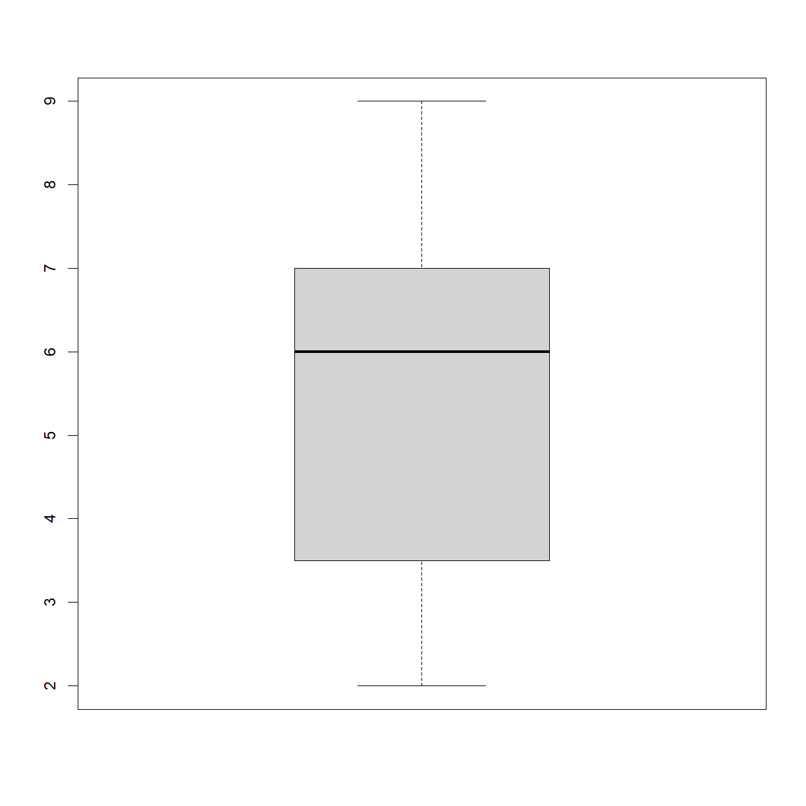

---
# Please do not edit this file directly; it is auto generated.
# Instead, please edit 05-oyo-more-decisions-loops.md in _episodes_rmd/
title: "Decision Making and Loops -- Additional Detail"
classdate: "9/9/2020 -- On Your Own"
teaching: 90
exercises: 30
questions:
- "What operators and functions are available for running test in `if` statements?"
- "Are there different indexing strategies for different situations using a `for` loop?"
- "Should I use a loop or an `apply` statement?"
objectives:
- "Know the bredth of options for running test (aka asking questions) in `if` statements."
- "Practice applying `if` statements in different situations."
- "Understand how R interprets simple operations (e.g. addition) when applied to data vectors."
- "Use either the elements or the position in a vector as the primary index in a `for` loop."
- "Trace changes to a loop variable as the loop runs."
- "Trace changes to other variables as they are updated by a `for` loop."
- "Understand the advanatages and disadvantages to using apply functions vs. for loops."
- "Practice applying `for` loops in different situations."
keypoints:
- "There are a number of ways to use logical operators, relational operators, and various functions to ask complex and specific questions in the form of `if` statements."
- "Two commone ways to index the **loop variable** in `for` loops are to use the form `for(variable in collection)` to pull the elements (\"variable\") from a vector (\"collection\") one at at time, or to use the form `for(i in 1:length(collection))` or `for(i in seq_along(collection))` to instead pull each index (i.e. location) in a vector one at a time."
- "Use functions such as `apply` instead of `for` loops to conduct repeated operates on values contained within defined subsets of a data structure."
- "Use `list.files(path = \"path\", pattern = \"pattern\", full.names = TRUE)` to create a list of files whose names match a pattern."
source: Rmd
---

###  On Your Own

#### Conditional statements -- additional detail

We covered the basics of using `if` and `else` statement *In Class*. These make up a central tool in coding. There are a lot of ways to write the logical tests in `if` statements to ask specific and complex questions about your data and metadata. Here is a useful reference to help keep the options straight:

> ## Common operators and functions used in `if` statments
> 
> Conditional tests can be as complicated as you need them to be. Here is
> set of operators and functions commonly used in `if` statement tests:
> 
> Relational operators:
> * `<` = less than
> * `>` = greater than
> * `<=` = less than or equal to
> * `>=` = greater than or equal to
> * `==` = exactly equal to
> * `!=` = not equal to
> * `%in%` = is present in (used to ask if the value(s) on the left is present in the vector/matrix on the right)
> 
> Logical operators:
> * `!` = **NOT** (changes `TRUE` to `FALSE` and vice versa)
> * `&` = element-wise **AND** (both are true; outputs vector for vector input comparing elements)
> * `&&` = logical **AND** (both are true; only considers first element of a vector)
> * `|` = element-wise **OR** (one or both are true; outputs vector for vector input comparing elements)
> * `||` = logical **OR** (both are true; only considers first index of a vector)
> * `xor(x,y)` = element-wise exclusive **OR** (either are true, but not both; outputs vector for vector input comparing elements)
> 
> Functions:
> * `all()` = are all entries `TRUE`?
> * `any()` = is at least one element `TRUE`?
> * `is.na()` = is the input value `NA`?
> * `is.<data type>()` = does the input object belong to class `<data type>`?
> * `is.finite()` = is the input value finite?
> * `is.infinite()` = is the input value infinite?
{: .callout}

&nbsp;

Beyond that, the best way to learn how to use `if` statements effectively is to practice applying them to different situations. Below are a series of exercises to get you started.

&nbsp;
#### Exercises -- conditional statements

> ## Histograms Instead
>
> One of your collaborators prefers to see the distributions of larger 
> vectors as a histogram instead of as a boxplot. In order to choose 
> between a histogram and a boxplot we will edit the function `plot_dist()` > that we wrote *In Class* and add an additional argument `use_boxplot`.  
> By default we will set `use_boxplot` to `TRUE` which will create a 
> boxplot when the vector is longer than `threshold`. 
> 
> When `use_boxplot` is set to `FALSE`, `plot_dist()` will instead plot a 
> histogram for larger vectors. As before, if the length of the vector is 
> shorter than `threshold`, `plot_dist()` will create a stripchart 
> (allowing users to define what is meant by "larger"). 
> 
> A histogram is made with the `hist()` command in R. Here is how we want 
> `plot_dist()` to behave:
>
> 
> ~~~
> dat <- read.csv("data/inflammation-01.csv", header = FALSE)
> plot_dist(dat[, 10], threshold = 10, use_boxplot = TRUE)   # day (column) 10 - create boxplot
> ~~~
> {: .language-r}
> 
> 
> 
> ~~~
> plot_dist(dat[, 10], threshold = 10, use_boxplot = FALSE)  # day (column) 10 - create histogram
> ~~~
> {: .language-r}
> 
> 
> 
> ~~~
> plot_dist(dat[1:5, 10], threshold = 10)                    # samples (rows) 1-5 on day (column) 10
> ~~~
> {: .language-r}
> 
> 
>
> > ## Solution
> > ~~~
> > # Copy and paste the plot_dist() function from In Class
> > # and add "use_boxplot" as an argument with a default value of TRUE
> > plot_dist <- function(x, threshold, use_boxplot = TRUE) {
> >
> >    # if the vector is above threshold, use boxplot if requested
> >    if (length(x) > threshold && use_boxplot) {
> >        boxplot(x)
> >    
> >    # if a boxplot is not requested, use histogram instead
> >    } else if (length(x) > threshold && !use_boxplot) {
> >        hist(x)
> > 
> >    # if the vector is below the length threshold, use a stripchart
> >    } else {
> >        stripchart(x, vert=T)
> >    }
> > }
> > ~~~
> > {: .language-r}
> {: .solution}
{: .challenge}

&nbsp;

> ## Combining concepts -- segretating flowers by petal size
>
> In the `iris` dataset, we want to categorize each flower based on size. Copy
> the `iris` dataset:
> 
> 
> ~~~
> iris2 <- iris
> ~~~
> {: .language-r}
> 
> &nbsp;
>
> and add a column that indicates, represents a member of 
> it's species with "large" petals (`Petal.Length` > species average of 
> `Petal.Length`) or "small" petals (`Petal.Length` <= species average of 
> `Petal.Length`).
> 
> To accomplish this goal, you will need to write a script that accomplishes
> several steps that combine concepts from different lessons. Plan out the 
> necessary steps and how to accomplish each step with concepts covered so far. 
> Try to find answers to questions using forums or other online resources; 
> however, there are a few progressive hints below if you get really stuck. 
> 
> > ## Hint 1 -- Planning your script
> > 
> > One approach to this problem is to complete three steps:
> >  1. Calculate the average `Petal.Length` for each species and store the 
> > values in a searchable format (e.g. data frame with `Species` name in one 
> > column, average `Petal.Length in the other).
> >  2. Identify the correct average `Petal.Length` value for each flower based
> > based on it's species.
> >  3. Compare the `Petal.Length` for each flower to the corresponding average 
> > species `Petal.Length` and output eitehr "large" or "small".
> {: .solution}
> 
> > ## Hint 2
> >
> > The `aggregate()` function is useful for completing basic function calls 
> > (e.g. `mean()`)across different subsets of a dataset.
> {: .solution}
> 
> > ## Hint 3
> >
> > The `match()` function allows you to take a vector of values, and look up
> > the position in a second vector that matches each element of the first.
> > The output can be used to index the second list (or another of the same 
> > length) to return corresponding values.
> {: .solution}
> 
> > ## Hint 4
> >
> > The `ifelse()` function is a vectorized version of an `if` and `else` 
> > statement that allows you to return one of two values based on a relational > > comparison that returns a logical statement.
> {: .solution}
>
> > ## Solution
> > 
> > The first step is to calculate the average `Petal.Length` for each species.
> > An efficient way to do this is to use the `aggregate()` function:
> > 
> > 
> > ~~~
> > petal.length.means <- aggregate(Petal.Length~Species, data=iris2, FUN=mean)
> > petal.length.means
> > ~~~
> > {: .language-r}
> > 
> > 
> > 
> > ~~~
> >      Species Petal.Length
> > 1     setosa        1.462
> > 2 versicolor        4.260
> > 3  virginica        5.552
> > ~~~
> > {: .output}
> > 
> > &nbsp; 
> > 
> > The second step is to determine which of these mean values is the correct 
> > one to use for comparison for each flower (i.e. which species does the 
> > flower belong to). To do this, we can create a vector that contains the 
> > correct mean comparison value for each flower in the `iris` data frame. The 
> > `match()` function allows us to look up the mean value in the 
> > `petal.length.means` data frame based on the `Species` for each flower in 
> > the `iris` data frame:
> > 
> > 
> > ~~~
> > # first look up the index
> > species.index <- match(iris$Species,petal.length.means$Species)
> > species.index
> > ~~~
> > {: .language-r}
> > 
> > 
> > 
> > ~~~
> >   [1] 1 1 1 1 1 1 1 1 1 1 1 1 1 1 1 1 1 1 1 1 1 1 1 1 1 1 1 1 1 1 1 1 1 1 1 1 1
> >  [38] 1 1 1 1 1 1 1 1 1 1 1 1 1 2 2 2 2 2 2 2 2 2 2 2 2 2 2 2 2 2 2 2 2 2 2 2 2
> >  [75] 2 2 2 2 2 2 2 2 2 2 2 2 2 2 2 2 2 2 2 2 2 2 2 2 2 2 3 3 3 3 3 3 3 3 3 3 3
> > [112] 3 3 3 3 3 3 3 3 3 3 3 3 3 3 3 3 3 3 3 3 3 3 3 3 3 3 3 3 3 3 3 3 3 3 3 3 3
> > [149] 3 3
> > ~~~
> > {: .output}
> > 
> > 
> > 
> > ~~~
> > # and use it to pull the mean value
> > mean.comparison <- petal.length.means$Petal.Length[species.index]
> > mean.comparison
> > ~~~
> > {: .language-r}
> > 
> > 
> > 
> > ~~~
> >   [1] 1.462 1.462 1.462 1.462 1.462 1.462 1.462 1.462 1.462 1.462 1.462 1.462
> >  [13] 1.462 1.462 1.462 1.462 1.462 1.462 1.462 1.462 1.462 1.462 1.462 1.462
> >  [25] 1.462 1.462 1.462 1.462 1.462 1.462 1.462 1.462 1.462 1.462 1.462 1.462
> >  [37] 1.462 1.462 1.462 1.462 1.462 1.462 1.462 1.462 1.462 1.462 1.462 1.462
> >  [49] 1.462 1.462 4.260 4.260 4.260 4.260 4.260 4.260 4.260 4.260 4.260 4.260
> >  [61] 4.260 4.260 4.260 4.260 4.260 4.260 4.260 4.260 4.260 4.260 4.260 4.260
> >  [73] 4.260 4.260 4.260 4.260 4.260 4.260 4.260 4.260 4.260 4.260 4.260 4.260
> >  [85] 4.260 4.260 4.260 4.260 4.260 4.260 4.260 4.260 4.260 4.260 4.260 4.260
> >  [97] 4.260 4.260 4.260 4.260 5.552 5.552 5.552 5.552 5.552 5.552 5.552 5.552
> > [109] 5.552 5.552 5.552 5.552 5.552 5.552 5.552 5.552 5.552 5.552 5.552 5.552
> > [121] 5.552 5.552 5.552 5.552 5.552 5.552 5.552 5.552 5.552 5.552 5.552 5.552
> > [133] 5.552 5.552 5.552 5.552 5.552 5.552 5.552 5.552 5.552 5.552 5.552 5.552
> > [145] 5.552 5.552 5.552 5.552 5.552 5.552
> > ~~~
> > {: .output}
> > 
> > 
> > 
> > ~~~
> > # this can all be done in one step:
> > mean.comparison <- petal.length.means$Petal.Length[match(iris$Species,petal.length.means$Species)]
> > ~~~
> > {: .language-r}
> > 
> > &nbsp;
> > 
> > Finally, we use the vector of mean values to compare each flower's 
> > `Petal.Length` to the species average `Petal.Length` using `ifelse()` and 
> > assign "large" if the flower is larger or "small" if not.
> > 
> > 
> > ~~~
> > iris2$Species.Petal.Group <- ifelse(iris2$Petal.Length > mean.comparison, 
> > "large", "small")
> > iris2
> > ~~~
> > {: .language-r}
> > 
> > 
> > 
> > ~~~
> >     Sepal.Length Sepal.Width Petal.Length Petal.Width    Species
> > 1            5.1         3.5          1.4         0.2     setosa
> > 2            4.9         3.0          1.4         0.2     setosa
> > 3            4.7         3.2          1.3         0.2     setosa
> > 4            4.6         3.1          1.5         0.2     setosa
> > 5            5.0         3.6          1.4         0.2     setosa
> > 6            5.4         3.9          1.7         0.4     setosa
> > 7            4.6         3.4          1.4         0.3     setosa
> > 8            5.0         3.4          1.5         0.2     setosa
> > 9            4.4         2.9          1.4         0.2     setosa
> > 10           4.9         3.1          1.5         0.1     setosa
> > 11           5.4         3.7          1.5         0.2     setosa
> > 12           4.8         3.4          1.6         0.2     setosa
> > 13           4.8         3.0          1.4         0.1     setosa
> > 14           4.3         3.0          1.1         0.1     setosa
> > 15           5.8         4.0          1.2         0.2     setosa
> > 16           5.7         4.4          1.5         0.4     setosa
> > 17           5.4         3.9          1.3         0.4     setosa
> > 18           5.1         3.5          1.4         0.3     setosa
> > 19           5.7         3.8          1.7         0.3     setosa
> > 20           5.1         3.8          1.5         0.3     setosa
> > 21           5.4         3.4          1.7         0.2     setosa
> > 22           5.1         3.7          1.5         0.4     setosa
> > 23           4.6         3.6          1.0         0.2     setosa
> > 24           5.1         3.3          1.7         0.5     setosa
> > 25           4.8         3.4          1.9         0.2     setosa
> > 26           5.0         3.0          1.6         0.2     setosa
> > 27           5.0         3.4          1.6         0.4     setosa
> > 28           5.2         3.5          1.5         0.2     setosa
> > 29           5.2         3.4          1.4         0.2     setosa
> > 30           4.7         3.2          1.6         0.2     setosa
> > 31           4.8         3.1          1.6         0.2     setosa
> > 32           5.4         3.4          1.5         0.4     setosa
> > 33           5.2         4.1          1.5         0.1     setosa
> > 34           5.5         4.2          1.4         0.2     setosa
> > 35           4.9         3.1          1.5         0.2     setosa
> > 36           5.0         3.2          1.2         0.2     setosa
> > 37           5.5         3.5          1.3         0.2     setosa
> > 38           4.9         3.6          1.4         0.1     setosa
> > 39           4.4         3.0          1.3         0.2     setosa
> > 40           5.1         3.4          1.5         0.2     setosa
> > 41           5.0         3.5          1.3         0.3     setosa
> > 42           4.5         2.3          1.3         0.3     setosa
> > 43           4.4         3.2          1.3         0.2     setosa
> > 44           5.0         3.5          1.6         0.6     setosa
> > 45           5.1         3.8          1.9         0.4     setosa
> > 46           4.8         3.0          1.4         0.3     setosa
> > 47           5.1         3.8          1.6         0.2     setosa
> > 48           4.6         3.2          1.4         0.2     setosa
> > 49           5.3         3.7          1.5         0.2     setosa
> > 50           5.0         3.3          1.4         0.2     setosa
> > 51           7.0         3.2          4.7         1.4 versicolor
> > 52           6.4         3.2          4.5         1.5 versicolor
> > 53           6.9         3.1          4.9         1.5 versicolor
> > 54           5.5         2.3          4.0         1.3 versicolor
> > 55           6.5         2.8          4.6         1.5 versicolor
> > 56           5.7         2.8          4.5         1.3 versicolor
> > 57           6.3         3.3          4.7         1.6 versicolor
> > 58           4.9         2.4          3.3         1.0 versicolor
> > 59           6.6         2.9          4.6         1.3 versicolor
> > 60           5.2         2.7          3.9         1.4 versicolor
> > 61           5.0         2.0          3.5         1.0 versicolor
> > 62           5.9         3.0          4.2         1.5 versicolor
> > 63           6.0         2.2          4.0         1.0 versicolor
> > 64           6.1         2.9          4.7         1.4 versicolor
> > 65           5.6         2.9          3.6         1.3 versicolor
> > 66           6.7         3.1          4.4         1.4 versicolor
> > 67           5.6         3.0          4.5         1.5 versicolor
> > 68           5.8         2.7          4.1         1.0 versicolor
> > 69           6.2         2.2          4.5         1.5 versicolor
> > 70           5.6         2.5          3.9         1.1 versicolor
> > 71           5.9         3.2          4.8         1.8 versicolor
> > 72           6.1         2.8          4.0         1.3 versicolor
> > 73           6.3         2.5          4.9         1.5 versicolor
> > 74           6.1         2.8          4.7         1.2 versicolor
> > 75           6.4         2.9          4.3         1.3 versicolor
> > 76           6.6         3.0          4.4         1.4 versicolor
> > 77           6.8         2.8          4.8         1.4 versicolor
> > 78           6.7         3.0          5.0         1.7 versicolor
> > 79           6.0         2.9          4.5         1.5 versicolor
> > 80           5.7         2.6          3.5         1.0 versicolor
> > 81           5.5         2.4          3.8         1.1 versicolor
> > 82           5.5         2.4          3.7         1.0 versicolor
> > 83           5.8         2.7          3.9         1.2 versicolor
> > 84           6.0         2.7          5.1         1.6 versicolor
> > 85           5.4         3.0          4.5         1.5 versicolor
> > 86           6.0         3.4          4.5         1.6 versicolor
> > 87           6.7         3.1          4.7         1.5 versicolor
> > 88           6.3         2.3          4.4         1.3 versicolor
> > 89           5.6         3.0          4.1         1.3 versicolor
> > 90           5.5         2.5          4.0         1.3 versicolor
> > 91           5.5         2.6          4.4         1.2 versicolor
> > 92           6.1         3.0          4.6         1.4 versicolor
> > 93           5.8         2.6          4.0         1.2 versicolor
> > 94           5.0         2.3          3.3         1.0 versicolor
> > 95           5.6         2.7          4.2         1.3 versicolor
> > 96           5.7         3.0          4.2         1.2 versicolor
> > 97           5.7         2.9          4.2         1.3 versicolor
> > 98           6.2         2.9          4.3         1.3 versicolor
> > 99           5.1         2.5          3.0         1.1 versicolor
> > 100          5.7         2.8          4.1         1.3 versicolor
> > 101          6.3         3.3          6.0         2.5  virginica
> > 102          5.8         2.7          5.1         1.9  virginica
> > 103          7.1         3.0          5.9         2.1  virginica
> > 104          6.3         2.9          5.6         1.8  virginica
> > 105          6.5         3.0          5.8         2.2  virginica
> > 106          7.6         3.0          6.6         2.1  virginica
> > 107          4.9         2.5          4.5         1.7  virginica
> > 108          7.3         2.9          6.3         1.8  virginica
> > 109          6.7         2.5          5.8         1.8  virginica
> > 110          7.2         3.6          6.1         2.5  virginica
> > 111          6.5         3.2          5.1         2.0  virginica
> > 112          6.4         2.7          5.3         1.9  virginica
> > 113          6.8         3.0          5.5         2.1  virginica
> > 114          5.7         2.5          5.0         2.0  virginica
> > 115          5.8         2.8          5.1         2.4  virginica
> > 116          6.4         3.2          5.3         2.3  virginica
> > 117          6.5         3.0          5.5         1.8  virginica
> > 118          7.7         3.8          6.7         2.2  virginica
> > 119          7.7         2.6          6.9         2.3  virginica
> > 120          6.0         2.2          5.0         1.5  virginica
> > 121          6.9         3.2          5.7         2.3  virginica
> > 122          5.6         2.8          4.9         2.0  virginica
> > 123          7.7         2.8          6.7         2.0  virginica
> > 124          6.3         2.7          4.9         1.8  virginica
> > 125          6.7         3.3          5.7         2.1  virginica
> > 126          7.2         3.2          6.0         1.8  virginica
> > 127          6.2         2.8          4.8         1.8  virginica
> > 128          6.1         3.0          4.9         1.8  virginica
> > 129          6.4         2.8          5.6         2.1  virginica
> > 130          7.2         3.0          5.8         1.6  virginica
> > 131          7.4         2.8          6.1         1.9  virginica
> > 132          7.9         3.8          6.4         2.0  virginica
> > 133          6.4         2.8          5.6         2.2  virginica
> > 134          6.3         2.8          5.1         1.5  virginica
> > 135          6.1         2.6          5.6         1.4  virginica
> > 136          7.7         3.0          6.1         2.3  virginica
> > 137          6.3         3.4          5.6         2.4  virginica
> > 138          6.4         3.1          5.5         1.8  virginica
> > 139          6.0         3.0          4.8         1.8  virginica
> > 140          6.9         3.1          5.4         2.1  virginica
> > 141          6.7         3.1          5.6         2.4  virginica
> > 142          6.9         3.1          5.1         2.3  virginica
> > 143          5.8         2.7          5.1         1.9  virginica
> > 144          6.8         3.2          5.9         2.3  virginica
> > 145          6.7         3.3          5.7         2.5  virginica
> > 146          6.7         3.0          5.2         2.3  virginica
> > 147          6.3         2.5          5.0         1.9  virginica
> > 148          6.5         3.0          5.2         2.0  virginica
> > 149          6.2         3.4          5.4         2.3  virginica
> > 150          5.9         3.0          5.1         1.8  virginica
> >     Species.Petal.Group
> > 1                 small
> > 2                 small
> > 3                 small
> > 4                 large
> > 5                 small
> > 6                 large
> > 7                 small
> > 8                 large
> > 9                 small
> > 10                large
> > 11                large
> > 12                large
> > 13                small
> > 14                small
> > 15                small
> > 16                large
> > 17                small
> > 18                small
> > 19                large
> > 20                large
> > 21                large
> > 22                large
> > 23                small
> > 24                large
> > 25                large
> > 26                large
> > 27                large
> > 28                large
> > 29                small
> > 30                large
> > 31                large
> > 32                large
> > 33                large
> > 34                small
> > 35                large
> > 36                small
> > 37                small
> > 38                small
> > 39                small
> > 40                large
> > 41                small
> > 42                small
> > 43                small
> > 44                large
> > 45                large
> > 46                small
> > 47                large
> > 48                small
> > 49                large
> > 50                small
> > 51                large
> > 52                large
> > 53                large
> > 54                small
> > 55                large
> > 56                large
> > 57                large
> > 58                small
> > 59                large
> > 60                small
> > 61                small
> > 62                small
> > 63                small
> > 64                large
> > 65                small
> > 66                large
> > 67                large
> > 68                small
> > 69                large
> > 70                small
> > 71                large
> > 72                small
> > 73                large
> > 74                large
> > 75                large
> > 76                large
> > 77                large
> > 78                large
> > 79                large
> > 80                small
> > 81                small
> > 82                small
> > 83                small
> > 84                large
> > 85                large
> > 86                large
> > 87                large
> > 88                large
> > 89                small
> > 90                small
> > 91                large
> > 92                large
> > 93                small
> > 94                small
> > 95                small
> > 96                small
> > 97                small
> > 98                large
> > 99                small
> > 100               small
> > 101               large
> > 102               small
> > 103               large
> > 104               large
> > 105               large
> > 106               large
> > 107               small
> > 108               large
> > 109               large
> > 110               large
> > 111               small
> > 112               small
> > 113               small
> > 114               small
> > 115               small
> > 116               small
> > 117               small
> > 118               large
> > 119               large
> > 120               small
> > 121               large
> > 122               small
> > 123               large
> > 124               small
> > 125               large
> > 126               large
> > 127               small
> > 128               small
> > 129               large
> > 130               large
> > 131               large
> > 132               large
> > 133               large
> > 134               small
> > 135               large
> > 136               large
> > 137               large
> > 138               small
> > 139               small
> > 140               small
> > 141               large
> > 142               small
> > 143               small
> > 144               large
> > 145               large
> > 146               small
> > 147               small
> > 148               small
> > 149               small
> > 150               small
> > ~~~
> > {: .output}
> > 
> {: .solution}
{: .challenge}

***
### Using `for` loops -- additional detail

&nbsp;
#### Setting up the loop variable in `for` loops -- two common approaches

There is a subtle decision to make when designing a `for` loop. *In Class* we demonstrated how to use the **loop variable** to step through a collection of objects and repeat some desired task. R updates the **loop variable** during each *loop* (aka each *iteration*) by reassigning the value of the **loop variable** to the next object sequentially in the collection. However, we can use different properties of the collection to define the value assigned to the **loop variable** during each iteration. The two most common are to have the **loop variable** take on, in sequence:
 * the value of the object contained within each element, or
 * the position (i.e. index) of the element within the collection

Each is perfectly acceptable, and useful in different situations.

**Iterating by element**

Updating the **loop variable** to take on the value of the next element in the collection during each iteration is the version we used in *in class*. To do this, we define the **loop variable** using the format `for(item in collection)`. To illustrate what the loop is doing with the **loop variable** during each iteration, let's write a self-referential `for` loop that just prints the value of the **loop variable** once each loop. We will use the first 6 letters in the alphabet as our `collection`:

~~~
# define our collection
collection <- letters[1:6]
collection
~~~
{: .language-r}

~~~
[1] "a" "b" "c" "d" "e" "f"
~~~
{: .output}

~~~
# iterate through the collection and print each element
for(item in collection) {
  print(item)
}
~~~
{: .language-r}

~~~
[1] "a"
[1] "b"
[1] "c"
[1] "d"
[1] "e"
[1] "f"
~~~
{: .output}

&nbsp;

we can now use the values contained within our `collection` in operations within the loop. As an arbitraty example, we can add the letters to a growing string and print that string:

~~~
string <- "" # initialize empty string
for(item in collection) {
  print(item) # print current item
  string <- paste0(string,item) # add letter to current string
  print(string) # print current string
}
~~~
{: .language-r}

~~~
[1] "a"
[1] "a"
[1] "b"
[1] "ab"
[1] "c"
[1] "abc"
[1] "d"
[1] "abcd"
[1] "e"
[1] "abcde"
[1] "f"
[1] "abcdef"
~~~
{: .output}

&nbsp;

This structure for the `for` loop is important when all you need to manipulate within the loop are the values contained within the collection. 

&nbsp;

**Iterating by position**

Often times, there will be a good reason to know the current position (or index) in the collection during a given loop, rather than the contents of the collection at that position. The index allows us to do a variety of things, including index other objects with the same dimensions or provide the user with a progress update for more time consuming jobs. T

For positional indexing, we can use the format `for(1:length(collection))`. Alternatively, we can use the `seq_along()` function, which is a version of seq that uses arguments `from = 1` and `by = 1` by default, and the length of the entered object for the `to` argument. Thus `1:length(collection)` produces the same result as `seq_along(collection)`:

~~~
collection
~~~
{: .language-r}

~~~
[1] "a" "b" "c" "d" "e" "f"
~~~
{: .output}

~~~
1:length(collection)
~~~
{: .language-r}

~~~
[1] 1 2 3 4 5 6
~~~
{: .output}

~~~
seq_along(collection)
~~~
{: .language-r}

~~~
[1] 1 2 3 4 5 6
~~~
{: .output}

&nbsp;

In essence, we are creating a new `collection` for the `for` loop that consists of a list of integers from 1 to the length of the collection. The `for` loop will step through these integers, in effect using the `loop` variable too keep count of the number of loops that have progressed. Let't look at the behavior by replacing the **loop** variable from our above example with the positional version (and renaming `item` with `i` to indicate that we are looking at the index, rather than the contents, of `collection`:

~~~
for(i in 1:length(collection)) {
  print(i)
}
~~~
{: .language-r}

~~~
[1] 1
[1] 2
[1] 3
[1] 4
[1] 5
[1] 6
~~~
{: .output}

&nbsp;

Note that we can still easily grab the contents of `collection` in each loop by simply indexing it with our **loop variable**:

~~~
for(i in 1:length(collection)) {
  print(collection[i])
}
~~~
{: .language-r}

~~~
[1] "a"
[1] "b"
[1] "c"
[1] "d"
[1] "e"
[1] "f"
~~~
{: .output}

&nbsp;

Because we can easily grab the current element of `collection` in this way, and the current index is more generally useful than the content of the current collection element, I tend to use **positional iteration** in `for` loops by default. This one comes down to personal preference. 

One place that **positional iteration** is commonly useful is when you want to use a `for` loop to repeat some operation on each row of a **data frame**. Let's revisit our aneurism data set:

~~~
dat <- read.csv("data/sample.csv")
head(dat)
~~~
{: .language-r}

~~~
      ID Gender      Group BloodPressure  Age Aneurisms_q1 Aneurisms_q2
1 Sub001      m    Control           132 16.0          114          140
2 Sub002      m Treatment2           139 17.2          148          209
3 Sub003      m Treatment2           130 19.5          196          251
4 Sub004      f Treatment1           105 15.7          199          140
5 Sub005      m Treatment1           125 19.9          188          120
6 Sub006      M Treatment2           112 14.3          260          266
  Aneurisms_q3 Aneurisms_q4
1          202          237
2          248          248
3          122          177
4          233          220
5          222          228
6          320          294
~~~
{: .output}

&nbsp;

Recall that in earlier lessons we corrected the capitalization inconsistency in the `Gender` variable, and also calculated several summary statistics for the quarterly aneurisms counts (total, mean, maximum). We previously did these using a combination of vectorized functions and the `apply()` function. Let's look at how we might accomplish the same set of tasks using a `for` loop:

~~~
# first define a new empty column for each new statistic 
# that we want to calculate; use NAs to indicate no value
# has yet been calculated
dat$aneurisms_total <- NA
dat$aneurisms_mean <- NA
dat$aneurisms_max <- NA

# set up a for loop to cycle through each row of the data frame
# using the number of rows provided by the dim() function; you 
# could alternatively use 1:length(dat$ID) for example
for(i in 1:dim(dat)[1]) {
  # first use an if statements to correct lower to upper case Gender
  # for the current (ith) entry
  if(dat$Gender[i] == "m") {dat$Gender[i] <- "M"} # do nothing if not "m"
  if(dat$Gender[i] == "f") {dat$Gender[i] <- "F"} # do nothing if not "f"
  
  # now calculate the current (ith) value for each of the statistics;
  # note that we need to include `as.numeric()` to tell R to treat
  # the columns of the data frame instead as a numeric vector
  dat$aneurisms_total[i] <- sum(as.numeric(dat[i,6:9]))
  dat$aneurisms_mean[i] <- sum(as.numeric(dat[i,6:9]))
  dat$aneurisms_max[i] <- sum(as.numeric(dat[i,6:9]))
}

# check the result
head(dat)
~~~
{: .language-r}

~~~
      ID Gender      Group BloodPressure  Age Aneurisms_q1 Aneurisms_q2
1 Sub001      M    Control           132 16.0          114          140
2 Sub002      M Treatment2           139 17.2          148          209
3 Sub003      M Treatment2           130 19.5          196          251
4 Sub004      F Treatment1           105 15.7          199          140
5 Sub005      M Treatment1           125 19.9          188          120
6 Sub006      M Treatment2           112 14.3          260          266
  Aneurisms_q3 Aneurisms_q4 aneurisms_total aneurisms_mean aneurisms_max
1          202          237             693            693           693
2          248          248             853            853           853
3          122          177             746            746           746
4          233          220             792            792           792
5          222          228             758            758           758
6          320          294            1140           1140          1140
~~~
{: .output}

&nbsp;

In this case, the point is more illustrative of how to design a `for` loop. Using `toupper()` to correct the `Gender` column and 3 `apply()` statements to take care of the statistics would accomplish in 4 lines of code what too 11 in the `for` loop version. However, there will be times when the analysis you want to conduct is too complex to formulate concisely within an `apply()` statement or two. 

&nbsp;
#### `for` or `apply`?

A `for` loop is used to apply the same function calls to a collection of objects. As we just demonstrated, the `apply` family of functions are used in much the same way.

You've already used one of the family, `apply()`. The `apply` family members include:
 * `apply()`  - apply over the margins of an array (e.g. the rows or columns of a matrix)
 * `lapply()` - apply over an object and return list
 * `sapply()` - apply over an object and return a simplified object (an array) if possible
 * `vapply()` - similar to `sapply()` but you specify the type of object returned by the iterations
 * Functions provided in external packages, such as `ddply()` and `adply()` in the popular `dplyr` package.

Each of these has an argument `FUN` (or something similar) which takes a function to apply to each element of the object. Instead of looping over `filenames` and calling `analyze`, as you did earlier, you could `sapply` over `filenames` with `FUN = analyze`:

~~~
sapply(filenames, FUN = analyze)
~~~
{: .language-r}

Deciding whether to use `for` or one of the `apply` family is really personal preference. Using an `apply` family function forces to you encapsulate your operations as a function rather than separate calls with `for`. `for` loops are often more intuitive. For several related operations, a `for` loop will avoid you having to pass in a lot of extra arguments to your function.

You will sometimes see claims that `apply` functions run faster than a `for` loop designed to run the same operations. However, this is not generally true, and under the surface the `apply` functions are just convenient wrappers for a hidden `for` loops.

&nbsp;
#### Loops in R are alow

On this topic, you will probably also hear at some point if you keep using R that loops are slow. This is a common refrain in coding forums. In point of fact, loops are not slow *if* you follow a few guidelines:
 1. Don't use a loop when a vectorized alternative exists; unlike `apply`, vectorized operations *are* faster than loops
 2. Don't grow objects (via `c()`, `cbind()`, etc) during the loop - R has to create a new object and copy across the information just to add a new element or row/column
 3. Instead, pre-allocate an empty object that is large enough to hold the results (e.g. a **data frame** with the right number of rows and columns, but with `NA` or default values pre-loaded) and fill in the individual values during each iteration of the `for` loop. For instance, in the aneurisms example above, we pre-defined (aka initialized) empty columns in the data frame for the total, mean, and max statistics *before* starting the `for` loop.

As an example, we will create a new function called `analyze()` that will return the mean inflammation per day (column) of each file in the inflammation dataset that we examined earlier. We will start by breaking rule 2, and grow our output by adding new data to a growing data frame using `cbind()`:

~~~
analyze <- function(filenames) {
  
  # start by defining the loop parameters
  for (f in seq_along(filenames)) {
    fdata <- read.csv(filenames[f], header = FALSE)
    res <- apply(fdata, 2, mean)
    
    # check if this is the first iteration
    if (f == 1) {
      # if so, the current result is the only line of output
      out <- res
    } else {
      # If this is not the first iteration, add the result to the
      # established result as a new column
      out <- cbind(out, res)
    }
  }
  return(out)
}
~~~
{: .language-r}

&nbsp;

Note how we add a new column to `out` during each iteration? This is a cardinal sin of writing a `for` loop in R.

A much better practice is to create an empty matrix with the right dimensions (rows/columns) to hold the results before starting the `for` loop. Then we loop over the files as before, but this time we fill in the pre-defined `f`th column of our results matrix `out` instead of creating a new column from scratch on the fly. This time there is no copying/growing for R to deal with.

~~~
analyze2 <- function(filenames) {
  # pre-allocate the right number of rows and columns for the data
  out <- matrix(ncol = length(filenames), nrow = 40) 
  
  # run the for loop to cycle through the files
  for (f in seq_along(filenames)) {
    # read the current file 
    fdata <- read.csv(filenames[f], header = FALSE)
    
    # instead of using cbind, now we just overwrite the row of 
    # the pre-allocated matrix
    out[, f] <- apply(fdata, 2, mean)
  }
  return(out)
}
~~~
{: .language-r}

&nbsp;

Now we can use the function `system.time()` to find out how long it takes to run each of these functions:

~~~
# First, make sure our inflammation file list is defined
inflam.files <- list.files(path = "data", 
                         pattern = "^inflammation-.*.csv$",
                         full.names = TRUE)

gc() # clean things up first
~~~
{: .language-r}

~~~
         used (Mb) gc trigger (Mb) max used (Mb)
Ncells 508294 27.2    1132977 60.6   638582 34.2
Vcells 980239  7.5    8388608 64.0  1632684 12.5
~~~
{: .output}

~~~
# one call to each function does not always show the difference. To 
# demonstrate the point, we will use a for loop to call function 100
# times in a row to see how long each takes
system.time(avg <- for(i in 1:100) {analyze(inflam.files)})
~~~
{: .language-r}

~~~
   user  system elapsed 
   2.09    0.19    2.29 
~~~
{: .output}

~~~
system.time(avg <- for(i in 1:100) {analyze2(inflam.files)})
~~~
{: .language-r}

~~~
   user  system elapsed 
   1.93    0.17    2.09 
~~~
{: .output}

&nbsp;

The `system` time output indicates the total CPU time used to execute the function. Your results may vary from run to run, but the amount of time used by `analyze` is greater than the time used by `analyze2`. A few 10ths of a second may not seem much now, but keep in mind that we are running a few simple operations on a few hundred files in total. As the complexity of your analysis and the number of files or data point in your dataset increases, the time difference will increase dramatically. A given analysis taking 6 hours to process vs. 30 hours can be critical to the success of some big-data projects, even before you start to calculate the monetary expense of running large analyses on super computer. This demonstrates one way to evaluate efficiency when it starts to matter.

Note that `apply` handles these memory allocation issues for you, but then you have to write the loop part as a function to pass to `apply`. At its heart, `apply` is just a `for` loop with extra convenience.

> ## Organizing Larger Projects
>
> On the topic of large datasets, for larger projects, it is recommended to 
> organize separate parts of the analysis into multiple subdirectories, e.g. one 
> subdirectory for the raw data, one for the code, and one for the results like 
> figures. We have done that here to some extent, putting all of our data files 
> into the subdirectory "data". For more advice on this topic, you can read [A quick guide to organizing computational biology projects](http://www.ploscompbiol.org/article/info%3Adoi%2F10.1371%2Fjournal.pcbi.1000424) by William Stafford Noble.
{: .callout}

&nbps;
#### Exercises -- `for` loops

> ## Summing Values
>
> Write a function called `total()` that calculates the sum of the values in a vector.
> 
> Yes, R has a built-in function called `sum()` that does this for you. Please don't
> use it for this exercise. The goal is to understand how this type of function might 
> work under the surface.
> 
> 
> ~~~
> ex_vec <- c(4, 8, 15, 16, 23, 42)
> total(ex_vec)
> ~~~
> {: .language-r}
> 
> 
> 
> ~~~
> [1] 108
> ~~~
> {: .output}
>
> > ## Solution
> > ~~~
> > total <- function(vec) {
> >   # calculates the sum of the values in a vector
> >   vec_sum <- 0
> >   for (num in vec) {
> >     vec_sum <- vec_sum + num
> >   }
> >   return(vec_sum)
> > }
> > ~~~
> > {: .language-r}
> {: .solution}
{: .challenge}

&nbsp;

> ## Exponentiation
>
> Exponentiation is built into R:
>
> 
> ~~~
> 2^4
> ~~~
> {: .language-r}
> 
> 
> 
> ~~~
> [1] 16
> ~~~
> {: .output}
> Write a function called `expo()` that uses a loop to calculate the same result without
> using the `^` operator.
>
> 
> ~~~
> expo(2, 4)
> ~~~
> {: .language-r}
> 
> 
> 
> ~~~
> [1] 16
> ~~~
> {: .output}
>
> > ## Solution
> > ~~~
> > expo <- function(base, power) {
> >   result <- 1
> >   for (i in seq(power)) {
> >     result <- result * base
> >   }
> >   return(result)
> > }
> > ~~~
> > {: .language-r}
> {: .solution}
{: .challenge}

&nbsp;

> ## Find the Maximum Inflammation Score
>
> Find the file containing the patient with the highest average inflammation score. Print the file name, the patient number (row number) and the value of the maximum average inflammation score.
>
> Tips:
>
> 1. Use variables to store the maximum average and update it as you go through files and patients.
> 1. You can use nested loops (one loop is inside the other) to go through the files as well as through the patients in each file (every row).
>
> Complete the code below:
>
> 
> ~~~
> filenames <- list.files(path = "data", pattern = "^inflammation-.*.csv$", full.names = TRUE)
> filename_max <- "" # filename where the maximum average inflammation patient is found
> patient_max <- 0 # index (row number) for this patient in this file
> average_inf_max <- 0 # value of the average inflammation score for this patient
> for (f in filenames) {
>   dat <- read.csv(file = f, header = FALSE)
>   dat.means <- apply(dat, 1, mean)
>   for (patient_index in 1:length(dat.means)){
>     patient_average_inf <- dat.means[patient_index]
>     # Add your code here ...
>   }
> }
> print(filename_max)
> print(patient_max)
> print(average_inf_max)
> ~~~
> {: .language-r}
>
> > ## Solution
> > ~~~
> > # Add your code here ...
> > if (patient_average_inf > average_inf_max) {
> >   average_inf_max <- patient_average_inf
> >   filename_max <- f
> >   patient_max <- patient_index
> > }
> > ~~~
> > {: .language-r}
> {: .solution}
{: .challenge}

&nbsp;

> ## Comparing inflammation across trials
> 
> We want to compare how inflammation for an individual patient changes across
> trials. Write a script that plots inflammation for the first patient from each trial
> (i.e. from each file) in the same line graph.
> 
> > ## Solution
> > 
> > 
> > ~~~
> > # Indicate the patient (aka row) number that we want to extract
> > patient.id <- 1
> > 
> > # First, grab our file list using pattern matching
> > inflam.files <- list.files(path = "data", 
> >                         pattern = "^inflammation-.*.csv$",
> >                         full.names = TRUE)
> > 
> > # We can't just plot away, because we don't know the minimum and maximum values.
> > # First, we should cycle through the files and collect the data we need into
> > # a data frame
> > 
> > # Initialize matrix for data collection (numeric matrix with a row for each file
> > # and 40 columns for number of days)
> > trial.data <- matrix(nrow = length(inflam.files), ncol = 40)
> > 
> > # Start the for loop to cycle through the files
> > for(i.file in 1:length(inflam.files)) { # this time we use a numeric index
> >   # grab file name
> >   file.c <- inflam.files[i.file]
> >   
> >   # read in the current file
> >   inflam.c <- read.csv(file = file.c, header = FALSE)
> >   
> >   # assign selected patient to collection file row
> >   trial.data[i.file,] <- as.numeric(inflam.c[patient.id,])
> > }
> > 
> > # Initiate the PDF file to store the graphs
> > pdf(file = paste0("results/inflammation-patient",patient.id,"-by-trial.pdf"),
> >     height = 5, width = 5)
> > 
> > # look up max and min values for complete day to set plot size
> > y_min <- min(trial.data)
> > y_max <- max(trial.data)
> > 
> > # first initiat the plot with no data, but define the size and labels
> > plot(NA, # plot minimum first
> >      xlab = "Day", ylab = "Inflammation", # axis labels
> >      xlim = c(1,40), ylim = c(y_min, y_max)) # define plot limits
> > 
> > # select colors with the rainbow() function
> > col.list <- rainbow(length(inflam.files))
> > 
> > # now that we have the plot limits set, use another for loop to cycle through > > # and plot each trials inflammation
> > for(i.plot in 1:dim(trial.data)[1]) { # index down the number of rows
> >   lines(trial.data[i.plot,], # plot current trial
> >       col = col.list[i.plot]) # choose current color in list
> > }
> > 
> > # finalize the PDF file by turning off the graphics device
> > dev.off()
> > ~~~
> > {: .language-r}
> > 
> > 
> > 
> > ~~~
> > png 
> >   2 
> > ~~~
> > {: .output}
> > 
> > As code becomes more complex, the ways to achieve a given solution multiply. This
> > is just one solution of many possibilities.
> {: .solution}
{: .challenge}

> ## Gathering data
> 
> There is interest in examining the inflammation data in a more complete analysis.
> To examine effects of treatments across trials, we first need to collect our data
> into a single file. 
> 
> Gather all of the data from the various inflammation files into a single data frame
> with the appropriate labels indicating where each data point originated. Make sure
> that your script is robust enough to run on any number of inflammation data files.
>
> > ## Solution
> > 
> > 
> > 
> > ~~~
> > # First, grab our file list using pattern matching
> > inflam.files <- list.files(path = "data", 
> >                        pattern = "^inflammation-.*.csv$",
> >                        full.names = TRUE)
> > 
> > # Start the for loop to cycle through the files
> > for(i.file in 1:length(inflam.files)) { # this time we use a numeric index
> >   # grab file name
> >   file.c <- inflam.files[i.file]
> >   
> >   # read in the current file
> >   inflam.c <- read.csv(file = file.c, header = FALSE)
> >   
> >   # name the columns
> >   names(inflam.c) <- paste0("Inflammation.D",1:40)
> >   
> >   # add columns for Patient ID and Trial ID
> >   inflam.c <- cbind(Patient.ID = 1:60, Trial.ID = i.file, inflam.c)
> >   
> >   # if this is the first iteration, the combined file is the same as the current file
> >   if(i.file == 1) {
> >     inflam.combined <- inflam.c
> >   
> >   # otherwise, add the rows of inflam.c to the growing combined data frame
> >   } else {
> >     inflam.combined <- rbind(inflam.combined, inflam.c)
> >   }
> > }
> > 
> > # save file
> > write.csv(inflam.combined, file = "data/combined-inflammation.csv",
> >           quote = FALSE, row.names = FALSE)
> > ~~~
> > {: .language-r}
> > 
> > Is there a more efficient way to do this?
> {: .solution}
{: .challenge}

***


