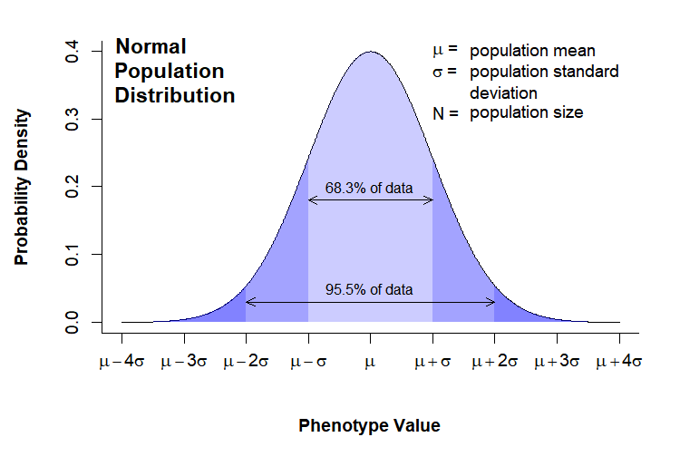
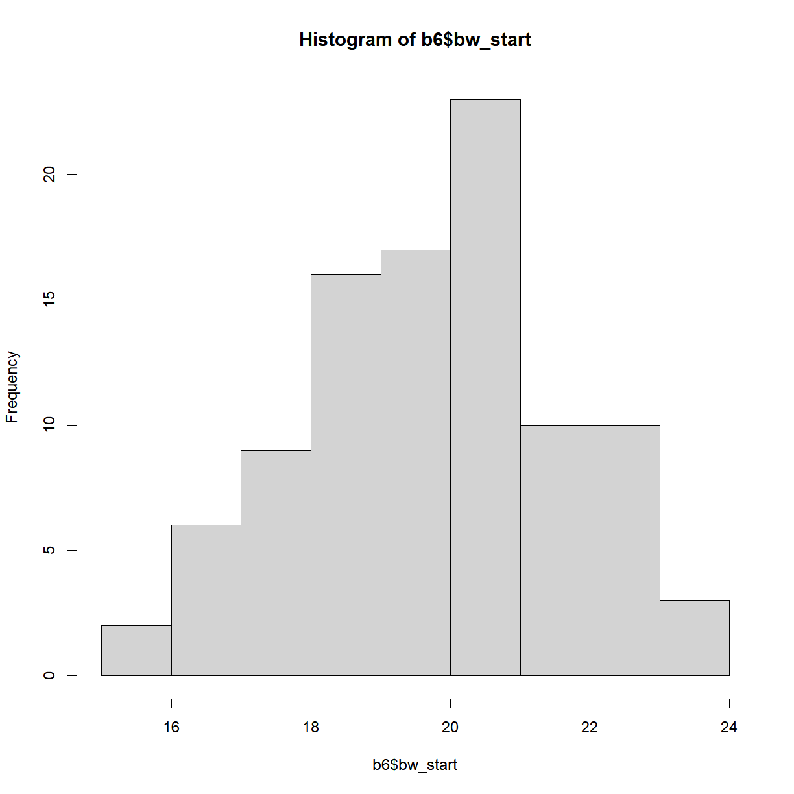
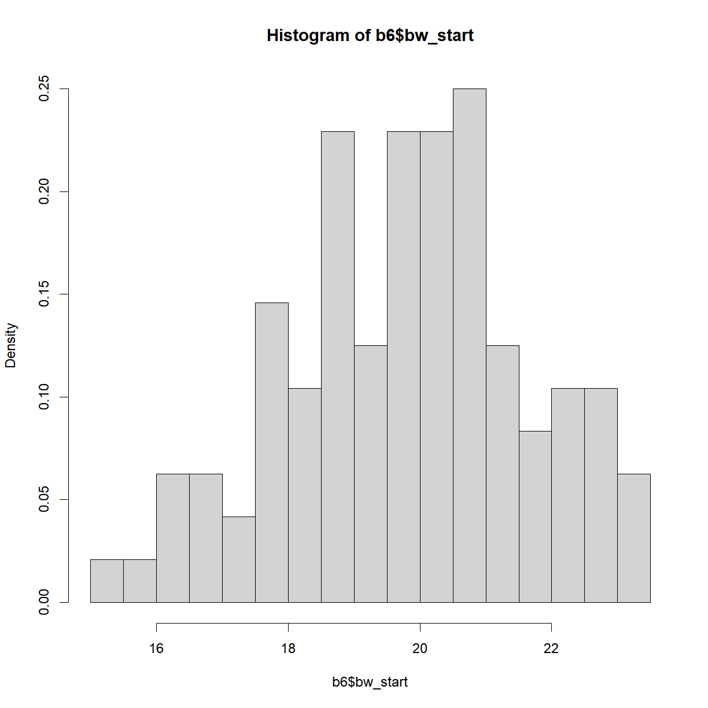
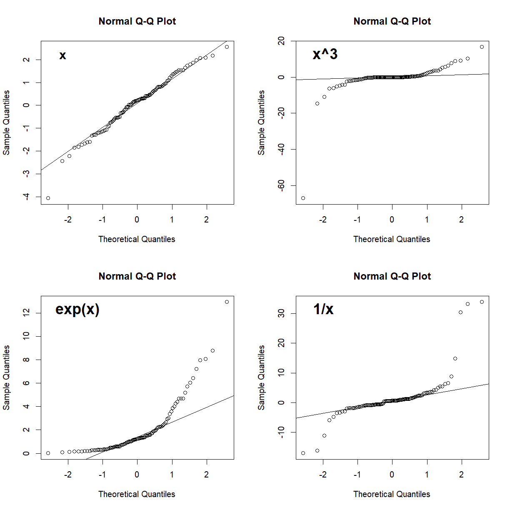
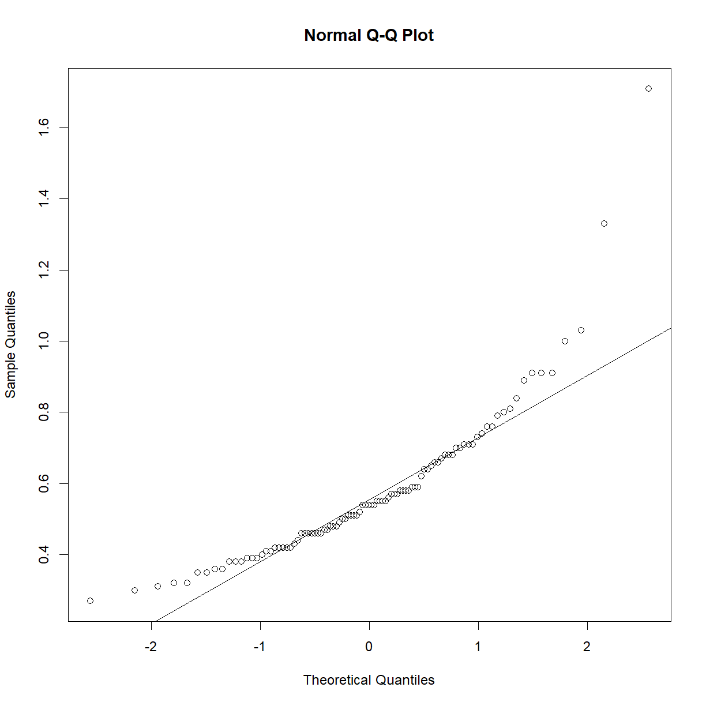
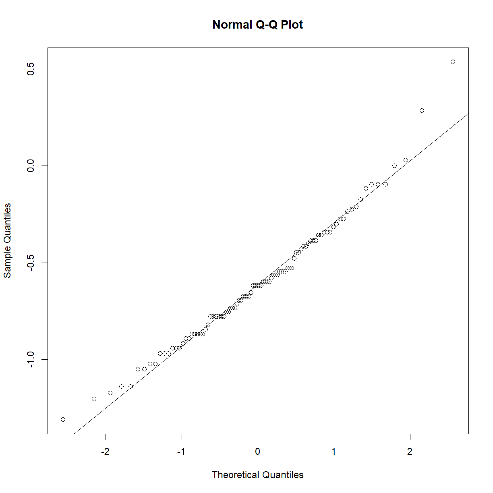
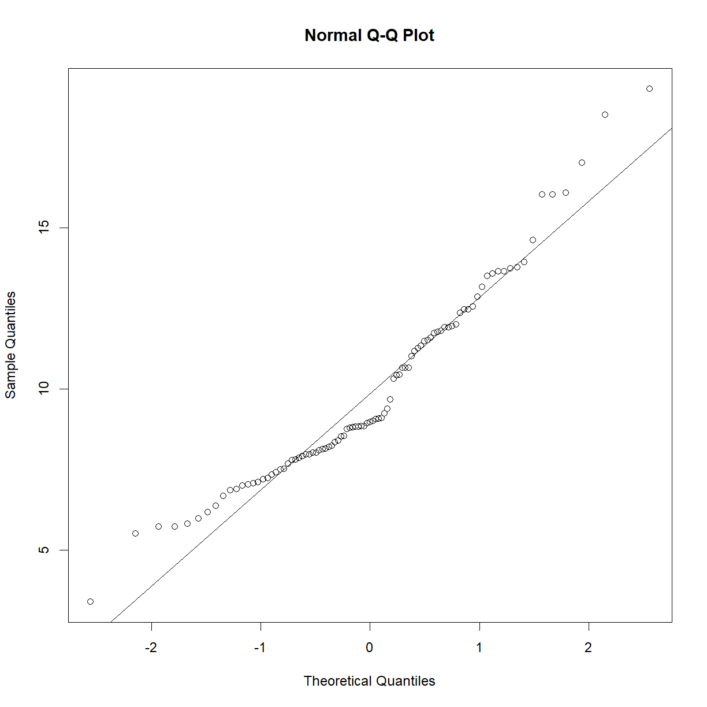
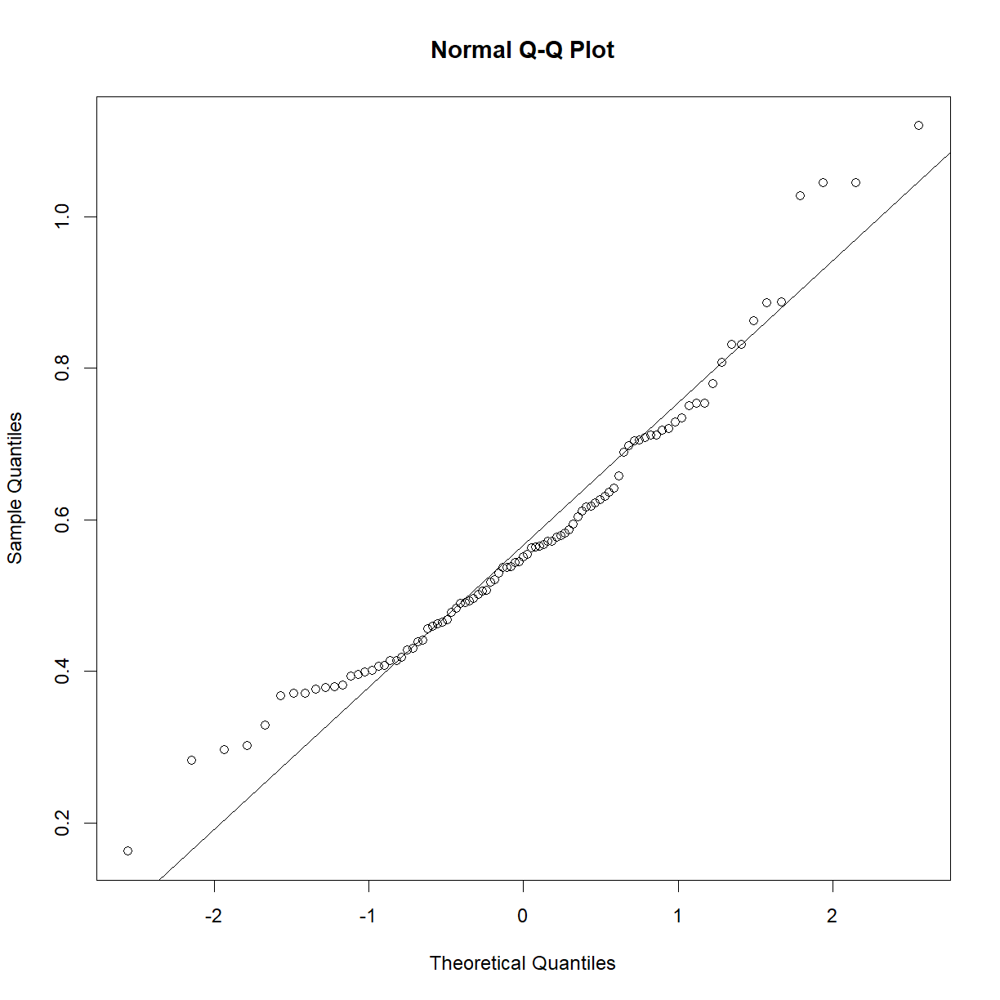
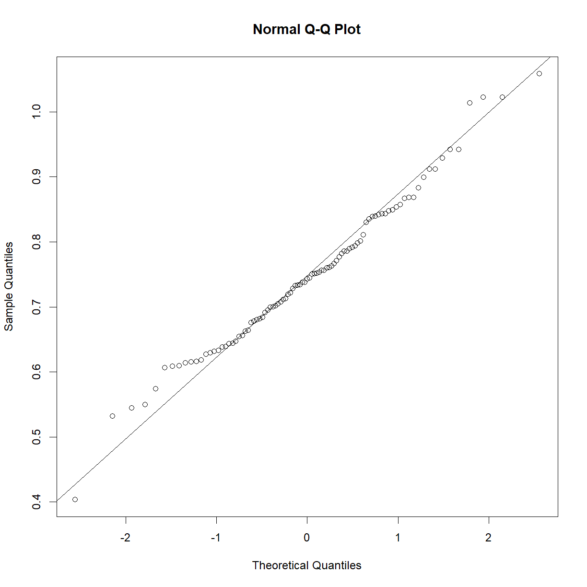

---
# Please do not edit this file directly; it is auto generated.
# Instead, please edit 06-class-distributions.md in _episodes_rmd/
title: "Distributions and Normality"
classdate: "9/11/2020 -- In Class"
teaching: 90
exercises: 30
questions:
- "What is the difference between the population and sampling distribution?"
- "Which distribution is more important for hypothesis testing?"
- "What is the normal distribution and what are it's attributes?"
- "How can I tell if my data is normally distributed?"
objectives:
- "Describe the difference between a population and a sample."
- "Understand the parameters of the population distribution."
- "Understand the statistics of the sampling distribution."
- "Plot the distribution of sample data."
- "Assess whether a sample is normally distributed qualitatively."
keypoints:
- "Samples are sets of observations drawn from a population."
- "The population distribution describes the characteristics of the observed phenotype in the population of interest."
- "The sampling distribution describes the characteristics of all possible samples of a given size."
- "Use `hist()`, `density()`, `dnorm()`, `qqnorm()`, and `qqline()` to visually assess whether a sample is normally distributed."
source: Rmd
---

## In Class

&nbsp;

The goal of this course is to give you some practical tools to use when confronted with real problems in biological science. This lesson will demonstrate how to use R to conduct basic hypothesis testing (e.g. run a t-test in order to determine the probability that two samples came from the same underlying population). However, equally important is understanding how to properly state a hypothesis, determine which statistical test is appropriate for your hypothesis and variables, and what the output of a statistical test means. 

To this end, the next few section will build a practical framework for thinking about statistics and biological variables. We will not cover these statistical concepts in depth--for that you should consult a good introductory statistics text book, take a complete statistics course, or consult the variety of online resources (e.g. [StatTrek](https://stattrek.com/))--but introduce a few basic concepts to help guide your data analysis decisions.

***
### Populations and samples

Statistics is concerned with the study of data. The basic process for an experiment is to:
1. Identify your population of interest.
2. Formulate a hypothesis.
3. Select a sample (i.e. a subset of your population).
4. Make an observation.
5. Test your hypothesis using your observation.
6. Interpret the outcome. 

This process revolves around the data set resulting from your observation. To understand what you are formally doing when making an observation, we need to look at the structure of the phenotype that we are observing. 

Consider the entire population that you are studying (e.g. all human beings, C57BL/6 mice, HeLa cells). There exists an abstract data set that includes all values phenotype present in your population of interest (e.g. the body weights of all human beings). When you make an observation, you do so on a set of individuals from that population. This difference is important:

* A **population** includes all elements present in a data set (all values of a phenotype).
* A **sample** is made up of one or more observations drawn from a population.

&nbsp;

#### The population distribution

The population is described by **parameters**, which are quantities that can be measured. The two most commonly examined parameters are the population *mean* ($$\mu$$) testing and *standard deviation* ($$\sigma$$). Many parameters in biological systems are normally distributed, meaning the follow a well-known bell curve with variability centered symmetrically around a population mean. Distributions are commonly presented as probability distributions, with the phenotype value on the x-axis and the relative likelihood of observing a given phenotype value on the y-axis:

&nbsp;

Note that in this case the distribution for the phenotype of interest is normally distributed. This is not always the case, but many phenotypes do follow this distribution. We will see in the next section that the distribution of the sampling distribution is more important, and something we can control.

&nbsp;
#### The sampling distribution

When conducting an experiment, we take a sample (x) of the population of interest and measure our phenotype. The sample has the following statistics: 

* n = sample size
* $$\bar{x}$$ = sample mean
* $$\sigma_x$$ = sample standard deviation

Here we come to a critical point: what we are actually measuring are characteristics fo the sample, not of the entire population. Therefore, what we want to know when running statistics is:

&nbsp;&nbsp;&nbsp;&nbsp;&nbsp;&nbsp;*How do we expect samples of size **n** to behave?*

It is the behavior of the *sample*, not the behavior of the underlying *population* that is critical when running statistical tests. 

So how do we predict how a sample will be have? It depends on how we take our sample. The most common sampling method is **simple random sampling**, which has the following characteristics:

* A population contains *N* objects.
* A sample of *n* is taken.
* Each possible sample of *n* observations is equally likely to be selected.

The last point is critical, as the sampling statistics will form a distribution of their own, the **sampling distribution**, which will have regular properties. These properties allow us to calculate probabilities and compare samples taken from different populations. A theoretical sampling distribution is formed by taking all possible samples of size *n* from a population, and plotting the density function of the mean of each sample. Thus, the **sample mean** ($$\bar{x}$$) is plotted on the x-axis, while the probability density of the sample mean is plotted on the y-axis:

&nbsp;

The sampling distribution has the following characteristics:
* $$\mu_x$$ = mean of the individual sample means.
* $$SE_x$$ = standard error of the mean, and also the standard deviation of the individual sample means.
* n = sample size

The sampling distribution has several key features in relation to the population distribution. In most cases, the number of observations in your sample will be much smaller than the size of your population (though depending on the sampling method, sample size can in some cases be the same or larger than your population size). If we make this an assumption (N >> n), then:
* $$\mu_x = \mu \rightarrow$$ Population and sampling distributions have the same mean.
* $$SE_x = \frac{\sigma}{\sqrt{n}}*\sqrt{\frac{N-n}{N-1}} \approx \frac{\sigma}{\sqrt{n}}$$ $$\rightarrow$$ $$N-n \approx N-1$$ when $$N >> n$$, therefore $$\sqrt{\frac{N-n}{N-1}} \rightarrow 1$$. Note that the standard error of the mean is the same thing as the standard deviation of the sampling distribution for a given n. This means that the sampling distribution will generally be narrower than the population distribution, as shown above. 
* For large n, the sampling distribution is approximately normal, regardless of the distribution of the observation in the population (according to the [Central Limit Theorem](https://en.wikipedia.org/wiki/Central_limit_theorem), see below).

> ## Central Limit Theorem
> 
> The [Central Limit Theorem](http://mathworld.wolfram.com/CentralLimitTheorem.html) 
> states that the sampling distribution of the sample means of a random variable 
> approaches the normal distribution as the sample size increases. 
> 
> While the question of "how large is large enough", a good rule of thumb is that 
> your sampling distribution will be approximately normal for n > 30, so long as your 
> population  distribution is not too far from normal.
{: .callout}

> ## Standard deviation vs. standard error
> 
> Both the population standard deviation and the standard error of the sample means 
> (generally called just "standard error", SE, or SEM) are both commonly used in 
> bar chart error bars in the scientific literature. 
> 
> Which is most appropriate?
> 
> > ## Solution
> > 
> > The answer is that it depends on what information you are trying to get across.
> > If the goal of your figure is descriptive, for example to describe the range
> > of values measured for a given phenotype, then the standard deviation is the 
> > appropriate measure. The standard deviation of a sample is an estimation of
> > the standard deviation of the population from which the sample was taken.
> >
> > In contrast, if your goal is to convey the accuracy of your measurement strategy,
> > then standard error is more appropriate. While the standard deviation reflects the > > background variation in the population for your phenotype of interest, standard 
> > error reflects the accuracy with which your sample mean estimates the population 
> > mean. In most cases, this is the information that scientists are trying to convey 
> > in figures printed in molecular biology journals.
> {: .solution}
{: .challenge}

> # Publication quality graphics practice
> 
> The "Normal Population Distribution" and "Sampling Distribution" charts
> above were both drawn in directly in R. Try to recreate as many aspects as
> you can.
>
> Functions used:
> * arrows()
> * axis()
> * dev.off()
> * dnorm()
> * expression()
> * mtext()
> * par()
> * paste()
> * plot()
> * png()
> * polygon()
> * rgb()
> * seq()
> * text()
> * title()
> 
> > ## Solution
> > 
> > 
> > ~~~
> > # ---------------------------------------
> > # Normal Population Distribution
> > 
> > # Define set of points and corresponding points on normal distribution
> > x <- seq(0,8,0.01)
> > y <- dnorm(x, mean = 4, sd = 1)
> > 
> > # initiate PNG file
> > png(filename = "results/population-distribution.png",
> >     width = 750, height = 525, res = 150)
> > 
> > (cex = 0.75, # default font size
> >     mar = c(7,5,2,2)) # increase margin sizes
> > 
> > # Plot normal distribution
> > plot(x, y,  type = "l", # plot the distribution as a line chart
> >      bty = "l", xaxt = "n", # only use L shaped frame and turn off axes
> >      xlab = "", ylab = "")
> > 
> > # Axis Labels
> > axis(side = 1, at = 0:8, 
> >      labels = c(expression(mu-4*sigma),
> >                 expression(mu-3*sigma),
> >                 expression(mu-2*sigma),
> >                 expression(mu-sigma),
> >                 expression(mu),
> >                 expression(mu+sigma),
> >                 expression(mu+2*sigma),
> >                 expression(mu+3*sigma),
> >                 expression(mu+4*sigma)))
> > mtext("Phenotype Value", side = 1, line = 4, font = 2, cex = 0.75)
> > mtext("Probability Density", side = 2, line = 3.5, font = 2, cex = 0.75)
> > 
> > # Add title
> > title(main = "Normal\nPopulation\nDistribution", font = 2, # plot title in bold
> >       line = -3, adj = 0.03) # positioning on left inside plot region
> > 
> > # add text identifying variables
> > text(x = 5, y = c(.4,0.37, 0.31), adj = 0,
> >      labels = c(expression(paste(mu, " = ")),
> >                 expression(paste(sigma, " = ")),
> >                 expression(paste(N, " = "))))
> > text(x = 5.6, y = c(0.40,0.37, 0.34, 0.31), adj = 0,
> >      labels = c(expression(paste("population mean")),
> >                 expression(paste("population standard")),
> >                 expression(paste("deviation")),
> >                 expression(paste("population size"))))
> > 
> > # Fill in curve areas
> > col.fill <- rgb(0,0,1,0.2)
> > polygon(c(x[x>=6], 6), c(y[x>=6], y[x == max(x)]), 
> >         border = NA, col = col.fill)
> > polygon(c(x[x<=2], 2), c(y[x<=2], y[x == min(x)]), 
> >         border = NA, col = col.fill)
> > polygon(c(x[x>=5], 5), c(y[x>=5], y[x == max(x)]), 
> >         border = NA, col = col.fill)
> > polygon(c(x[x<=3], 3), c(y[x<=3], y[x == min(x)]), 
> >         border = NA, col = col.fill)
> > polygon(c(x[x>=4], 4), c(y[x>=4], y[x == max(x)]), 
> >         border = NA, col = col.fill)
> > polygon(c(x[x<=4], 4), c(y[x<=4], y[x == min(x)]), 
> >         border = NA, col = col.fill)
> > 
> > # add arrows and data intervals
> > arrows(x0 = 3, y0 = 0.18, x1 = 5,
> >        code = 3, # draw arrow heads at both ends
> >        angle = 25, length = 0.07) # arrow head angle and length
> > arrows(x0 = 2, y0 = 0.03, x1 = 6,
> >        code = 3, # draw arrow heads at both ends
> >        angle = 25, length = 0.07) # arrow head angle and length
> > 
> > text(4, 0.2, "68.3% of data", cex = 0.85)
> > text(4, 0.05, "95.5% of data", cex = 0.85)
> > 
> > # turn of graphics device
> > dev.off()
> > 
> > # ---------------------------------------
> > # Sampling Distribution
> > 
> > # Define set of points and corresponding points on normal distribution
> > x <- seq(0,8,0.01)
> > y.pop <- dnorm(x, mean = 4, sd = 2)
> > y <- dnorm(x, mean = 4, sd = 1)
> > 
> > x.lim <- c(min(x), max(x)) # x plot limits
> > y.lim <- c(0, max(c(y,y.pop))) # y plot limits
> > 
> > # initiate PNG file
> > png(filename = "results/sampling-distribution.png",
> >     width = 750, height = 525, res = 150)
> > # windows()
> > 
> > par(cex = 0.75, # default font size
> >     mar = c(5,5,2,3)) # increase margin sizes
> > 
> > # Plot population distribution
> > plot(x, y.pop,  type = "l",  # plot the distribution as a line chart
> >      lty=2, col = "blue", # plot population in dotted blue
> >      bty = "l", xaxt = "n", # only use L shaped frame and turn off axes
> >      xlab = "", ylab = "", # no axis labels
> >      xlim = x.lim, ylim = y.lim)
> > 
> > # add sampling distribution
> > lines(x, y, col = "black")
> > 
> > # Axis Labels
> > axis(side = 1, at = 0:8, labels = rep("",9), cex = 0.75)
> > text(x = 0:8, y = -0.055, xpd = NA, cex = 0.75,
> >      labels = c(expression(mu[x]-4*SE[x]),
> >                 expression(mu[x]-3*SE[x]),
> >                 expression(mu[x]-2*SE[x]),
> >                 expression(mu[x]-SE[x]),
> >                 expression(mu[x]),
> >                 expression(mu[x]+SE[x]),
> >                 expression(mu[x]+2*SE[x]),
> >                 expression(mu[x]+3*SE[x]),
> >                 expression(mu[x]+4*SE[x])))
> > mtext(expression(paste("Sample Mean, ", bar(x))), side = 1, line = 3, font = 2, cex = 0.75)
> > mtext("Probability Density", side = 2, line = 3, font = 2, cex = 0.75)
> > 
> > # Add title
> > title(main = "Sampling\nDistribution", font = 2, # plot title in bold
> >       line = -2, adj = 0.03) # positioning on left inside plot region
> > 
> > # add text identifying variables
> > x.pos <- 5.2
> > x.off <- 0.9
> > y.pos <-  seq(0.4, by = -0.028, length = 15)
> > text(x = x.pos, y = y.pos[c(1:2,4:6,8)], adj = 0, xpd = NA,
> >      labels = c(expression(paste(phantom(E),mu[x], "  = ")),
> >                 expression(paste(phantom(E[x]),sigma, "  = ")),
> >                 expression(paste(phantom(E[x]),N, "  = ")),
> >                 expression(paste(phantom(Sn),n, "  = ")),
> >                 expression(paste(SE[x],"  = ")),
> >                 expression(paste(phantom(SE[x]),"  = "))))
> > text(x = x.pos + x.off, y = y.pos[c(1:6,8)], adj = 0, xpd = NA,
> >      labels = c(expression(paste("sampling mean")),
> >                 expression(paste("population standard")),
> >                 expression(paste("deviation")),
> >                 expression(paste("population size")),
> >                 expression(paste("sample size")),
> >                 expression(paste("standard error of ",mu[x])),
> >                 expression(
> >                            paste(" ", frac(sigma,sqrt(n)), 
> >                            sqrt(frac(N-n,N-1))%~~%frac(sigma,sqrt(n))))))
> > 
> > # Label population distribution
> > text(x = 1.3, y = 0.104, col = "blue", srt = 34, cex = 0.75,
> >      labels = "Population Distribution")
> > 
> > # turn of graphics device
> > dev.off()
> > ~~~
> > {: .language-r}
> > 
> {: .solution}
{: .challenge}

***
### Assessing normality

An assumption made my many statistical test is whether or not your data is normal. How can you tell? 

There are essentially two common strategies. The first is to examine the distribution visually and look for obvious skew or deviation from an expected normal curve. The second is to use a statistical test to assess normality.

Let's take a look at a mouse data set (*b6.aj.hfhs.diet.txt*). This data comes from a study looking at several measures of body composition and metabolic health for two strains of mice (C57BL/6 and A/J) fed a high-fat, high-sucrose  diet.

Start by loading and examining the data:

~~~
# the data is in txt formal
data.diet <- read.delim("./data/b6.aj.hfhs.diet.txt")

str(data.diet)
~~~
{: .language-r}

~~~
'data.frame':	191 obs. of  17 variables:
 $ strain         : chr  "A/J" "A/J" "A/J" "A/J" ...
 $ sex            : chr  "m" "m" "m" "m" ...
 $ animal_id      : int  16 17 18 19 20 21 22 23 24 25 ...
 $ animal_facility: chr  "ARC" "ARC" "ARC" "ARC" ...
 $ bw_start       : num  19.6 18.9 17.8 17.1 17.4 ...
 $ bw_end         : num  33.1 32.6 29.6 25.9 28.1 ...
 $ bw_gain        : num  13.51 13.74 11.73 8.85 10.66 ...
 $ body_length    : num  10.8 10.9 10.8 10.1 10.1 10.1 9.8 10.1 10.2 10.1 ...
 $ BMI            : num  0.28 0.27 0.25 0.25 0.28 0.28 0.31 0.28 0.29 0.3 ...
 $ GLU            : num  9.49 11.71 11.32 10.66 9.71 ...
 $ INS            : num  35.1 62.5 24.9 40.3 106.2 ...
 $ HOMA_IR        : num  2.09 4.58 1.77 2.69 6.46 2.25 8.88 5.23 3.07 4.45 ...
 $ CHOL           : num  3.17 3.15 2.63 3.38 2.76 2.65 3.43 2.86 3.12 3.07 ...
 $ TG             : num  1.07 1.54 0.86 0.66 0.8 0.66 1.07 1.47 0.76 0.8 ...
 $ liver_wt       : num  0.95 0.96 0.92 0.94 0.82 0.82 0.84 0.85 0.8 0.86 ...
 $ liver_TG       : int  114 95 107 67 109 79 49 36 60 104 ...
 $ liver_TG_tot   : num  108.3 91.4 98.5 63.1 89.3 ...
~~~
{: .output}

&nbsp;

To save some typing, let's separate out the data for the C57BL/6 strain.

~~~
b6 = data.diet[data.diet$strain == "C57BL/6J",]
~~~
{: .language-r}

&nbsp;
#### Visual assessment of normality

The most common first step to look for normality (or lack thereof) in a sample is to plot the histogram/density function and quantile-quantile (Q-Q) plot in order to examine the visual similarity to a theoretical normal distribution. 

Let's start by looking at the distribution of starting body weights for C57BL/6 mice. Histograms can be generated using the `hist()` function:

~~~
hist(b6$bw_start)
~~~
{: .language-r}

&nbsp;

By default, `hist()` breaks the histogram into 10 bins with "counts" (e.g. number of observations) plotted on the y-axis. This is rarely appealing. Let's break down the structure a bit further using the `breaks` argument and change the histogram to probability density (fraction of the total observations in each bin) using the `freq` argument:

~~~
hist.bw.b6 <- hist(b6$bw_start, breaks=15, freq=F)
~~~
{: .language-r}

~~~
hist.bw.b6
~~~
{: .language-r}

~~~
$breaks
 [1] 15.0 15.5 16.0 16.5 17.0 17.5 18.0 18.5 19.0 19.5 20.0 20.5 21.0 21.5 22.0
[16] 22.5 23.0 23.5

$counts
 [1]  1  1  3  3  2  7  5 11  6 11 11 12  6  4  5  5  3

$density
 [1] 0.02083333 0.02083333 0.06250000 0.06250000 0.04166667 0.14583333
 [7] 0.10416667 0.22916667 0.12500000 0.22916667 0.22916667 0.25000000
[13] 0.12500000 0.08333333 0.10416667 0.10416667 0.06250000

$mids
 [1] 15.25 15.75 16.25 16.75 17.25 17.75 18.25 18.75 19.25 19.75 20.25 20.75
[13] 21.25 21.75 22.25 22.75 23.25

$xname
[1] "b6$bw_start"

$equidist
[1] TRUE

attr(,"class")
[1] "histogram"
~~~
{: .output}

~~~
str(hist.bw.b6)
~~~
{: .language-r}

~~~
List of 6
 $ breaks  : num [1:18] 15 15.5 16 16.5 17 17.5 18 18.5 19 19.5 ...
 $ counts  : int [1:17] 1 1 3 3 2 7 5 11 6 11 ...
 $ density : num [1:17] 0.0208 0.0208 0.0625 0.0625 0.0417 ...
 $ mids    : num [1:17] 15.2 15.8 16.2 16.8 17.2 ...
 $ xname   : chr "b6$bw_start"
 $ equidist: logi TRUE
 - attr(*, "class")= chr "histogram"
~~~
{: .output}

&nbsp;

The histogram object is a list that contains a variety of information on the structure of our data. The relevant bit for plotting is the `mids` variable, which indicates the x-position of the box midpoints, and the `density` variable, which indicates the heights.

It is often useful to overlay the density function (which in one sense is the smoothed version of the histogram) using the `density()` function. Let's setup and assign the density of body weight to a new variable:

~~~
## ?density
dens.bw.b6 <- density(b6$bw_start)
dens.bw.b6
~~~
{: .language-r}

~~~

Call:
	density.default(x = b6$bw_start)

Data: b6$bw_start (96 obs.);	Bandwidth 'bw' = 0.5924

       x               y            
 Min.   :13.37   Min.   :8.002e-05  
 1st Qu.:16.34   1st Qu.:1.386e-02  
 Median :19.31   Median :7.567e-02  
 Mean   :19.31   Mean   :8.413e-02  
 3rd Qu.:22.28   3rd Qu.:1.365e-01  
 Max.   :25.25   Max.   :2.250e-01  
~~~
{: .output}

~~~
str(dens.bw.b6)
~~~
{: .language-r}

~~~
List of 7
 $ x        : num [1:512] 13.4 13.4 13.4 13.4 13.5 ...
 $ y        : num [1:512] 8.00e-05 9.01e-05 1.01e-04 1.13e-04 1.27e-04 ...
 $ bw       : num 0.592
 $ n        : int 96
 $ call     : language density.default(x = b6$bw_start)
 $ data.name: chr "b6$bw_start"
 $ has.na   : logi FALSE
 - attr(*, "class")= chr "density"
~~~
{: .output}

&nbsp;

Like `hist()`, `density()` generates a list with a variety of information about our data. For our purposes, the `x` and `y` values represent the density distribution function for the data and can be plotted.

Finally, for a direct comparison, we can calculate the expected theoretical normal distribution of a sample with the same mean and standard deviation as our body weight data using the `dnorm()` function. `dnorm()` will return the probability density function for a given phenotype value (relative probability that the specific value will occur) for a normal distribution with a given mean and standard deviation.

~~~
# first we need to define the range of phenotype values that we are interested
# in, i.e. the range of values represented in our data. I will ask for a sequence of 
# values from the minimum observation to the maximum with 100 equally spaced points in # between
norm.x <- seq(min(b6$bw_start), max(b6$bw_start), length = 100)

# now we can use the phenotype value range to grab the corresponding normal density 
# function from dnorm() using the mean and standard deviation of our data
norm.y <- dnorm(x = norm.x, mean = mean(b6$bw_start), sd = sd(b6$bw_start))
~~~
{: .language-r}
&nbsp;

Putting it all together, we can now plot our histogram, observed density function, and theoretical normal density function on the same chart. First we should use our stored values to determine the appropriate plot size.

~~~
# First calculate the range for the plot window size
x.lim <- c(min(hist.bw.b6$mids, dens.bw.b6$x, norm.x), # find the lowest x value
           max(hist.bw.b6$mids, dens.bw.b6$x, norm.x)) # find the largest x value
y.lim <- c(0, # we want to plot y from 0 in this case
           max(hist.bw.b6$density, dens.bw.b6$y, norm.y)) # find the largest x value

# now plot all three on the same chart
plot(hist.bw.b6, xlim = x.lim, ylim = y.lim, freq=F) # we could also re-call hist()
lines(dens.bw.b6, col="black")
lines(norm.x,norm.y, col = "blue")
~~~
{: .language-r}

&nbsp;

In this case, the distributions look to be very close to one another. The histogram and density function of a plot give useful information about the shape of the data and can be used to quickly assess whether a sample is, for example, skewed or bimodal. To more directly assess normality, a Q-Q plot, which plots quantiles of a distribution against the quantiles of the corresponding normal distribution, is simpler and makes picking out divergence from normality more obvious. In R this can be simply accomplished using the `qqnorm()` function. A second function, `qqline()` adds a line representing perfect normality:

~~~
qqnorm(b6$bw_start)
qqline(b6$bw_start)
~~~
{: .language-r}

&nbsp;

In a Q-Q plot, deviation from the line indicate deviation from the normal distribution. A skewed data set, for example, will show deviation from the line at one end or the other. Here are some examples of non-normal data sets and how they might display on a Q-Q plot:

~~~
# generate a random normal set of 100 points
x <- rnorm(100) 

# set up 4 panel plot
par(mfrow = c(2,2))

# generate the Q-Q plot for x and x's 3rd power, exponential, and inverse
qqnorm(x)
qqline(x)
mtext("x", side = 3, line = -2, adj = 0.1, font = 2, cex = 1.25)
qqnorm(x^3)
qqline(x^3)
mtext("x^3", side = 3, line = -2, adj = 0.1, font = 2, cex = 1.5)
qqnorm(exp(x))
qqline(exp(x))
mtext("exp(x)", side = 3, line = -2, adj = 0.1, font = 2, cex = 1.5)
qqnorm(1/x)
qqline(1/x)
mtext("1/x", side = 3, line = -2, adj = 0.1, font = 2, cex = 1.5)
~~~
{: .language-r}

&nbsp;
#### The Shapiro-Wilk test for normality

While it is always good to look at your data first, there is a statistical test for normality called the [Shapiro-Wilk test](https://en.wikipedia.org/wiki/Shapiro%E2%80%93Wilk_test), originally published in 1965. The Shapiro-Wilk test sets up the following hypothesis test:

&nbsp;&nbsp;&nbsp;&nbsp;&nbsp;&nbsp;$$H_0$$: *The sample belongs to a normally distribution.*

&nbsp;

&nbsp;&nbsp;&nbsp;&nbsp;&nbsp;&nbsp;$$H_1$$: *The sample does not belong to a normally distribution.*

Essentially the test looks for statistical deviation from the corresponding theoretical normal distribution. We can run the test in R using the `shapiro.test()` function:

~~~
shapiro.test(b6$bw_start)
~~~
{: .language-r}

~~~

	Shapiro-Wilk normality test

data:  b6$bw_start
W = 0.98847, p-value = 0.5732
~~~
{: .output}

&nbsp; 

As we may have suspected from looking at the Q-Q plot and distributions, the P-value is comfortably far from significance, and we accept the null hypothesis that the sample is drawn from a normal distribution. As a demonstration, the exponential of this data is clearly not normal:

~~~
shapiro.test(exp(b6$bw_start))
~~~
{: .language-r}

~~~

	Shapiro-Wilk normality test

data:  exp(b6$bw_start)
W = 0.56719, p-value = 2.251e-15
~~~
{: .output}

&nbsp;

Now that we have the tools, a question to consider: is it worth running a statistical test for normality?

> ## To test or not to test
> When you start to read about testing normality, you get a lot of hand-wavy answers
> that amount to "just look at the Q-Q plot". Is there value in running something like > the Shapiro-Wilk test? 
> 
> The answer is probably something like "not really, but it doesn't hurt". The problem
> with normality tests is that, if you have a large sample size, t-tests tend to be 
> quite robust even if your data is not that close to normal. On the other hand, the 
> Shapiro-Wilk test, while one of the better-powered normality tests, is still under 
> powered for small sample sizes, which are the only cases where t-tests tend to under > perform. See a detailed discussion in 
> [this paper](https://bmcmedresmethodol.biomedcentral.com/articles/10.1186/1471-2288-12-81). 
> 
> The bottom line is that it is **always** good to look at your data before running 
> your analyses. A quick Q-Q plot will tell you whether your data is dramatically 
> different from normality (in which case you may want to run a transformation; see the > next section). That said, a statistical test is not likely to tell you whether your 
> data is meaningfully non-normal beyond what the Q-Q plot can divulge. A highly 
> statistical answer will be obvious in the Q-Q plot, and a close answer should, at 
> most, make you a bit more skeptical of your 0.049 t-test p-value (which you should 
> be anyway). 
{: .callout}

&nbsp;
#### Transforming highly non-normal data

So what happens if your data is clearly non-normal? Let's look at plasma triglycerides for our C57BL/6 mice:

~~~
qqnorm(b6$TG)
qqline(b6$TG)
~~~
{: .language-r}

~~~
shapiro.test(b6$TG)
~~~
{: .language-r}

~~~

	Shapiro-Wilk normality test

data:  b6$TG
W = 0.83851, p-value = 7.657e-09
~~~
{: .output}

&nbsp;

This sample looks to be clearly non-normal. In this case the data has a somewhat characteristic shape, with both low and values higher than expected from a normal distribution. What happens if we examine normality of the log of triglycerides?

~~~
qqnorm(log(b6$TG))
qqline(log(b6$TG))
~~~
{: .language-r}

~~~
shapiro.test(log(b6$TG))
~~~
{: .language-r}

~~~

	Shapiro-Wilk normality test

data:  log(b6$TG)
W = 0.97882, p-value = 0.1227
~~~
{: .output}

&nbsp;

That's much better! Now we can continue with our analysis using log(TG) as our random variable, rather than the raw value of TG. This is an ideal case, because taking the logarithm of a value is a *reversible* data transformation. We can easily reverse the process by raising e to log(TG) power (note that by default, `log()` in R takes the natural logarithm of the input). Therefore, not information if lost when performing the transformation. Other reversible transformations include:
* square root: $$\sqrt{x}$$
* polynomial powers ($$x^2$$)
* inverse ($$\frac{1}{x}$$)
* exponential ($$e^x$$)

The best reversible transformation is not always immediately obvious. You can just try a few until you find the one that gives the most normal outcome. However, in some cases you won't be able to find a nice transformation that brings you closer to a normal distribution. You may also have outliers that are having an out-weighted effect. In these cases, you may need a more extreme measure. While we do not cover these options in detail, two common approaches are to use a [Z-Score Normalization](https://en.wikipedia.org/wiki/Feature_scaling#Standardization_(Z-score_Normalization)) [Rank Z Transformation](https://rdrr.io/bioc/DOQTL/man/rankZ.html), or a [Min-Max Scaling](https://en.wikipedia.org/wiki/Feature_scaling#Rescaling_(min-max_normalization)). These methods have different strengths and weaknesses, and tend to change some aspect of the data. For example, Min-Max Scaling suppresses the impact of outliers, while the Rank Z Transformation maintains data order, but forces a normal distribution and thus removes information about relative value.

***
### Exercises

> ## Assessing normality in the other strain
>
> We looked above at the starting body weight sample for C57BL/6 mice. Repeat our 
> analysis using the A/J strain. In particular,
> * Plot the histogram with density for the sample and normal distributions
> * Generate a Q-Q plot to compare the sample to the normal distribution.
> * Conduct a Shapiro-Wilk test on the sample.
> 
> > ## Solution
> > 
> > 
> > ~~~
> > # First separate out the A/J data
> > aj = data.diet[data.diet$strain == "A/J",]
> > 
> > # calculate histogram, density and normal ranges to prepare for plotting
> > hist.bw.aj <- hist(aj$bw_start, breaks=15, freq = F, plot = F, warn.unused = F)
> > dens.bw.aj <- density(aj$bw_start)
> > norm.x <- seq(min(aj$bw_start), max(aj$bw_start), length = 100)
> > norm.y <- dnorm(x = norm.x, mean = mean(aj$bw_start), sd = sd(aj$bw_start))
> > 
> > # First calculate the range for the plot window size
> > x.lim <- c(min(hist.bw.aj$mids, dens.bw.aj$x, norm.x), # find the lowest x value
> >            max(hist.bw.aj$mids, dens.bw.aj$x, norm.x)) # find the largest x value
> > y.lim <- c(0, # we want to plot y from 0 in this case
> >            max(hist.bw.aj$density, dens.bw.aj$y, norm.y)) # find the largest x value
> > 
> > # now plot all three on the same chart
> > plot(hist.bw.aj, xlim = x.lim, ylim = y.lim, freq=F) 
> > lines(dens.bw.aj, col="black")
> > lines(norm.x,norm.y, col = "blue")
> > ~~~
> > {: .language-r}
> > 
> > 
> > 
> > ~~~
> > # generate the Q-Q plot
> > qqnorm(aj$bw_start)
> > qqline(aj$bw_start)
> > ~~~
> > {: .language-r}
> > 
> > 
> > 
> > ~~~
> > # conduct the Shapiro-Wilk test
> > shapiro.test(aj$bw_start)
> > ~~~
> > {: .language-r}
> > 
> > 
> > 
> > ~~~
> > 
> > 	Shapiro-Wilk normality test
> > 
> > data:  aj$bw_start
> > W = 0.98581, p-value = 0.3992
> > ~~~
> > {: .output}
> {: .solution}
{: .challenge}

> ## The weightier matter
> 
> While the starting body weight is important, what we really care about is 
> the change in body weight following the diet. Examine the `bw_gain` variable. 
> Can we use this directly? Is there a better metric to assess change in body weight?
>
> > ## Solution
> > 
> > 
> > ~~~
> > # examine Q-Q plots for B6 and AJ mice separately
> > qqnorm(b6$bw_gain)
> > qqline(b6$bw_gain)
> > ~~~
> > {: .language-r}
> > 
> > 
> > 
> > ~~~
> > shapiro.test(b6$bw_gain)
> > ~~~
> > {: .language-r}
> > 
> > 
> > 
> > ~~~
> > 
> > 	Shapiro-Wilk normality test
> > 
> > data:  b6$bw_gain
> > W = 0.93757, p-value = 0.0001893
> > ~~~
> > {: .output}
> > 
> > 
> > 
> > ~~~
> > qqnorm(aj$bw_gain)
> > qqline(aj$bw_gain)
> > ~~~
> > {: .language-r}
> > 
> > 
> > 
> > ~~~
> > shapiro.test(aj$bw_gain)
> > ~~~
> > {: .language-r}
> > 
> > 
> > 
> > ~~~
> > 
> > 	Shapiro-Wilk normality test
> > 
> > data:  aj$bw_gain
> > W = 0.94935, p-value = 0.001068
> > ~~~
> > {: .output}
> > 
> > 
> > 
> > ~~~
> > # both are skewed. Try a log transformation:
> > qqnorm(log(b6$bw_gain))
> > qqline(log(b6$bw_gain))
> > ~~~
> > {: .language-r}
> > 
> > 
> > 
> > ~~~
> > shapiro.test(log(b6$bw_gain))
> > ~~~
> > {: .language-r}
> > 
> > 
> > 
> > ~~~
> > 
> > 	Shapiro-Wilk normality test
> > 
> > data:  log(b6$bw_gain)
> > W = 0.88267, p-value = 3.692e-07
> > ~~~
> > {: .output}
> > 
> > 
> > 
> > ~~~
> > qqnorm(log(b6$bw_gain))
> > qqline(log(b6$bw_gain))
> > ~~~
> > {: .language-r}
> > 
> > 
> > 
> > ~~~
> > shapiro.test(log(b6$bw_gain))
> > ~~~
> > {: .language-r}
> > 
> > 
> > 
> > ~~~
> > 
> > 	Shapiro-Wilk normality test
> > 
> > data:  log(b6$bw_gain)
> > W = 0.88267, p-value = 3.692e-07
> > ~~~
> > {: .output}
> > 
> > 
> > 
> > ~~~
> > # That didn't work. What if we normalize to the starting body weight?
> > qqnorm(b6$bw_gain/b6$bw_start)
> > qqline(b6$bw_gain/b6$bw_start)
> > ~~~
> > {: .language-r}
> > 
> > 
> > 
> > ~~~
> > shapiro.test(b6$bw_gain/b6$bw_start)
> > ~~~
> > {: .language-r}
> > 
> > 
> > 
> > ~~~
> > 
> > 	Shapiro-Wilk normality test
> > 
> > data:  b6$bw_gain/b6$bw_start
> > W = 0.98215, p-value = 0.2167
> > ~~~
> > {: .output}
> > 
> > 
> > 
> > ~~~
> > qqnorm(aj$bw_gain/aj$bw_start)
> > qqline(aj$bw_gain/aj$bw_start)
> > ~~~
> > {: .language-r}
> > 
> > 
> > 
> > ~~~
> > shapiro.test(aj$bw_gain/aj$bw_start)
> > ~~~
> > {: .language-r}
> > 
> > 
> > 
> > ~~~
> > 
> > 	Shapiro-Wilk normality test
> > 
> > data:  aj$bw_gain/aj$bw_start
> > W = 0.95953, p-value = 0.005023
> > ~~~
> > {: .output}
> > 
> > 
> > 
> > ~~~
> > # still not perfect. Let's try to transform the new data with a square root
> > qqnorm(sqrt(b6$bw_gain/b6$bw_start))
> > qqline(sqrt(b6$bw_gain/b6$bw_start))
> > ~~~
> > {: .language-r}
> > 
> > 
> > 
> > ~~~
> > shapiro.test(sqrt(b6$bw_gain/b6$bw_start))
> > ~~~
> > {: .language-r}
> > 
> > 
> > 
> > ~~~
> > 
> > 	Shapiro-Wilk normality test
> > 
> > data:  sqrt(b6$bw_gain/b6$bw_start)
> > W = 0.97056, p-value = 0.02933
> > ~~~
> > {: .output}
> > 
> > 
> > 
> > ~~~
> > qqnorm(sqrt(aj$bw_gain/aj$bw_start))
> > qqline(sqrt(aj$bw_gain/aj$bw_start))
> > ~~~
> > {: .language-r}
> > 
> > 
> > 
> > ~~~
> >  shapiro.test(sqrt(aj$bw_gain/aj$bw_start))
> > ~~~
> > {: .language-r}
> > 
> > 
> > 
> > ~~~
> > 
> > 	Shapiro-Wilk normality test
> > 
> > data:  sqrt(aj$bw_gain/aj$bw_start)
> > W = 0.98504, p-value = 0.3549
> > ~~~
> > {: .output}
> >
> > &nbsp;
> >
> > Still not perfect, but this may be one of those cases where there isn't a clean 
> > reversible transform. I would probably be comfortable going forward with the 
> > slightly skewed data and being congnizant of the problem when running my t-test, 
> > particularly given that we have nearly 100 observations in each sample, making 
> > the t-test more robust.
> {: .solution}
{: .challenge}

***
## Additional Information and Exercises

***


