---
# Please do not edit this file directly; it is auto generated.
# Instead, please edit 07-class-hypothesis-testing.md in _episodes_rmd/
title: "Hypothesis Testing"
classdate: "9/14/2023 -- In Class"
teaching: 90
exercises: 30
questions:
  - "What is the formal process for hypothesis testing?"
  - "How does hypothesis testing relate to the population and sampling distributions?"
  - "What are the assumptions of a t-test?"
  - "What does a P-value mean?"
  - "What is the right statistical test to use for my data?"
objectives:
  - "Describe the steps of developing and testing a model."
  - "Formulate simple hypotheses."
  - "Conceptually describe the operations performed during a statistical test."
  - "Describe the assumptions of various statistical tests."
  - "Understand different types of variables."
  - "Conduct basic statistical tests in R."
keypoints:
  - "Understand basic model development and testing."
  - "All statistical tests make assumptions about your sample and population. Understanding these assumptions is critical to running a valid test."
source: Rmd
---

## In Class

In the last class we examined what we are actually doing statistically when take a sample from a population to run an experiment. In this lesson, we will take a similar look at hypothesis testing, define the formal process of formulating and testing a set of hypotheses, and examining the critical factors when selecting an appropriate statistical tool for a given set of data.

*** 
### Formulating a hypothesis

There is a basic process that we undertake as scientists to build our understanding of how a system works. This process comprises the following steps:

1. Develop a model.
2. Formulate a hypothesis (and corresponding null hypothesis) based on that model.
3. Collect a data sample.
4. Run a statistical test to test the null hypothesis.
5. Interpret the statistical test.
6. Accept the null hypothesis or reject it in favor of the alternative.

Let's use the mouse study looking the role of a high-fat, high-sucrose diet on metabolism to examine each step. First, let's load the data:

~~~
data.diet <- read.delim("./data/b6.aj.hfhs.diet.txt")
~~~
{: .language-r}

&nbsp;

For a simple starting example, let's say we are interested in the impact of genetic background on body weight. A first-order model can be simply stated:

&nbsp;&nbsp;&nbsp;&nbsp;&nbsp;&nbsp;**Model:** *Body weight is determined, at least in part, by genetic background.*

This model predicts that different genetic backgrounds should have different body weights at the same age. We can thus generate a hypothesis ($$H_1$$) and a corresponding null hypothesis ($$H_0$$). Note that a properly formed hypothesis should be a specific, falsifiable prediction about a change in an experimentally testable dependent variable following a change in an independent variable:

&nbsp;

&nbsp;&nbsp;&nbsp;&nbsp;&nbsp;&nbsp; $$H_1$$: *Age-matched mice from genetically distinct strain backgrounds will have different body weights on average.*

&nbsp;&nbsp;&nbsp;&nbsp;&nbsp;&nbsp; $$H_0$$: *Age-matched mice from genetically distinct strain backgrounds will not have different body weights on average.*

&nbsp;

Our high-fat, high-sucrose diet data set includes body weight measurements for two different strains, C57BL/6 and A/J, so we have a set of observations that can be used to test the hypothesis. From our class on distributions, we can translate the idealized version of these hypotheses as distributions:

We are actually taking two samples, one from the C57BL/6J strain and one from the A/J strain. In essence, the null hypothesis is that the observations from each sample are drawn from the same effective population with respect to the measured phenotype (or at least populations with the same phenotype mean; bottom panel), while the alternative hypothesis is that the samples are drawn from separate populations with distinct distributions for the measured phenotype (top panel. We will talk more about the important features of these distributions when we get to **Power Analysis**.

First, we will examine the two distributions to see if there is a visual difference. There are a few ways to do this. Let's start by plotting the density functions for the starting body weights for the two strains:

~~~
# define the density functions
dens.bw.b6 <- density(data.diet$bw_start[data.diet$strain == "C57BL/6J"])
dens.bw.aj <- density(data.diet$bw_start[data.diet$strain == "A/J"])

# define the plot limits
x.lim <- c(min(dens.bw.b6$x, dens.bw.aj$x), max(dens.bw.b6$x, dens.bw.aj$x))
y.lim <- c(0, max(dens.bw.b6$y, dens.bw.aj$y))

# plot density functions
plot(dens.bw.b6, type = "l",
     col = "black", main = "", xlab = "Body Weight (g)",
     xlim = x.lim, ylim = y.lim)

lines(dens.bw.aj, col = "blue")
~~~
{: .language-r}

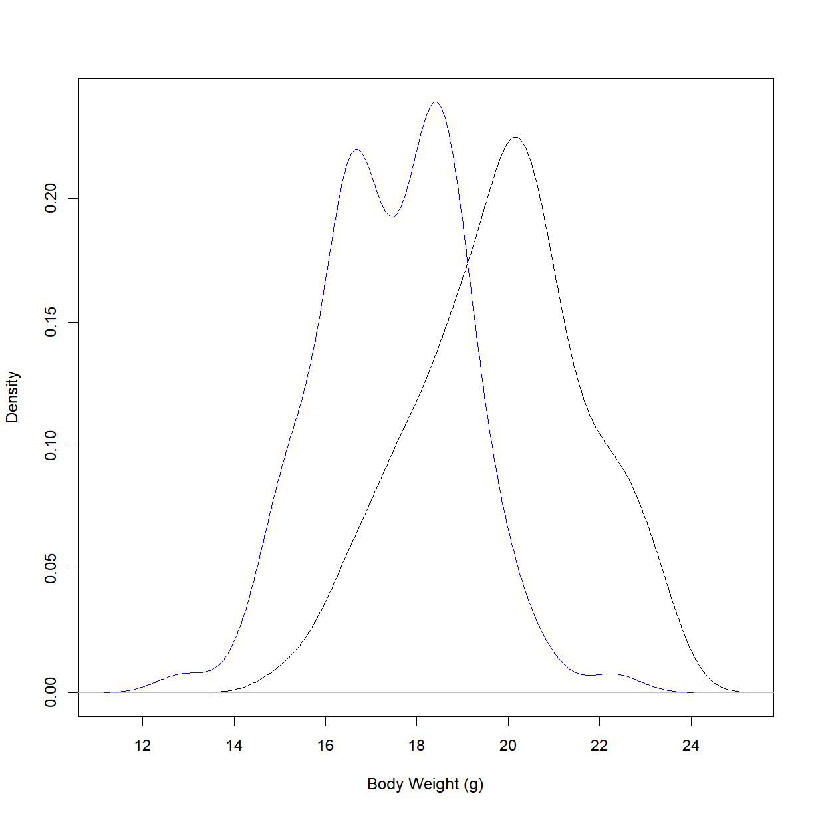

&nbsp;

Alternatively, we may want to look at the box and whisker plot for this data:

~~~
boxplot(data.diet$bw_start ~ data.diet$strain,     # formula notation to plot body weight by strain
        xlab = "Strain", ylab = "Body Weight (g)", # add some axis labels
        outline = F)                                # turn off outlier points
        
stripchart(data.diet$bw_start ~ data.diet$strain,     # formula notation to plot body weight by strain
        pch=20, col=c("blue","red"),                  # change the point type and color
        method = "jitter",                            # spread out the points in the x direction (instead of drawing them over eachother)
        vert=T,add=T)                                 # draw the points vertically to match the direction of boxplot, and add to the current plot
~~~
{: .language-r}

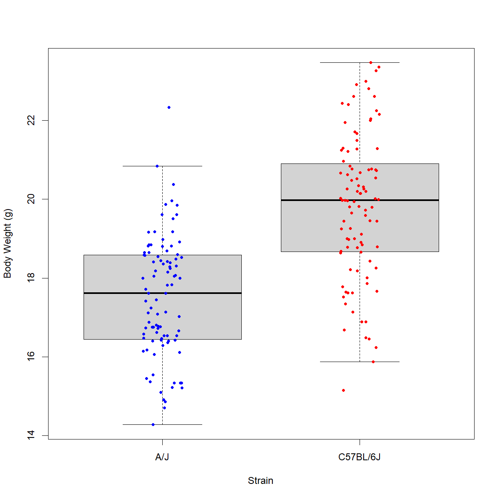

&nbsp;

Well, they certainly look like distributions with different mean values. To determine whether the difference is large enough to reject the null hypothesis, we need to run a statistical test. 

What are we actually doing when we run a statistical test? In the simplest form, we have a sample with a set of observations for our phenotype of interest. The goal of the test is to determine how likely it is that our sample came from the same population (again, with respect to the specific phenotype) that we are comparing to. In this case the population from a different genetic background. In our example, we are asking: 

&nbsp;&nbsp;&nbsp;&nbsp;&nbsp;&nbsp;*How likely is it that the sample of C57BL/6 body weight observations came from the same population as the A/J body weight observations?*

Because of this framing, we are actually testing the *null hypothesis*, and will choose to accept it, or to reject it in favor of the alternative hypothesis. In running the statistical test, we make an assumption about the shape of the sampling distribution of the phenotype in the comparison population  for the sample size and simply ask how likely it would be to observe the mean from the measured sample given that assumption. Because of the Central Limit Theorem, the assumption that the sampling distribution is normally distributed is usually valid for large sample size (n), regardless of the actual shape of the population distribution. 

Because we know the distribution of all possible samples for a normally distributed sample population, we can calculate the probability that our sample is drawn from the assumed sampling distribution (this is the P-value). The general rule of thumb is that if the probability is greater than 0.05 we accept the null hypothesis, while if the probability is less than 0.05, we reject the null hypothesis in favor of the alternative hypothesis. 

We can visualize this procedure:

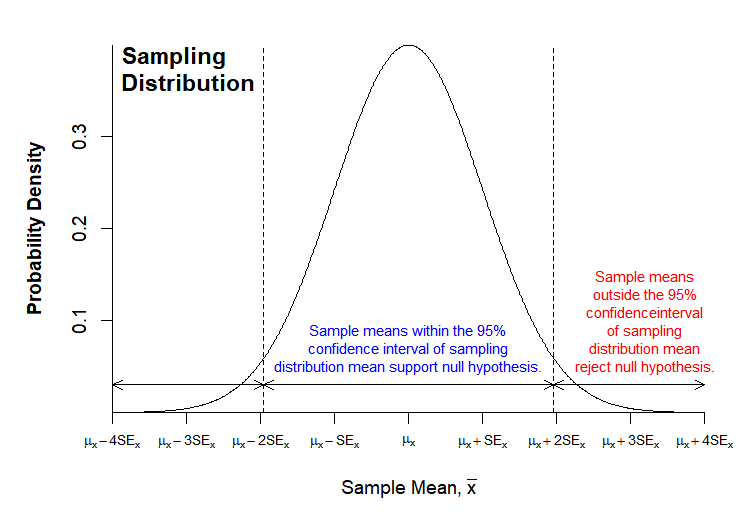

&nbsp;

Each statistical test has an underlying set of assumptions. The t-test is the most common test used in biological sciences (though not always in the correct situations!). These assumptions must be met for the output of the test to be valid. The t-test makes the following assumptions:

* The independent variable is bivariate (i.e. categorical with two categories)
* The dependent variable is continuous
* The sampling mean for the sample size is normally distributed for the two populations sampled (approximately true for large sample sizes under the Central Limit Theorem)
* Each observation of the dependent variable is independent of all other observations of the dependent variable (this is broken by, for example, cluster sampling or time-to-event/survival data)
* For the classical Student's t-test, the two populations must have equal variance (i.e. the same standard deviation). However, Welch's t-test generalizes the operation to populations with unequal variance. Unless you *know* that your populations have equal variance, assume unequal variance.

We can check normality using the Q-Q plot and the Shapiro-Wilk test from last class:

~~~
qqnorm(data.diet$bw_start[data.diet$strain == "C57BL/6J"])
qqline(data.diet$bw_start[data.diet$strain == "C57BL/6J"])
~~~
{: .language-r}

~~~
shapiro.test(data.diet$bw_start[data.diet$strain == "C57BL/6J"])
~~~
{: .language-r}

~~~

	Shapiro-Wilk normality test

data:  data.diet$bw_start[data.diet$strain == "C57BL/6J"]
W = 0.98847, p-value = 0.5732
~~~
{: .output}

~~~
qqnorm(data.diet$bw_start[data.diet$strain == "A/J"])
qqline(data.diet$bw_start[data.diet$strain == "A/J"])
~~~
{: .language-r}

~~~
shapiro.test(data.diet$bw_start[data.diet$strain == "A/J"])
~~~
{: .language-r}

~~~

	Shapiro-Wilk normality test

data:  data.diet$bw_start[data.diet$strain == "A/J"]
W = 0.98581, p-value = 0.3992
~~~
{: .output}

&nbsp;

Our data meet all of the other assumptions of the t-test. We can run a t-test using the `t.test()` function in R:

~~~
## ?t.test

# We can either use formula notation...
t.test(data.diet$bw_start ~ data.diet$strain,     
       alternative = "two.sided") # specify that we want a two-sided test
~~~
{: .language-r}

~~~

	Welch Two Sample t-test

data:  data.diet$bw_start by data.diet$strain
t = -9.4095, df = 185.35, p-value < 2.2e-16
alternative hypothesis: true difference in means between group A/J and group C57BL/6J is not equal to 0
95 percent confidence interval:
 -2.835463 -1.852550
sample estimates:
     mean in group A/J mean in group C57BL/6J 
              17.47537               19.81938 
~~~
{: .output}

~~~
# ... or by explicitly entering the two data sets
t.test(data.diet$bw_start[data.diet$strain == "C57BL/6J"], 
       data.diet$bw_start[data.diet$strain == "A/J"],                  
       alternative = "two.sided")
~~~
{: .language-r}

~~~

	Welch Two Sample t-test

data:  data.diet$bw_start[data.diet$strain == "C57BL/6J"] and data.diet$bw_start[data.diet$strain == "A/J"]
t = 9.4095, df = 185.35, p-value < 2.2e-16
alternative hypothesis: true difference in means is not equal to 0
95 percent confidence interval:
 1.852550 2.835463
sample estimates:
mean of x mean of y 
 19.81938  17.47537 
~~~
{: .output}

&nbsp;

As we suspected from our plot, the P-value is highly significant, and we can reject the null hypothesis in favor of the alternative hypothesis.

***
### Choosing the right statistical test

One of the more common errors you see in hypothesis testing is application of the wrong statistical test to a given data set. By "wrong", I just mean that the assumptions of the test are violated by some aspect of the underlying data. 

What are the critical factors when selecting your test?
* Number of dependent variables.
* Type(s) of dependent variable(s).
* Number of independent variables.
* Type(s) of independent variable(s).
* Distribution of the dependent variable.
* Sample size.
* Paired vs. unpaired observations between variables.

&nbsp;
#### Variable types

The nature of your variables is the first thing to consider when selecting a statistical test. In most situations, there are two broad categories of variable type (*categorical* and *numeric*), with sub-categories:

Variable type:
 * **<u>Categorical</u>** variables are those that take on discrete or qualitative values. They are divided into three types: 
    + **Nominal** variables have two or more categories, but no intrinsic order. For example, flower color ("red", "green", "blue") or state of residence ("Washington", "Arizona", "Maine") are considered nominal variables.
    + **Dichotomous** variables are a subcategory of nominal variables with exactly two categories. For most studies, biological sex or gender ("female" or "male") is considered dichotomous, as are questions with binary answers, e.g. "do you own a smart phone?" ("Yes" or "No"), censoring variables (0 = not censored, 1 = censored), or variables about current status ("Alive" or "Dead"). 
    + **Ordinal** are similar to nominal, except with a clear order to the values (e.g. inflammation may be characterized as "none", "low", "moderate", or "high"). Numeric variables are converted to ordinal values in certain circumstances using a threshold value (e.g. height observations can be converted to "tall" and "short" by taking values above or below a specified threshold value).

&nbsp;

* **<u>Numeric</u>** variables are quantifiable and meaningfully representable by numbers. To be considered "numerical", the relative value must be numerically meaningful. Note that categories can be coded as numbers (see the censoring example under dichotomous variables above), but are not considered "numerical" because the relative value is not meaningful.
    + **Discrete** variables denote quantities that are represented by whole numbers or counts. The number of items purchased at a store or the number of children in a family (i.e. "1" and "5" are meaningful, but "2.3" is not) are discrete variables.
    + **Continuous** variables are quantities that can be represented on a continuous number line and are not limited to discrete values. These can be further subdivided based on what type of comparison between two values is meaningful.
    + **Interval** variables have a consistent distance between numbered values. For example, the difference between 40 and 50 degrees Fahrenheit is the same as the difference between 90 and 100 degrees Fahrenheit.
    + **Ratio** variables have the same properties as interval variables, except that the point 0.0 is clearly defined, such that the ratio between two values is meaningful. For example, 50 degrees Fahrenheit is not twice as hot as 25 degrees Fahrenheit, while a person who is 6 feet tall can be considered "twice as tall" as a person who is 3 feet tall. Degrees Fahrenheit is thus an interval variable, but not a ratio variable, while height is both. 

> ## More complex variables -- e.g. time-to-event data
> 
> There are special cases that require different considerations. 
> Time-to-event (aka survival) data does not fit cleanly into the above 
> categories. While the variable it putatively numeric 
> (*how long did it take the event to occur?*), the way we observe the 
> event actually makes the variable a repeated categorical observation on 
> the same individual. We can't just look at the whole timespan at once 
> and say "the event happened at time t". Instead, we observe the same 
> sample of individuals at descrete intervals and ask 
> (*has the event occurred yet?*). This structure means that observations 
> are not independent and requires a test that does not make that 
> assumption. Analysis of time-to-event data also generally requires a 
> means to censor data, for example if a death was observed, but not from 
> the cause of interest, or if a patient dropped out of a study. We will 
> examine analysis of time-to-event data in a later lesson.
{: .callout}

&nbsp;
#### Sample size and the distribution of the dependent variable

We have spent a fair amount of time talking about distributions and what they say about our data. The primary place that this can matter is in fulfilling the assumptions of our selected statistical test. Types of tests can be categorized as *parametric* or *nonparametric*. While there is not a hard-and-fast definition for these terms *per se*, they are generally used as follows:

* **Parametric tests** make an assumption about an underlying *parameter*, or *statistic*, in a dataset to calculate probabilities. In most cases, the assumption is that the statistic is drawn from a particular distribution (e.g. the normal distribution). The t-test is the most common example of this sort of test.

* **Nonparametric tests** do not make assumptions about the underlying parameters or parameter distributions and use other means to calculate probabilities. Often they will rely on the rank-order of the data (e.g. the Log-Rank test).

Nonparametric tests are more robust than parametric tests in that they make fewer assumptions. However, they also have less statistical power to detect real differences (i.e. they are more conservative). You have a trade-off to consider if you have relatively low sample size (say <30) and observations that are not clearly normally distributed.

As discussed previously, if you have a large sample size the distribution becomes less important. Parametric tests tend to be robust to non-normal data distributions with large sample sizes, while the reduction of power for nonparametric tests becomes less severe. 

> ## How many is enough?
> 
> While there are is no hard and fast rule for sample size, the Central 
> Limit Theorem tends to hold for n > 30 so long as the population size 
> is much larger than the sample size. The assumption of
> normality to be safely adopted in many cases. If your data is
> dramatically skewed, try a transformation, use a nonparametric test, 
> and/or adopt a more conservative interpretation.
{: .callout}

&nbsp;
# Paired vs. unpaired data

In some cases, data is paired between the two test groups. That is, there is a specific observation in one group that corresponds to a specific observation in another groups. This can be illustrated by an couple of examples:

* **Unpaired:** Comparing body weight between two different strains of mouse. There is no specific relationship between one individual in *Strain A* and another individual in *Strain B*.

* **Paired:** Comparing body weight of mice before and after being provided a particular diet for some time frame. In this case, you have body weight data from the same set of mice before and after the diet. The body weight for *Mouse A* before the diet is paired to the body weight for *Mouse A* after the diet.

If you have a data structure that allows for paired testing, it provides quite a bit more power to detect difference between groups. In the body weight example, pairing observations by measuring the same phenotype *before* vs. *after* a diet change controls for individual-to-individual variation in body weight within the population, which can be high. Unfortunately, most data is not paired. 

&nbsp;
#### Available statistical tests

There are many, many resources that provide information on selecting statistical tests from data. You should now have the basic information needed to find the right test. Pick your favorite table or flow chart to select your test. Here are some options:

* [UCLA Institute for Digital Research & Education](https://stats.idre.ucla.edu/other/mult-pkg/whatstat/) provides a table to guide the correct choice of test with handy links to the corresponding functions in R and other analysis tools.
* [Handbook of Biological Statistics](http://www.biostathandbook.com/testchoice.html) provides a table with a different organization and links to more detailed descriptions of each test.

Here is an example of a flow chart for choosing a test. Many different versions of this type of chart are available online (original [here](http://www.pnrjournal.com/article.asp?issn=0976-9234;year=2010;volume=1;issue=2;spage=61;epage=63;aulast=Jaykaran)):

&nbsp;
#### Exercises

> ## Petal length by species?
> 
> Is there a significant difference ($$\alpha < 0.05$$) in petal length 
> among species in the `iris` dataset?
> 
> > ## Solution
> > 
> > Petal length is a continuous variable while species is categorical 
> > with 3 groups. First we can look at whether our data is normally 
> > distributed:
> >
> > 
> > ~~~
> > qqnorm(iris$Petal.Length)
> > qqline(iris$Petal.Length)
> > ~~~
> > {: .language-r}
> > 
> > 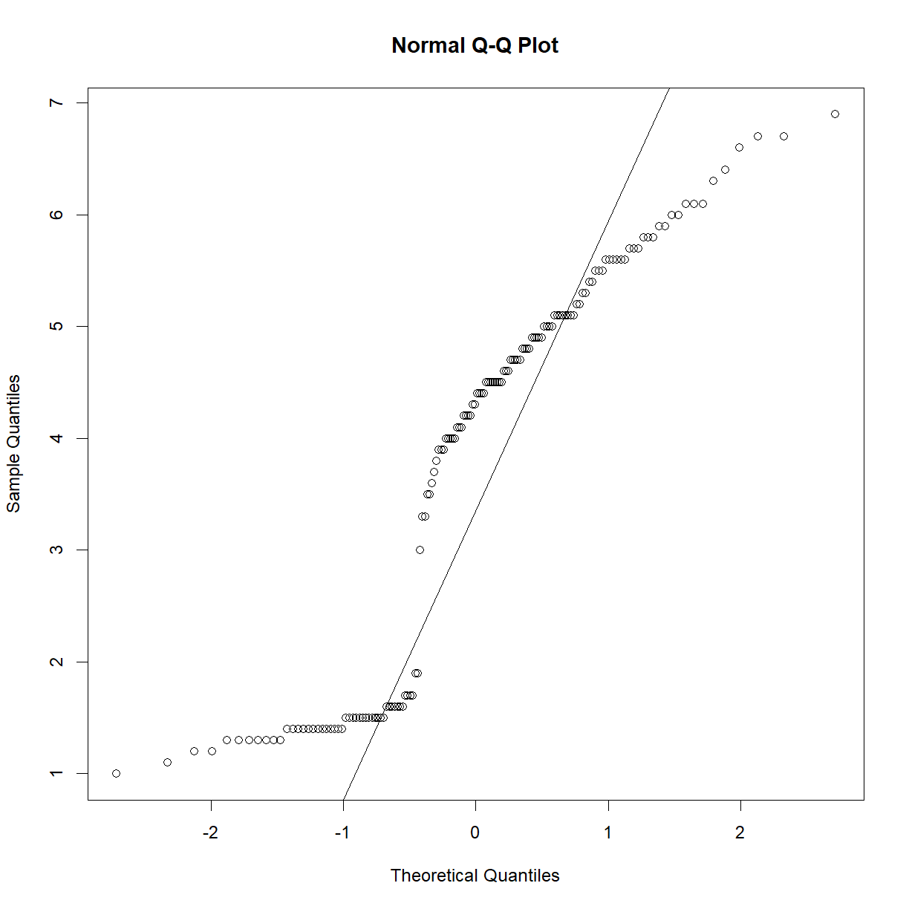
> > 
> > Not really close to normal... We can first try transforming the data 
> > to see if we can get the distribution to a more normal state. 
> > 
> > 
> > ~~~
> > qqnorm(log(iris$Petal.Length))
> > qqline(log(iris$Petal.Length))
> > ~~~
> > {: .language-r}
> > 
> > 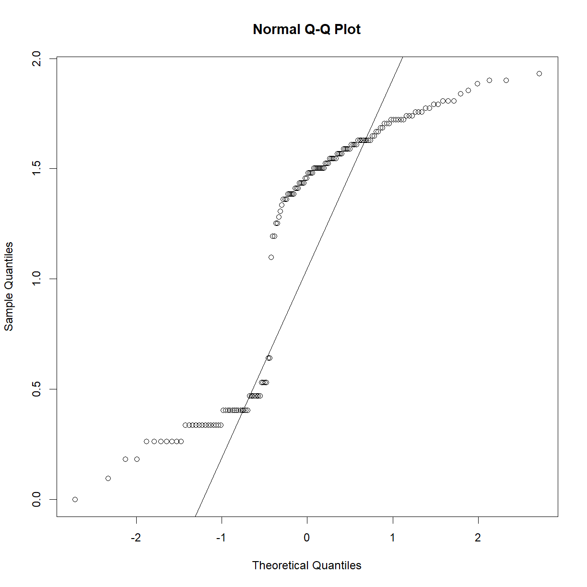
> > 
> > ~~~
> > qqnorm(exp(iris$Petal.Length))
> > qqline(exp(iris$Petal.Length))
> > ~~~
> > {: .language-r}
> > 
> > 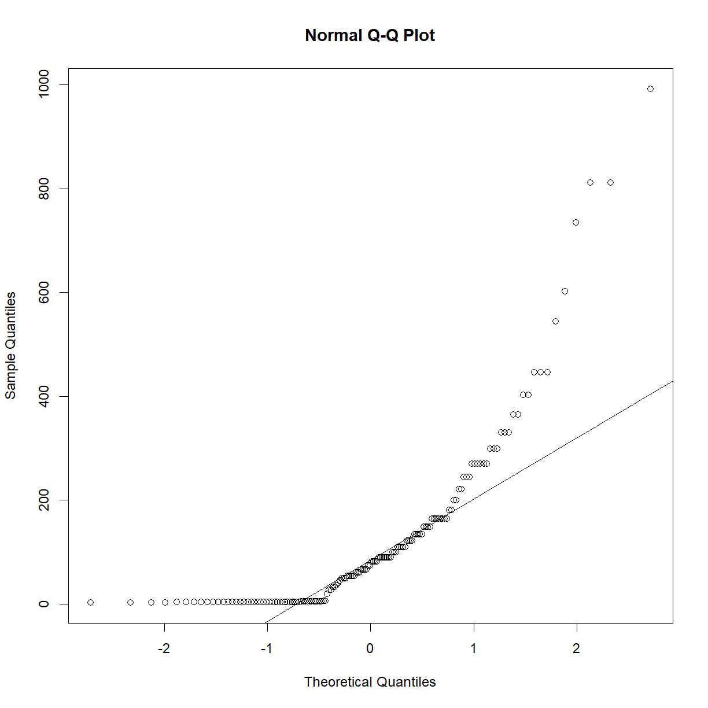
> > 
> > ~~~
> > qqnorm(1/iris$Petal.Length)
> > qqline(1/iris$Petal.Length)
> > ~~~
> > {: .language-r}
> > 
> > 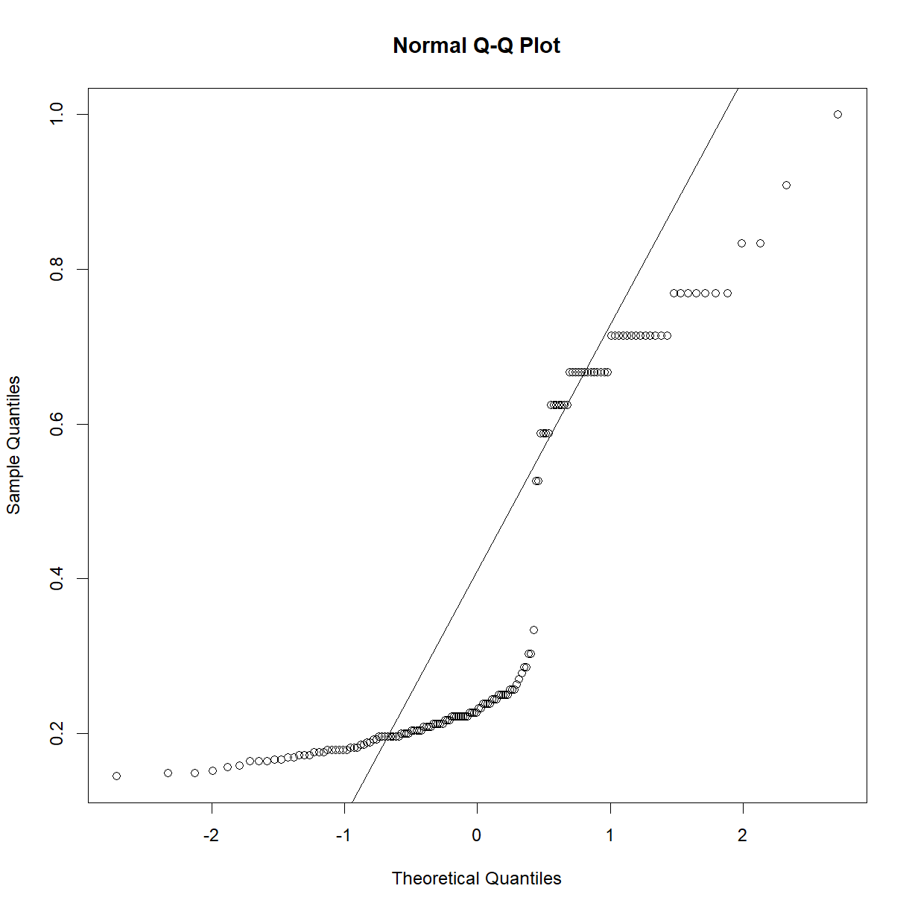
> > 
> > ~~~
> > qqnorm((iris$Petal.Length)^2)
> > qqline((iris$Petal.Length)^2)
> > ~~~
> > {: .language-r}
> > 
> > 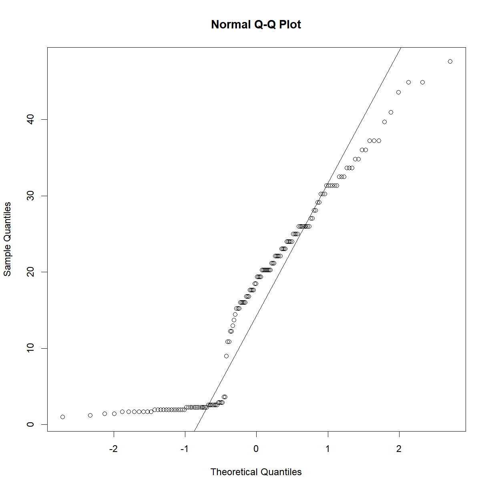
> > 
> > ~~~
> > qqnorm((iris$Petal.Length)^(1/2))
> > qqline((iris$Petal.Length)^(1/2))
> > ~~~
> > {: .language-r}
> > 
> > 
> > 
> > Nothing really helps, so that means nonparametric testing!
> > 
> > Referencing the above chart, the best fir is the non-parametric ANOVA, > > also called the Kruskal-Wallis rank sum test. From the UCLA site 
> > above, we can find the appropriate R function:
> > 
> > 
> > ~~~
> > kruskal.test(Petal.Length ~ Species, data = iris)
> > ~~~
> > {: .language-r}
> > 
> > 
> > 
> > ~~~
> > 
> > 	Kruskal-Wallis rank sum test
> > 
> > data:  Petal.Length by Species
> > Kruskal-Wallis chi-squared = 130.41, df = 2, p-value < 2.2e-16
> > ~~~
> > {: .output}
> > 
> > We conclude that species does affect petal length in irises. We can 
> > also visualize the differnece using a boxplot:
> > 
> > 
> > ~~~
> > boxplot(Petal.Length ~ Species, data = iris, outline = F)
> > stripchart(Petal.Length ~ Species, data = iris, add = T,
> >            vert = T, pch = 16, method = "jitter")
> > ~~~
> > {: .language-r}
> > 
> > 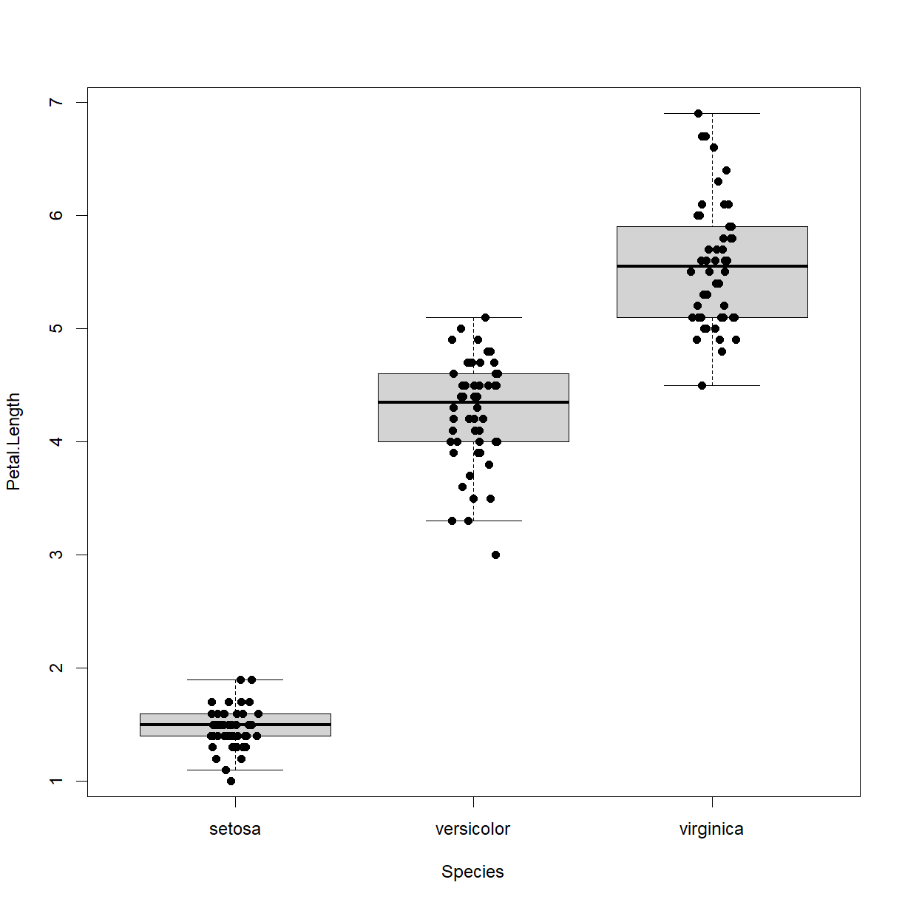
> > 
> > &nbsp;
> > 
> > As a point of discussion, petal length does follow a reasonably 
> > normal distribution, if you look within each species:
> > 
> > 
> > ~~~
> > par(mfrow = c(1,3))
> > qqnorm(iris$Petal.Length[iris$Species == "setosa"])
> > qqline(iris$Petal.Length[iris$Species == "setosa"])
> > qqnorm(iris$Petal.Length[iris$Species == "versicolor"])
> > qqline(iris$Petal.Length[iris$Species == "versicolor"])
> > qqnorm(iris$Petal.Length[iris$Species == "virginica"])
> > qqline(iris$Petal.Length[iris$Species == "virginica"])
> > ~~~
> > {: .language-r}
> > 
> > 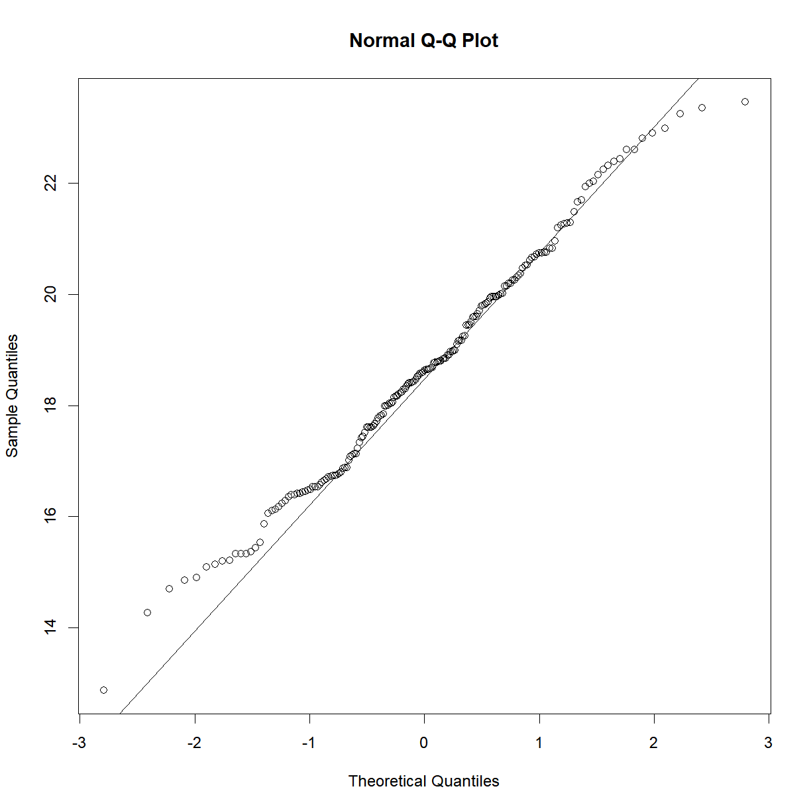
> > 
> > &nbsp;
> > 
> > Assuming a normal distribution is warranted in this case because each 
> > of the independent samples appears to come from a normally distributed > > population. However, even if this sort of situation is present in your > > dataset, the source of the deviation from normality may not be your 
> > independent variable of interest. It may be that there is an unknown 
> > (and unmeasured) independent variable. If you can't identify what is 
> > driving the non-normality, you have to continue your analysis without 
> > assuming that the data is normally distributed.
> {: .solution}
{: .challenge}

&nbsp;

> ## Does diet affect body weight?
> 
> In our mouse diet data set (*b6.aj.hfhs.diet.txt*), is the impact of 
> diet on body weight statistically significant ($$\alpha < 0.05$$)?
>
> > ## Solution
> > 
> > First load the data and remind ourselves of the structure:
> > 
> > 
> > ~~~
> > data.diet <- read.delim("./data/b6.aj.hfhs.diet.txt")
> > str(data.diet)
> > ~~~
> > {: .language-r}
> > 
> > 
> > 
> > ~~~
> > 'data.frame':	191 obs. of  17 variables:
> >  $ strain         : chr  "A/J" "A/J" "A/J" "A/J" ...
> >  $ sex            : chr  "m" "m" "m" "m" ...
> >  $ animal_id      : int  16 17 18 19 20 21 22 23 24 25 ...
> >  $ animal_facility: chr  "ARC" "ARC" "ARC" "ARC" ...
> >  $ bw_start       : num  19.6 18.9 17.8 17.1 17.4 ...
> >  $ bw_end         : num  33.1 32.6 29.6 25.9 28.1 ...
> >  $ bw_gain        : num  13.51 13.74 11.73 8.85 10.66 ...
> >  $ body_length    : num  10.8 10.9 10.8 10.1 10.1 10.1 9.8 10.1 10.2 10.1 ...
> >  $ BMI            : num  0.28 0.27 0.25 0.25 0.28 0.28 0.31 0.28 0.29 0.3 ...
> >  $ GLU            : num  9.49 11.71 11.32 10.66 9.71 ...
> >  $ INS            : num  35.1 62.5 24.9 40.3 106.2 ...
> >  $ HOMA_IR        : num  2.09 4.58 1.77 2.69 6.46 2.25 8.88 5.23 3.07 4.45 ...
> >  $ CHOL           : num  3.17 3.15 2.63 3.38 2.76 2.65 3.43 2.86 3.12 3.07 ...
> >  $ TG             : num  1.07 1.54 0.86 0.66 0.8 0.66 1.07 1.47 0.76 0.8 ...
> >  $ liver_wt       : num  0.95 0.96 0.92 0.94 0.82 0.82 0.84 0.85 0.8 0.86 ...
> >  $ liver_TG       : int  114 95 107 67 109 79 49 36 60 104 ...
> >  $ liver_TG_tot   : num  108.3 91.4 98.5 63.1 89.3 ...
> > ~~~
> > {: .output}
> > 
> > Next examine the distribution of the before and after diet body 
> > weights.
> > 
> > 
> > ~~~
> > qqnorm(data.diet$bw_start)
> > qqline(data.diet$bw_start)
> > ~~~
> > {: .language-r}
> > 
> > 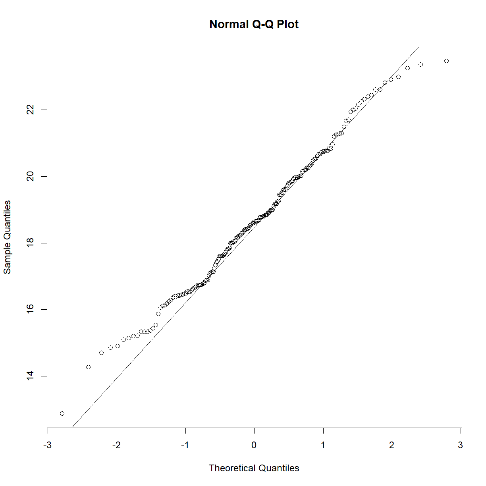
> > 
> > ~~~
> > qqnorm(data.diet$bw_end)
> > qqline(data.diet$bw_end)
> > ~~~
> > {: .language-r}
> > 
> > 
> > 
> > Starting body weight looks okay, but ending body weight looks very 
> > skewed. Learning from the above exercise using the `iris` data set, 
> > perhaps this is a strain effect? Let's break it down further 
> > and recheck.
> > 
> > 
> > ~~~
> > par(mfrow = c(1,2))
> > 
> > qqnorm(data.diet$bw_start[data.diet$strain == "C57BL/6J"])
> > qqline(data.diet$bw_start[data.diet$strain == "C57BL/6J"])
> > qqnorm(data.diet$bw_end[data.diet$strain == "C57BL/6J"])
> > qqline(data.diet$bw_end[data.diet$strain == "C57BL/6J"])
> > ~~~
> > {: .language-r}
> > 
> > 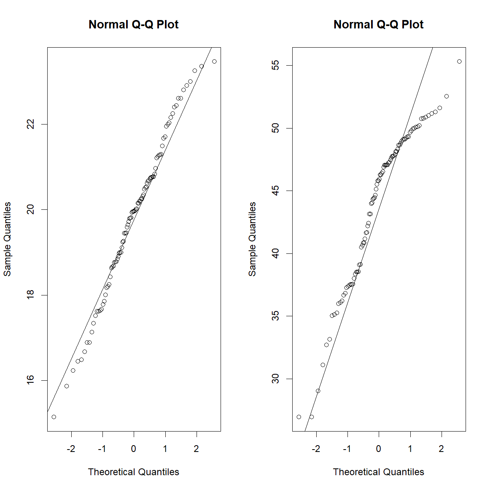
> > 
> > ~~~
> > qqnorm(data.diet$bw_start[data.diet$strain == "A/J"])
> > qqline(data.diet$bw_start[data.diet$strain == "A/J"])
> > qqnorm(data.diet$bw_end[data.diet$strain == "A/J"])
> > qqline(data.diet$bw_end[data.diet$strain == "A/J"])
> > ~~~
> > {: .language-r}
> > 
> > 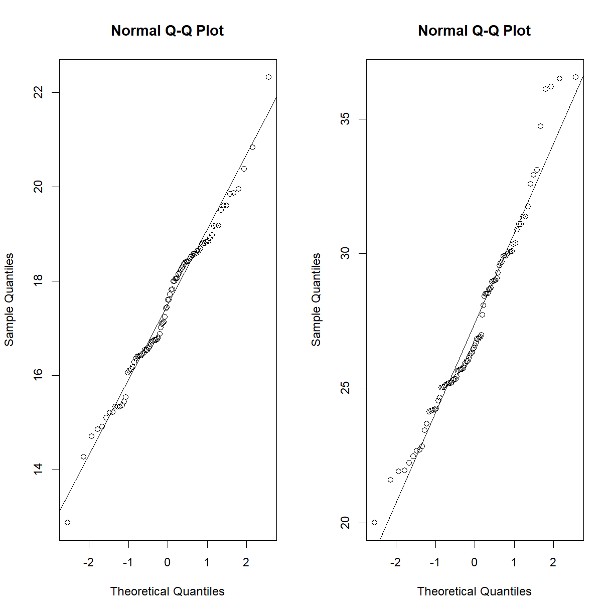
> > 
> > That looks a lot closer (still a bit skewed on the high body weight 
> > side for C57BL/6J, but we have almost 100 mice, so we will go ahead 
> > with the normal assumption).
> > 
> > Our data is paired, our independent variable is categorical (before 
> > vs. after HF-HS diet) and our dependent variable is continuous 
> > numeric. Since we are assuming normality, we can use a paired t-test 
> > (again broken down by strain, because that's where are data are 
> > normal):
> > 
> > 
> > ~~~
> > t.test(data.diet$bw_start[data.diet$strain == "C57BL/6J"],
> >        data.diet$bw_end[data.diet$strain == "C57BL/6J"],
> >        paired = T, alternative = "two.sided")
> > ~~~
> > {: .language-r}
> > 
> > 
> > 
> > ~~~
> > 
> > 	Paired t-test
> > 
> > data:  data.diet$bw_start[data.diet$strain == "C57BL/6J"] and data.diet$bw_end[data.diet$strain == "C57BL/6J"]
> > t = -44.553, df = 95, p-value < 2.2e-16
> > alternative hypothesis: true difference in means is not equal to 0
> > 95 percent confidence interval:
> >  -25.14135 -22.99636
> > sample estimates:
> > mean of the differences 
> >               -24.06885 
> > ~~~
> > {: .output}
> > 
> > 
> > 
> > ~~~
> > t.test(data.diet$bw_start[data.diet$strain == "A/J"],
> >        data.diet$bw_end[data.diet$strain == "A/J"],
> >        paired = T, alternative = "two.sided")
> > ~~~
> > {: .language-r}
> > 
> > 
> > 
> > ~~~
> > 
> > 	Paired t-test
> > 
> > data:  data.diet$bw_start[data.diet$strain == "A/J"] and data.diet$bw_end[data.diet$strain == "A/J"]
> > t = -31.834, df = 94, p-value < 2.2e-16
> > alternative hypothesis: true difference in means is not equal to 0
> > 95 percent confidence interval:
> >  -10.544198  -9.306118
> > sample estimates:
> > mean of the differences 
> >               -9.925158 
> > ~~~
> > {: .output}
> > 
> > Diet does significantly effect body weight in both strain backgrounds.
> > Let's check out the box plot:
> > 
> > 
> > ~~~
> > # first we have to build a data frame that has the data in the right 
> > # format
> > bw.data <- data.frame(bw = c(data.diet$bw_start, data.diet$bw_end), 
> >                       time = c(rep("start",length(data.diet$bw_start)),
> >                                rep("end",length(data.diet$bw_end))),
> >                       strain = c(data.diet$strain, data.diet$strain))
> > 
> > # order the time variable so that it plots in the right order
> > bw.data$time = factor(bw.data$time, levels = c("start","end"))
> > 
> > # plot the boxplot and stripchart
> > bob <- boxplot(bw ~ time + strain, data = bw.data, outline = F)
> > stripchart(bw ~ time + strain, data = bw.data, add = T,
> >         pch = 16, method = "jitter", vert = T)
> > ~~~
> > {: .language-r}
> > 
> > 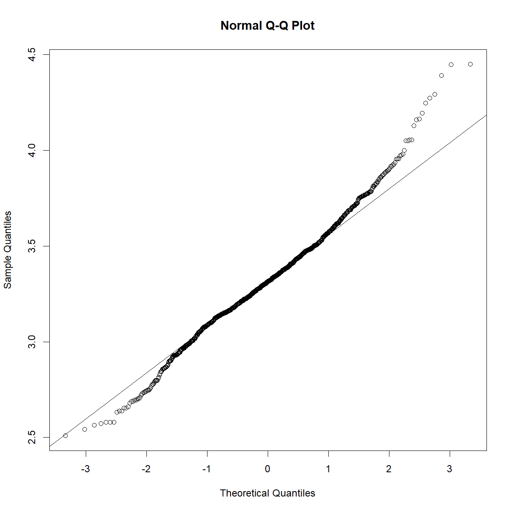
> > 
> > &nbsp;
> > 
> > From this we can clearly see the differences between starting and ending 
> > body weight for both strains, but the difference seems to be more severe for 
> > C57BL/6 mice. This likely explains the non-normal structure of the `bw_end` 
> > data when we looked at both strains combined.
> {: .solution}
{: .challenge}

&nbsp;

> ## Does strain affect body weight in mice?
> 
> A large study of different inbred strains was conducted in mice across 
> lifespan. This data is stored in a file called *inbred.body.composition.txt*. 
> Does strain background affect body weight in mice?
> 
> > ## Solution
> > 
> > 
> > Load the data and look at the structure:
> > 
> > 
> > ~~~
> > data.bodycomp <- read.delim("./data/inbred.body.composition.txt")
> > str(data.bodycomp)
> > ~~~
> > {: .language-r}
> > 
> > 
> > 
> > ~~~
> > 'data.frame':	1187 obs. of  10 variables:
> >  $ strain       : chr  "129S1/SvImJ" "129S1/SvImJ" "129S1/SvImJ" "129S1/SvImJ" ...
> >  $ sex          : chr  "f" "f" "f" "f" ...
> >  $ animal_id    : chr  "SC-7749" "SC-7751" "SC-7752" "SC-7747" ...
> >  $ age          : int  6 6 6 6 6 6 6 6 6 6 ...
> >  $ body_weight_g: num  20.2 22.8 22.5 23.1 21.6 19.6 24 27.4 29.4 28.3 ...
> >  $ BMI          : num  2.66 2.88 2.97 2.92 2.85 2.71 2.96 3.38 3.33 3.49 ...
> >  $ percent_fat  : num  22.1 22.2 22.6 22.8 23.1 24 24.3 28.3 17.6 17.7 ...
> >  $ total_mass_g : num  17.9 19.8 19.4 20.6 18.9 17.3 21.3 25.1 26.5 25.9 ...
> >  $ lean_mass_g  : chr  "13.9" "15.4" "15" "15.9" ...
> >  $ fat_mass_g   : num  4.45 5.08 5.08 5.27 4.99 4.69 5.84 7.76 5.16 5 ...
> > ~~~
> > {: .output}
> > 
> > First look at normality within the body weight data.
> > 
> > 
> > ~~~
> > qqnorm(data.bodycomp$body_weight_g)
> > qqline(data.bodycomp$body_weight_g)
> > ~~~
> > {: .language-r}
> > 
> > 
> > 
> > Looks like a deviation from normality toward the higher end of the body 
> > weight spectrum. Let's try a log transformation.
> > 
> > 
> > ~~~
> > qqnorm(log(data.bodycomp$body_weight_g))
> > qqline(log(data.bodycomp$body_weight_g))
> > ~~~
> > {: .language-r}
> > 
> > 
> > 
> > That looks better. Not perfect, but given the large sample size (n = 1187), 
> > we are going to assume that the sampling distribution is normal). Given our 
> > previous body weight examples, body weight within each strain group is also 
> > likey normally distributed. It would be tedious to check all of the strains, 
> > but we can take a quick peak at a selection:
> > 
> > 
> > ~~~
> > par(mfrow = c(1,3))
> > 
> > qqnorm(data.bodycomp$body_weight_g[data.bodycomp$strain == "C57BL/6J"])
> > qqline(data.bodycomp$body_weight_g[data.bodycomp$strain == "C57BL/6J"])
> > qqnorm(data.bodycomp$body_weight_g[data.bodycomp$strain == "DBA/2J"])
> > qqline(data.bodycomp$body_weight_g[data.bodycomp$strain == "DBA/2J"])
> > qqnorm(data.bodycomp$body_weight_g[data.bodycomp$strain == "WSB/EiJ"])
> > qqline(data.bodycomp$body_weight_g[data.bodycomp$strain == "WSB/EiJ"])
> > ~~~
> > {: .language-r}
> > 
> > 
> > 
> > &nbsp;
> > 
> > Our dependent variable is continous, numeric (ratio) with an (assumed) 
> > normal distribution and our independent variable is catagroical with many 
> > levels. We can use an ANOVA test (`aov()` in R, rom the UCLA site). The 
> > UCLA notes that you have to request the `summary()` of the object created 
> > by `aov()` to see the P-values.
> > 
> > 
> > ~~~
> > anova.bodycomp <- aov(body_weight_g ~ strain, data = data.bodycomp)
> > summary(anova.bodycomp)
> > ~~~
> > {: .language-r}
> > 
> > 
> > 
> > ~~~
> >               Df Sum Sq Mean Sq F value Pr(>F)    
> > strain        31  52618  1697.4   59.66 <2e-16 ***
> > Residuals   1151  32745    28.4                   
> > ---
> > Signif. codes:  0 '***' 0.001 '**' 0.01 '*' 0.05 '.' 0.1 ' ' 1
> > 4 observations deleted due to missingness
> > ~~~
> > {: .output}
> > 
> > The impact of strain on body weight is highly significant. Check out the 
> > visualization:
> > 
> > 
> > ~~~
> > # first shrink the labels (cex) and add some more space the the bottom margin
> > par(cex = 0.7, mar = c(12,4,2,2)) 
> > boxplot(body_weight_g ~ strain, data = data.bodycomp, 
> >         outline = F, # not outliers
> >         las = 2, # rotate the strain names so that they fit under each box
> >         xlab = "") # turn of the "strain" x-axis label
> > ~~~
> > {: .language-r}
> > 
> > 
> {: .solution}
{: .challenge}

***


