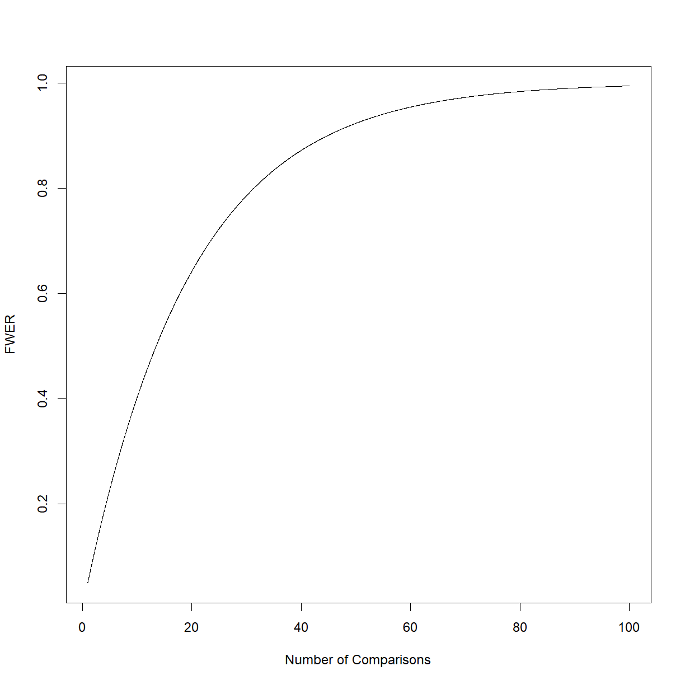
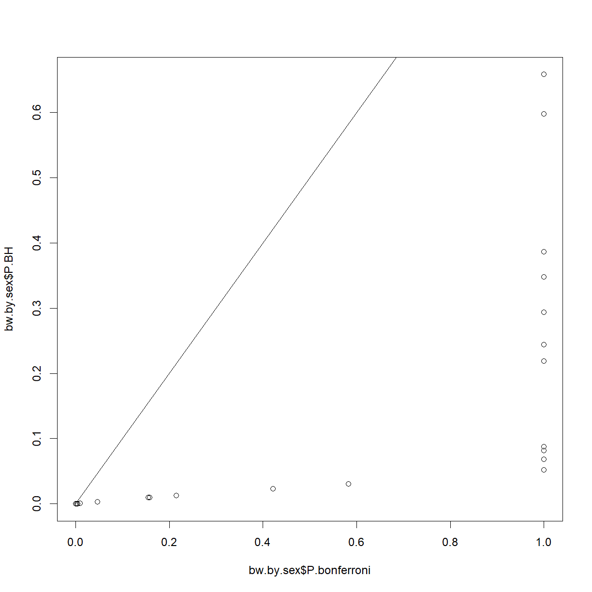

---
# Please do not edit this file directly; it is auto generated.
# Instead, please edit 07-oyo-multiple-test-correction.md in _episodes_rmd/
title: "Multiple Test Correction"
classdate: "9/16/2020 -- On Your Own"
teaching: 90
exercises: 30
questions:
  - "What is the consequence of running multiple statistical comparisons?"
  - "How do we define a family of tests?"
  - "What are the strategies for controlling error in multiple testing?"
objectives:
  - "Understand why we correct our interpretation of statistical tests when running multiple tests in a study."
  - "Understand what each common type of multiple test comparison controls for and when to choose each method."
  - "Use the p.adjust() function in R to correct P-values for multiple comparisons."
keypoints:
  - "Running multiple comparisons increases you chance of making a Type I Error."
  - "Different multiple test correction strategies correct for different types of errors (Type I vs. Type II) using different strategies."
  - "The basic outcome of a multiple test correction is to lower the P-value threshold ($$\alpha$$) below which you reject the null hypothesis."
source: Rmd
---

***
## On Your Own

&nbsp;
### Multiple test correction

When you run a statistical test, you draw a conclusion based on the probability of observing the data from your sample if the null hypothesis is true. Each time you run a statistical test, there is a chance of making either a Type I Error (rejecting $$H_0$$ when $$H_0$$ is true) or a Type II Error (accepting $$H_0$$ when $$H_1$$ is true). 

As we discussed previously, we set the P-value threshold, $$\alpha$$ in such a way that we control Type I Errors. The standard value, $$\alpha = 0.05$$, means that there is a 5% change of getting the observed result even if $$H_0$$ is true. Note that this *does not* mean that there is a 5% chance that the $$H_0$$ is true based on the observed data.

So what happens when, within a given study, you run 20 statistical tests? Randall Monroe gives an excellent example of what can happen (and how it can be, and often is, misinterpreted):

<figure>
  <!--  -->
  
  <figcaption>Image credit <a href="https://xkcd.com/882/">xkcd.com</a></figcaption>
</figure>

&nbsp;

In the example, the researchers tested for acne associated with each of 20 different jelly bean colors, and found that green jelly beans were significantly associated with acne!!

Does this mean that green jelly beans cause acne? No, of course not. Even if the association were real, perhaps people with acne just like green jelly beans better. However, even that is going too far. Recall that setting $$\alpha$$ = 0.05 means that we expect to reject $$H_0$$ 5% of the time (or 1 time in 20) when $$H_0$$ is true. So the illustrated test gave the expected outcome if jelly beans (of any color) had no connection to acne.

We have to consider the "family" of tests that we are conducting within a study to draw appropriate conclusions about our data. The process of multiple test correction formalizes this procedure.

> ## All in the family
> 
> We said that you have to consider your P-values in the context of the 
> *family* of tests that you are running in your study. So what do we 
> mean by  family? It turns out that this term is not well defined. 
> 
> The  XKCD jelly bean example is one extreme, where the P-value for each
> individual test in a clearly linked set of tests was interpreted on 
> it's own. The set of jelly bean tests were clearly related, and should
> be considered as a whole. Thus we consider these a *family*.
> 
> Near the other extreme is your average Cell paper, which can have 10s to 
> 100,000s (or more in the age of systems biology) statistical tests in one
> paper. Should you group all of the various P-values calculated in one 
> paper across figures and data types and treat them all as a family? Clearly
> not. 
> 
> So where do you draw the line? Usually a family of tests are a series of 
> statistical tests on similar data types using the same statistical test
> interpretation of which is carried out together. Usually the interpretation
> of each test in the family will have some relation to the other test. 
> Perhaps you are running a screen and want to pick candidates for further 
> testing for example. There is not a bright line crossing which makes your
> set of tests a family. Ultimately, you have to use your own judgement.
{: .callout}

***
### Controlling Familywise Error Rate (FWER)
  
The most conservative version of a multiple test correction is designed to control the *familywise error rate* or *FWER*. The FWER is the probability that your family of tests includes *one or more* false positives (Type I Errors). FWER is the simplest to understand, because it is the direct familywise analog to $$\alpha$$ for a single test. 

We can calculate the FWER for $$\alpha = 0.05$$ as the number of comparisons, $$n_{tests}$$, increases:

&nbsp;&nbsp;&nbsp;&nbsp;&nbsp;&nbsp;$$FWER = 1 - 0.95^n_{tests}$$ 

Plotting this equation:

&nbsp;
#### The Bonferroni correction

The most direct way to control FWER is to simply lower the critical P-value to the point where your expected number of Type I Errors once again falls below your original single-test threshold. To do this, divide your original $$\alpha$$ by the number of tests conducted:

&nbsp;&nbsp;&nbsp;&nbsp;&nbsp;&nbsp;$$\alpha_{corrected} = \frac{alpha}{n_{tests}}$$

&nbsp;

This is called the Bonferroni correction, after [Carlo Emilio Bonferroni](https://en.wikipedia.org/wiki/Carlo_Emilio_Bonferroni). This correction makes no assumptions about your data, population, or sampling method, so it works for any situation. All you need are you P-values from each statistical test, and the number of tests run.  For the jelly bean example, the researchers performed 20 tests with $$\alpha = 0.05$$, so 

&nbsp;&nbsp;&nbsp;&nbsp;&nbsp;&nbsp;$$\alpha_{corrected} = \frac{alpha}{n_{tests}} = \frac{0.05}{20} = 0.0025$$ 

&nbsp;

We now need a much lower P-value to reject the null hypothesis. Alternatively, we can leave $$\alpha$$ and correct the P-value by multiplying by the number of tests (max P-value is always 1):

&nbsp;&nbsp;&nbsp;&nbsp;&nbsp;&nbsp;$$P_{corrected} = min(P*n_{tests}, 1)$$ 

&nbsp;

Let's look at a real example. In the inbred lifespan study that we have examined in previous classes, body composition data was collected for each strain across lifespan. First, load body composition data set:

~~~
body.comp <- read.delim("data/inbred.body.composition.txt")
head(body.comp)
~~~
{: .language-r}

~~~
       strain sex animal_id age body_weight_g  BMI percent_fat
1 129S1/SvImJ   f   SC-7749   6          20.2 2.66        22.1
2 129S1/SvImJ   f   SC-7751   6          22.8 2.88        22.2
3 129S1/SvImJ   f   SC-7752   6          22.5 2.97        22.6
4 129S1/SvImJ   f   SC-7747   6          23.1 2.92        22.8
5 129S1/SvImJ   f   SC-7746   6          21.6 2.85        23.1
6 129S1/SvImJ   f   SC-7745   6          19.6 2.71        24.0
  total_mass_g lean_mass_g fat_mass_g
1         17.9        13.9       4.45
2         19.8        15.4       5.08
3         19.4          15       5.08
4         20.6        15.9       5.27
5         18.9        14.5       4.99
6         17.3        13.1       4.69
~~~
{: .output}

&nbsp;

Let's setup an analysis to calculate the t-test P-value comparing body weight of male vs. female mice
in each strain.

~~~
# grab strain list
strain.list <- unique(body.comp$strain)

# initialize data frame to store output information
bw.by.sex <- data.frame(strain = strain.list,
                        P = numeric(length = length(strain.list)))

# cycle through each strain and compare male and female body weight using a t-test
for (i.strain in 1:length(strain.list)) {
  # grab current strain name
  strain.c <- strain.list[i.strain]
  
  # run t-test for male vs. female body weight for current strain
  t.test.c <- t.test(body_weight_g ~ sex, 
                     data = body.comp[body.comp$strain == strain.c,],
                     type = "two.sample",
                     alternative = "two.sided")
  
  # update data frame
  bw.by.sex$P[i.strain] <- t.test.c$p.value
}

# display strains with significant P-values (alpha < 0.05)
bw.by.sex$strain[bw.by.sex$P < 0.05]
~~~
{: .language-r}

~~~
 [1] 129S1/SvImJ       BALB/cByJ         BUB/BnJ          
 [4] C3H/HeJ           C57BL/10J         C57BL/6J         
 [7] C57BLKS/J         C57BR/cdJ         C57L/J           
[10] FVB/NJ            LP/J              MOLF/EiJ         
[13] NOD.B10Sn-H2<b>/J NON/ShiLtJ        P/J              
[16] PL/J              PWD/PhJ           RIIIS/J          
[19] SM/J              SWR/J             WSB/EiJ          
32 Levels: 129S1/SvImJ A/J AKR/J BALB/cByJ BTBR T+ tf/J ... WSB/EiJ
~~~
{: .output}

&nbsp;

We have 21 strains where sex significantly impacts body weight. But with 32 strains we ran 32 tests, and our threshold $$\alpha = 0.05$$ means that we expect 1 to 2 of these to be false positives. Let's try the Bonferroni multiple test correction.

~~~
# add a row for corrected P-value
bw.by.sex$P.manual = NA

# calculate Bonferroni corretion manually (note that min is not a vectorized function)
for (i in 1:length(bw.by.sex$P)) {
  bw.by.sex$P.manual[i] <- min(bw.by.sex$P[i]*length(bw.by.sex$P), 1)
}
~~~
{: .language-r}

&nbsp;

R has a function, `p.adjust()` which automatically calculates the adjusted P-value using a variety of methods:

~~~
# calculate Bonferroni corrected P-value using p.adjust()
bw.by.sex$P.bonferroni <- p.adjust(bw.by.sex$P, method = "bonferroni")

# check against manual 
bw.by.sex$P.manual == bw.by.sex$P.bonferroni
~~~
{: .language-r}

~~~
 [1] TRUE TRUE TRUE TRUE TRUE TRUE TRUE TRUE TRUE TRUE TRUE TRUE TRUE TRUE
[15] TRUE TRUE TRUE TRUE TRUE TRUE TRUE TRUE TRUE TRUE TRUE TRUE TRUE TRUE
[29] TRUE TRUE TRUE TRUE
~~~
{: .output}

~~~
# how many strains now have significant differences?
bw.by.sex$strain[bw.by.sex$P.bonferroni < 0.05]
~~~
{: .language-r}

~~~
 [1] BALB/cByJ         BUB/BnJ           C3H/HeJ          
 [4] C57BL/10J         C57BL/6J          C57BLKS/J        
 [7] C57L/J            LP/J              NOD.B10Sn-H2<b>/J
[10] P/J               PL/J              RIIIS/J          
[13] SM/J              SWR/J            
32 Levels: 129S1/SvImJ A/J AKR/J BALB/cByJ BTBR T+ tf/J ... WSB/EiJ
~~~
{: .output}

&nbsp;

Applying the Bonferroni method reduces the number of strains with significant body weight between sexes from 21 to 14.

As you might already realize, the Bonferroni test reduces Type I Error rates ($$\alpha$$) at the cost of increasing the risk of committing a Type II Error ($$\beta$$; accepting $$H_0$$ when $$H_1$$ is true), and thus reducing power ($$1 - \beta$$). Thankfully, there is a universally better option that does at least a bit better.

&nbsp;
#### The Holm-Bonferroni correction

The primary advantage to the Bonferroni is that the procedure is intuitive and the calculations can be done in your head. This makes it ideal for a back-of-the-envelope first-pass examination of you data to see if you have any comparisons that are in the ballpark. 

There is a closely related procedure called the Holm-Bonferroni (or just Holm) method for multiple test correction. The procedure and proof is more complicated and, while it can be done by hand without too much trouble, will generally require a computer for efficient processing. If you are interested in the mathematics, there are many places that describe the underlying principles, and the Wikipedia article on [Holm-Bonferroni method](https://en.wikipedia.org/wiki/Holm%E2%80%93Bonferroni_method) does a decent job.

The bottom line is that the Holm method does just as good a job at controlling FWER, but does so with better power in all cases. This method is also available in the `p.adjust()` function:

~~~
# calculate Bonferroni corrected P-value using p.adjust()
bw.by.sex$P.holm <- p.adjust(bw.by.sex$P, method = "holm")

# how many strains now have significant differences?
bw.by.sex$strain[bw.by.sex$P.bonferroni < 0.05]
~~~
{: .language-r}

~~~
 [1] BALB/cByJ         BUB/BnJ           C3H/HeJ          
 [4] C57BL/10J         C57BL/6J          C57BLKS/J        
 [7] C57L/J            LP/J              NOD.B10Sn-H2<b>/J
[10] P/J               PL/J              RIIIS/J          
[13] SM/J              SWR/J            
32 Levels: 129S1/SvImJ A/J AKR/J BALB/cByJ BTBR T+ tf/J ... WSB/EiJ
~~~
{: .output}

&nbsp;

Still 14 strains, so the Holm method produces similar results to the Bonferroni in this case. How do the P-values compare?

~~~
# plot P-values for Bonferroni vs. Holm with a line for equal values
plot(bw.by.sex$P.bonferroni, bw.by.sex$P.holm)
lines(x = c(0,1), y = c(0,1))
~~~
{: .language-r}

&nbsp;

Despite not finding any new significant strains, it is clear that Holm calculates a lower adjusted P-value in each case relative to Bonferroni. This visually demonstrates that Bonferroni is more conservative. 

While the Holm method is all around better than the Bonferroni method, all FWER are very conservative, strictly limiting the probability of any Type I Error occurring to a defined maximum. This if generally fine if you are making a few 10s of comparisons. But what about 1,000s or 100,000s of comparisons, which is commonly needed to analyze '-omics' data? FWER methods will control Type I Errors, but will also tremendously limit your power to detect any real differences that are actually present. We need a different type of correction.

***
### Controlling False Discovery Rate (FDR)

A second class of multiple test correction focuses on "discoveries"--comparisons with significant P-values--and limits the fraction of total discoveries that are false (i.e. the False Discovery Rate, or FDR), in contrast to FWER methods, which control the fraction of false discoveries relative to the total number of comparisons. 

Let's say we run 1000 comparisons, and 50 are signficant using the uncorrected P-value (we reject $$H_0$$ in 50 comparisons). FWER will ensure that we only have a small chance that we accidentally reject $$H_0$$ incorrectly. In the process, after correction, we only have 20 significant values remaining. In contrast, FDR analysis may remove 5, leaving 45 correct, with an expectation that 4-5 of these remaining are incorrectly rejected $$H_0$$s. The second approach has a lot more power to detect true differences, at the cost of a higher Type I Error rate.

&nbsp;
#### The Benjamini-Hochberg FDR method

The most common FDR procedure is the Benjamini-Hochberg method. Again, for more detail on the underlying mathematics, the Wikipedia page on [False Discovery Rate](https://en.wikipedia.org/wiki/False_discovery_rate) has a decent explanation. For our purposes, let's look at the practical output by applying the correction to our body weight data using `p.adjust()`:

~~~
# calculate Benjamini-Hochberg corrected P-value using p.adjust()
bw.by.sex$P.BH <- p.adjust(bw.by.sex$P, method = "BH")

# how many strains now have significant differences?
bw.by.sex$strain[bw.by.sex$P.BH < 0.05]
~~~
{: .language-r}

~~~
 [1] 129S1/SvImJ       BALB/cByJ         BUB/BnJ          
 [4] C3H/HeJ           C57BL/10J         C57BL/6J         
 [7] C57BLKS/J         C57BR/cdJ         C57L/J           
[10] FVB/NJ            LP/J              MOLF/EiJ         
[13] NOD.B10Sn-H2<b>/J NON/ShiLtJ        P/J              
[16] PL/J              RIIIS/J           SM/J             
[19] SWR/J            
32 Levels: 129S1/SvImJ A/J AKR/J BALB/cByJ BTBR T+ tf/J ... WSB/EiJ
~~~
{: .output}

In this case, by setting $$\alpha = 0.05$$ we are stating that we expect 5% of *significant P-values* to be false positives. Since we now have 19 strains with significant differences in body weight, we expect that approximately one of these strains does not actually have a body weight difference between sexes. Let's compare these P-values to those calculated using the FWER method:

~~~
# plot P-values for Bonferroni vs. Benjamini-Hochberg with a line for equal values
plot(bw.by.sex$P.bonferroni, bw.by.sex$P.BH)
lines(x = c(0,1), y = c(0,1))
~~~
{: .language-r}

~~~
# plot P-values for holm vs. Benjamini-Hochberg with a line for equal values
plot(bw.by.sex$P.holm, bw.by.sex$P.BH)
lines(x = c(0,1), y = c(0,1))
~~~
{: .language-r}

&nbsp;

We can see that the P-values for the Bonferroni and Holm methods are substantially more conservative than the FDR method. 

***
### Other methods

There are other tests that make different assumptions about your data, sampling, and test procedures. We will not cover these here, but see the `p.adjust()` documentation, and various statistics textbooks and websites for additional information should you come across a more complex data set. 

***
### Exercises

***


