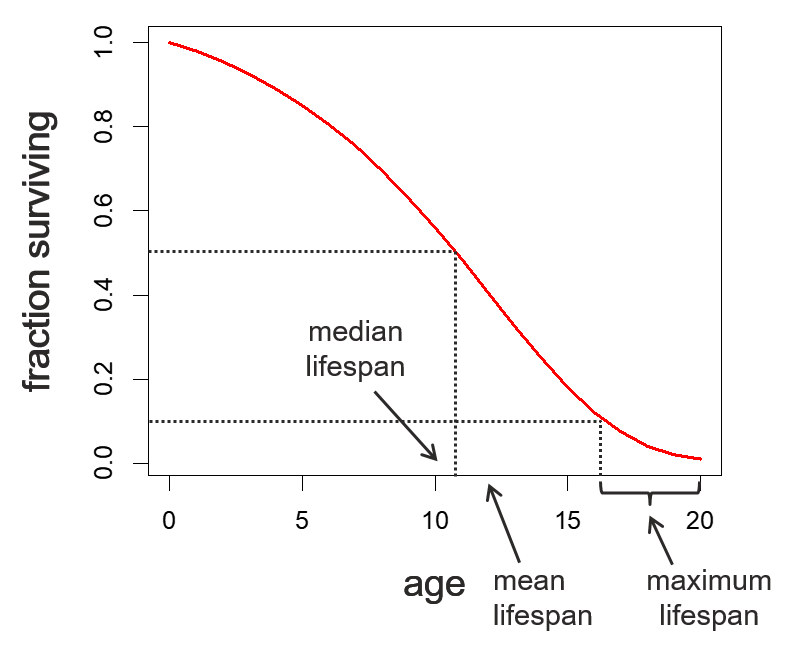
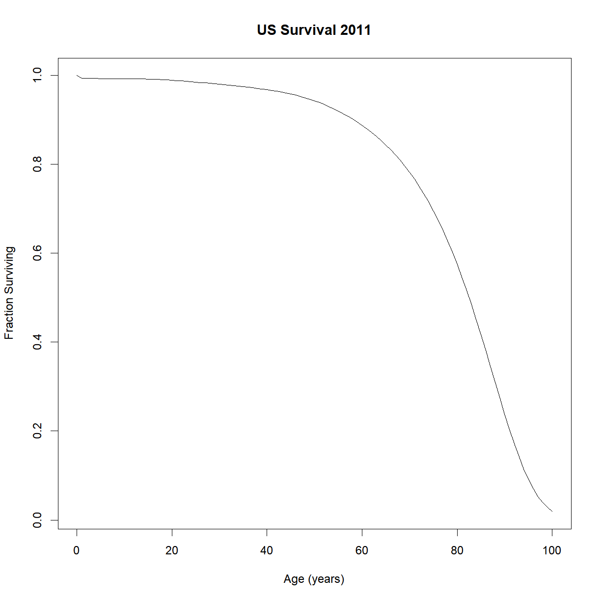
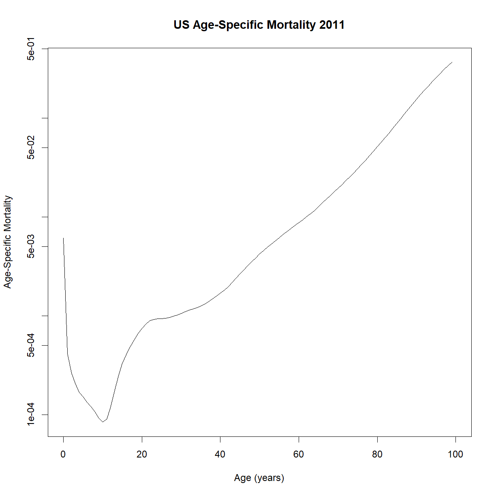
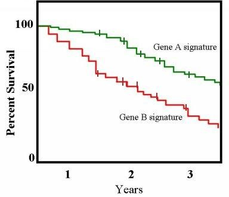
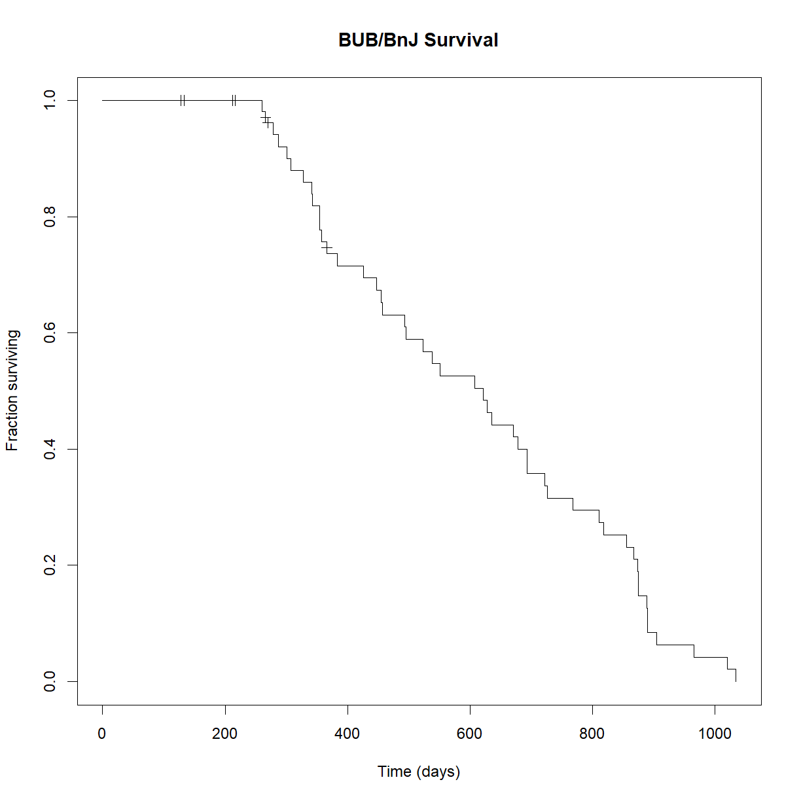
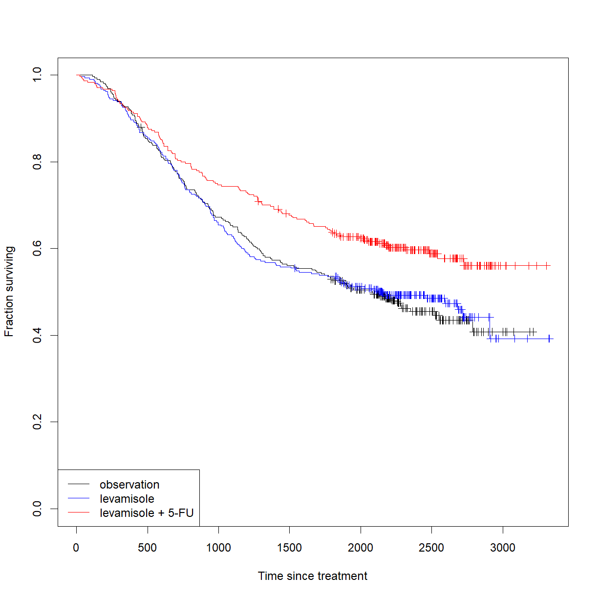

---
# Please do not edit this file directly; it is auto generated.
# Instead, please edit 08-class-survival-analysis.md in _episodes_rmd/
title: "Survival Analysis"
classdate: "9/15/2022 -- In Class"
teaching: 90
exercises: 30
questions:
- "How is time-to-event data structured?"
- "What are the elements that separate time-to-event data from single-point observations?"
- "How do we visualize time-to-event data?"
- "What statistical tests are available for time-to-event data hypothesis testing?"
objectives:
- "Describe the basic structure of time-to-event data." 
- "Understand censoring and how it affects time-to-event data."
- "Use the `survival` package to generate survival curves and age-specific mortality plots."
- "Use the Log-Rank tests to evaluate statistical differences between time-to-event observations between groups."
keypoints:
- "Time-to-event data includes a hybrid of an observation (event vs. no event) and a series of observation times."
- "Time-to-event data analysis violates several assumptions made by standard tests, including normality and independence of observations."
- "Censoring complicates analysis and is not handled by standard statistical tests. Instead, we use the Log-Rank test for basic survival comparisons."
- "Unlike the survival function, age-specific mortality at any given time does not depend on previous observations."
source: Rmd
---

## In Class

So far we have mostly been dealing with data that meets that basic assumptions of a t-test or other common statistical tests. In this class, we are going to look at a category of data that requires special consideration. Time-to-event data (e.g. survival or lifespan data) violates several assumptions made by many of our standard tests:

* It is not generally normally distributed.
* Observations are not independent (more below on this).
* Data is often censored.

In the following sections we will examine common methods for formatting, displaying, and analyzing time-to-event data, and how to implement these methods in R.

***
#### Missing data and censoring

When you are dealing with time-to-event data, subjects are selected (aka sampled) and observed repeatedly until some event occurs (or does not occur). This opens the possibility that a study will be completed without an observation of the event under study actually occurring. This can happen for a few reasons:

* A subject is removed from the study (e.g. a patient in a drug trial stops taking the drug on their own)
* A related event occurs that precludes occurrence of the event of interest (e.g. a patient in a cancer drug trial is killed in a car accident; this prevents the event of interest, "death from cancer" from occurring)
* A subject remains in the study, but the study concludes before the event of interest occurs

To deal with these cases, we include the subject in the study but use censoring to indicate that the event of interest was not observed between specific defined time points. There are three types of censoring:

1. Right-censoring: the event of interest occurs after some time *t*, but the specific time of is unknown.
 + e.g. a subject dies of an unrelated cause 
 + e.g. a subject is still alive at the end of the study
 + e.g. a subject leaves the study prior to its conclusion
 
2. Left-censoring: an individual’s entry date is unknown (e.g. birthdate in lifespan studies).
 + e.g. a subject infected with a pathogen enters a study, but the infection date is unknown 
 
3. Interval-censoring: the event of interest occurred in a known interval, but the precise time is unknown.
 + e.g. a patient is diagnosed with the disease of interest during a follow-up visit after a study concludes

Right-censoring is the most common. This is particularly true when using a model organism in the lab, where the birthdate or other entry criteria can be tightly controlled, but an individual exiting a study can happen for various reasons. We will only examine right-censoring in this class, but be aware of the other forms, particularly if you are dealing with data collected from human subjects.

> ## Why not just exclude censored data?
> 
> One option for dealing with an unexpected event (e.g. your mouse 
> escapes 18 months into your lifespan study) is to just leave out the 
> data for that individual. This has at least two problems for your 
> analysis:
> 
> * *Bias:* What if the unexpected event is correlated with you outcome 
> of interest? For example, perhaps only mice that are still healthy and 
> likely to have a long remaining lifespan will be capable of escaping at 
> 18 months of age. By not considering these mice, you will shift the 
> distribution of measured lifespan values toward shorter lifespan.
> * *Power:* Because the procedure in these studies is to (1) select a 
> sample, and (2) make repeated observations until the event occurs, we 
> already have observations collected up until the time point when an 
> individual is censored. Removing the individual from the analysis 
> removes potentially valuable data (e.g. we know that the mouse lived at least 18 
> months). Including these individuals with proper censoring will 
> increase your statistical power to detect changes.
{: .callout}

***
### Survival curves

The most common form of data presented for time-to-event data is the survival curve. The curve shows the fraction or percentage of the population surviving at a given time. The time measure can be age (as is the case for lifespan) or some other relevant defined point (e.g. diagnosis with a disease, cancer remission, time of treatment). 

Of course, we generally don't know the survival for every individual in the population and need to draw a best estimate from our sample data. To deal with this issue, we use two tools called the *Life Table*, to generate information about the survival characteristics over time, and *Kaplan-Meier curves* to draw approximate survival curves from sample data.

&nbsp;
#### The life table

The *Life Table* is a systematic way to tabulate observations and estimate survival parameters based on sample data. A Life Table has the following basic information:

* $$t_0 =$$ start time, relative to the time period of interest (e.g. for lifespan data, each individual's birth is set to time 0, even if they were born on different dates) 
* $$t =$$ observation time 
* $$d_t =$$ number of events observed at time t
* $$n_0 = \sum d_t =$$ original sample size (number of individuals in the sample prior to censoring or events)
* $$n_t = n_0 - \sum_{x = 0}^{t-1} d_x =$$ number of individuals at risk at time t (e.g. sampled, uncensored individuals with no event by time t)
* $$l_t = \frac{n_t}{n_0} =$$ fraction of the sample remaining at risk by time t
* $$S(t) \approx l_t =$$ survival function, the fraction of the population at risk at (aka "surviving to") time t 

We estimate the survival function by plotting $$l_t$$ vs. age $$t$$. Let's examine the survival of the US population as an example. The life table is stored in `US2011.life.table.txt`.

~~~
lt <- read.delim("./data/US2011.life.table.txt")
str(lt)
~~~
{: .language-r}

~~~
'data.frame':	101 obs. of  7 variables:
 $ age: int  0 1 2 3 4 5 6 7 8 9 ...
 $ qx : num  0.006058 0.000415 0.000264 0.000208 0.000167 ...
 $ lx : int  100000 99394 99353 99327 99306 99289 99274 99261 99249 99239 ...
 $ dx : chr  "606" "41" "26" "21" ...
 $ Lx : int  99470 99374 99340 99316 99298 99282 99268 99255 99244 99234 ...
 $ Tx : int  7870915 7771445 7672071 7572731 7473415 7374117 7274835 7175567 7076312 6977068 ...
 $ ex : num  78.7 78.2 77.2 76.2 75.3 74.3 73.3 72.3 71.3 70.3 ...
~~~
{: .output}

&nbsp; 

Note that what I called $$n_t$$ this particular data set calls $$l_x$$ (and that all subscripts are "x" instead of "t"). Some of the above variables (e.g. our $$l_t$$) are missing. To start, let's rename the variables to match our convention and calculate $$l_t$$:

~~~
# rename life table variables
names(lt) = c("t","qt","nt","dt","Lt","Tt","et")

# calculate l{t}
lt$lt = lt$nt/max(lt$nt)
head(lt)
~~~
{: .language-r}

~~~
  t       qt     nt  dt    Lt      Tt   et      lt
1 0 0.006058 100000 606 99470 7870915 78.7 1.00000
2 1 0.000415  99394  41 99374 7771445 78.2 0.99394
3 2 0.000264  99353  26 99340 7672071 77.2 0.99353
4 3 0.000208  99327  21 99316 7572731 76.2 0.99327
5 4 0.000167  99306  17 99298 7473415 75.3 0.99306
6 5 0.000151  99289  15 99282 7374117 74.3 0.99289
~~~
{: .output}

&nbsp; 

Now we can plot the survival curve:

~~~
plot(lt$t,lt$lt, type = "l",
     main="US Survival 2011",
     xlab="Age (years)",ylab="Fraction Surviving")
~~~
{: .language-r}

&nbsp; 

Great! That looks like a standard survival curve to me. We can see that median lifespan is around 85 years and maximum is out around 100. The tip of the tail (which won't appear on this chart since we only has ~100,000 people out of ~300,000,000) is really out at 122 or so.

From the equation for $$l_t$$, we can see that it depends on $$n_t$$, which in turn depends on all of the previously observed events ($$d_0$$ to $$d_t-1$$). Thus the survival function cannot be considered an variable with independent observations. This is one reason we can't use a t-test to make comparisons. For that we need to look at a different aspect of time-to-event data. A complete life table will have a few more columns:

* $$p_t = l_{t+1}/l_t =$$ probability that someone with no event at time t will still have no event by time t + 1.
* $$q_t = 1 - p_t =$$ probability that someone with no event at time t will experience the event by time t + 1.
* $$\lambda(t) = -\frac{\delta}{dx} ln[S(x)] \approx -ln(p_t) =$$ instantaneous rate at which the event occurs at time t; the slope of the log of the survival function. For survival data specifically, this is also called $$\mu_x =$$ age-specific mortality. 

The last variable, $$\lambda(t)$$ is called the hazard function (aka hazard rate, $$h(x)$$), or in the context of survival data, age-specific mortality or force of mortality ($$\mu_x$$). Conceptually, age-specific mortality represents the chance of an individual dying at that specific age. 

$$\lambda(t)$$, while not normally distributed, does not depend on previous observations, and can thus be considered a variable for which observations are independent. This allows us to make statistical comparisons. Let's look at how $$\lambda(t)$$ behaves.

~~~
# calculate pt and lambdat
lt$pt = 1 - lt$qt
lt$lambdat = -log(lt$pt)

# plot age specific mortality -- does the shape look familiar?
plot(lt$t, lt$lambdat, type = "l",
     main="US Age-Specific Mortality 2011",
     xlab="Age (years)", ylab="Age-Specific Mortality")
~~~
{: .language-r}

&nbsp;

Does that shape look familiar? It appears to increase exponentially with age. Try plotting the y-axis on a log-scale (using the `log = "y"` argument in plot; alternatively, you could plot `log(lt$lambdat)` on the y-axis):

~~~
plot(lt$t, lt$lambdat, type = "l", log="y",
     main="US Age-Specific Mortality 2011",
     xlab="Age (years)",
     ylab="Age-Specific Mortality")
~~~
{: .language-r}

&nbsp;

Despite the some odd behavior during the early part of life, age-specific mortality appears to increase linearly during the majority of adulthood. That looks like something we can model!

> ## Minimum age-specific mortality
>
> As an aside, what is up with that minimum point? At what age does that occur?
> 
> 
> ~~~
> lt$t[which.min(lt$lambdat)]
> ~~~
> {: .language-r}
> 
> 
> 
> ~~~
> [1] 10
> ~~~
> {: .output}
>
> &nbsp;
> 
> What happens to humans at roughly 10 years of age? Puberty! Thinking from an 
> evolutionary perspective, it makes sense that the minimum change of dying should
> occur at the point of maximum reproductive potential. Ability to reproduce is 
> a primary driver of species survival, and remaining reproductive potential only
> decreases with increasing age. 
> 
> Incidentally, this is one of the major categories of theory for why we age in 
> the first place. It isn't so much that aging is selected for, but that the decline
> in "remaining reproductive potential" decreases as we get older, and thus the selection
> pressure steadily reduces. If an allele gives us a boost to reproduction or health 
> early in life, it may be selected for even if it causes a fatal disease later in life. 
{: .callout}

&nbsp;
#### Kaplan-Meier curves

We never actually know the "real" shape of the survival curve for our population, or even our sample, because of the structure of time-to-event data. This is true for two reasons:

* We often have missing data that requires censoring (i.e. the event was never observed)
* Subjects are only observed at discrete time points, so we don't have access to the exact time that the event occurred. We instead know that the event had not occurred at some time *t - 1*, but that the event had occurred by time *t*. 

There is a type of survival curve estimator called the Kaplan-Meier curve which allows us to approximate the shape of the survival curve for a given set of time-to-event observations. Kaplan-Meier curves have the following properties.

* Estimates true survival curve when data is missing (i.e. when one or more observations is censored)
* Assumes that no deaths occur between observation times (i.e. approximates that each event occurred at the observation time, rather than at some unknown time between observations)
* Tick marks are used to indicate time at which a subject was censored for missing data.
* For the purposes of drawing the curve, censored individuals are included in the "total" or "at risk" sample size up until the time point where they were censored. After that point, the change in curve height for a new event occurrence is dependent on the reduced sample size with out the censored individual.

This is because the pool of patients remaining "at risk" for the event drops when either an event is experienced or when a patient is censored.

When an event occurs, the curve drops by a fraction of the remaining "at risk" pool *at that time point*. As patients are censored without an observed event, the remaining "at risk" pool decreases. Thus subsequent events drop the remaining % remaining by a larger and larger margin. A good step-by-step guide to how Kaplan-Meier curves are drawn can be found [here](https://towardsdatascience.com/kaplan-meier-curves-c5768e349479).

Let's look at our data from the inbred mouse aging study for an example. Make sure that the `survival` package is loaded, and read in the mouse lifespan data. For our purposes, let's look specifically at the strain BUB/BnJ, which has a number of censored mice.

~~~
# load survival package
library("survival")

# read in inbred strain lifespan data
data.surv <- read.delim("data/inbred.lifespan.txt")

# grab the subset of data for BUB/BnJ 
surv.bub <- data.surv[data.surv$strain == "BUB/BnJ",]

# check out the data
str(surv.bub)
~~~
{: .language-r}

~~~
'data.frame':	64 obs. of  5 variables:
 $ strain       : chr  "BUB/BnJ" "BUB/BnJ" "BUB/BnJ" "BUB/BnJ" ...
 $ sex          : chr  "f" "f" "f" "f" ...
 $ animal_id    : chr  "174" "175" "176" "177" ...
 $ lifespan_days: int  328 343 266 357 523 670 279 635 216 538 ...
 $ censor       : int  0 0 0 0 0 0 0 0 1 0 ...
~~~
{: .output}

&nbsp;

For survival analysis, the survival packages uses an odd notation for simulating the survival curve. In order to include data censoring, instead of using `lifespan_days` directly as the dependent variable, we use the notation `Surv(time, event status)`. This tells R that we have a set of censored survival data with observed event times (`lifespan_days`), and some mice that were censored and not observed to have died (`censor`). Let's contrast the data format here to the life table that we looked at above:

* **Life tables** describe populations, providing information about the number or fraction of individuals in different categories, or other population-level information like age-specific mortality for individuals within that population.
* **Mortality** data like that provided in the inbred mouse aging dataset describes individuals, providing phenotype data for each individual. 

A note on the lifespan variable. We have emphasized that the sampling method for survival data involves repeated binary observations (the event *did*/*did not* occur) at subsequent time points, but the mortality data simply provides a single data point for `lifespan_days`. The underlying assumption is that the individual was observed at all previous time points, but that the event of interest occurred at the reported time. If an individual was not censored (`censor = 0`), then we know the event occurred at that time point. If the individual was censored (`censor = 1`), then we know that the mouse was last observed alive at the reported time point. 

In our case, we use the `lifespan_days` as the time that we observed the event, and `censor` as our status variable. An important note: what `Surv()` wants for status is whether the event occurred. In this particular data set, the event was assumed to occur unless something odd happened (e.g. the mouse escaped), so `censor` is "0" when the mouse died (the event occurred) and "1" when something else happened (e.g. the mouse was "censored" and removed from the study because death, the event, was never observed). Thus we need to tell R that `censor == 0` means "the event occurred". 

The `survfit()` function builds the life table that we need for our analyses. We embed the `Surv()` object as the dependent variable in side the `survfit()` function. `survfit()` *always* needs an independent variable. If you want to just plot all of the data as a single curve, you can just give it "1", which tells R not to subset the data before running the analysis:

~~~
# calculate life table for BUB/BnJ mice
survfit.bub <- survfit(Surv(lifespan_days, censor == 0) ~ 1, data=surv.bub)

# use summary() to look at the life table
summary(survfit.bub)
~~~
{: .language-r}

~~~
Call: survfit(formula = Surv(lifespan_days, censor == 0) ~ 1, data = surv.bub)

 time n.risk n.event survival std.err lower 95% CI upper 95% CI
  260     52       1   0.9808  0.0190      0.94414        1.000
  266     51       1   0.9615  0.0267      0.91066        1.000
  279     47       1   0.9411  0.0330      0.87852        1.000
  287     46       1   0.9206  0.0381      0.84885        0.998
  301     45       1   0.9002  0.0424      0.82076        0.987
  307     44       1   0.8797  0.0461      0.79380        0.975
  328     43       1   0.8592  0.0494      0.76772        0.962
  341     42       1   0.8388  0.0523      0.74236        0.948
  343     41       1   0.8183  0.0549      0.71759        0.933
  354     40       2   0.7774  0.0592      0.66954        0.903
  357     38       1   0.7570  0.0611      0.64616        0.887
  366     37       1   0.7365  0.0628      0.62315        0.870
  383     35       1   0.7155  0.0644      0.59969        0.854
  426     34       1   0.6944  0.0659      0.57658        0.836
  447     33       1   0.6734  0.0672      0.55380        0.819
  455     32       1   0.6523  0.0683      0.53133        0.801
  457     31       1   0.6313  0.0692      0.50916        0.783
  493     30       1   0.6102  0.0701      0.48727        0.764
  495     29       1   0.5892  0.0707      0.46566        0.746
  523     28       1   0.5682  0.0713      0.44431        0.727
  538     27       1   0.5471  0.0717      0.42322        0.707
  551     26       1   0.5261  0.0719      0.40239        0.688
  608     25       1   0.5050  0.0721      0.38180        0.668
  621     24       1   0.4840  0.0721      0.36147        0.648
  628     23       1   0.4629  0.0719      0.34138        0.628
  635     22       1   0.4419  0.0717      0.32154        0.607
  670     21       1   0.4209  0.0713      0.30195        0.587
  678     20       1   0.3998  0.0708      0.28261        0.566
  693     19       2   0.3577  0.0693      0.24472        0.523
  722     17       1   0.3367  0.0683      0.22618        0.501
  726     16       1   0.3156  0.0672      0.20792        0.479
  768     15       1   0.2946  0.0660      0.18996        0.457
  810     14       1   0.2736  0.0645      0.17230        0.434
  818     13       1   0.2525  0.0629      0.15498        0.411
  855     12       1   0.2315  0.0611      0.13801        0.388
  867     11       1   0.2104  0.0590      0.12143        0.365
  873     10       1   0.1894  0.0568      0.10526        0.341
  874      9       1   0.1683  0.0542      0.08955        0.316
  875      8       1   0.1473  0.0514      0.07438        0.292
  888      7       1   0.1263  0.0481      0.05980        0.267
  889      6       2   0.0842  0.0403      0.03297        0.215
  904      4       1   0.0631  0.0353      0.02112        0.189
  965      3       1   0.0421  0.0291      0.01084        0.163
 1020      2       1   0.0210  0.0208      0.00303        0.146
 1034      1       1   0.0000     NaN           NA           NA
~~~
{: .output}

&nbsp;

Now that we have the survival function, the `plot()` function already knows what we want to do with it: plot the Kaplan-Meier curve:

~~~
# Plot the Kaplan-Meier curve
plot(survfit.bub, xlab = "Time (days)", 
     ylab="Fraction surviving", 
     conf.int=FALSE,              # turn of confidence intervals
     mark.time = TRUE,            # mark time of censor
     main="BUB/BnJ Survival")
~~~
{: .language-r}

&nbsp;

We can also break the data down into the two sexes. We do this using the dependent variable at the `survfit()` step:

~~~
# calculate life table for BUB/BnJ mice with sex as an independent variable
survfit.bub.sex <- survfit(Surv(lifespan_days, censor == 0) ~ sex, data=surv.bub)

# use summary() to look at the life table
summary(survfit.bub.sex)
~~~
{: .language-r}

~~~
Call: survfit(formula = Surv(lifespan_days, censor == 0) ~ sex, data = surv.bub)

                sex=f 
 time n.risk n.event survival std.err lower 95% CI upper 95% CI
  266     24       1   0.9583  0.0408      0.88163        1.000
  279     23       1   0.9167  0.0564      0.81250        1.000
  328     22       1   0.8750  0.0675      0.75221        1.000
  343     21       1   0.8333  0.0761      0.69681        0.997
  357     20       1   0.7917  0.0829      0.64478        0.972
  455     19       1   0.7500  0.0884      0.59531        0.945
  457     18       1   0.7083  0.0928      0.54795        0.916
  495     17       1   0.6667  0.0962      0.50240        0.885
  523     16       1   0.6250  0.0988      0.45845        0.852
  538     15       1   0.5833  0.1006      0.41598        0.818
  551     14       1   0.5417  0.1017      0.37489        0.783
  621     13       1   0.5000  0.1021      0.33513        0.746
  628     12       1   0.4583  0.1017      0.29668        0.708
  635     11       1   0.4167  0.1006      0.25954        0.669
  670     10       1   0.3750  0.0988      0.22373        0.629
  678      9       1   0.3333  0.0962      0.18930        0.587
  722      8       1   0.2917  0.0928      0.15636        0.544
  726      7       1   0.2500  0.0884      0.12502        0.500
  810      6       1   0.2083  0.0829      0.09551        0.454
  818      5       1   0.1667  0.0761      0.06813        0.408
  867      4       1   0.1250  0.0675      0.04337        0.360
  904      3       1   0.0833  0.0564      0.02211        0.314
  965      2       1   0.0417  0.0408      0.00612        0.284
 1034      1       1   0.0000     NaN           NA           NA

                sex=m 
 time n.risk n.event survival std.err lower 95% CI upper 95% CI
  260     28       1   0.9643  0.0351      0.89794        1.000
  287     24       1   0.9241  0.0517      0.82807        1.000
  301     23       1   0.8839  0.0632      0.76836        1.000
  307     22       1   0.8438  0.0720      0.71386        0.997
  341     21       1   0.8036  0.0790      0.66280        0.974
  354     20       2   0.7232  0.0892      0.56792        0.921
  366     18       1   0.6830  0.0929      0.52328        0.892
  383     16       1   0.6403  0.0964      0.47678        0.860
  426     15       1   0.5977  0.0989      0.43205        0.827
  447     14       1   0.5550  0.1007      0.38893        0.792
  493     13       1   0.5123  0.1016      0.34732        0.756
  608     12       1   0.4696  0.1017      0.30718        0.718
  693     11       2   0.3842  0.0995      0.23125        0.638
  768      9       1   0.3415  0.0972      0.19552        0.597
  855      8       1   0.2988  0.0939      0.16137        0.553
  873      7       1   0.2561  0.0897      0.12894        0.509
  874      6       1   0.2134  0.0843      0.09843        0.463
  875      5       1   0.1708  0.0775      0.07016        0.416
  888      4       1   0.1281  0.0689      0.04463        0.368
  889      3       2   0.0427  0.0417      0.00628        0.290
 1020      1       1   0.0000     NaN           NA           NA
~~~
{: .output}

&nbsp;

Note that `survfit()` builds separate life tables for male and female mice. Now we can use `plot()` to generate the Kaplan-Meier curves for our new `survfit` object:

~~~
# Plot the Kaplan-Meier curve
plot(survfit.bub.sex, xlab = "Time (days)", 
     ylab="Fraction surviving", 
     col = c("red","blue"),
     conf.int=FALSE,              # turn of confidence intervals
     mark.time = TRUE,            # mark time of censor
     main="BUB/BnJ Survival")

# add legend
legend("topright", lty = 1,
       col = c("red","blue"),
       legend = c("f","m"))
~~~
{: .language-r}

***
### The log-rank test 

Now that we can visualize our lifespan data, how do we conduct a hypothesis test to compare different groups? The most common test for lifespan data is the [log-rank test](https://en.wikipedia.org/wiki/Logrank_test) (aka logrank or Mantel-Cox test). The log-rank test makes the assumption that the survival functions ($$S(t)$$) are the same for the two groups under the null hypothesis (essentially, this means that any censoring is correlated with survival). What the test does it:

1. Assume that the survival is equal and that any censoring does not impact the survival function.

2. At each observation point, calculate the difference in the number of observed events between comparison groups.

3. Sum the differences across time points to calculate the test statistics: $$z = \frac{\sum_{j=1}^{J} (O_{1j} - O_{2j})}{\sqrt{\sum_{j=1}^{J} V_j}}$$

4. This test statistic is approximately normally distributed and can be used to calculate the probability that the observed difference represents a sample from the null distribution (or not) at a given $$\alpha$$.

In R, the `survdiff()` function performs a log-rank test using the same dependent and independent variable format as `survfit()`. Let's use it to see if there are differences in lifespan between male and female BUB/BnJ mice:

~~~
logrank.bub <- survdiff(Surv(lifespan_days, censor == 0) ~ sex, data = surv.bub)
logrank.bub
~~~
{: .language-r}

~~~
Call:
survdiff(formula = Surv(lifespan_days, censor == 0) ~ sex, data = surv.bub)

       N Observed Expected (O-E)^2/E (O-E)^2/V
sex=f 32       24     24.1  0.000882   0.00189
sex=m 32       24     23.9  0.000893   0.00189

 Chisq= 0  on 1 degrees of freedom, p= 1 
~~~
{: .output}

&nbsp;

So there is no difference in lifespan between male and female BUB/BnJ mice. There is a quirk with the `survdiff()` function in R. How do you extract the P-value? Looking at the `survdiff` object, there doesn't seem to be a clear way to extract it directly:

~~~
str(logrank.bub)
~~~
{: .language-r}

~~~
List of 6
 $ n    : 'table' int [1:2(1d)] 32 32
  ..- attr(*, "dimnames")=List of 1
  .. ..$ groups: chr [1:2] "sex=f" "sex=m"
 $ obs  : num [1:2] 24 24
 $ exp  : num [1:2] 24.1 23.9
 $ var  : num [1:2, 1:2] 11.3 -11.3 -11.3 11.3
 $ chisq: num 0.00189
 $ call : language survdiff(formula = Surv(lifespan_days, censor == 0) ~ sex, data = surv.bub)
 - attr(*, "class")= chr "survdiff"
~~~
{: .output}

&nbsp;

Similar to how a t-test uses the t-distribution (which is a modified normal distribution) to calculate a P-value based on the area under a well-defined portion of the probability density curve, the log-rank test calculates a different statistics, called $$\chi$$, and uses another well-defined distribution, the $$\chi^2$$ distribution, to calculate P-values.  

For an obscure and mathematically dense reason, the creator of the `survdiff()` function decided not to directly report the P-value in the output of the function. However, he did include the calculated value of $$\chi^2$$, and R includes a function that defines the $$\chi^2$$ distribution, so we can relatively easily calculate it for ourselves.

~~~
# extract the value of the chi-squared statistic from the survdiff object
# we also need the number of comparison groups, which defines the degrees 
# of freedom for the test (this is stored in the `n` variable)
chisq.bub <- logrank.bub$chisq
n.bub <- logrank.bub$n

# use the chisq statistic to calculate the P-value; the second argument
# is degrees of freedom (df), calculated from n. By default, and based on 
# the way the distribution is used in the function, qchisq() returns the 
# reciprocol of the P-value (1 - P). Setting `lower.tail = F` reverses 
# this and gives the P-value
P.bub <- pchisq(chisq.bub, length(n.bub) - 1, lower.tail = F)
P.bub
~~~
{: .language-r}

~~~
[1] 0.9653378
~~~
{: .output}

&nbsp;

Incidentally, we can similarly calculate the P-value from a `t` statistic (reported in the `t.test()` function) in place of `chisq` and the `pt()` function in place of the `pchisq()` function as above. 

> ## Summary of survival package notation in R
> 
> `Surv(age, event)`
>  * Creates a “survival object” that is basically just a function that indicates the 
>  comparison we are interested in making
>  * `age` = age that the event occurred
>  * `event` = had the event (e.g. death) occurred at observation (1 = yes, 0 = no)
>
> &nbsp;
>
> `survfit(Surv(age, event) ~ groups)`
>  * Generates a life table from a survival object, subsetted by `groups`
>  * Used for plotting survival curves
>  * `groups` = variable(s) used to subset for group comparison (e.g. sex, genotype)
>
> &nbsp;
>
> `survdiff(Surv(age, event) ~ groups))`
>  * Conducts a log-rank test on `Surv(age, event)` between `groups`
{: .callout}

***
### Exercises

> ## Treating colon cancer with levamisole
> 
> The `survival` package includes a colon cancer dataset looking at the 
> efficacy of treating patients diagnosed with colon cancer with levamisole as 
> either a monotherapy or in combination with 5-FU. Take a look at the `colon` 
> dataset:
> 
> 
> ~~~
> library("survival") # make sure you have the library loaded
> str(colon)
> ~~~
> {: .language-r}
> 
> 
> 
> ~~~
> 'data.frame':	1858 obs. of  16 variables:
>  $ id      : num  1 1 2 2 3 3 4 4 5 5 ...
>  $ study   : num  1 1 1 1 1 1 1 1 1 1 ...
>  $ rx      : Factor w/ 3 levels "Obs","Lev","Lev+5FU": 3 3 3 3 1 1 3 3 1 1 ...
>  $ sex     : num  1 1 1 1 0 0 0 0 1 1 ...
>  $ age     : num  43 43 63 63 71 71 66 66 69 69 ...
>  $ obstruct: num  0 0 0 0 0 0 1 1 0 0 ...
>  $ perfor  : num  0 0 0 0 0 0 0 0 0 0 ...
>  $ adhere  : num  0 0 0 0 1 1 0 0 0 0 ...
>  $ nodes   : num  5 5 1 1 7 7 6 6 22 22 ...
>  $ status  : num  1 1 0 0 1 1 1 1 1 1 ...
>  $ differ  : num  2 2 2 2 2 2 2 2 2 2 ...
>  $ extent  : num  3 3 3 3 2 2 3 3 3 3 ...
>  $ surg    : num  0 0 0 0 0 0 1 1 1 1 ...
>  $ node4   : num  1 1 0 0 1 1 1 1 1 1 ...
>  $ time    : num  1521 968 3087 3087 963 ...
>  $ etype   : num  2 1 2 1 2 1 2 1 2 1 ...
> ~~~
> {: .output}
> 
> &nbsp;
> 
> Note from the structure and `?colon` description for `colon` that the data 
> set includes two events encoded by the `etype` variable: recurrence (`1`) and > death (`2`). The `status` variable encodes the occurance of an event (1 = 
> event, 0 = no even or censor) at `time`. `rx` indicates treatment group.
> 
> Based on this dataset, do we have evidence that is levamisole is effective at > increasing colon cancer survival? What is the impact of 5-FU?
> 
> > ## Solution
> > 
> > Start by taking a look at the survival curves to get a sense of the 
> > data:
> > 
> > 
> > ~~~
> > # the study recorded two event types: death and recurrence. We are 
> > # interested in survival, so we will pull the subset that reports death 
> > # (etype = 2)
> > colon.death <- colon[colon$etype == 2,]
> > 
> > # build a survfit object subsetting the data from colon by treatment
> > survfit.colon <- survfit(Surv(time, status) ~ rx, data = colon.death)
> > 
> > # plot the Kaplan-Meier curves for the two data sets, showing censored
> > # individuals as markers
> > plot(survfit.colon, col = c("black", "blue", "red"), mark.time = T,
> >      xlab = "Time since treatment",
> >      ylab = "Fraction surviving")
> > legend(x = "bottomleft", 
> >        legend = c("observation","levamisole","levamisole + 5-FU"), # order labels in the order of levels(colon.death)
> >      lty = 1, col = c("black", "blue", "red")) # generate lines of the right colors
> > ~~~
> > {: .language-r}
> > 
> > 
> > 
> > &nbsp;
> > 
> > Looks promising. Let's run the statistics. Note that, like the t-test, the
> > log-rank test only works between two groups. Let's examine the impact of
> > each treatment versus control, and then the combined treatement versus
> > levamisole alone.
> > 
> > 
> > ~~~
> > # use survdiff() to run log-rank test between groups after subsetting
> > # for each comparison
> > logrank.lev.vs.ctrl <- survdiff(Surv(time, status) ~ rx, 
> >                                 data = colon.death[colon.death$rx %in% c("Obs", "Lev"),])
> > logrank.comb.vs.ctrl <- survdiff(Surv(time, status) ~ rx, 
> >                                 data = colon.death[colon.death$rx %in% c("Obs", "Lev+5FU"),])
> > logrank.comb.vs.lev <- survdiff(Surv(time, status) ~ rx, 
> >                                 data = colon.death[colon.death$rx %in% c("Lev", "Lev+5FU"),])
> > 
> > logrank.lev.vs.ctrl
> > ~~~
> > {: .language-r}
> > 
> > 
> > 
> > ~~~
> > Call:
> > survdiff(formula = Surv(time, status) ~ rx, data = colon.death[colon.death$rx %in% 
> >     c("Obs", "Lev"), ])
> > 
> >          N Observed Expected (O-E)^2/E (O-E)^2/V
> > rx=Obs 315      168      166    0.0282     0.057
> > rx=Lev 310      161      163    0.0287     0.057
> > 
> >  Chisq= 0.1  on 1 degrees of freedom, p= 0.8 
> > ~~~
> > {: .output}
> > 
> > 
> > 
> > ~~~
> > logrank.comb.vs.ctrl
> > ~~~
> > {: .language-r}
> > 
> > 
> > 
> > ~~~
> > Call:
> > survdiff(formula = Surv(time, status) ~ rx, data = colon.death[colon.death$rx %in% 
> >     c("Obs", "Lev+5FU"), ])
> > 
> >              N Observed Expected (O-E)^2/E (O-E)^2/V
> > rx=Obs     315      168      141      5.12      9.97
> > rx=Lev+5FU 304      123      150      4.82      9.97
> > 
> >  Chisq= 10  on 1 degrees of freedom, p= 0.002 
> > ~~~
> > {: .output}
> > 
> > 
> > 
> > ~~~
> > logrank.comb.vs.lev
> > ~~~
> > {: .language-r}
> > 
> > 
> > 
> > ~~~
> > Call:
> > survdiff(formula = Surv(time, status) ~ rx, data = colon.death[colon.death$rx %in% 
> >     c("Lev", "Lev+5FU"), ])
> > 
> >              N Observed Expected (O-E)^2/E (O-E)^2/V
> > rx=Lev     310      161      137      4.24      8.21
> > rx=Lev+5FU 304      123      147      3.95      8.21
> > 
> >  Chisq= 8.2  on 1 degrees of freedom, p= 0.004 
> > ~~~
> > {: .output}
> > 
> > 
> > 
> > ~~~
> > # now we can extract each P-value using the chisq statistic and distribtion
> > P.lev.vs.ctrl <- pchisq(logrank.lev.vs.ctrl$chisq, 
> >                         length(logrank.lev.vs.ctrl$n) - 1, 
> >                         lower.tail = F)
> > P.comb.vs.ctrl <- pchisq(logrank.comb.vs.ctrl$chisq, 
> >                         length(logrank.comb.vs.ctrl$n) - 1, 
> >                         lower.tail = F)
> > P.comb.vs.lev <- pchisq(logrank.comb.vs.lev$chisq, 
> >                         length(logrank.comb.vs.lev$n) - 1, 
> >                         lower.tail = F)
> > 
> > # and correct for the multiple comparison
> > P.colon <- c(P.lev.vs.ctrl, P.comb.vs.ctrl, P.comb.vs.lev)
> > P.colon.corrected <- p.adjust(P.colon, method = "holm")
> > P.colon.corrected
> > ~~~
> > {: .language-r}
> > 
> > 
> > 
> > ~~~
> > [1] 0.811352105 0.004784595 0.008345494
> > ~~~
> > {: .output}
> > 
> > &nbsp;
> > 
> > This data does not support efficacy for levamisole as a monotherapy for 
> > colon cancer. However, the P-values are both < 0.05, even following 
> > correction for multiple tests for the combination of levamisol and 5-FU 
> > relative to both untreated controls and levamisole alone. Thus we have 
> > evidence supporting efficacy for the combined therapy.
> {: .solution}
{: .challenge}

***


