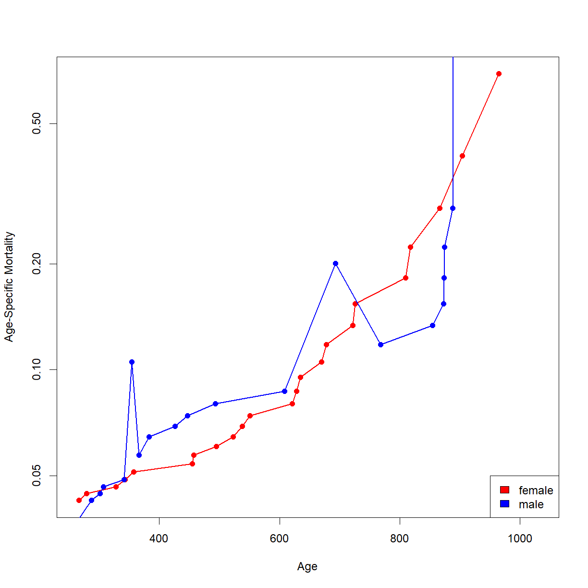
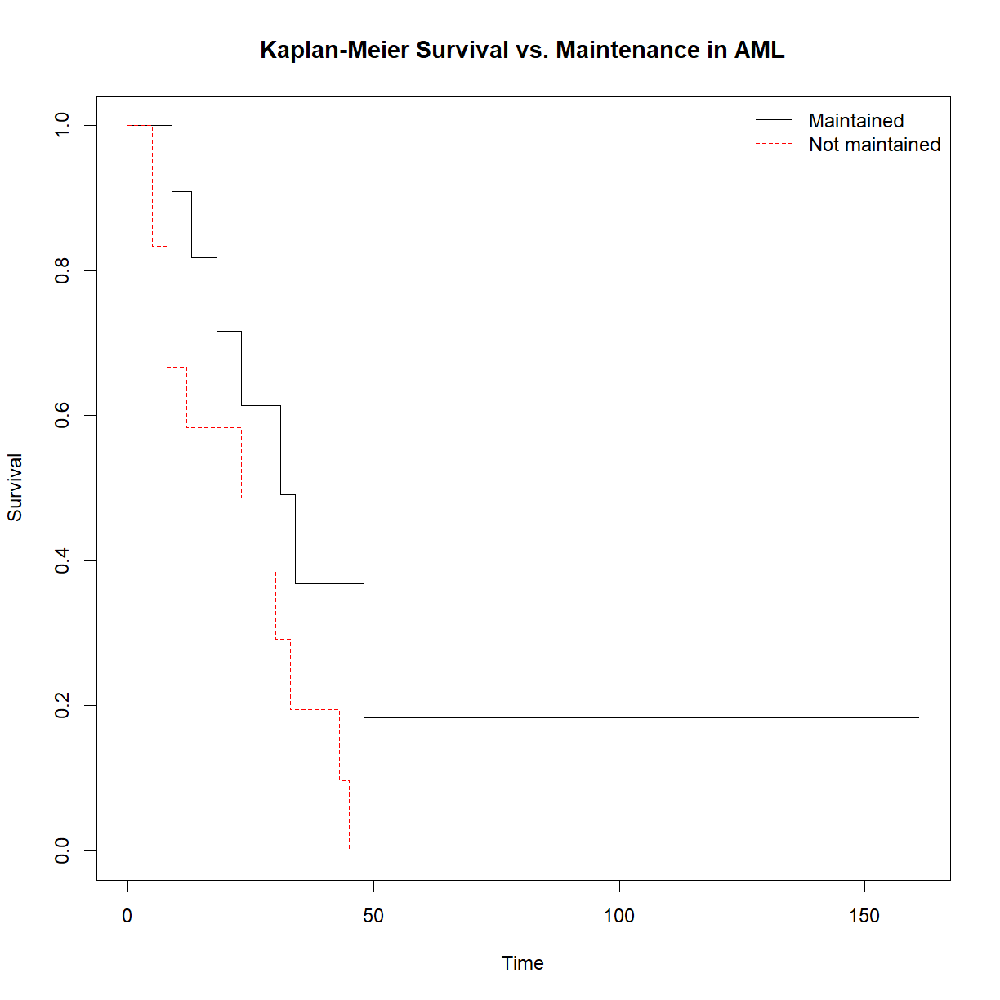

---
# Please do not edit this file directly; it is auto generated.
# Instead, please edit 08-oyo-advanced-survival-analysis.md in _episodes_rmd/
title: "Advanced Survival Analysis"
classdate: "9/19/2023 -- On Your Own"
teaching: 90
exercises: 30
questions:
- "How do you extract life table information from `survfit()` objects in R?"
- "How do you plot age-specific mortality (aka the hazard function) when a life table is not provided?"
objectives:
- "Understand the process for extracting life table information from the object created by the `survfit()` function."
- "Use this information to plot age-specific mortality."
- "Practice using `Surv()`, `survfit()`, and `survdiff()` on available data."
keypoints:
- "The `survfit()` function creates a complex object in R containing life table information. This data can be extracted using the `strata` variable."
- "Once extracted, the life table data can be used to calculate and plot age-specific mortality (don't forget to use log scale on your y-axis!)."
source: Rmd
---

##  On Your Own

Working with survival data in R is not straightforward and practice is useful for getting the hang of using the `Surv()` object and the functions for generating survival curves and running log-rank tests. For the most part, today's *On Your Own* material consists of additional exercise, with one practical note for dealing with an odd data structure.

***
### Extracting life table data from `survfit()`

*In Class* we looked at a life table for human mortality in the US. We were able to examine the age-specific $$\mu_x$$  (aka the hazard function $$\lambda(t)$$, which is one useful way to evaluate differences between groups in survival data. Because the log of age-specific mortality increases linearly with age, the intercept of this line can be interpreted as "initial mortality" in a population, and the slope as "rate of aging" (aka the rate at which the chance of dying at a given time increases with age). 

If we want to examine age-specific mortality for a survival dataset where the life table is not pre-built for us, R does not provide a straightforward solution. There is no function in R to directly plot $$\mu_x$$, so we have 
to extract the life tables and calculate it manually. Let's revisity the lifespan data for the BUB/BnJ mouse strain that we looked at *In Class*.

~~~
# load the survival package
library("survival")

# read in inbred strain lifespan data and subset ou thet BUB/BnJ strain
data.surv <- read.delim("data/inbred.lifespan.txt")
surv.bub <- data.surv[data.surv$strain == "BUB/BnJ",]

# calculate life table for BUB/BnJ mice with sex as an independent variable
survfit.bub.sex <- survfit(Surv(lifespan_days, censor == 0) ~ sex, data=surv.bub)

# use summary() to capture the life table in a new variable
summary.bub <- summary(survfit.bub.sex)
summary.bub
~~~
{: .language-r}

~~~
Call: survfit(formula = Surv(lifespan_days, censor == 0) ~ sex, data = surv.bub)

                sex=f 
 time n.risk n.event survival std.err lower 95% CI upper 95% CI
  266     24       1   0.9583  0.0408      0.88163        1.000
  279     23       1   0.9167  0.0564      0.81250        1.000
  328     22       1   0.8750  0.0675      0.75221        1.000
  343     21       1   0.8333  0.0761      0.69681        0.997
  357     20       1   0.7917  0.0829      0.64478        0.972
  455     19       1   0.7500  0.0884      0.59531        0.945
  457     18       1   0.7083  0.0928      0.54795        0.916
  495     17       1   0.6667  0.0962      0.50240        0.885
  523     16       1   0.6250  0.0988      0.45845        0.852
  538     15       1   0.5833  0.1006      0.41598        0.818
  551     14       1   0.5417  0.1017      0.37489        0.783
  621     13       1   0.5000  0.1021      0.33513        0.746
  628     12       1   0.4583  0.1017      0.29668        0.708
  635     11       1   0.4167  0.1006      0.25954        0.669
  670     10       1   0.3750  0.0988      0.22373        0.629
  678      9       1   0.3333  0.0962      0.18930        0.587
  722      8       1   0.2917  0.0928      0.15636        0.544
  726      7       1   0.2500  0.0884      0.12502        0.500
  810      6       1   0.2083  0.0829      0.09551        0.454
  818      5       1   0.1667  0.0761      0.06813        0.408
  867      4       1   0.1250  0.0675      0.04337        0.360
  904      3       1   0.0833  0.0564      0.02211        0.314
  965      2       1   0.0417  0.0408      0.00612        0.284
 1034      1       1   0.0000     NaN           NA           NA

                sex=m 
 time n.risk n.event survival std.err lower 95% CI upper 95% CI
  260     28       1   0.9643  0.0351      0.89794        1.000
  287     24       1   0.9241  0.0517      0.82807        1.000
  301     23       1   0.8839  0.0632      0.76836        1.000
  307     22       1   0.8438  0.0720      0.71386        0.997
  341     21       1   0.8036  0.0790      0.66280        0.974
  354     20       2   0.7232  0.0892      0.56792        0.921
  366     18       1   0.6830  0.0929      0.52328        0.892
  383     16       1   0.6403  0.0964      0.47678        0.860
  426     15       1   0.5977  0.0989      0.43205        0.827
  447     14       1   0.5550  0.1007      0.38893        0.792
  493     13       1   0.5123  0.1016      0.34732        0.756
  608     12       1   0.4696  0.1017      0.30718        0.718
  693     11       2   0.3842  0.0995      0.23125        0.638
  768      9       1   0.3415  0.0972      0.19552        0.597
  855      8       1   0.2988  0.0939      0.16137        0.553
  873      7       1   0.2561  0.0897      0.12894        0.509
  874      6       1   0.2134  0.0843      0.09843        0.463
  875      5       1   0.1708  0.0775      0.07016        0.416
  888      4       1   0.1281  0.0689      0.04463        0.368
  889      3       2   0.0427  0.0417      0.00628        0.290
 1020      1       1   0.0000     NaN           NA           NA
~~~
{: .output}

&nbsp;

Let's take a closer look at the structure of the life tables stored in the `summary.bub` object:

~~~
str(summary.bub)
~~~
{: .language-r}

~~~
List of 19
 $ n            : int [1:2] 32 32
 $ time         : num [1:45] 266 279 328 343 357 455 457 495 523 538 ...
 $ n.risk       : num [1:45] 24 23 22 21 20 19 18 17 16 15 ...
 $ n.event      : num [1:45] 1 1 1 1 1 1 1 1 1 1 ...
 $ n.censor     : num [1:45] 8 0 0 0 0 0 0 0 0 0 ...
 $ surv         : num [1:45] 0.958 0.917 0.875 0.833 0.792 ...
 $ std.err      : num [1:45] 0.0408 0.0564 0.0675 0.0761 0.0829 ...
 $ cumhaz       : num [1:45] 0.0417 0.0851 0.1306 0.1782 0.2282 ...
 $ std.chaz     : num [1:45] 0.0417 0.0602 0.0754 0.0892 0.1023 ...
 $ strata       : Factor w/ 2 levels "sex=f","sex=m": 1 1 1 1 1 1 1 1 1 1 ...
 $ type         : chr "right"
 $ logse        : logi TRUE
 $ conf.int     : num 0.95
 $ conf.type    : chr "log"
 $ lower        : num [1:45] 0.882 0.813 0.752 0.697 0.645 ...
 $ upper        : num [1:45] 1 1 1 0.997 0.972 ...
 $ call         : language survfit(formula = Surv(lifespan_days, censor == 0) ~ sex, data = surv.bub)
 $ table        : num [1:2, 1:9] 32 32 32 32 32 ...
  ..- attr(*, "dimnames")=List of 2
  .. ..$ : chr [1:2] "sex=f" "sex=m"
  .. ..$ : chr [1:9] "records" "n.max" "n.start" "events" ...
 $ rmean.endtime: num [1:2] 1034 1034
 - attr(*, "class")= chr "summary.survfit"
~~~
{: .output}

&nbsp; 

This object has a variable called `strata` that defines the groups by which the comparison is broken down, and thus the defining feature for the two separate life tables stored within the object. You can use this to extract the separate life table columns for each sex from `summary.bub`. Here we will just extract the specific columns that we need to calculate $$\mu_x$$:

~~~
# extract age, number of deaths, and number at risk at each age from the
# life tables stored in `summary.bub`. Note that the names assigned to the 
# "strata" are in the form "<variable>=<value>", so we use "sex=f" to extract
# the information for female mice
age.f <- summary.bub$time[summary.bub$strata == "sex=f"]
n.event.f <- summary.bub$n.event[summary.bub$strata == "sex=f"]
n.risk.f <- summary.bub$n.risk[summary.bub$strata == "sex=f"]

# calculate qt; note that this is an alternative way to get qx from using the 
# lx and lx+1 values. If you rearrange the life table equations you can derive 
# this form.
qx.f <- n.event.f/n.risk.f

# now calculate px and mux (mu is age-specific mortality)
px.f <- 1 - qx.f
mux.f <- -log(px.f)

# for the male mice ("sex=m"), I am just going to combine the above few steps
# into a single step.
age.m <- summary.bub$time[summary.bub$strata == "sex=m"]
mux.m <- -log(1 - summary.bub$n.event[summary.bub$strata == "sex=m"]/summary.bub$n.risk[summary.bub$strata == "sex=m"])

# Now we can finally plot. Someone should write a function to do this...
# Remember to put the y-axis on a log scale.
plot(age.f,mux.f, col = "red", log = "y", type="o", pch = 16, lwd = 1.7,  
     xlab = "Age", ylab = "Age-Specific Mortality",
     xlim = c(min(summary.bub$time),max(summary.bub$time)))
lines(age.m,mux.m, col = "blue", type="o", pch = 16, lwd = 1.7)
legend("bottomright",legend = c("female","male"), fill = c("red","blue"))
~~~
{: .language-r}

&nbsp;

Note that these plots can be somewhat sensitive to time periods during the lifespan where few mice died (particularly the early portion), creating odd jumps and jogs like the one present near the early male lifespan. Pay attention to the general trends (slope, intercept) to get a feel for how the groups differ. In this case, It looks like the male and female BUB/BnJ mice are pretty similar, showing a similar intercept and slope for the log-mortality curves.

*** 
### Exercises

> ## Differences in male vs. female survival and mortality in modern US humans
> 
> Earlier we looked at survival and mortality in the US population. Now let's
> see how these differ by sex. Plot male and female survival and age-specific 
> mortality  on the same plot for comparison. The life tables are stored in 
> `US2011.life.table.male.txt` and `US2011.life.table.female.txt`, respectively.
> 
> > ## Solution
> > 
> > 
> > ~~~
> > # load data
> > lt.male <- read.delim("./data/US2011.life.table.male.txt")
> > lt.female <- read.delim("./data/US2011.life.table.female.txt")
> > 
> > # change names to our convention
> > names(lt.male) <- c("t","qt","nt","dt","Lt","Tt","et")
> > 
> > # calculate lt, pt, and lambdat
> > lt.male$lt <- lt.male$nt/max(lt.male$nt)
> > lt.male$pt <- 1 - lt.male$qt
> > lt.male$lambdat <- -log(lt.male$pt)
> > 
> > # change names to our convention (lx -> nx)
> > names(lt.female) <- c("t","qt","nt","dt","Lt","Tt","et")
> > 
> > # calculate lt, pt, and lambdat
> > lt.female$lt <- lt.female$nt/max(lt.female$nt)
> > lt.female$pt <- 1 - lt.female$qt
> > lt.female$lambdat <- -log(lt.female$pt)
> > 
> > # plot survival curves
> > plot(lt.female$t, lt.female$lt, type = "l", col = "red",
> >      main="US Survival 2011",
> >      xlab="Age (years)",ylab="Fraction Surviving")
> > lines(lt.male$t, lt.male$lt,col="blue")
> > ~~~
> > {: .language-r}
> > 
> > 
> > 
> > ~~~
> > # plot age-specific mortality
> > plot(lt.female$t, lt.female$lambdat, type = "l",
> >      col="red",log="y",
> >      main="US Age-Specific Mortality 2011",
> >      xlab="Age (years)", ylab="Age-Specific mortality")
> > lines(lt.male$t, lt.male$lambdat, col="blue")
> > ~~~
> > {: .language-r}
> > 
> > 
> {: .solution}
{: .challenge}

&nbsp;

> ## Leukemia -- log-rank test (survdiff function)
> 
> The survival package includes the Acute Myelogenous Leukemia (AML) survival dataset.
> Open the help for `aml` for a description of the data. the "x" column indicates whether
> a particular chemotherapy treatment was continued/maintained or discontinued.
> 
> 1. Open and examine the data, and plot a Kaplan-Meier curve for all data.
> 2. Plot the Kaplan-Meier curves broken down by treatment, and calculate the
> Log-Rank P-value to determine whether the differences are signifcant.
> 3. Extra challenge: extract the life tables for treated and untreated individuals
> and plot age-specific morality
> 
> The data is stored in the `aml` dataframe, which is loaded with the `survival` package.
> 
> *Note: unlike our mouse data, the `status` variable indicates whether a patient has died,
> not patients that were censored. Be sure to indicate this appropriately in the `Surv()` 
> object: `Surv(time, status == 1)`.
> 
> > ## Solution
> > 
> > 
> > 
> > ~~~
> > # load the survival package
> > library("survival")
> > 
> > # Examine the data
> > head(aml)
> > ~~~
> > {: .language-r}
> > 
> > 
> > 
> > ~~~
> >   time status          x
> > 1    9      1 Maintained
> > 2   13      1 Maintained
> > 3   13      0 Maintained
> > 4   18      1 Maintained
> > 5   23      1 Maintained
> > 6   28      0 Maintained
> > ~~~
> > {: .output}
> > 
> > 
> > 
> > ~~~
> > # Create the life table for the aml data (all combined)
> > survfit.aml <- survfit(Surv(time, status == 1) ~ 1, data=aml)
> > 
> > summary(survfit.aml)
> > ~~~
> > {: .language-r}
> > 
> > 
> > 
> > ~~~
> > Call: survfit(formula = Surv(time, status == 1) ~ 1, data = aml)
> > 
> >  time n.risk n.event survival std.err lower 95% CI upper 95% CI
> >     5     23       2   0.9130  0.0588       0.8049        1.000
> >     8     21       2   0.8261  0.0790       0.6848        0.996
> >     9     19       1   0.7826  0.0860       0.6310        0.971
> >    12     18       1   0.7391  0.0916       0.5798        0.942
> >    13     17       1   0.6957  0.0959       0.5309        0.912
> >    18     14       1   0.6460  0.1011       0.4753        0.878
> >    23     13       2   0.5466  0.1073       0.3721        0.803
> >    27     11       1   0.4969  0.1084       0.3240        0.762
> >    30      9       1   0.4417  0.1095       0.2717        0.718
> >    31      8       1   0.3865  0.1089       0.2225        0.671
> >    33      7       1   0.3313  0.1064       0.1765        0.622
> >    34      6       1   0.2761  0.1020       0.1338        0.569
> >    43      5       1   0.2208  0.0954       0.0947        0.515
> >    45      4       1   0.1656  0.0860       0.0598        0.458
> >    48      2       1   0.0828  0.0727       0.0148        0.462
> > ~~~
> > {: .output}
> > 
> > 
> > 
> > ~~~
> > # Plot the basic Kaplan-Meier curve for aml. Don't print the confidence interval.
> > # We'll leave the 95% confidence intervals in place for fun.
> > plot(survfit.aml, xlab = "Time (weeks)", 
> >      ylab="Fraction surviving", 
> >      mark.time = TRUE, 
> >      main="Survival in AML")
> > ~~~
> > {: .language-r}
> > 
> > 
> > 
> > ~~~
> > # Create aml life tables and KM plots broken out by treatment (x,  "Maintained" vs. "Not maintained")
> > survfit.aml.by.rx <- survfit(Surv(time, status == 1) ~ x, data = aml)
> > summary(survfit.aml.by.rx)
> > ~~~
> > {: .language-r}
> > 
> > 
> > 
> > ~~~
> > Call: survfit(formula = Surv(time, status == 1) ~ x, data = aml)
> > 
> >                 x=Maintained 
> >  time n.risk n.event survival std.err lower 95% CI upper 95% CI
> >     9     11       1    0.909  0.0867       0.7541        1.000
> >    13     10       1    0.818  0.1163       0.6192        1.000
> >    18      8       1    0.716  0.1397       0.4884        1.000
> >    23      7       1    0.614  0.1526       0.3769        0.999
> >    31      5       1    0.491  0.1642       0.2549        0.946
> >    34      4       1    0.368  0.1627       0.1549        0.875
> >    48      2       1    0.184  0.1535       0.0359        0.944
> > 
> >                 x=Nonmaintained 
> >  time n.risk n.event survival std.err lower 95% CI upper 95% CI
> >     5     12       2   0.8333  0.1076       0.6470        1.000
> >     8     10       2   0.6667  0.1361       0.4468        0.995
> >    12      8       1   0.5833  0.1423       0.3616        0.941
> >    23      6       1   0.4861  0.1481       0.2675        0.883
> >    27      5       1   0.3889  0.1470       0.1854        0.816
> >    30      4       1   0.2917  0.1387       0.1148        0.741
> >    33      3       1   0.1944  0.1219       0.0569        0.664
> >    43      2       1   0.0972  0.0919       0.0153        0.620
> >    45      1       1   0.0000     NaN           NA           NA
> > ~~~
> > {: .output}
> > 
> > 
> > 
> > ~~~
> > # Plot KM broken out by treatment 
> > plot(survfit.aml.by.rx, xlab = "Time", ylab="Survival",
> >      col = c("black", "red"), lty = 1:2, 
> >      main = "Kaplan-Meier Survival vs. Maintenance in AML")
> > 
> > # Add a legend so we know which is which
> > legend("topright", c("Maintained", "Not maintained"), 
> >        lty = 1:2, col=c("black", "red"))
> > ~~~
> > {: .language-r}
> > 
> > 
> > 
> > ~~~
> > # Perform the log rank test using the R function survdiff().
> > aml.survdiff <- survdiff(Surv(time, status == 1) ~ x, 
> >                         data=aml)
> > aml.survdiff
> > ~~~
> > {: .language-r}
> > 
> > 
> > 
> > ~~~
> > Call:
> > survdiff(formula = Surv(time, status == 1) ~ x, data = aml)
> > 
> >                  N Observed Expected (O-E)^2/E (O-E)^2/V
> > x=Maintained    11        7    10.69      1.27       3.4
> > x=Nonmaintained 12       11     7.31      1.86       3.4
> > 
> >  Chisq= 3.4  on 1 degrees of freedom, p= 0.07 
> > ~~~
> > {: .output}
> > 
> > Extra challenge: calculate and plot age-specific mortality ($$\mu_x$$) for 
> > the above groups.
> > 
> > 
> > ~~~
> > # first we need to assign the life table summary to an object
> > aml.lt <- summary(survfit.aml.by.rx)
> > 
> > # extract age, and number of deaths and number at risk at each age from the
> > # survfit object. We'll do the "Maintained" group first. For some reason the summary
> > # is formatted in rows with a weird notation. It creates a new variable that combines
> > # the header from our original input data with the value in the column; in this case
> > # "x=Maintained" and "x=Nonmaintained". We have to use this to separate out the data
> > age.main <- aml.lt$time[aml.lt$strata == "x=Maintained"]
> > n.event.main <- aml.lt$n.event[aml.lt$strata == "x=Maintained"]
> > n.risk.main <- aml.lt$n.risk[aml.lt$strata == "x=Maintained"]
> > 
> > # calculate qt; note that this is an alternative way to get qx from using the lx and
> > # lx+1 values. If you rearrange the life table equations you can derive this form.
> > qx.main <- n.event.main/n.risk.main
> > 
> > # now calculate px and mux (mu is age-specific mortality)
> > px.main <- 1 - qx.main
> > mux.main <- -log(px.main)
> > 
> > # for the non-maintenance group, I am just going to combine the above few steps
> > # into a single step.
> > age.nomain <- aml.lt$time[aml.lt$strata == "x=Nonmaintained"]
> > mux.nomain <- -log(1 - aml.lt$n.event[aml.lt$strata == "x=Nonmaintained"]/aml.lt$n.risk[aml.lt$strata 
> > == "x=Nonmaintained"])
> > 
> > # Now we can finally plot. Someone should write a function to do this...
> > # Remember to put the y-axis on a log scale.
> > plot(age.main,mux.main, col = "blue", log = "y", type="o", pch = 16, lwd = 1.7,  
> >      xlab = "Age", ylab = "Age-Specific Mortality",
> >      xlim = c(min(aml.lt$time),max(aml.lt$time)))
> > lines(age.nomain,mux.nomain, col = "red", type="o", pch = 16, lwd = 1.7)
> > legend("bottomright",legend = c("Maintained","Nonmaintained"), fill = c("blue","red"))
> > ~~~
> > {: .language-r}
> > 
> > 
> {: .solution}
{: .challenge}

&nbsp;

> ## Revisiting levamisole treatment in colon cancer
> 
> *In Class* we looked at the colon cancer dataset (`colon`) that is included 
> with the `survival` package in R, and concluded that this dataset supports 
> the idea that levamisole treatment improves survival in colon cancer 
> patients when combined with 5-FU. Let's take a closer look at the data and 
> see what more we can learn.
> 
> 
> ~~~
> library("survival") # make sure you have the library loaded
> str(colon)
> ~~~
> {: .language-r}
> 
> 
> 
> ~~~
> 'data.frame':	1858 obs. of  16 variables:
>  $ id      : num  1 1 2 2 3 3 4 4 5 5 ...
>  $ study   : num  1 1 1 1 1 1 1 1 1 1 ...
>  $ rx      : Factor w/ 3 levels "Obs","Lev","Lev+5FU": 3 3 3 3 1 1 3 3 1 1 ...
>  $ sex     : num  1 1 1 1 0 0 0 0 1 1 ...
>  $ age     : num  43 43 63 63 71 71 66 66 69 69 ...
>  $ obstruct: num  0 0 0 0 0 0 1 1 0 0 ...
>  $ perfor  : num  0 0 0 0 0 0 0 0 0 0 ...
>  $ adhere  : num  0 0 0 0 1 1 0 0 0 0 ...
>  $ nodes   : num  5 5 1 1 7 7 6 6 22 22 ...
>  $ status  : num  1 1 0 0 1 1 1 1 1 1 ...
>  $ differ  : num  2 2 2 2 2 2 2 2 2 2 ...
>  $ extent  : num  3 3 3 3 2 2 3 3 3 3 ...
>  $ surg    : num  0 0 0 0 0 0 1 1 1 1 ...
>  $ node4   : num  1 1 0 0 1 1 1 1 1 1 ...
>  $ time    : num  1521 968 3087 3087 963 ...
>  $ etype   : num  2 1 2 1 2 1 2 1 2 1 ...
> ~~~
> {: .output}
> 
> &nbsp;
> 
> Based on the `?colon` description, in addition to the information on 
> recurrence and survival, we have data on the differention status of the 
> tumor cells, an indicator of tumor grade (poorly differentiated tumors are 
> higher grade and more aggressive) stored in the `differ` variable. 
> 
> How does the effectiveness of levamisole at prolonging survival differ 
> across patients with different tumor grades?
> 
> > ## Hint
> > 
> > If you examine the `differ` variable, we don't have data on tumor grade for
> > all patients. In this case, we will want to remove all `NA` values from the > > data set up front.
> {: .solution}
>
> > ## Solution
> > 
> > Again, we will start by taking a look at the survival curves for each tumor grade. We can do this using a `for` loop and building a 3-panel figure:.
> > 
> > 
> > ~~~
> > # like before, we will grab just the subset of data for the "death" events, 
> > # since we are not looking at recurrence in this exercise
> > colon.death <- colon[colon$etype == 2,]
> > 
> > # note that some patients do not have information on tumor grade. There are 
> > # various ways to look at this, but let's use the table function with useNA
> > # set to "ifany". You could also just display the `differ` variable, or 
> > # use `any(isNA(colon.death$differ))`
> > table(colon.death[,c("rx","differ")], useNA = "ifany")
> > ~~~
> > {: .language-r}
> > 
> > 
> > 
> > ~~~
> >          differ
> > rx          1   2   3 <NA>
> >   Obs      27 229  52    7
> >   Lev      37 219  44   10
> >   Lev+5FU  29 215  54    6
> > ~~~
> > {: .output}
> > 
> > 
> > 
> > ~~~
> > # The data from these patients will not be useful in our analysis, so we 
> > # should remove them up front. We can do this using either != NA, or `is.na()`
> > colon.differ <- colon.death[!is.na(colon.death$differ),]
> > 
> > # first setup a 3 panel figure
> > par(mfrow = c(1,3))
> > 
> > # start a for loop to cycle through each unique value of the differ variable
> > # I am also including `sort()` to place the values in numeric order (grade 1 
> > # first)
> > for(i in unique(sort(colon.death$differ))) {
> >   # grab data subset for just the current tumor grade
> >   colon.c <- colon.differ[colon.death$differ == i,]
> >   
> >   # build a survfit object subsetting the data from colon by treatment
> >   survfit.c <- survfit(Surv(time, status) ~ rx, data = colon.c)
> >   
> >   # plot the Kaplan-Meier curves for the two data sets, showing censored
> >   # individuals as markers
> >   plot(survfit.c, col = c("black", "blue", "red"), mark.time = T,
> >      xlab = "Time since treatment",
> >      ylab = "Fraction surviving",
> >      main = paste0("Tumor Grade ",i)) # add a label for the current grade
> >   legend(x = "bottomleft", 
> >      legend = c("observation","levamisole","levamisole + 5-FU"), # order labels in the order of levels(colon.death)
> >      lty = 1, col = c("black", "blue", "red")) # generate lines of the right colors
> > 
> > }
> > ~~~
> > {: .language-r}
> > 
> > 
> > 
> > 
> > &nbsp;
> > 
> > The treatment pattern for grades 1 and 2 look similar to the whole popoulation. In patients with grade 3 tumors, it appears that levamisole may have efficacy on it's own. Let's check that out.
> > 
> > 
> > ~~~
> > # grab the subset for grade 3 tumors
> > colon.3 <- colon.differ[colon.differ$differ == 3,]
> > 
> > # use survdiff() to run log-rank test between groups after subsetting
> > # for each comparison
> > logrank.lev.vs.ctrl <- survdiff(Surv(time, status) ~ rx, 
> >                                 data = colon.3[colon.death$rx %in% c("Obs", "Lev"),])
> > logrank.comb.vs.ctrl <- survdiff(Surv(time, status) ~ rx, 
> >                                 data = colon.3[colon.death$rx %in% c("Obs", "Lev+5FU"),])
> > logrank.comb.vs.lev <- survdiff(Surv(time, status) ~ rx, 
> >                                 data = colon.3[colon.death$rx %in% c("Lev", "Lev+5FU"),])
> > 
> > logrank.lev.vs.ctrl
> > ~~~
> > {: .language-r}
> > 
> > 
> > 
> > ~~~
> > Call:
> > survdiff(formula = Surv(time, status) ~ rx, data = colon.3[colon.death$rx %in% 
> >     c("Obs", "Lev"), ])
> > 
> > n=103, 522 observations deleted due to missingness.
> > 
> >             N Observed Expected (O-E)^2/E (O-E)^2/V
> > rx=Obs     36       25     20.8     0.838     1.283
> > rx=Lev     35       21     19.8     0.075     0.111
> > rx=Lev+5FU 32       15     20.4     1.428     2.160
> > 
> >  Chisq= 2.4  on 2 degrees of freedom, p= 0.3 
> > ~~~
> > {: .output}
> > 
> > 
> > 
> > ~~~
> > logrank.comb.vs.ctrl
> > ~~~
> > {: .language-r}
> > 
> > 
> > 
> > ~~~
> > Call:
> > survdiff(formula = Surv(time, status) ~ rx, data = colon.3[colon.death$rx %in% 
> >     c("Obs", "Lev+5FU"), ])
> > 
> > n=102, 517 observations deleted due to missingness.
> > 
> >             N Observed Expected (O-E)^2/E (O-E)^2/V
> > rx=Obs     36       22     20.9    0.0628    0.0974
> > rx=Lev     28       17     15.3    0.1958    0.2644
> > rx=Lev+5FU 38       20     22.9    0.3610    0.5913
> > 
> >  Chisq= 0.6  on 2 degrees of freedom, p= 0.7 
> > ~~~
> > {: .output}
> > 
> > 
> > 
> > ~~~
> > logrank.comb.vs.lev
> > ~~~
> > {: .language-r}
> > 
> > 
> > 
> > ~~~
> > Call:
> > survdiff(formula = Surv(time, status) ~ rx, data = colon.3[colon.death$rx %in% 
> >     c("Lev", "Lev+5FU"), ])
> > 
> > n=95, 519 observations deleted due to missingness.
> > 
> >             N Observed Expected (O-E)^2/E (O-E)^2/V
> > rx=Obs     32       21     19.3     0.149     0.229
> > rx=Lev     25       16     14.4     0.177     0.238
> > rx=Lev+5FU 38       19     22.3     0.486     0.811
> > 
> >  Chisq= 0.8  on 2 degrees of freedom, p= 0.7 
> > ~~~
> > {: .output}
> > 
> > 
> > 
> > ~~~
> > # now we can extract each P-value using the chisq statistic and distribtion
> > P.lev.vs.ctrl <- pchisq(logrank.lev.vs.ctrl$chisq, 
> >                         length(logrank.lev.vs.ctrl$n) - 1, 
> >                         lower.tail = F)
> > P.comb.vs.ctrl <- pchisq(logrank.comb.vs.ctrl$chisq, 
> >                         length(logrank.comb.vs.ctrl$n) - 1, 
> >                         lower.tail = F)
> > P.comb.vs.lev <- pchisq(logrank.comb.vs.lev$chisq, 
> >                         length(logrank.comb.vs.lev$n) - 1, 
> >                         lower.tail = F)
> > 
> > # and correct for the multiple comparison
> > P.colon <- c(P.lev.vs.ctrl, P.comb.vs.ctrl, P.comb.vs.lev)
> > P.colon.corrected <- p.adjust(P.colon, method = "holm")
> > P.colon.corrected
> > ~~~
> > {: .language-r}
> > 
> > 
> > 
> > ~~~
> > [1] 0.9208073 1.0000000 1.0000000
> > ~~~
> > {: .output}
> > 
> > &nbsp;
> > 
> > Well, the P-values do not allow us to reject the null hypotheses 
> > associated with each test (no differen between groups). The survival 
> > curves still look promising, and given the relatively low patient 
> > numbers with grade 3 cancer, this dataset may simply be underpowered. 
> > Levamisole as a monotherapy for aggressive colon cancer may be worth 
> > another look. 
> {: .solution}
{: .challenge}

&nbsp;

> ## Challenge: comparison of female vs. male lifespan across strains
>
> We saw that lifespan was not significanlty different between female and male BUB/BnJ mice.
> Is this universally true for different mouse strains?
>
> Write a script that does the following using the `inbred.lifespan.txt` data:
> 1. Generate a PDF.
> 2. On each page, plot female vs. male lifespan and mortality curves for one strain. Include
> the following on each plot (hint: use the `text()` or `mtext()` functions):
>  + strain name
>  + Log-Rank P-value
>  + Tick marks to indicate time of censoring
>  + Legend to show female vs. male colors
>
> The goal here is to combine concepts from across the early section of the class 
> to generate a novel analysis pipeline and apply it repeatedly to similar data 
> sets (i.e. different mouse strains) using R to do the heavy lifting.
> 
> > ## Solution
> > 
> > 
> > ~~~
> > # load survival package (if you don't already have it loaded)
> > library("survival")
> > 
> > # read in inbred strain lifespan data
> > data.surv <- read.delim("data/inbred.lifespan.txt")
> > 
> > # extract the list of strains in our data set
> > strain.list <- unique(data.surv$strain)
> > 
> > # initialize our PDF file with a 3" x 5" plot area (size is up to you)
> > pdf("results/inbred.lifespan.by.strain.pdf",
> >     width = 6, height = 4)
> > 
> > # cycle through each strain in the strain list to
> > for(i.strain in 1:length(strain.list)) {
> >   # grab the name of the current strain
> >   strain.c <- strain.list[i.strain]
> >   
> >   # grab the subset of the lifespan data for the current strain
> >   data.c <- data.surv[data.surv$strain == strain.c,]
> > 
> >   # calculate life table for the current strain
> >   survfit.c <- survfit(Surv(lifespan_days, censor == 0) ~ sex, data=data.c)
> >   
> >   # check to see if this strain has data for both sexes. When you try to 
> >   # skip this step, your logrank function will throw an error for CAST/EiJ,
> >   # which only has data for female mice. There are various ways to do this,
> >   # but I just checked to make sure that there were more than one values in 
> >   # the "sex" column for the current strain. If there is only 1 value, set
> >   # the p-value to 1 by default, otherwise calculate it.
> >   if(length(unique(data.c$sex)) > 1) {
> >     # run the logrank test using the survdiff() function
> >     logrank.c <- survdiff(Surv(lifespan_days, censor == 0) ~ sex, data = data.c)
> >     
> >     # extract the chi-squared statistic and number of groups from the survdiff
> >     # object
> >     chisq.c <- logrank.c$chisq
> >     n.c <- logrank.c$n
> >     
> >     # use these value to calculate the P-value from the chi-squared distribution
> >     P.c <- pchisq(chisq.c, length(n.c) - 1, lower.tail = F)
> >   } else {
> >     # if there is only 1 sex in the current strain dataset, set p = 1
> >     P.c <- 1
> >   }
> >   
> >   # Plot the Kaplan-Meier curve
> >   plot(survfit.c, xlab = "Age (days)", 
> >        ylab="Fraction surviving", 
> >        col = c("red","blue"),
> >        conf.int=FALSE,              # turn of confidence intervals
> >        mark.time = TRUE,            # mark time of censor
> >        main=paste0(strain.c," Lifespan"))
> >   
> >   # add legend
> >   legend("topright", lty = 1,
> >          col = c("red","blue"),
> >          legend = c("f","m"))  
> >   
> >   # add P value to plot (you can use either text or mtext here).
> >   # I used round() to limit the number of decimal places printed.
> >   mtext(paste0("P = ", round(P.c, digits = 4)), 
> >         side = 1, # print on the bottom
> >         line = -1.2, # use negative numbers to move "inward"/up on the plot
> >         font = 2, # bold font
> >         adj = 0.03) # left justify (0) plus a bit (0.03) to print in bottom left
> > }
> > 
> > # turn off PDF graphics device
> > dev.off()
> > ~~~
> > {: .language-r}
> > 
> > 
> > 
> > ~~~
> > png 
> >   2 
> > ~~~
> > {: .output}
> {: .solution}
{: .challenge}

***


