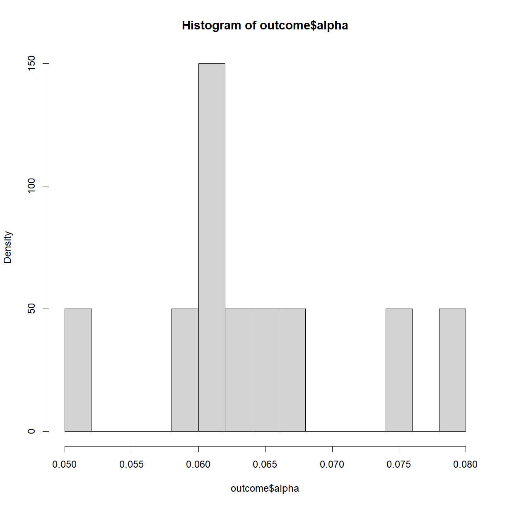
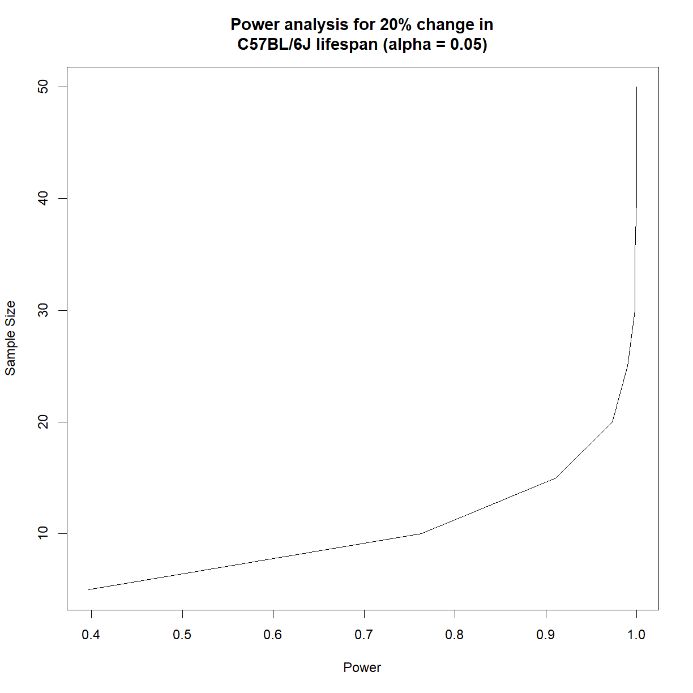
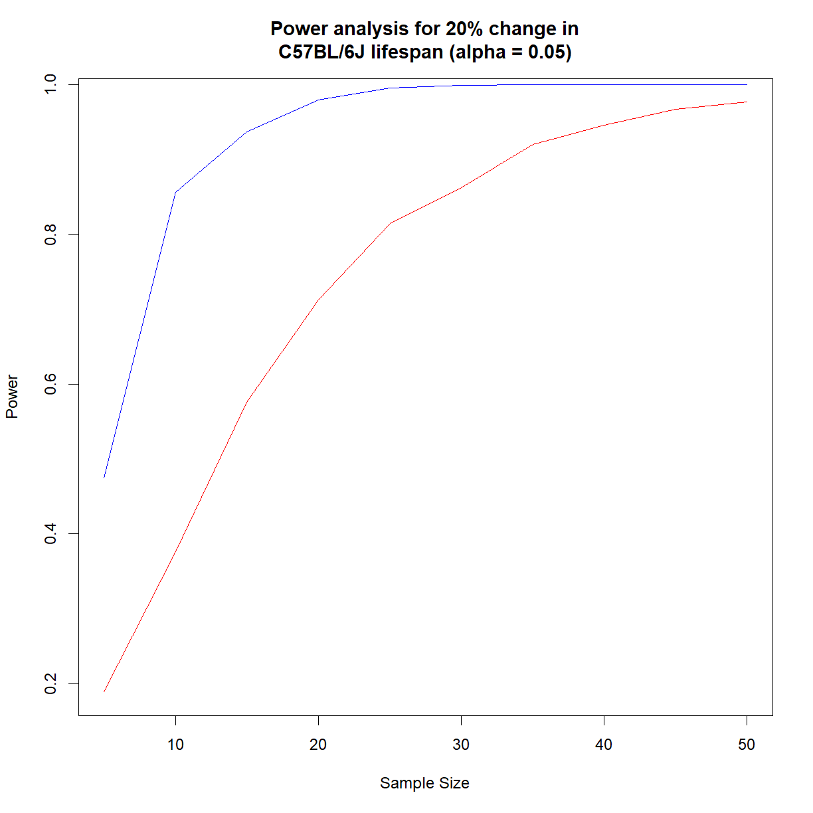

---
# Please do not edit this file directly; it is auto generated.
# Instead, please edit 09-oyo-simulation.md in _episodes_rmd/
title: "Simulating Experiments"
classdate: "9/21/2023 -- On Your Own"
teaching: 90
exercises: 30
questions:
- "What is a simulated experiment?"
- "What are the applications for simulated experiments?"
- "How can we use simulation to improve (and generalize) power analysis?"
objectives:
- "Prepare a plan for running an experiment simulation."
- "Simulate data from an assumed distribution."
- "Use simulated data to run a series of mock experiments to examine the behavior of a planned analysis."
keypoints:
- "Experiment simulations can be used to understand the behavior of an idealized system (i.e. a system lacking noise from sources like subjective observation and measurement error)."
- "Power analyses can be conducted using pilot data and (potentially) removing assumptions about distribution."
- "In essence, an experiment simulation is used to build a 'real' sampling distribution from which to draw statistical parameters like significance and power."
source: Rmd
---

## On Your Own

*In Class* we looked at how to conduct a basic power analysis using a t-test. This process relies on the same assumptions that go into a t-test, and in particular that we understand the properties of a t distribution, which is related to the normal distribution. For simple experimental designs--comparing normally distributed phenotype(s) in samples taken randomly and independently from two groups--this process works great. 

What happens when our phenotype or experimental design breaks one of the assumptions of a t-test? Maybe our data is not normal; maybe we have a more complex sampling strategy; maybe we are looking at the interaction between multiple phenotypes across time or some other dimension. What do we do now?

In essence, what the power analysis is doing is asking the following:

| *If I run my experiment 10,000 times, in what fraction of those experiments can I expect to detect a difference when a difference exists?*

Wouldn't it be nice if we could do just that: run our experiment 10,000 times and see what happens? Well, in a way, we can. We do so by making some basic assumptions and running a simulation. In fact, simulations can give insights beyond mere power.

***
### Simulating experiments in advance

Simulations have several advantages, for example:
* The force you to think through a planned statistical analysis in advance (for best practices, you should be doing this anyway) and work out at least some of the technical issues ahead of time.

* They give valuable insight into the behavior the phenotype that you are studying.

* They can identify problems with experimental design or practical execution that you would not have considered in advance otherwise. 

Here we are going to use a simulation to run a more generalized form of power analysis. Unlike the functions in the `pwr` package, this method can be used on essentially any experimental design for which you have pilot data (or not, assuming you can make a reasonable estimate of the behavior of the phenotype of interest). It does not necessarily rely on specific assumptions about the distribution or nature of the phenotype, though *some* assumptions will always be required.

***
### Using simulations to conduct power analyses

In a power analysis, we are usually trying to figure out what sample size we need to be confident in the statistical outcome of an experiment. Why don't we just run the experiment a bunch of times to see how often we expect different outcomes to occur? Because we have limited resources, going to the bench and physcially repeating an experiment a hundred or a thousand times is not practical. We usually have the time and resources to run an experiment once (or at most a few times), and we want to know how to get the most bang for our buck. That doesn't mean we can't pretend though.

In essence, a simulation is a formalized thought experiment, where we set up an idealized scenario where we know what the "right" answer is (e.g. we define the population distribution), pretend to run our experiment over and over again, complete with sampling and statistical tests, and see how often our "single" experiments can be expected to successfully detect the true background truth of the distribution. 

Running a simulation is really not that difficult, but requires thinking through each of the steps that you will be taking in the real-world experiment and replicating those steps in code. This process will take advantage of most of the skills that we have developed over the past 5 weeks. Here is a basic protocol:

1. Estimate the behavior of the real phenotype of interest. Usually this involves collection pilot data and making an assumption along one of two lines:
 + Assume that the phenotype behaves according to a defined function or distribution and use the pilot data to estimate the exact shape (e.g. assume your phenotype is normally distributed, and use the mean and standard deviation of the pilot data to estimate the shape of the specific normal distribution).
 + Assume that your pilot data is identical to your population and use it directly (this usually works if you have a lot of pilot data, say about your control population).

{:start="2"}
2. Decide what sort of change in your phenotype of interest is meaningful. Usually this involves making an assumption about how the independent variable will impact your dependent variable (e.g. I am interested in detecting a mean body weight change of 20% without a change in standard deviation). 

3. Using the information in (1) and (2), formally define your "control" and "treatment" populations for the two situations that you are trying to distinguish with your hypothesis framing:
  + **$$H_1$$ is true:** apply a transformation to your control distribution or data to simulate the impact of your independent variable (e.g. multiply the mean by 1.2 to simulate a 20% increase in mean value, then use that value to define the "treatment" distribution).
  + **$$H_0$$ is true:** under the null hypothesis, the independent variable does not impact the dependent variable. In this case, we will use the control distribution to draw both samples.

{:start="4"}
4. Collect a simulated sample of size m and n from your control and treatment groups, respectively (note that m and n can be different). This usually involves drawing random values for the dependent variable from a distribution or pilot data set. Based on (3), we will actually be drawing 3 samples:
  + one "control" sample from our *control* population
  + one "treatment" sample from our *treatment* population, to simulate the scenario when $$H_1$$ is true.
  + one "treatment" sample from our *control* population, to simulate the scenario when $$H_0$$ is true.

{:start="5"}
5. Conduct a pre-defined statistical test on your "control" vs. "treatment" samples for both scenarios ($$H_1$$ is true and $$H_0$$ is true) and note the outcome (i.e. the P-value and interpretation).

6. Repeat steps (4) and (5) as many times as you like to simulate repeated experiments.

7. Tabulate the number of times your statistical test accepted or rejected $$H_0$$ under both scenarios ($$H_1$$ is true and $$H_0$$ is true) to generate a hypothesis table. 

8. Use the four quadrants of the hypothesis table to calculate your simulated $$\alpha$$, $$\beta$$, and power. At this stage you have effectively conducted a single **power analysis** analogous to what a single call of the `pwr.t.test()` function produces.

9. Repeat steps (4) to (8) for additional effect sizes and sample sizes to draw power reference charts. 

We now have the tools to conduct each step in this process, with the exception of how to sample data (step 4). Technically we did sample data when looking at normal distributions using the `rnorm()` function, but we will go through the process in more detail in order to re-examine our power analysis for mouse lifespan. 

***
### Sampling from distributions

To demonstrate how to define a distribution based on pilot data and use that distribution to simulate drawing novel sampling data, we will use our inbred mouse lifespan data set to simulate new lifespan data for C57BL/6J mice. 

First, load the `inbred.lifespan.txt` data and the `survival` package. Also define the "status" variable to indicate which mice had a positive observation for the phenotype of interest (death). Recall that this is just the inverse of the already defined `censor` variable, which indicates censoring events for mice that were removed from the study prior to dying. Finally, grab the subset of data for just the C57BL/6J mouse strain.

~~~
# load library
library("survival")

# load inbred mouse lifespan data
data.surv <- read.delim("data/inbred.lifespan.txt")

# define status variable to indicate "death" events
data.surv$status <- as.integer(!data.surv$censor)

# Grab C57BL/6J data subset
surv.b6 <- data.surv[data.surv$strain == "C57BL/6J",]
head(surv.b6)
~~~
{: .language-r}

~~~
      strain sex animal_id lifespan_days censor status
449 C57BL/6J   f        24           333      1      0
450 C57BL/6J   f        25           475      1      0
451 C57BL/6J   f        26           391      1      0
452 C57BL/6J   f       204           272      0      1
453 C57BL/6J   f       205          1049      0      1
454 C57BL/6J   f       206           795      0      1
~~~
{: .output}

&nbsp;

One way to approach this data would be to just use our pilot inbred lifespan data under the assumption that it can represent the "true" population. In this scenario we would just randomly draw a sample directly from the C57BL/6J lifespan data using the `sample()` function:

~~~
# draw a lifespan sample of size 10 from our B6 data frame
x <- sample(surv.b6$lifespan_days, 10)
x
~~~
{: .language-r}

~~~
 [1]  859 1052  838  999  736 1034 1049  727  929  908
~~~
{: .output}

&nbsp;

While this does produce a sample, our pilot data only represents 64 individuals out of all potential C57BL/6J mice for a phenotype that is highly variable. A better approach, when possible, is to find a distribution that can accurately represent your data. This approach allows for true random sampling with the the confines of the assumption that the real data follows the selected distribution. There are some distributions that can do a decent job at approximating lifespan data. The most common are the Gompertz and Weibull distributions.

&nbsp;
#### Gompertz and Weibull distributions for lifespan data

As discussed in our previous class on survival analysis, samples taken from the population-level survival function, $$S(t)$$, cannot be considered independent, because each point depends on the value of previous observations. In contrast, each point in the hazard function, $$\lambda(t)$$, (aka age-specific mortality, $$\mu_x$$) does not depend on previous values and can be modeled, allowing for independent sampling of a parameter that can be converted to lifespan. The Gompertz and Weibull functions make the assumption that the hazard function takes on a specific (and slightly different) form:

&nbsp;

More information and the R functions for dealing with a Gompertz distribution are available in the `flexsurv` package. For our purposes, and within the `survival` package, we will primarily deal with the Weibull distribution. In the above equations, $$\gamma$$ is called the *shape* and $$\lambda$$ is called the scale. For shape, the following relationships hold:
* **$$\gamma < 1$$** indicates that the failure rate (aka mortality) is decreasing over time, such as infant mortality rates.

* **$$\gamma = 1$$** indicates a constant failure rate, such as that for many types of machinery. The Weibull distribution simply collapses to the exponential distributions. 

* **$$\gamma > 1$$** indicates an increasing failure rate, which is what we see during aging.

In contrast, the scale parameter $$\lambda$$ simply defines the relative rate at which the hazard is increasing. If we make the assumption that our lifespan data falls within a Weibull distribution, we can use the `survreg()` function to identify the shape and scale parameters that best fit our survival data. This uses the same formula notation and definition of our dependent variable with `Surv()` that we employed for survival analysis:

~~~
# calculate parameters for Weibull distribution
wei.b6 <- survreg(Surv(lifespan_days, status == 1) ~ 1, data = surv.b6, dist = "weibull")

# There are multiple ways to parameterize a Weibull distribution. The 
# survreg() function embeds it in a general location-scale family, which 
# is a different parameterization than the rweibull function, and often leads
# to confusion.
#   survreg's scale  =    1/(rweibull shape)
#   survreg's intercept = log(rweibull scale)

# based on the above, calculate scale and shape for rweibull
shape.b6 <- 1/wei.b6$scale
scale.b6 <- as.numeric(exp(wei.b6$coefficients))
shape.b6
~~~
{: .language-r}

~~~
[1] 7.116202
~~~
{: .output}

~~~
scale.b6
~~~
{: .language-r}

~~~
[1] 934.7153
~~~
{: .output}

&nbsp;

And using these shape and scale parameters, we can now use the `rweibull()` function to randomly draw any desired number of samples from the corresponding Weibull distribution.

~~~
samp.b6 <- rweibull(10, shape.b6, scale.b6)
samp.b6
~~~
{: .language-r}

~~~
 [1]  988.6342  848.2433  973.1964  787.7737  927.9421  671.3529  979.9968
 [8]  952.5514  900.6205 1070.8704
~~~
{: .output}

&nbsp;

Note that this is essentially the same operation that we performed to draw a random sample from a defined normal distribution using `rnorm(n, mean, sd)`. The parameters are different for `rnorm()` (mean and standard deviation) and `rweibull()` (shape and scale), but the underlying principle is the same. We are taking a random sample from data with an assumed distribution. 

The *shape* and *scale* functions define the distribution for our *control* population. As a first order confirmation, note that the sample generated using `rweibull()` have values in the same range as the real lifespan values for C57BL/6J mice in our data set. We will use this sampling procedure to generate samples for both our *control* population, and for our *treatment* population under the scenario that $$H_0$$ is true.

To generate a distribution for our *treatment* population under the scenario that $$H_1$$ is true, we first have to make another assumption, this time about how the *treatment* effects the distributions. A useful assumption in this case is that the *treatment* changes **scale** without affecting  **shape**. Based on the equation for hazard, we can use the `scale` parameter to define a desired change in lifespan:

~~~
# define change
change <- 0.2 # 20% change in lifespan

# sample a distribution with a 20% increase in scale
samp.b6 <- rweibull(10, shape.b6, scale.b6 + 0.2*scale.b6)
samp.b6
~~~
{: .language-r}

~~~
 [1] 1271.0953  953.3049 1203.7566  796.2932  925.1207 1048.4625 1121.6864
 [8]  873.4601 1043.7940  767.3590
~~~
{: .output}

&nbsp;

To test the sampling procedure, let's draw 10 random samples of 64 mice from both the *control* population, and a *treatment* population with a 20% increase in lifespan, and plot the survival curves for each simulated group alongside the survival curves from the original sample from our inbred lifespan study:

~~~
# first define the survival curve for the original sample
survfit.real <- survfit(Surv(lifespan_days, status == 1) ~ 1, data = surv.b6)

# plot the real survival data
plot(survfit.real, conf.int = F, 
     col = "black", lwd = 3, # make this line black and thicker
     xlim = c(0, 1.5*max(surv.b6$lifespan_days))) # make the x-axis plenty large enough for the next set

# run through 10 iterations
for (i in 1:10) {
  # select a sample of 100 from the estimated "control" and "treatment" Weibull distributions
  samp.ctrl <- rweibull(64, shape.b6, scale.b6)
  samp.treat <- rweibull(64, shape.b6, scale.b6 + 0.2*scale.b6)
  
  # calculate survfit objects (note that we are assuming no censoring here)
  survfit.ctrl <- survfit(Surv(samp.ctrl, rep(1,length(samp.ctrl))) ~ 1)
  survfit.treat <- survfit(Surv(samp.treat, rep(1,length(samp.treat))) ~ 1)
  
  # add lines to the existing plot for current set
  lines(survfit.ctrl, conf.int = F, col = "blue")
  lines(survfit.treat, conf.int = F, col = "red")
}
~~~
{: .language-r}

&nbsp;

That looks like a pretty decent approximation of the real data, and gives some idea of what variation to expect, even with a relatively large sample size (64). Now let's look at how to use this same procedure to conduct a power analysis.

***
### Power analysis by simulation

For the purposes of this example, we want to know how large we need our sample size to be in order to detect a 20% change at 90% power at a significance level of 0.05 using a log-rank test. As noted above, this style of power analysis always takes in a value for effect size, sample size, and significance level and generates power as an output. What we need to do is run a simulated experiment with a range of sample sizes and figure out which generates a sufficiently high simulated power. Here is how we go about it:

~~~
# set power parameters
alpha <- 0.05
change <- 0.2

# set range of sample sizes
n.vec <- seq(5, 50, 5)

# initialize data frame to store power and alpha values for each sample size
outcome <- data.frame(N = n.vec, 
                      alpha = as.numeric(NA),
                      power = as.numeric(NA))

# set number of simulated samples
n.samp <- 1000

# calculate parameters for Weibull distribution
wei.b6 <- survreg(Surv(lifespan_days, status == 1) ~ 1, data = surv.b6, dist = "weibull")
shape.b6 <- 1/wei.b6$scale
scale.b6 <- as.numeric(exp(wei.b6$coefficients))

# start by cycling through sample sizes
for (i.n in 1:length(n.vec)) {
  # grab current sample size
  n.c <- n.vec[i.n]

  # initialize matrix to record whether null hypothesis was accepted or rejected
  outcome.c <- data.frame(Sample = 1:n.samp, H0.True = as.integer(NA), H1.True = as.integer(NA))
  
  # start sampling procedure -- for each iteration, do the following:
  #  1. generate test sample from each distribution (control, 
  #     control (H0 true) and simulated 20% extension (H1 true))
  #  2. run a log rank test to determine what we would conclude given
  #     the current sample
  #  3. record outcome for both comparisons to the outcome matrix
  for (i.samp in 1:n.samp) {
    # print every 100 samples
    if ((i.samp %% 250) == 0) {
      print(paste("Now starting sample",i.samp, "for sample size",n.c))
    }
    
    # generate control sample and embed in test data frame
    samp.ctrl.c <- rweibull(n.c, shape.b6, scale.b6)
    surv.ctrl.c <- data.frame(lifespan = samp.ctrl.c, group = "control", status = 1)
    
    # generate test sample assuming H0 is true
    samp.test.H0true.c <- rweibull(n.c, shape.b6, scale.b6)
    surv.test.H0true.c <- data.frame(lifespan = samp.test.H0true.c, group = "test", status = 1)
    
    # generate test sample assuming H1 is true
    samp.test.H1true.c <- rweibull(n.c, shape.b6, scale.b6 + change*scale.b6)
    surv.test.H1true.c <- data.frame(lifespan = samp.test.H1true.c, group = "test", status = 1)
    
    # setup data frames for H0 and H1 true for testing
    surv.H0true.c <- rbind(surv.ctrl.c, surv.test.H0true.c)
    surv.H1true.c <- rbind(surv.ctrl.c, surv.test.H1true.c)
    
    # run log-rank test
    logrank.H0true <- survdiff(Surv(lifespan, status == 1) ~ group, data = surv.H0true.c)
    logrank.H1true <- survdiff(Surv(lifespan, status == 1) ~ group, data = surv.H1true.c)
    
    # calculate P-values from logrank chisq statistics
    p.H0true <- pchisq(logrank.H0true$chisq, length(logrank.H0true$n) - 1, lower.tail = F)
    p.H1true <- pchisq(logrank.H1true$chisq, length(logrank.H1true$n) - 1, lower.tail = F)
    
    # record outcome (1 = accept H0, 0 = reject H0)
    outcome.c$H0.True[i.samp] <- as.integer(p.H0true >= 0.05)
    outcome.c$H1.True[i.samp] <- as.integer(p.H1true >= 0.05)
  }
  
  # Build hypothesis table
  h.table.c <- data.frame(outcome = c("Accept H0", "Reject H0"), 
                         H0.true = c(sum(outcome.c$H0.True), n.samp - sum(outcome.c$H0.True)),
                         H1.true = c(sum(outcome.c$H1.True), n.samp - sum(outcome.c$H1.True)))
  
  # update power and significance data frames
  outcome$alpha[i.n] <- h.table.c$H0.true[h.table.c$outcome == "Reject H0"]/n.samp
  outcome$power[i.n] <- h.table.c$H1.true[h.table.c$outcome == "Reject H0"]/n.samp
}
~~~
{: .language-r}

~~~
[1] "Now starting sample 250 for sample size 5"
[1] "Now starting sample 500 for sample size 5"
[1] "Now starting sample 750 for sample size 5"
[1] "Now starting sample 1000 for sample size 5"
[1] "Now starting sample 250 for sample size 10"
[1] "Now starting sample 500 for sample size 10"
[1] "Now starting sample 750 for sample size 10"
[1] "Now starting sample 1000 for sample size 10"
[1] "Now starting sample 250 for sample size 15"
[1] "Now starting sample 500 for sample size 15"
[1] "Now starting sample 750 for sample size 15"
[1] "Now starting sample 1000 for sample size 15"
[1] "Now starting sample 250 for sample size 20"
[1] "Now starting sample 500 for sample size 20"
[1] "Now starting sample 750 for sample size 20"
[1] "Now starting sample 1000 for sample size 20"
[1] "Now starting sample 250 for sample size 25"
[1] "Now starting sample 500 for sample size 25"
[1] "Now starting sample 750 for sample size 25"
[1] "Now starting sample 1000 for sample size 25"
[1] "Now starting sample 250 for sample size 30"
[1] "Now starting sample 500 for sample size 30"
[1] "Now starting sample 750 for sample size 30"
[1] "Now starting sample 1000 for sample size 30"
[1] "Now starting sample 250 for sample size 35"
[1] "Now starting sample 500 for sample size 35"
[1] "Now starting sample 750 for sample size 35"
[1] "Now starting sample 1000 for sample size 35"
[1] "Now starting sample 250 for sample size 40"
[1] "Now starting sample 500 for sample size 40"
[1] "Now starting sample 750 for sample size 40"
[1] "Now starting sample 1000 for sample size 40"
[1] "Now starting sample 250 for sample size 45"
[1] "Now starting sample 500 for sample size 45"
[1] "Now starting sample 750 for sample size 45"
[1] "Now starting sample 1000 for sample size 45"
[1] "Now starting sample 250 for sample size 50"
[1] "Now starting sample 500 for sample size 50"
[1] "Now starting sample 750 for sample size 50"
[1] "Now starting sample 1000 for sample size 50"
~~~
{: .output}

~~~
# show outcome
outcome
~~~
{: .language-r}

~~~
    N alpha power
1   5 0.068 0.397
2  10 0.073 0.763
3  15 0.065 0.911
4  20 0.067 0.973
5  25 0.041 0.990
6  30 0.051 0.998
7  35 0.050 0.998
8  40 0.055 1.000
9  45 0.054 1.000
10 50 0.053 1.000
~~~
{: .output}

~~~
# Check out the distribution of calculated alphas
hist(outcome$alpha, breaks = 15, freq = F)
~~~
{: .language-r}

~~~
# generate power plot to compare power vs. sample size
plot(outcome$power, outcome$N, type = "l", 
     main =  "Power analysis for 20% change in\nC57BL/6J lifespan (alpha = 0.05)",
     ylab = "Sample Size", 
     xlab = "Power")
~~~
{: .language-r}

&nbsp;

It looks like we need somewhere around 16 mice to have 90% power to detect a 20% change in C57BL/6J lifespan at $$\alpha = 0.05$$. 

Note that the precision of the power and significance calculated based on the simulation is strictly determined by the number of times we run the simulated experiment. If we only run 100 iterations, we will only be able to distinguish a significance level or power differences down to 1/100 = 0.01.

> ## Revisiting the impact of sex on power
> 
> *In Class* we found that the higher variability in female 
> lifespan substantially increased the number of mice required to 
> detect a given given lifespan extension in C57BL/6J mice. Let's 
> revisit this question using our simulated lifespand data.
> 
> Generate power vs. sample size charts for the ability to detect 
> a 15% change in lifespan at a significance level of 0.05 in male 
> and female C57BL/6J mice.
> 
> > ## Solution
> > 
> > Make sure we have the `survival` package and inbred mouse 
> > lifespan data loaded. Subset the data for C57BL/6J females and 
> > males separately.
> > 
> > 
> > ~~~
> > # load library
> > library("survival")
> > 
> > # load inbred mouse lifespan data
> > data.surv <- read.delim("data/inbred.lifespan.txt")
> > 
> > # define status variable to indicate "death" events
> > data.surv$status <- as.integer(!data.surv$censor)
> > 
> > # Grab C57BL/6J data subset
> > b6.f <- data.surv[data.surv$strain == "C57BL/6J" & 
> > data.surv$sex == "f",]
> > b6.m <- data.surv[data.surv$strain == "C57BL/6J" & 
> > data.surv$sex == "m",]
> > ~~~
> > {: .language-r}
> > 
> > &nbsp;
> > 
> > Now set up our variables and run our simulation for both 
> > sexes. We can do this all in the same loop. Since there are 
> > only two sexes, I opted not to build a second for loop to 
> > cycle through the two options for sex (though that is an 
> > alternative, and would have saved me some lines of code).
> > 
> > 
> > ~~~
> > # set power parameters
> > alpha <- 0.05
> > change <- 0.15
> > 
> > # set range of sample sizes
> > n.vec <- seq(5, 50, 5)
> > 
> > # initialize data frames to store power and alpha values 
> > # for each sample size. We will just do one for each sex
> > outcome.f <- data.frame(N = n.vec, 
> >                       alpha = as.numeric(NA),
> >                       power = as.numeric(NA))
> > outcome.m <- data.frame(N = n.vec, 
> >                       alpha = as.numeric(NA),
> >                       power = as.numeric(NA))
> > 
> > # set number of simulated samples
> > n.samp <- 1000
> > 
> > # calculate parameters for Weibull distribution
> > wei.b6.f <- survreg(Surv(lifespan_days, status == 1) ~ 1, 
> >                     data = b6.f, dist = "weibull")
> > shape.b6.f <- 1/wei.b6.f$scale
> > scale.b6.f <- as.numeric(exp(wei.b6.f$coefficients))
> > 
> > wei.b6.m <- survreg(Surv(lifespan_days, status == 1) ~ 1, 
> >                     data = b6.m, dist = "weibull")
> > shape.b6.m <- 1/wei.b6.m$scale
> > scale.b6.m <- as.numeric(exp(wei.b6.m$coefficients))
> > 
> > # start by cycling through sample sizes
> > for (i.n in 1:length(n.vec)) {
> >   # grab current sample size
> >   n.c <- n.vec[i.n]
> > 
> >   # initialize matrices to record whether null hypothesis     
> >   # was accepted or rejected
> >   outcome.f.c <- data.frame(Sample = 1:n.samp, 
> >                             H0.True = as.integer(NA), 
> >                             H1.True = as.integer(NA))
> >    outcome.m.c <- data.frame(Sample = 1:n.samp, 
> >                              H0.True = as.integer(NA), 
> >                              H1.True = as.integer(NA))
> >   
> >   # start sampling procedure -- for each iteration, do the   
> >   # following:
> >   #  1. generate test sample from each distribution (control, 
> >   #     control (H0 true) and simulated 20% extension 
> >   #     (H1 true))
> >   #  2. run a log rank test to determine what we would  
> >   #     conclude given the current sample
> >   #  3. record outcome for both comparisons to the outcome 
> >   #     matrix
> >   for (i.samp in 1:n.samp) {
> >     # print every 100 samples
> >     if ((i.samp %% 250) == 0) {
> >       print(paste("Now starting sample",i.samp, "for sample size",n.c))
> >     }
> >     
> >     # generate control sample and embed in test data frame
> >     samp.ctrl.f.c <- rweibull(n.c, shape.b6.f, scale.b6.f)
> >     surv.ctrl.f.c <- data.frame(lifespan = samp.ctrl.f.c, 
> >                                 group = "control", 
> >                                 status = 1)
> >     
> >     samp.ctrl.m.c <- rweibull(n.c, shape.b6.m, scale.b6.f)
> >     surv.ctrl.m.c <- data.frame(lifespan = samp.ctrl.m.c, 
> >                                 group = "control", 
> >                                 status = 1)
> >     
> >     # generate test sample assuming H0 is true
> >     samp.test.H0true.f.c <- rweibull(n.c, shape.b6.f, 
> >                                      scale.b6.f)
> >     surv.test.H0true.f.c <- data.frame(lifespan = samp.test.H0true.f.c, group = "test", status = 1)
> >     
> >     samp.test.H0true.m.c <- rweibull(n.c, 
> >                                      shape.b6.m, 
> >                                      scale.b6.m)
> >     surv.test.H0true.m.c <- data.frame(lifespan = samp.test.H0true.m.c, group = "test", status = 1)
> >     
> >     # generate test sample assuming H1 is true
> >     samp.test.H1true.f.c <- rweibull(n.c, shape.b6.f, 
> >                             scale.b6.f + change*scale.b6.f)
> >     surv.test.H1true.f.c <- data.frame(lifespan = samp.test.H1true.f.c, group = "test", status = 1)
> >     
> >      samp.test.H1true.m.c <- rweibull(n.c, shape.b6.m, scale.b6.m + change*scale.b6.m)
> >     surv.test.H1true.m.c <- data.frame(lifespan = samp.test.H1true.m.c, group = "test", status = 1)
> >     
> >     # setup data frames for H0 and H1 true for testing
> >     surv.H0true.f.c <- rbind(surv.ctrl.f.c, surv.test.H0true.f.c)
> >     surv.H1true.f.c <- rbind(surv.ctrl.f.c, surv.test.H1true.f.c)
> >     
> >     surv.H0true.m.c <- rbind(surv.ctrl.m.c, surv.test.H0true.m.c)
> >     surv.H1true.m.c <- rbind(surv.ctrl.m.c, surv.test.H1true.m.c)
> >     
> >     # run log-rank test
> >     logrank.H0true.f <- survdiff(Surv(lifespan, status == 1) ~ group, data = surv.H0true.f.c)
> >     logrank.H1true.f <- survdiff(Surv(lifespan, status == 1) ~ group, data = surv.H1true.f.c)
> >     
> >     logrank.H0true.m <- survdiff(Surv(lifespan, status == 1) ~ group, data = surv.H0true.m.c)
> >     logrank.H1true.m <- survdiff(Surv(lifespan, status == 1) ~ group, data = surv.H1true.m.c)
> >     
> >     # calculate P-values from logrank chisq statistics
> >     p.H0true.f <- pchisq(logrank.H0true.f$chisq, length(logrank.H0true.f$n) - 1, lower.tail = F)
> >     p.H1true.f <- pchisq(logrank.H1true.f$chisq, length(logrank.H1true.f$n) - 1, lower.tail = F)
> >     
> >     p.H0true.m <- pchisq(logrank.H0true.m$chisq, length(logrank.H0true.m$n) - 1, lower.tail = F)
> >     p.H1true.m <- pchisq(logrank.H1true.m$chisq, length(logrank.H1true.m$n) - 1, lower.tail = F)
> >     
> >     # record outcome (1 = accept H0, 0 = reject H0)
> >     outcome.f.c$H0.True[i.samp] <- as.integer(p.H0true.f >= 0.05)
> >     outcome.f.c$H1.True[i.samp] <- as.integer(p.H1true.f >= 0.05)
> >     
> >     outcome.m.c$H0.True[i.samp] <- as.integer(p.H0true.m >= 0.05)
> >     outcome.m.c$H1.True[i.samp] <- as.integer(p.H1true.m >= 0.05)
> >   }
> >   
> >   # Build hypothesis table
> >   h.table.f.c <- data.frame(outcome = c("Accept H0", "Reject H0"), 
> >                          H0.true = c(sum(outcome.f.c$H0.True), 
> > n.samp - sum(outcome.f.c$H0.True)),
> >                          H1.true = c(sum(outcome.f.c$H1.True), 
> > n.samp - sum(outcome.f.c$H1.True)))
> >   
> >     h.table.m.c <- data.frame(outcome = c("Accept H0", "Reject H0"), 
> >                          H0.true = c(sum(outcome.m.c$H0.True), 
> > n.samp - sum(outcome.m.c$H0.True)),
> >                          H1.true = c(sum(outcome.m.c$H1.True), 
> > n.samp - sum(outcome.m.c$H1.True)))
> >   
> >   # update power and significance data frames
> >   outcome.f$alpha[i.n] <- h.table.f.c$H0.true[h.table.f.c$outcome == "Reject H0"]/n.samp
> >   outcome.f$power[i.n] <- h.table.f.c$H1.true[h.table.f.c$outcome == "Reject H0"]/n.samp
> >   
> >     outcome.m$alpha[i.n] <- h.table.m.c$H0.true[h.table.m.c$outcome == "Reject H0"]/n.samp
> >   outcome.m$power[i.n] <- h.table.m.c$H1.true[h.table.f.c$outcome == "Reject H0"]/n.samp
> > }
> > ~~~
> > {: .language-r}
> > 
> > 
> > 
> > ~~~
> > [1] "Now starting sample 250 for sample size 5"
> > [1] "Now starting sample 500 for sample size 5"
> > [1] "Now starting sample 750 for sample size 5"
> > [1] "Now starting sample 1000 for sample size 5"
> > [1] "Now starting sample 250 for sample size 10"
> > [1] "Now starting sample 500 for sample size 10"
> > [1] "Now starting sample 750 for sample size 10"
> > [1] "Now starting sample 1000 for sample size 10"
> > [1] "Now starting sample 250 for sample size 15"
> > [1] "Now starting sample 500 for sample size 15"
> > [1] "Now starting sample 750 for sample size 15"
> > [1] "Now starting sample 1000 for sample size 15"
> > [1] "Now starting sample 250 for sample size 20"
> > [1] "Now starting sample 500 for sample size 20"
> > [1] "Now starting sample 750 for sample size 20"
> > [1] "Now starting sample 1000 for sample size 20"
> > [1] "Now starting sample 250 for sample size 25"
> > [1] "Now starting sample 500 for sample size 25"
> > [1] "Now starting sample 750 for sample size 25"
> > [1] "Now starting sample 1000 for sample size 25"
> > [1] "Now starting sample 250 for sample size 30"
> > [1] "Now starting sample 500 for sample size 30"
> > [1] "Now starting sample 750 for sample size 30"
> > [1] "Now starting sample 1000 for sample size 30"
> > [1] "Now starting sample 250 for sample size 35"
> > [1] "Now starting sample 500 for sample size 35"
> > [1] "Now starting sample 750 for sample size 35"
> > [1] "Now starting sample 1000 for sample size 35"
> > [1] "Now starting sample 250 for sample size 40"
> > [1] "Now starting sample 500 for sample size 40"
> > [1] "Now starting sample 750 for sample size 40"
> > [1] "Now starting sample 1000 for sample size 40"
> > [1] "Now starting sample 250 for sample size 45"
> > [1] "Now starting sample 500 for sample size 45"
> > [1] "Now starting sample 750 for sample size 45"
> > [1] "Now starting sample 1000 for sample size 45"
> > [1] "Now starting sample 250 for sample size 50"
> > [1] "Now starting sample 500 for sample size 50"
> > [1] "Now starting sample 750 for sample size 50"
> > [1] "Now starting sample 1000 for sample size 50"
> > ~~~
> > {: .output}
> > 
> > 
> > 
> > ~~~
> > # show outcome
> > outcome.f
> > ~~~
> > {: .language-r}
> > 
> > 
> > 
> > ~~~
> >     N alpha power
> > 1   5 0.071 0.224
> > 2  10 0.061 0.393
> > 3  15 0.068 0.573
> > 4  20 0.052 0.692
> > 5  25 0.054 0.792
> > 6  30 0.052 0.877
> > 7  35 0.058 0.909
> > 8  40 0.054 0.931
> > 9  45 0.067 0.959
> > 10 50 0.047 0.977
> > ~~~
> > {: .output}
> > 
> > 
> > 
> > ~~~
> > outcome.m
> > ~~~
> > {: .language-r}
> > 
> > 
> > 
> > ~~~
> >     N alpha power
> > 1   5 0.072 0.460
> > 2  10 0.068 0.804
> > 3  15 0.096 0.945
> > 4  20 0.089 0.988
> > 5  25 0.106 0.994
> > 6  30 0.109 0.996
> > 7  35 0.124 1.000
> > 8  40 0.119 1.000
> > 9  45 0.163 1.000
> > 10 50 0.153 1.000
> > ~~~
> > {: .output}
> > 
> > 
> > 
> > ~~~
> > # generate power plot to compare power vs. sample size
> > plot(outcome.f$N, outcome.f$power, type = "l", 
> >      main =  "Power analysis for 20% change in\nC57BL/6J lifespan (alpha = 0.05)",
> >      xlab = "Sample Size", 
> >      ylab = "Power",
> >      col = "red")
> > lines(outcome.m$N, outcome.m$power,  col = "blue")
> > ~~~
> > {: .language-r}
> > 
> > 
> > 
> > &nbsp;
> > 
> > As expected from our t-test example, we need a fair number of 
> > extra female mice to achieve an equivalent power level to 
> > males in the C56BL/6J strain background. In this case, the 
> > distribution that we selected more closely matches the actual 
> > shape of the data, so we can be more confident in these values 
> > relative to those calculated with the t-test. 
> {: .solution}
{: .challenge}

***


