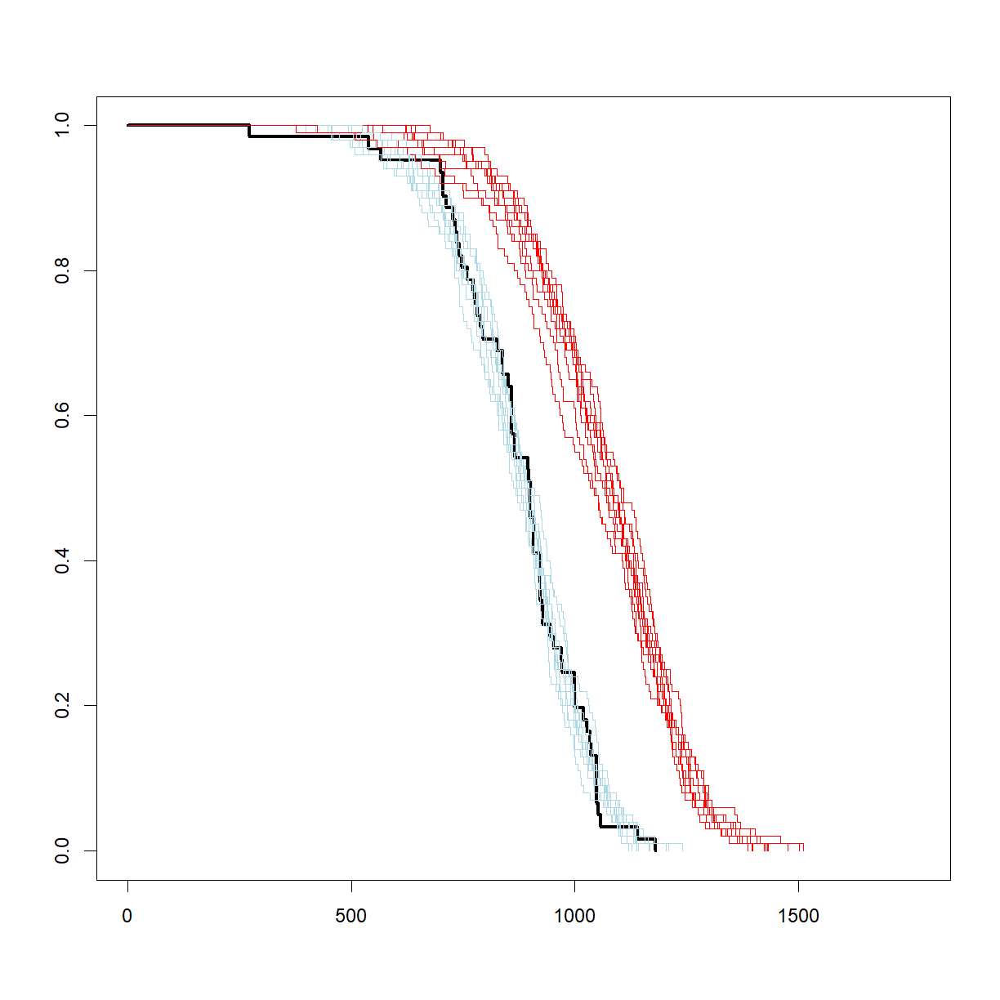
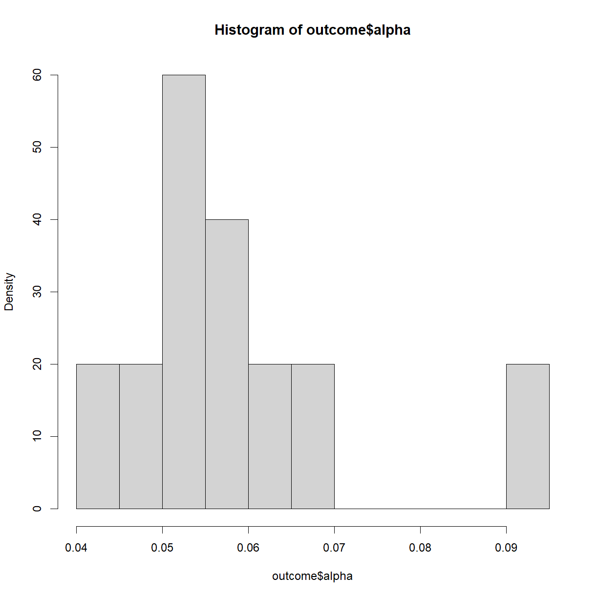

---
# Please do not edit this file directly; it is auto generated.
# Instead, please edit 09-oyo-simulation.md in _episodes_rmd/
title: "Simulating Experiments"
classdate: "9/23/2020 -- On Your Own"
teaching: 90
exercises: 30
questions:
- "What is a simulated experiment?"
- "What are the applications for simulated experiments?"
- "How can we use simulation to improve (and generalize) power analysis?"
objectives:
- "Prepare a plan for running an experiment simulation."
- "Simulate data from an assumed distribution."
- "Use simulated data to run a series of mock experiments to examine the behavior of a planned analysis."
keypoints:
- "Experiment simulations can be used to understand the behavior of an idealized system (i.e. a system lacking noise from sources like subjective observation and measurement error)."
- "Power analyses can be conducted using pilot data and (potentially) removing assumptions about distribution."
- "In essence, an experiment simulation is used to build a 'real' sampling distribution from which to draw statistical parameters like significance and power."
source: Rmd
---

***
## On Your Own

Simulations have several advantages, for example:
* The force you to think through a planned statistical analysis in advance (for best practices, you should be doing this anyway) and work out at least some of the technical issues ahead of time.
* They give valuable insight into the behavior the phenotype that you are studying.
* They can identify problems with experimental design or practical execution that you did not consider in advance. 

In this class we are going to use a simulation to run a more generalizable form of power analysis. Unlike the functions in the `pwr` package, this method can be used on essentially any experimental design for which you have pilot data, or can make a reasonable estimate of the behavior of the data. It does not necessarily rely on specific assumptions about the distribution or nature of the phenotype (though *some* assumptions will always be required).

***
### Simulating power

In a power analysis, we are usually trying to figure out what sample size we need to be confident in the statistical outcome of an experiment. Why don't we just run the experiment a bunch of times to see how often we expect different outcomes to occur? Because we have limited resources, and repeating an experiment a hundred or a thousand times just isn't practical. We usually have the time and resources to run an experiment once (or at most a few times), and we want to know how to get the most bang for our buck. That doesn't mean we can't pretend though.

In essence, a simulation is a formalized thought experiment, where we set up an idealized scenario where we know the right answer, pretend to run our experiments over and over again, complete with statistical tests, and see how often our "single" experiments make the right call about the true situation. Here is a basic protocol:

1. Estimate the behavior of the real phenotype of interest. Usually this involves collection pilot data and making an assumption along one of two lines:
 + Assume that the phenotype behaves according to a defined function or distribution and use the pilot data to estimate the exact shape (e.g. assume your phenotype is normally distributed, and use the mean and standard deviation of the pilot data to estimate the shape).
 + Assume that your pilot data is identical to your population and use it directly (this usually works if you have a lot of pilot data, say about your control population).
2. Decide what sort of change in your phenotype of interest is meaningful. Usually this involves making an assumption about how the independent variable will impact your dependent variable (e.g. I am interested in detecting a mean body weight change of 20% without a change in standard deviation). 
3. Using the information in (1) and (2), formally define your "control" and "treatment" populations with a known change of a magnitude that will be meaningful (to simulate the situation "$$H_1$$ is true"). Also draw a second random "treatment" sample from your control population (to simulate the situation "$$H_0$$ is true")
4. Collect a simulated sample of size m and n from your control and treatment groups, respectively (note that m and n can be different). This usually involves drawing randomly from a distribution or pilot data set.
5. Conduct a pre-defined statistical test on your "control" vs. "treatment" samples for both situations ($$H_1$$ is true and $$H_0$$ is true) and note the outcome.
6. Repeat steps (4) and (5) as many times as you like.
7. Tabulate the number of times your statistical test accepted or rejected $$H_0$$ under both "truth" scenarios to generate a hypothesis table. 
8. Use the four quadrants of the hypothesis table to calculate your simulated $$\alpha$$, $$\beta$$, and power.
9. Repeat for additional effect and sample sizes to draw power reference charts. 

Let's use this process to re-examine our power analysis for mouse lifespan. First, we need to know how to sample data.

***
### Sampling from distributions

Let's use our inbred lifespan data set to simulate some new lifespan data for C57BL/6J mice. First, load the `inbred.lifespan.txt` data and the `survival` package. Also define the "status" variable to indicate which mice had a positive observation for the phenotype of interest (death). Recall that this is just the inverse of the already defined `censor` variable, which indicates censoring events for mice that were removed from the study prior to dying. Finally, grab the subset of data for just the C57BL/6J mouse strain.

~~~
# load libraries
library("survival")

# load inbred mouse lifespan data
data.surv <- read.delim("data/inbred.lifespan.txt")

# define status variable to indicate "death" events
data.surv$status <- as.integer(!data.surv$censor)

# Grab C57BL/6J data subset
surv.b6 <- data.surv[data.surv$strain == "C57BL/6J",]
head(surv.b6)
~~~
{: .language-r}

~~~
      strain sex animal_id lifespan_days censor status
449 C57BL/6J   f        24           333      1      0
450 C57BL/6J   f        25           475      1      0
451 C57BL/6J   f        26           391      1      0
452 C57BL/6J   f       204           272      0      1
453 C57BL/6J   f       205          1049      0      1
454 C57BL/6J   f       206           795      0      1
~~~
{: .output}

One way to approach this data would be to just use our pilot inbred lifespan data under the assumption that it can represent the "true" population. A better approach, when possible, is to find a distribution that can accurately represent your data. There are some distributions that can do a decent job for lifespan data. The most common are the Gompertz and Weibull distributions.

&nbsp;
#### Gompertz and Weibull distributions for lifespan data

As discussed in our previous class on survival analysis, while the population-level survival function, S(t), cannot be considered independently sampled, because each point depends on the value of previous observations, the hazard function, or age-specific mortality function can be modeled based on independent sampling of lifespan. The Gompertz and Weibull assume that the hazard function takes on a specific (and slightly different) form:

&nbsp;

More information and the R functions for dealing with a Gompertz distribution are available in the `flexsurv` package. For our purposes, and within the `survival` package, we will primarily deal with the Weibull distribution. In the above equations, $$\gamma$$ is called the *shape* and $$\lambda$$ is called the scale. For shape, the following hold:
* $$\gamma < 1$$ indicates that the failure rate (aka mortality) is decreasing over time, such as infant mortality rates.
* $$\gamma = 1$$ indicates a constant failure rate, such as that for many types of machinery. The Weibull distribution simply collapses to the exponential distributions. 
* $$\gamma > 1$$ indicates an increasing failure rate, which is what we see during aging.

In contrast, the scale parameter $$\lambda$$ simply defines the relative rate at which the hazard is increasing. If we make the assumption that our lifespan data falls within a Weibull distribution, we can use the `survreg()` function to identify the shape and scale parameters that best fit our survival data:

~~~
# calculate parameters for Weibull distribution
wei.b6 <- survreg(Surv(lifespan_days, status == 1) ~ 1, data = surv.b6, dist = "weibull")

# There are multiple ways to parameterize a Weibull distribution. The survreg 
# function embeds it in a general location-scale family, which is a 
# different parameterization than the rweibull function, and often leads
# to confusion.
#   survreg's scale  =    1/(rweibull shape)
#   survreg's intercept = log(rweibull scale)

# based on the above, calculate scale and shape for rweibull
shape.b6 <- 1/wei.b6$scale
scale.b6 <- as.numeric(exp(wei.b6$coefficients))
~~~
{: .language-r}

&nbsp;

And using these shape and scale parameters, we can now use the `rweibull()` function to randomly draw a requested number of samples from the corresponding Weibull distribution.

~~~
samp.b6 <- rweibull(10, shape.b6, scale.b6)
samp.b6
~~~
{: .language-r}

~~~
 [1] 949.5079 841.4592 963.9582 737.7958 913.4836 949.7336 735.6371 920.7197
 [9] 859.8751 927.9590
~~~
{: .output}

&nbsp;

As a first order confirmation, note that these values are in the same range as the real lifespan values for C57BL/6J mice in our data set. Based on the equation for hazard, we can use the `scale` parameter to define a desired change in lifespan:

~~~
# define change
change <- 0.2 # 20% change in lifespan

# sample a distribution with a 20% increase in scale
samp.b6 <- rweibull(10, shape.b6, scale.b6 + 0.2*scale.b6)
samp.b6
~~~
{: .language-r}

~~~
 [1]  857.9289 1116.5046 1263.4893 1169.8657  818.3239  859.9955  953.7225
 [8] 1167.9282  792.4100 1052.3357
~~~
{: .output}

&nbsp;

To test the sampling procedure, let's draw 10 random samples from both the "control" population, and a population with a 20% increase in lifespan, and plot the survival curves all together along with the survival curves from the original sample.

~~~
# first define the survival curve for the original sample
survfit.real <- survfit(Surv(lifespan_days, status == 1) ~ 1, data = surv.b6)

# plot the real survival data
plot(survfit.real, conf.int = F, 
     col = "black", lwd = 3, # make this line black and thicker
     xlim = c(0, 1.5*max(surv.b6$lifespan_days))) # make the x-axis plenty large enough for the next set

# run through 10 iterations
for (i in 1:10) {
  # select a sample of 100 from the estimated "control" and "treatment" Weibull distributions
  samp.ctrl <- rweibull(100, shape.b6, scale.b6)
  samp.treat <- rweibull(100, shape.b6, scale.b6 + 0.2*scale.b6)
  
  # calculate survfit objects (note that we are assuming no censoring here)
  survfit.ctrl <- survfit(Surv(samp.ctrl, rep(1,length(samp.ctrl))) ~ 1)
  survfit.treat <- survfit(Surv(samp.treat, rep(1,length(samp.treat))) ~ 1)
  
  # add lines to the existing plot for current set
  lines(survfit.ctrl, conf.int = F, col = "lightblue")
  lines(survfit.treat, conf.int = F, col = "red")
}
~~~
{: .language-r}

&nbsp;

That looks like a pretty decent estimate, and gives some idea of what variation to expect, even with a relatively large sample size (100). Now let's look at how to use that same approach to calculate power.

***
### Power analysis by simulation

For the purposes of this example, we want to know how large we need our sample size to be in order to detect a 20% change at 90% power at a significance level of 0.05 using a log-rank test. As noted above, this style of power analysis always takes in a value for effect size, sample size, and significance level and generates power as an output. What we need to do is run a simulated experiment with a range of sample sizes and figure out which generates a sufficiently high simulated power. Here is how we go about it:

~~~
# set power parameters
alpha <- 0.05
change <- 0.2

# set range of sample sizes
n.vec <- seq(5, 50, 5)

# initialize data frame to store power and alpha values for each sample size
outcome <- data.frame(N = n.vec, 
                      alpha = as.numeric(NA),
                      power = as.numeric(NA))

# set number of simulated samples
n.samp <- 1000

# calculate parameters for Weibull distribution
wei.b6 <- survreg(Surv(lifespan_days, status == 1) ~ 1, data = surv.b6, dist = "weibull")
shape.b6 <- 1/wei.b6$scale
scale.b6 <- as.numeric(exp(wei.b6$coefficients))

# start by cycling through sample sizes
for (i.n in 1:length(n.vec)) {
  # grab current sample size
  n.c <- n.vec[i.n]

  # initialize matrix to record whether null hypothesis was accepted or rejected
  outcome.c <- data.frame(Sample = 1:n.samp, H0.True = as.integer(NA), H1.True = as.integer(NA))
  
  # start sampling procedure -- for each iteration, do the following:
  #  1. generate test sample from each distribution (control, 
  #     control (H0 true) and simulated 20% extension (H1 true))
  #  2. run a log rank test to determine what we would conclude given
  #     the current sample
  #  3. record outcome for both comparisons to the outcome matrix
  for (i.samp in 1:n.samp) {
    # print every 100 samples
    if ((i.samp %% 250) == 0) {
      print(paste("Now starting sample",i.samp, "for sample size",n.c))
    }
    
    # generate control sample and embed in test data frame
    samp.ctrl.c <- rweibull(n.c, shape.b6, scale.b6)
    surv.ctrl.c <- data.frame(lifespan = samp.ctrl.c, group = "control", status = 1)
    
    # generate test sample assuming H0 is true
    samp.test.H0true.c <- rweibull(n.c, shape.b6, scale.b6)
    surv.test.H0true.c <- data.frame(lifespan = samp.test.H0true.c, group = "test", status = 1)
    
    # generate test sample assuming H1 is true
    samp.test.H1true.c <- rweibull(n.c, shape.b6, scale.b6 + change*scale.b6)
    surv.test.H1true.c <- data.frame(lifespan = samp.test.H1true.c, group = "test", status = 1)
    
    # setup data frames for H0 and H1 true for testing
    surv.H0true.c <- rbind(surv.ctrl.c, surv.test.H0true.c)
    surv.H1true.c <- rbind(surv.ctrl.c, surv.test.H1true.c)
    
    # run log-rank test
    logrank.H0true <- survdiff(Surv(lifespan, status == 1) ~ group, data = surv.H0true.c)
    logrank.H1true <- survdiff(Surv(lifespan, status == 1) ~ group, data = surv.H1true.c)
    
    # calculate P-values from logrank chisq statistics
    p.H0true <- pchisq(logrank.H0true$chisq, length(logrank.H0true$n) - 1, lower.tail = F)
    p.H1true <- pchisq(logrank.H1true$chisq, length(logrank.H1true$n) - 1, lower.tail = F)
    
    # record outcome (1 = accept H0, 0 = reject H0)
    outcome.c$H0.True[i.samp] <- as.integer(p.H0true >= 0.05)
    outcome.c$H1.True[i.samp] <- as.integer(p.H1true >= 0.05)
  }
  
  # Build hypothesis table
  h.table.c <- data.frame(outcome = c("Accept H0", "Reject H0"), 
                         H0.true = c(sum(outcome.c$H0.True), n.samp - sum(outcome.c$H0.True)),
                         H1.true = c(sum(outcome.c$H1.True), n.samp - sum(outcome.c$H1.True)))
  
  # update power and significance data frames
  outcome$alpha[i.n] <- h.table.c$H0.true[h.table.c$outcome == "Reject H0"]/n.samp
  outcome$power[i.n] <- h.table.c$H1.true[h.table.c$outcome == "Reject H0"]/n.samp
}
~~~
{: .language-r}

~~~
[1] "Now starting sample 250 for sample size 5"
[1] "Now starting sample 500 for sample size 5"
[1] "Now starting sample 750 for sample size 5"
[1] "Now starting sample 1000 for sample size 5"
[1] "Now starting sample 250 for sample size 10"
[1] "Now starting sample 500 for sample size 10"
[1] "Now starting sample 750 for sample size 10"
[1] "Now starting sample 1000 for sample size 10"
[1] "Now starting sample 250 for sample size 15"
[1] "Now starting sample 500 for sample size 15"
[1] "Now starting sample 750 for sample size 15"
[1] "Now starting sample 1000 for sample size 15"
[1] "Now starting sample 250 for sample size 20"
[1] "Now starting sample 500 for sample size 20"
[1] "Now starting sample 750 for sample size 20"
[1] "Now starting sample 1000 for sample size 20"
[1] "Now starting sample 250 for sample size 25"
[1] "Now starting sample 500 for sample size 25"
[1] "Now starting sample 750 for sample size 25"
[1] "Now starting sample 1000 for sample size 25"
[1] "Now starting sample 250 for sample size 30"
[1] "Now starting sample 500 for sample size 30"
[1] "Now starting sample 750 for sample size 30"
[1] "Now starting sample 1000 for sample size 30"
[1] "Now starting sample 250 for sample size 35"
[1] "Now starting sample 500 for sample size 35"
[1] "Now starting sample 750 for sample size 35"
[1] "Now starting sample 1000 for sample size 35"
[1] "Now starting sample 250 for sample size 40"
[1] "Now starting sample 500 for sample size 40"
[1] "Now starting sample 750 for sample size 40"
[1] "Now starting sample 1000 for sample size 40"
[1] "Now starting sample 250 for sample size 45"
[1] "Now starting sample 500 for sample size 45"
[1] "Now starting sample 750 for sample size 45"
[1] "Now starting sample 1000 for sample size 45"
[1] "Now starting sample 250 for sample size 50"
[1] "Now starting sample 500 for sample size 50"
[1] "Now starting sample 750 for sample size 50"
[1] "Now starting sample 1000 for sample size 50"
~~~
{: .output}

~~~
# show outcome
outcome
~~~
{: .language-r}

~~~
    N alpha power
1   5 0.060 0.438
2  10 0.074 0.735
3  15 0.066 0.911
4  20 0.059 0.966
5  25 0.060 0.991
6  30 0.069 0.995
7  35 0.063 1.000
8  40 0.044 1.000
9  45 0.051 1.000
10 50 0.047 1.000
~~~
{: .output}

~~~
# Check out the distribution of calculated alphas
hist(outcome$alpha, breaks = 15, freq = F)
~~~
{: .language-r}

~~~
# generate power plot to compare power vs. sample size
plot(outcome$power, outcome$N, type = "l", 
     main =  "Power analysis for 20% change in\nC57BL/6J lifespan (alpha = 0.05)",
     ylab = "Sample Size", 
     xlab = "Power")
~~~
{: .language-r}

&nbsp;

It looks like we need somewhere around 16 mice to detect a 20% change in C57BL/6J lifespan at $$\alpha = 0.05$$. 

Note that the precision of the power and significance calculated based on the simulation is strictly determined by the number of times we run the simulated experiment. If we only run 100 iterations, we will only be able to distinguish a significance level or power differences down to 1/100 = 0.01.

***


