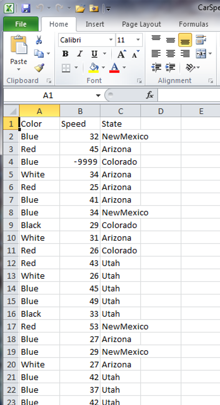

```{r, include = FALSE}
source("../bin/chunk-options.R")
knitr_fig_path("03-class-data-frames-")
```

## In Class

### Data Frames

The **data frame** is the most important data type in R. It is the *de facto* data structure for most tabular data and what we will use for calculating statistics and running other analyses. **Data frames** have some similarities to matrices. For example, both are two-dimensional structures and can be similarly indexed using `[]`. However, **data frames** have several features that distinguish them from **matrices** and make them more generally useful to store and manipulate datasets. 

**Data frames** have the following characteristics:
* Each column must contain a single data type
* Different columns can have different data types
* All columns must have the same number of elements (i.e. rows)
* Each column has a names can be directly called using the `$` operator
* Like matrices, data frames can be indexed using the `df[row,column]` notation.

As with other data types and structure, **data frames** can be generated manually using the `data.frame()` function:

```{r}
dat <- data.frame(id = letters[1:10], x = 1:10, y = 11:20)
dat
```

&nbsp;

Note the structural difference when compared to the same object coerced to a matrix, particularly the different data types in each column:

```{r}
m <- as.matrix(dat)
m
```

&nbsp;

Converting a **data frame** to a **matrix** enforces the "single data type" requirement of the latter by coercing all elements to the most general data type already present (in this case **character**). If we try to reverse the conversion (using the `as.data.frame()` function) we lose the original data structure:

```{r}
m.dat <- as.data.frame(m)
m.dat
```

&nbsp;

The attributes are also distinct for the two data types.

```{r}
class(m)
class(dat)
attributes(m)
attributes(dat)
dim(m)
dim(dat)
```

&nbsp;

The above features mean that **matrices** and **data frames** are suitable for different data types. For instance, **matrices** are optimized for data of the same type, and particularly data with a inherently two-dimensional structure--e.g. image data stored as pixel intensities at different x-y coordinates. **Data frames** are optimized for data sets with mixed data types--e.g. patient data with multiple phenotypes, such as patient ID (**character**), sex (**character**), body weight (**numeric**), and smoking status (**logical**). The mixed structure of data in **data frames** makes them non-suitable to matrix operations (e.g. matrix multiplication, transposition).

Here is some additional information on **data frames**:

* A **data frame** is created by the `read.csv()` and `read.table()` when importing the data into R (see below).
* Assuming all columns in a data frame are of same type, data frame can be converted to a matrix with `data.matrix()` (preferred) or `as.matrix()`. Otherwise type coercion will be enforced and the results may not always be what you expect.
* **Data frames** can be created *de novo* with the `data.frame()` or `as.data.frame()` functions.
* Like matrices, the number of rows and columns can be queried with `nrow(dat)` and `ncol(dat)`, respectively.
* **Data frames** can have additional attributes such as `rownames()`, which can be useful for annotating data, like `subject_id` or `sample_id`.
* Rownames are often automatically generated to reflect the row number: `1, 2, ..., n`. Consistency in numbering of rownames may not be honored when rows are reshuffled or when a **data frame** is subsetted.
* A common way to use data frames is with columns as "variables" (e.g. body weight, blood pressure) and rows as "patients" or "observations" (e.g. "subject 1", "subject 2", ...).

Just as a **matrix** in R is a specialized **vector**, a **data frame** is a specialized **list**. More on this in today's *On Your Own* section. For now, the following table summarizes the one-dimensional and two-dimensional data structures in 
R in relation to diversity of data types they can contain.

| Dimensions | Homogenous | Heterogeneous |
| ------- | ---- | ---- |
| 1-D | atomic vector | list |
| 2-D | matrix | data frame |


&nbsp;
#### Sample data in R

R includes a number of built-in data sets that can be used to examine and test different functions and operators. The variable `iris` contains a pre-defined **data frame** that is automatically loaded into memory when R is initialized. We will use `iris` to begin learning how to interact with **data frames**. 

Let's start by looking at the documentation for the `iris` data set:

```{r eval=FALSE}
?iris
```

&nbsp;

For reference, here are images of the flowers from the three iris species from the `iris` dataset:


There are many ways to interact with **data frames** and get information about their contents. We have seen some of these previously:

> ## Useful Data Frame Functions
>
> * `head()` - shows first 6 rows
> * `tail()` - shows last 6 rows
> * `dim()` - returns the dimensions of data frame (i.e. number of rows and number of columns)
> * `nrow()` - number of rows
> * `ncol()` - number of columns
> * `str()` - structure of data frame - name, type and preview of data in each column
> * `names()` or `colnames()` - both show the `names` attribute for a data frame
> * `sapply(dataframe, class)` - shows the class of each column in the data frame
{: .callout}

&nbsp;

I find `head()`, which displays the first 6 rows and all columns of the data frame, particularly useful to get a feel for the contents and organization of a new data frame. Let's take a quick look at `iris` with `head()` and `dim()`:

```{r}
head(iris)
head(iris, 2) # you can look at more or fewer rows if 6 is not what you want
dim(iris)
```

&nbsp;

We know that **data frames** can store different data types in different columns, but how do we tell which data types are present in a specific **data frame**?

```{r}
class(iris)
mode(iris)
typeof(iris)
```
&nbsp;

The usual functions for looking at the data type of basic variables and data structures don't seem to work. This is where the `str()` is particularly useful:

```{r}
str(iris)
```

&nbsp;

`str()` gives a lot of useful information about **data frames**:
* number of rows (i.e. `150 obs.`)
* number of columns (i.e. `5 variables`)
* the name of each column (e.g. `$Sepal.Length`)
* the data type of each column (e.g. `num`)
* the first 10 entries in each column (e.g. `5.1, 4.9, 4.7, ...`)

&nbsp;

This is the same information displayed if you toggle the arrow for a **data frame** variable in the *Environment* panel (upper-right), for instance the `dat` variable we created earlier. Clicking on a variable opens a basic spreadsheet representation of the table in the *Source Editor* panel (upper-left). 

&nbsp;
#### Indexing data frames

We examined basic indexing using **vectors** and **matrices** in last week's lessons. These work the same for **data frames**. There are really three primary ways for accessing specific data inside **data frames**:

* By index
* By name
* By logical vector

These can be combined to rapidly extract desired data subsets within **data frames**. You will be exploring these in depth *On Your Own*, but here I will give you the flavor of each.

&nbsp;

**By index**

Because **data frames** are rectangular, elements of data frame can be referenced by specifying the row and the column index in single square brackets (similar to **matrices**).

```{r}
iris[1, 3]
```

&nbsp;

Like **matrices**, we can also ask for multiple columns and rows using the `:` operator:

```{r}
iris[1:20, 2:3]
```

&nbsp;

... or for non-contiguous subsets using lists of indices:

```{r}
iris[c(1:10,20:25), c(1,3)] # note the use of sequences within the `c()` list
```

&nbsp;

As with other data types, leaving a dimension blank is interpretted as *return all values* in that dimension:

```{r}
iris[2,] # return row 2
iris[,2] # return column 2
```

&nbsp;

Note that the column version actually returns a vector of the data type in the requested column number, rather than a data frame with a single column:

```{r}
class(iris[,2])
```

&nbsp;

What if we only ask for one dimension in data frame?

> ## Asking for a single index from a data frame
> 
> What do you expect if we query `iris` with just one index?
> 
> ```{r, eval=FALSE}
> iris[3]
> ```
> > ## Solution
> > ```{r}
> > iris[3]
> > ```
> > Because the data frame is a list at heart, just asking for a single index returns 
> > the indicated column.
> >
> {: .solution}
{: .challenge}

&nbsp;


**By name**

**Data frames** (and **lists**; see *On Your Own* section) have a special property in that each column is considered a separate element with a unique name that can be used as a handle to call the data in that column. To exploit this feature, you can either use double square brackets (`[[]]`) or the `$`:

```{r}
iris[["Sepal.Length"]]
iris$Sepal.Length
```

&nbsp;

These named columns can be used in vectorized mathematical operations:

```{r}
iris$Sepal.Length + iris$Petal.Length
```

&nbsp;

> ## Default Names
>
> If column names are not specified, `V1, V2, ..., Vn` are automatically used as the defaults. For example, if we convert a matrix to a data frame:
> 
> ```{r}
> m <- matrix(1:10, nrow = 2)
> m.data <- as.data.frame(m)
> m.data
> ``` 
{: .callout}

&nbsp;

**By logical vector**

Recall that a logical vector contains only the special values `TRUE` and `FALSE`:

```{r logical_vectors}
c(TRUE, TRUE, FALSE, FALSE, TRUE)
```

&nbsp;

**Data frames** and other data structures can accept **logical** vectors as indexing variables. Usually the length of the vector will be the same as the corresponding dimension of the **data frame**, with each vector element indicating whether the corresponding row or column in the **data frame** should be included (`TRUE`) or excluded (`FALSE`) in the output **data frame**. Let's look at a simple example using `dat`:

```{r}
# grab the dimensions of dat
dim(dat)

# create a logical vector with 10 elements indicating that
# elements 2, 3, and 7 should be returned
index <- c(F,T,T,F,F,F,T,F,F,F)

# use the created logical vector to index the rows of dat
dat[index,]
```

&nbsp;

Logical indexing is one of the most powerful subsetting techniques in R. Generally, we won't be manually defining the index vector, but using R to generate the appropriate logical vector. We will go into more depth in the *On Your Own*, but let's look at an example and a few simple exercises to look at how logical indexing may be used in practice.

Looking at the `iris` dataset, we can use the logical operator `==` to return the subset of data corresponding to the *Iris setosa* species. First, let's examine what the `==` operator does:

```{r}
# Which elements of a vector are exactly equal to 1?
x <- c(3,2,1,2,1,2,1)
x == 1
```

&nbsp;

The expression `x == 1` automatically returns a logical vector of the same length as `x` with `TRUE` elements where `x` is exactly `1` and `FALSE` elements where `x` is not exactly `1`. Let's apply this to our `iris` data set:

```{r}
# create a vector indicating which elements of the iris "Species"
# variable are equal to "setosa"
i.setosa <- iris$Species == "setosa"
i.setosa

# use the vector to extract the subset of the iris data for flowers
# of the "Iris setosa" species
setosa <- iris[i.setosa,] # don't forget to specify "all" columns!
setosa

# note that you can also just do this all on one line:
setosa <- iris[iris$Species == "setosa",]
```

&nbsp;
> ## Subsetting sepal length
>
> Use the `>` operator to create a new data frame that is the subset of `iris` with sepal length greater than 5.0 for the species.
> 
> > ## Solution
> > ```{r}
> > iris.new <- iris[iris$Sepal.Length > 5,]
> > ```
> {: .solution}
{: .challenge}

> ## Comparing variables -- petal aspect ratio
>
> Create a new data frame that includes all flowers for which the petal length is less than 3x the petal width.
> 
> > ## Solution
> > ```{r}
> > iris.new <- iris[iris$Petal.Length < 3 * iris$Petal.Width,]
> > ```
> {: .solution}
{: .challenge}

> ## Combining concepts -- subsetting and counting
>
> How many flower of each species in the current data set have petal length less than 3x the petal width?
> 
> > ## Solution
> > ```{r}
> > # First subset on the aspect ratio as in the previous exercise
> > iris.new <- iris[iris$Petal.Length < 3 * iris$Petal.Width,]
> > 
> > # Now we have several options.
> > # Option 1: Subset on species, then look at dimensions:
> > iris.setosa <- iris.new[iris.new$Species == "setosa",]
> > iris.versicolor <- iris.new[iris.new$Species == "versicolor",]
> > iris.virginica <- iris.new[iris.new$Species == "virginica",]
> > dim(iris.setosa)[1] # index dimensions to return # of rows
> > dim(iris.versicolor)[1]
> > dim(iris.virginica) [1]
> > 
> > # Option 2: Use logical == combined with sum() to count each 
> > # species name in the new data frame
> > sum(iris.new$Species == "setosa")
> > sum(iris.new$Species == "versicolor")
> > sum(iris.new$Species == "virginica")
> > ```
> {: .solution}
{: .challenge}

***
### Reading data from a tabulated file (.csv, .txt)

In the majority of cases, your data will be stored in some type of external file. The most common way that scientists store data is in Excel spreadsheets. While there are R packages designed to access data directly from Excel spreadsheets--the best I have found so far is `readxl`, for those who have need--these packages are often difficult and non-intuitive to use. Opening Excel spreadsheets from R is also slow, and it is not uncommon for large datasets to exceed the size limits of Excel. It is usually easier and faster to save tabular data in one or more [comma-separated values]({{ page.root }}/reference.html#comma-separated-values-csv) (*CSV* or *.csv*) or text (*TXT* or *.txt*) files and then use R's built in functionality to read and manipulate the data. Both file types are primitive forms of spreadsheet data anyway, in which data is stored as text with distinct data elements separated by a *delimiting character*--a comma `,` for *.csv* files and usually a tab (denoted `\t` in R) for *.txt* files.

Thankfully, Excel is capable of opening, editing, and saving both *.csv* and *.txt* files, so we can go back and forth between R and Excel when we find it convenient. 

Here we will learn how to read external data from a *.csv* or *.txt* file, and write data modified or generated in R to a new *.csv* or *.txt* file. We will also explore the [arguments]({{ page.root }}/reference.html#argument) that allow you read and write the data correctly for your needs.

&nbsp;
#### Loading external data into a data frame

Let's start by loading some sample data in *.csv* format using the `read.csv()` function and take a look at the first few rows of the contents using the `head()` function:

```{r}
dat <- read.csv(file = 'data/sample.csv')
head(dat)
```

&nbsp;

Open up the same file using a basic text editor (e.g. *Notepad* in Windows; *TextEdit* in MacOS). You should see something like this:

> "ID","Gender","Group","BloodPressure","Age","Aneurisms_q1","Aneurisms_q2","Aneurisms_q3","Aneurisms_q4" 
> "Sub001","m","Control",132,16,114,140,202,237
> "Sub002","m","Treatment2",139,17.2,148,209,248,248
> "Sub003","m","Treatment2",130,19.5,196,251,122,177
> "Sub004","f","Treatment1",105,15.7,199,140,233,220
> "Sub005","m","Treatment1",125,19.9,188,120,222,228
> "Sub006","M","Treatment2",112,14.3,260,266,320,294
{: .callout}

&nbsp;

A couple of things to notice:
* The first line contains column headers.
* The `,` delimiters tell the `read.csv(...)` function where the breaks in the data are located; that is, which data to put in which column of the output data frame.
* Each new line is also a delimiter that tells `read.csv(...)` which data to put in which row in the output data frame
* In this case, all strings are contained within quotation marks `""`. This is an optional way to tell the program where character strings start and stop. 

On the topic of using quotation marks, open `sample-noquotes.csv` in your text editor to see the quote-free option:

> ID,Gender,Group,BloodPressure,Age,Aneurisms_q1,Aneurisms_q2,Aneurisms_q3,Aneurisms_q4 
> Sub001,m,Control,132,16,114,140,202,237
> Sub002,m,Treatment2,139,17.2,148,209,248,248
> Sub003,m,Treatment2,130,19.5,196,251,122,177
> Sub004,f,Treatment1,105,15.7,199,140,233,220
> Sub005,m,Treatment1,125,19.9,188,120,222,228
> Sub006,M,Treatment2,112,14.3,260,266,320,294
{: .callout}

&nbsp;

And note that the default `read.csv(...)` treats this file identically:

```{r}
dat2 <- read.csv(file = 'data/sample-noquotes.csv')
head(dat2)
```

&nbsp;

Whether to use quotes in your data files is up to you. The default behavior of `read.csv(...)` is smart enough to figure this out on it's own. However, the `read.csv(...)` has an argument called `quote` that dictates how to interpret quotation marks. 

> ## Mis-loading quoted data
>
> What if we force `read.csv()` to ignore the quotes when they are present?
> Before you run any code, think about what will happen to the data in quotes
> if we tell R that there are no "quote" characters.
>
> ```{r, eval = FALSE}
> dat3 <- read.csv(file = 'data/sample.csv', quote="")
> head(dat3)
> ```
>
> > ## Solution
> > 
> > The quotes are now included as part of the character arguments. It also messed up the header 
> > formatting, appending an "X" to the beginning and surrounding text with "."ss.
> > Perhaps surprisingly, it does interpret teh numbers as numbers, rather than number "characters"
> > with quotation marks around them.
> {: .solution}
{: .challenge}

&nbsp;

What happens if we don't assign the output of `read.csv(...)` to a variable?

```{r, eval=FALSE}
read.csv(file = 'data/sample.csv')
```

&nbsp;

As with any other function call, if the output is not explicitly assigned, it will be dumped into the console window. This can be annoying with large data files. Remember to assign your `read...()` functions!

&nbsp;
#### Changing Delimiters

The default delimiter in the `read.csv()` function is a comma `,`, but you can
use essentially any set of characters as a delimiter. `read.csv(...)` is actually a special case of a more general function called `read.table(...)`, with the delimiter argument (which is defined by the argument `sep`, for "separator") set to `,` by default. Check out the help file for these functions:

```{r, eval=FALSE}
?read.table # note that `?read.csv` brings up the same help document.
```

&nbsp;

Under the **Usage** section there are multiple functions listed, including `read.table(...)` and `read.csv(...)`. In the parentheses for each function there is a list of arguments. Since `read.table(...)` is the parent function, all arguments are listed. Only arguments with different default values (as indicated by the `=`) are listed for `read.csv(...)`. A default value is the value that each argument assumes when you do not explicitly enter a value. For example, `read.table(...)` assumes that a data file has no header (`header = FALSE`) and no delimiting character (`sep = ""`) while `read.csv(...)` assumes that a data file does have a header (`header = TRUE`) and a comma as the delimiting character (`sep = ","`), unless you specify otherwise.

If your data is stored in a tab-delimited text file, you will need to use `read.table(...)` with a different delimiting character, or another of the associated functions called `read.delim(...)` which has defaults to a tab-delimited file format. Note that to define a *tab* as a delimiting character, you have to use `\t`.

Let's give it a try using a copy of the `sample.csv` data saved as a tab-delimited `sample.txt` file.

*Note:* From the help file, `read.delim(...)` defaults to `header = TRUE` while we have to explicitly define it when using `read.table(...)`. We will talk about what this means in the next section.

```{r}
# note that read
dat4 <- read.delim(file = 'data/sample.txt')
dat5 <- read.table(file = 'data/sample.txt', header = TRUE)
head(dat4)
head(dat5)
```

&nbsp;

Now let's take a closer look at a couple of useful arguments in `read.table(...)` family of functions.

&nbsp;
#### The `header` argument

The default for `read.csv(...)` and `read.delim(...)` is to set the `header` argument to `TRUE`. This means that the first row of values in the *.csv* or *.txt* is used to define the column names for the output **data frame**. If your dataset does not have a header, set the `header` argument to `FALSE`.

> ## Mis-loading data with headers
>
> What happens if you forget to put `header = FALSE` when loading a *.csv*
> file with `read.csv()`? The default value is `header = TRUE`, which you can 
> check with `?read.csv` or `help(read.csv)`. What do you expect will happen if > you leave the default value?
>
> Before you run any code, think about what will happen to the first few rows
> of your data frame, and its overall size. Then run the following code and
> see if your expectations agree:
>
> ```{r, eval = FALSE}
> dat6 <- read.csv(file = 'data/sample.csv', header = FALSE)
> head(dat6)
> ```
>
> > ## Solution
> >
> > The `read.csv(...)` function sets the column names as the default values (`V1, V2, V3, ...`) and
> > treats the first row of the `sample.csv` file as the first row of data. Clearly this is not the
> > desired behavior for this data set, but it will be useful if you have a dataset without headers.
> > Note that the `V` is used to start the column names, since column names must follow
> > the usual variable naming rules, which would be violated with just a number.
> {: .solution}
{: .challenge}

&nbsp;
#### The `stringsAsFactors` Argument

The `stringsAsFactors` argument tells R whether to treat imported data represented by a text string as a **character** or **factor** data type. Up until R version 4.0 was released, I introduced the `stringsAsFactors` argument as one of the most important in `read.csv(...)`, particularly if you are working with categorical data. This is because the default behavior of R *used to be* to convert **characters** into **factors**. Because many relevant functions behave differently when confronted with a **character** vector than they do when confronted with a **factor**, this often resulted in unexpected behavior. In R 4.0 they updated the default behavior, and now strings of text are loaded as **character** data, rather than **factors**. This argument is still important, but the default behavior is now more intuitive and results in fewer frustrations.

The major problem is that, as previously discussed, **factors** do not let you add new data to a vector unless another element with that value us already present. As an example, let's look at the `car-speeds.csv` data set. We find out that the data collector was color blind, and accidentally recorded green cars as being blue. In order to correct the data set, let's replace 'Blue' with 'Green' in the `$Color` column:

```{r}
# First - load the data with characters treated as factors and take a look at 
# what information is available
carSpeeds <- read.csv(file = 'data/car-speeds.csv', stringsAsFactors = TRUE)
head(carSpeeds)

# Next use indexing to replace all `Blue` entries in the Color column with 
# 'Green'
carSpeeds$Color[carSpeeds$Color == 'Blue'] <- 'Green'
head(carSpeeds, 10)
```

&nbsp;

What happened? Because we loaded the colors of the cars (represented by text strings) as factors, `Green` was not included in the original set of colors. Thus it was not included as a level in the factor. When we tried to replace `Blue` with `Green`, R changed each value to `NA` because `Green` was not included as a valid factor level.

To see the internal structure, we can use another function, `str()`. In this case, the data frame's internal structure includes the format of each column, which is what we are interested in.

```{r}
str(carSpeeds)
```

&nbsp;

We can see that the `$Color` and `$State` columns are factors and `$Speed` is a numeric column.

One way to solve this problem would be to add the `Green` level to the `Color` factor, but there is a simpler way. Let's reload the dataset using `stringsAsFactors = FALSE`, and see what happens when we try to replace 'Blue' with `Green` in the `$Color` column:

```{r}
# First - load the data and take a look at what information is available
carSpeeds <- read.csv(file = 'data/car-speeds.csv', stringsAsFactors = FALSE)
str(carSpeeds)

# Next use indexing to replace all `Blue` entries in the Color column with 'Green'
carSpeeds$Color[carSpeeds$Color == 'Blue'] <- 'Green'
carSpeeds$Color
```

&nbsp;

That's better! And we can see how the data now is read as character instead of factor.

Note that there are certainly times when we do want text strings represented by **factor** variable types. Recall the example in last week's *On Your Own* section dealing with ordered categorical data. Just be aware of the data types present in your data frames and how they impact the way you interact with your data.

***
### Writing tabular data to a file (.csv, .txt)

After altering our cars dataset by replacing 'Blue' with 'Green' in the `$Color` column, we now want to save the output. The `read.table(...)` function family has a corresponding set of `write.table(...)` functions. These functions have a familiar set of arguments:

```{r, eval=FALSE}
?read.table
```

&nbsp;

Here is the basic format for writing a table:

```{r}
# Export the data. The write.csv() function requires a minimum of two
# arguments, the data to be saved and the name of the output file.
write.csv(carSpeeds, file = 'data/car-speeds-corrected.csv')
```

If you open the file, you'll see that it has header names, because the data had headers within R, but that there are also numbers in the first column.

```{r, fig.align="left", out.width = "350px", echo = FALSE}
include_graphics("../fig/01-supp-csv-with-row-nums.png")
```

&nbsp;

This extra column can cause problems when trying to open data in some other programs, and in most cases you won't want to explicitly name the rows. This can be easily disabled with a simple argument:

&nbsp;
#### The `row.names` Argument

This argument allows us to set the names of the rows in the output data file. R's default for this argument is `TRUE`, and since it does not know what else to name the rows for the cars data set, it resorts to using row numbers. Unlike the recent change to the `stringsAsFactors` argument for reading data, this is an argument that defaults to something that is non-intuitive. To turn row names/numbers off, we can set `row.names` to `FALSE`:

```{r}
write.csv(carSpeeds, file = 'data/car-speeds-cleaned.csv', row.names = FALSE)
```

&nbsp;

Now we see:

```{r, fig.align="left", out.width = "350px", echo = FALSE}
include_graphics("../fig/01-supp-csv-without-row-nums.png")
```

&nbsp;

> ## Setting column names
>
> There is also a `col.names` argument, which can be used to set the column
> names for a data set without headers. If the data set already has headers
> (e.g. we used the `headers = TRUE` argument when importing the data) then a
> `col.names` argument will be ignored.
{: .callout}

&nbsp;
#### The `na` Argument

By default, R will export missing data in a dataset as `NA`. There are times when we want to specify certain values for missing data in our datasets (e.g. when we are going to pass the data to a program that only accepts `-9999` or `NaN` as a "no data available" value). In this case, we want to set the `NA` value of our output file to the desired value, using the `na` argument. Let's see how this works:

```{r}
# First, replace the speed in the 3rd row with NA, by using an index (square
# brackets to indicate the position of the value we want to replace)
carSpeeds$Speed[3] <- NA
head(carSpeeds)

write.csv(carSpeeds, file = 'data/car-speeds-corrected-na.csv', row.names = FALSE)
```

&nbsp;

Now we'll set `NA` to -9999 when we write the new *.csv* file:

```{r}
# Note - the na argument requires a string input
write.csv(carSpeeds,
          file = 'data/car-speeds-corrected-9999.csv',
          row.names = FALSE,
          na = '-9999')
```

&nbsp;

And we see:

```{r, fig.align="left", out.width = "350px", echo = FALSE}

```

***


