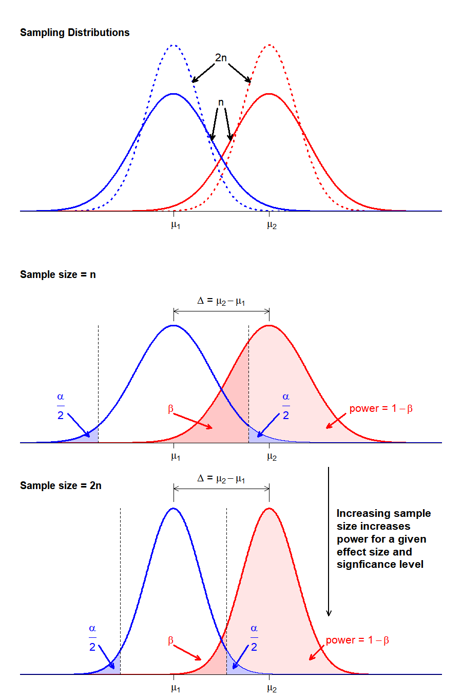

```{r, include = FALSE}
source("../bin/chunk-options.R")
knitr_fig_path("07-power-analysis-")
```

Increasingly, funding agencies are asking for detailed justification for experimental design decisions. An explicitly request in these requirements is presentation of a power analysis to justify your study design, particularly your selected sample size.

So what is power analysis? In essence, power analysis is a structured process for thinking through critical aspects of an upcoming question to ensure that your study is properly designed to test your hypothesis. The name "Power Analysis"" comes from the statistical definition of power:

&nbsp;&nbsp;&nbsp;&nbsp;&nbsp;&nbsp;*The power of a statistical test is the probability that it will reject the null hypothesis when the alternative hypothesis is true.*

The power of a test depends on several factors, including the characteristics of the observed phenotype in a population, the expected difference between groups, and the size of the sample. As we will see, sample size is the primary tool that we have to adjust power. For this reason, the usual goal of conducting a power analysis is to determine the sample size needed to test a specific hypothesis with a given statistical test. 

***
### The conceptual basis for power analysis

There are several possible outcomes when we collect a sample and run a statistical test to evaluate a hypothesis. There is some truth about our population that we are trying to detect: either the null hypothesis is true, or the alternative hypothesis is true. Once we conduct our test, there are two possible outcomes: either we accept the null hypothesis, or we reject it in favor of the alternative hypothesis. We can lay out the possible scenarios in a table:

Truth Table | $$H_0$$ True | $$H_1$$ True
----------: | :----------: | :----------:
Accept $$H_0$$ | Correct | Type II Error ($$\beta$$)
Reject $$H_0$$ | Type I Error ($$\alpha$$) | Correct

Each quadrant has specific meaning to our experiment. 
1. The upper left quadrant is the boring case where there is no difference present, and correctly conclude that this is the case.
2. Type I Error ($$\alpha$$). In the lower left is the probability that we make an error and reject the null hypothesis when it is, in fact, true. 
3. Type II Error ($$\beta$$). In the upper right is the probability that we make an error and accept the null hypothesis when the alternative hypothesis is true. 
4. Power (1 - $$\beta$$). Finally, in the lower right we have the situation where we correctly reject the null hypothesis in favor of the alternative when the alternative is, in fact, true. The probability associated with this outcome is called **power**. Because the top and bottom possibility in each column are direct negations, the sum of probabilities in each column is 1. Therefore:

&nbsp;&nbsp;&nbsp;&nbsp;&nbsp;&nbsp;power = 1 - $$\beta$$

While we cannot eliminate the possibility of committing either type of error, a well-designed experiment will explicitly define the chance of committing either a Type I or Type II Error. 

**Limiting Type I Errors.** Because the P-value represents the probability that the observed sample mean came from the null sampling distribution, it tells us directly what our chance of committing a Type I Error. Thus, we generally control Type I Errors explicitly by choosing a value for $$\alpha$$ and only accepting P-values that fall below that threshold. 

**Limiting Type II Errors.** Type II Errors are simply a failure to detect a real difference when once exists. Because they are not explicitly built into the statistical testing process like the $$\alpha$$ threshold used to control Type I Errors, they often go uncontrolled and unremarked upon. Deliberately controlling Type II Errors requires more work up front in careful study design. As we will see, there are a couple of options here, but the main one is in the selection of sample size.

To better understand these concepts, let's look at them visually by examining our distributions. To set up our thought experiment, we want to consider the situation where a real difference exists (because this is what we are ultimately interested in detecting):


&nbsp;

The sampling means for two distributions are separated by some distance ($$\Delta$$). The variance in the distribution defines what fraction of the distributions overlap.

The dotted vertical line represents our selected P-value threshold ($$\alpha$$): if the sample mean from the compared sample falls within the threshold (between the dotted lines), we accept the null hypothesis. If it falls outside the threshold, we reject the null hypothesis in favor of the alternative. $$\alpha$$ is visually represented as the area under the distribution curve of the null distribution that falls outside the threshold mean. 

In contrast to $$\alpha$$, the $$\beta$$ represents the fraction of the area of the second distribution that falls within the threshold sample means. If a measured sample mean falls within this range, we will erroneously accept the null hypothesis (the distributions are the same) when the alternative hypothesis (the means are different, as drawn) is true. 

***
### What variables are important for minimizing error?

What are the key features of the above distributions that can be manipulated to control our two types of error? As noted above, we control $$\alpha$$ directly by setting our desired value as the P-value threshold (or significance level). Looking at the above distributions, it turns out that we have five features that are inter-dependent:
* **Population standard deviations:** $$\sigma_1$$, $$\sigma_2$$
* **Sample size:** $$n_1$$, $$n_2$$
* **Effect size:** This is the minimum difference in means that we would like to detect, and has two common symbolic representations.
 + **Difference in means:** $$\Delta = \mu_2 - \mu_1$$
 + **Cohen's *d*:** $$d = \frac{\sqrt{2}*(\mu_2 - \mu_1)}{\sqrt{\sigma_1^2 + \sigma_2^2}}$$. 
* **Significance level:** $$\alpha$$
* **Power:** $$1 - \beta$$

*If we know 4, we can calculate the 5th.* This means that we can define our desired $$\alpha$$ and $$\beta$$ if we can control the other 3. 

Two of these remaining variables are generally defined by biological features of our system:
* Effect size is determined by what change in sampling mean represents a biologically meaningful difference. This will vary widely based on the phenotype that you are interested in (e.g. a 10% increase in lifespan may be something to celebrate, while a 2-fold change in transcript level may be borderline for relevance for gene expression).
* The population standard deviation is a feature of your phenotype of interest.

> ## Estimating population parameters
>
> Note that we don't know the mean or standard deviation of our population 
> by default. You will almost never know both parameters for both your control 
> and test populations. However, you can often estimate these parameters in 
> one of two ways:
* Use published data on your phenotype of interest in your control population.
* Conduct a small pilot study and use the sample mean and standard deviation as estimates of the control population.
> 
> We can then make two assumptions in our power analysis:
> 1. The sample standard deviation approximates the population standard deivation
> 2. The independent variable will only affect the population mean without affecting standard deviation.
{: .callout}

That leaves **sample size** as our only real tool to control error terms. Since we typically set $$\alpha$$ to 0.05 by convention, what we are left with is a direct relatinship between power and sample size. By examining the impact of sample size on the distribution shapes and relationships, we can see how this relationship holds:



&nbsp;

By increasing sample size we reduce the variance in the sampling distribution. For a given population with a specified $$\Delta$$ and $$\alpha$$, this reduces the overlap in the sampling distributions, reducing the probability of making a Type II Error ($$\beta$$) and increasing the power to detect a real difference in distribution means, if one exists.

In reality, effect size is another parameter that can be manipulated in the effort to maximize power while minimizing resource expenditure. You might, for instance, decide opt for a larger power to detect a bigger effect size. The interplay between these various factors can be intuitively manipulated using a visualization tool at [R Psychologist](http://rpsychologist.com/d3/NHST/).

***
### Calculating power in R

The `pwr` package in R has power analysis tools for the t-test and a number of other statistical tests. Let's explore the t-test power tool using our mouse body weight data. First, let's install and load the package, and load our data set:

```{r}
# install and load "pwr" package
install.packages("pwr")
library("pwr")

# load high-fat high-sucrose mouse diet data
data.diet <- read.delim("./data/b6.aj.hfhs.diet.txt")
```

The power t-test function is `pwr.t.test()`. Let's examine the inputs first:

```{r, eval=F}
?pwr.t.test
```

The function requires n (sample size), d (Cohen's d effect size, which incorporates mean and standard deviation), significance level ($$\alpha$$), and power (1 - $$\beta$$), as well as two arguments that define the type of t-test (we generally want `type = "two.sample"` and `alternative = "two.sided"`). You can actually calculate any of the first 4. Just enter any three, and set the desired output to `NULL`.

For our purposes, we want to determine the sample size needed to detect a 20% change in body weight with 95% power at a 0.05 significance level in C57BL/6J mice.


First, recall that the data is close to normal: 

```{r}
qqnorm(data.diet$bw_start[data.diet$strain == "C57BL/6J"])
qqline(data.diet$bw_start[data.diet$strain == "C57BL/6J"])
```

&nbsp;


```{r}
# define our desired parameters:
power = 0.95   # we want a 95% chance
beta = 1 - power
change = 0.2 # to detect a 20% change in body weight
alpha = 0.05   # at a 0.05 significance level 

# we next use our available data to estimate the distribution shape parameters (mean, sd)
mu = mean(data.diet$bw_start[data.diet$strain == "C57BL/6J"])
sigma = sd(data.diet$bw_start[data.diet$strain == "C57BL/6J"])

# from the mean and the desired percent change we can calculate the effect size
delta = change*mu
  
# calculate Cohen's d; since we are assuming that standard deviation is not affected, 
# this just collapses to:
d = delta/sigma

# calculate sample size, enter the other values
n.t = pwr.t.test(n=NULL,d=delta/sigma,sig.level=alpha,power=power,type="two.sample",alternative="two.sided")
n.t$n
```

&nbsp;

So, we only need to test ~7 mice per groups to detect a 20% change in body weight for C57BL/6J mice.

> ## Changing strains
>
> Calculate the sample size needed to detect a 10% change in A/J body weight with 95% power at 0.5 significance
>
> > ## Solution
> > ```{r}
> > # define our desired parameters:
> > power = 0.95   # we want a 95% chance
> > beta = 1 - power
> > change = 0.1 # to detect a 20% change in body weight
> > alpha = 0.05   # at a 0.05 significance level 
> > 
> > # we next use our available data to estimate the distribution shape parameters (mean, sd)
> > mu = mean(data.diet$bw_start[data.diet$strain == "A/J"])
> > sigma = sd(data.diet$bw_start[data.diet$strain == "A/J"])
> > 
> > # from the mean and the desired percent change we can calculate the effect size
> > delta = change*mu
> >   
> > # calculate Cohen's d; since we are assuming that standard deviation is not affected, 
> > # this just collapses to:
> > d = delta/sigma
> > 
> > # calculate sample size, enter the other values
> > n.t = pwr.t.test(n=NULL,d=delta/sigma,sig.level=alpha,power=power,type="two.sample",alternative="two.sided")
> > n.t$n
> > ```
> > 
> > The smaller effect size desired means that we need quite a bit higher sample size to detect the change in A/J mice.
> {: .solution}
{: .challenge}

> ## Should you always use equal sample size in compared groups?
> 
> Using equal samples sizes between groups maximizes power to detect a desired effect when 
> comparing populations that have identical variance (e.g. $$\sigma_1 = \sigma_2$$). Many
> tools assume equal sample sizes. This is a good rule of thumb.
> 
> However, different sample sizes can be helpful in some situations. Comparing samples with 
> unequal variance for instance:
> * If $$\sigma_2 = 2\sigma_1$$, use $$n_2 = 2n_1$$ animals to maximize power.
> * When testing an expensive drug, use more controls and fewer treated animals. You can achieve the same power with more animals but use a lot less drug.
> * When testing multiple drugs, increase increase power by increasing control n only.
> * When studying a rare disease, your disease population will often have a low n. Use more control group samples to increase power.
{: .callout}

***
### Using t-test power analysis in non-normal populations to calculate minimum sample size

What about data that does not meet the normality assumption of the t-test? There are more sophisticated ways to handle this type of data, which we will discuss next week, but the t-test power calculation is much simpler and still gives a good ballpark estimate. In face, this is probably the most common method for running power analyses in non-normal data, despite the violation of the normality assumption. The estimate that it gives is still useful, just treat sample size estimates as *bare minimum* numbers, at best.

To illustrate, let's say we want to move to the next step and determine the impact of high-fat high-sucrose diet on mouse lifespan. Design an experiment to determine whether the high-fat, high- sucrose diet affects lifespan in C57BL/6J. We need to detect a 20% change in lifespan at 95% power. We have pilot lifespan data from a published inbred strain survey study in the file `inbred.lifespan.txt`.

First load the data and take a look:
```{r}
# load data
data.surv <- read.delim("./data/inbred.lifespan.txt")

# summarize data structure and examine strain list
str(data.surv)
unique(data.surv$strain) # generate strain list

# grab subset of lifespan data for C57BL/6J mice.
surv.b6 = data.surv[data.surv$strain %in% "C57BL/6J",]

```

Okay, we are in business. Let's see if the data is normal.
```{r}
qqnorm(surv.b6$lifespan_days)
qqline(surv.b6$lifespan_days)

```

&nbsp;

That actually looks pretty good for survival data. Certainly good enough that we don't need to worry too much about normality assumptions, but we should still treat our t-test samples sizes conservatively, since survival data violates other t-test assumptions.

```{r}
# set desired power and significance
alpha = 0.05
power = 0.95
beta = 1 - power
change = 0.2

# we next use our pilot data to estimate the distribution shape parameters (mean, sd)
mu = mean(surv.b6$lifespan_days)
sigma = sd(surv.b6$lifespan_days)

# from the mean and the desired percent change we can calculate the effect size
delta = change*mu

# t-test
n.t = pwr.t.test(n=NULL,d=delta/sigma,sig.level=alpha,power=power,type="two.sample",alternative="two.sided")
n.t$n
```
 
 &nbsp;
 
 That's much bigger than the sample size needed for body weight! Lifespan data has a much higher variability than body weight data, so a similar detection change requires a bigger sample size to acheive the same power at the same significance level.


> ## A/J lifespan
>
> Determine the sample size needed to detect a 10% change in A/J lifespan at 90% power with significance level 0.01.
> 
> > ## Solution
> > 
> > First load the data and take a look:
> > ```{r}
> > # load data
> > data.surv <- read.delim("./data/inbred.lifespan.txt")
> > 
> > # grab subset of lifespan data for C57BL/6J mice.
> > surv.aj = data.surv[data.surv$strain %in% "A/J",]
> > 
> > # check for normality
> > qqnorm(surv.aj$lifespan_days)
> > qqline(surv.aj$lifespan_days)
> > ```
> > 
> > Pretty good! On to the power
> > 
> > ```{r}
> > # set desired power and significance
> > alpha = 0.01
> > power = 0.90
> > beta = 1 - power
> > change = 0.1
> > 
> > # we next use our pilot data to estimate the distribution shape parameters (mean, sd)
> > mu = mean(surv.aj$lifespan_days)
> > sigma = sd(surv.aj$lifespan_days)
> > 
> > # from the mean and the desired percent change we can calculate the effect size
> > delta = change*mu
> > 
> > # t-test
> > n.t = pwr.t.test(n=NULL,d=delta/sigma,sig.level=alpha,power=power,type="two.sample",alternative="two.sided")
> > n.t$n
> > ```
> > 
> > That's a lot of mice! Decreasing the detectable change and the significance 
> > level had a big impact even though we reduced power to detect a bit.
> {: .solution}
{: .challenge}

